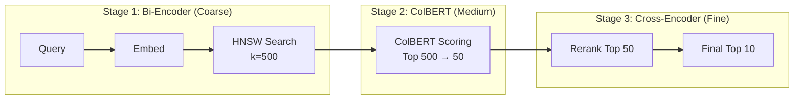

# Vector Search in Production: Real-World Patterns

> Author: **Tamilselvan** · ✉️ tamilselvan.sde@gmail.com · 🔗 [LinkedIn](https://www.linkedin.com/in/tamilselvan-ai/)
>


### Pattern: Multi-Stage Retrieval



```python
class MultiStageRetriever:
    """Coarse-to-fine retrieval pipeline."""
    
    def __init__(self, dense_encoder, colbert_model, cross_encoder):
        self.dense = dense_encoder       # Fast bi-encoder
        self.colbert = colbert_model     # Medium late interaction
        self.cross = cross_encoder       # Slow but accurate
        
    def retrieve(self, query: str, k=10):
        # Stage 1: Fast dense retrieval (get candidates)
        q_vec = self.dense.encode(query)
        candidates = vector_db.search(q_vec, k=500)
        
        # Stage 2: ColBERT refinement
        colbert_scores = self.colbert.score(
            query, 
            [c.payload["text"] for c in candidates]
        )
        top_50 = np.argsort(colbert_scores)[-50:][::-1]
        candidates_50 = [candidates[i] for i in top_50]
        
        # Stage 3: Cross-encoder reranking
        pairs = [
            [query, c.payload["text"]]
            for c in candidates_50
        ]
        cross_scores = self.cross.predict(pairs)
        final_order = np.argsort(cross_scores)[-k:][::-1]
        
        return [candidates_50[i] for i in final_order]
```

---

## Quick Reference: Vector DB by Use Case

| Use Case | Recommended DB | Index Type | Scaling Strategy | Alternative |
|----------|---------------|------------|-----------------|-------------|
| **Prototyping** | Chroma | HNSW | N/A | FAISS |
| **Small production** | Qdrant | HNSW | Vertical | pgvector |
| **Medium production** | Milvus | IVF_PQ | Shard + Replicate | Qdrant |
| **Large production** | Milvus | IVF_PQ | Horizontal | Pinecone |
| **Billion-scale** | Milvus/DiskANN | DiskANN | Multi-region | SPANN |
| **E-commerce** | Qdrant | HNSW_PQ | By tenant | Elastic |
| **RAG/LLM** | Pinecone | HNSW | Managed | Weaviate |
| **Full-text + vector** | Elastic | HNSW | Elastic-native | OpenSearch |
| **PostgreSQL user** | pgvector | IVFFlat | RDS | Supabase |
| **GPU accelerated** | FAISS (GPU) | IVF_PQ | Multi-GPU | RAPIDS cuVS |
| **Embedded/Mobile** | LanceDB | IVF | Simple | Chroma |
| **Multi-modal** | Weaviate | HNSW | Managed | Qdrant + CLIP |
| **Time-series vectors** | Qdrant | HNSW | Partition by time | Timescale |
| **Analytics** | DuckDB (v0.10+) | Flat | N/A | LanceDB |

---

