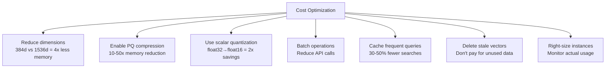
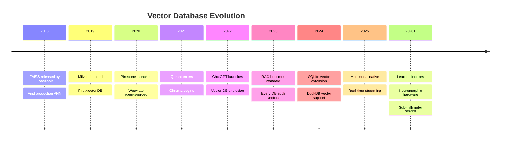

# Security Best Practices

> Author: **Tamilselvan** · ✉️ tamilselvan.sde@gmail.com · 🔗 [LinkedIn](https://www.linkedin.com/in/tamilselvan-ai/)
>


### Vector Database Security Checklist

| Concern | Risk | Mitigation |
|---------|------|------------|
| **Data exfiltration** | Malicious queries reconstruct training data | Rate limiting, query auditing |
| **Tenant isolation** | Cross-tenant data leakage | Always filter by tenant_id, test isolation |
| **Injection attacks** | Malicious filter values | Validate all filter inputs, sanitize strings |
| **Model extraction** | API used to copy embedding model | Rate limiting, embedding watermarking |
| **Access control** | Unauthorized queries | API keys, IAM roles, network policies |
| **Encryption at rest** | Disk theft exposes vectors | Enable encryption, use encrypted volumes |
| **Encryption in transit** | Network sniffing | TLS/mTLS for all connections |
| **Audit logging** | No trace of access | Log all queries (anonymize PII) |
| **Backup security** | Backup compromise | Encrypted backups, access control |

### Embedding Privacy

```python
from sentence_transformers import SentenceTransformer
import hashlib

class PrivacyAwareEmbedder:
    def __init__(self, model_name='all-MiniLM-L6-v2'):
        self.model = SentenceTransformer(model_name)
    
    def embed_with_privacy(self, text, salt="app_specific_salt"):
        """One-way hash-based privacy for sensitive data."""
        # Option 1: Hash PII before embedding (loses semantic meaning)
        hashed = hashlib.sha256(
            (text + salt).encode()
        ).hexdigest()
        
        # Option 2: Use differentially private embedding
        embedding = self.model.encode(text)
        noise = np.random.laplace(0, 1.0, embedding.shape)
        return embedding + noise  # ε-differential privacy
    
    def anonymize_before_index(self, documents):
        """Remove PII before vectorizing."""
        import re
        cleaned = []
        for doc in documents:
            # Remove emails
            doc = re.sub(r'\S+@\S+', '[EMAIL]', doc)
            # Remove phone numbers
            doc = re.sub(r'\d{3}[-.]?\d{3}[-.]?\d{4}', '[PHONE]', doc)
            # Remove SSN
            doc = re.sub(r'\d{3}-\d{2}-\d{4}', '[SSN]', doc)
            cleaned.append(doc)
        return cleaned
```

---

## Cost Analysis

### Vector Database Pricing Comparison

| Service | Free Tier | Pay-as-you-go (1M vectors) | Pay-as-you-go (100M vectors) | Notes |
|---------|-----------|---------------------------|------------------------------|-------|
| **Pinecone** | 100K vectors, 1 pod | ~$70/month (p1 pod) | ~$7,000/month (p2 × 10) | Includes storage + queries |
| **Weaviate Cloud** | 1GB (free) | ~$75/month | ~$5,000/month | Sandbox free forever |
| **Qdrant Cloud** | 1GB (14 day trial) | ~$60/month | ~$4,000/month | Cheaper self-hosted |
| **Milvus (Zilliz)** | 100K vectors | ~$80/month | ~$6,000/month | GPU options extra |
| **Self-hosted Qdrant** | Free (self-host) | ~$30/month (1 node) | ~$500/month (cluster) | +infrastructure cost |
| **Self-hosted Milvus** | Free (self-host) | ~$50/month | ~$1,000/month | +infrastructure cost |
| **pgvector** | Free (self-host) | ~$20/month (1 PG node) | ~$400/month (RDS) | Uses existing PG infra |

### Cost Optimization Tips



---

## Future Trends in Vector Databases



### Emerging Technologies

1. **Learned Indexes:** Replace traditional index structures with neural networks that learn the data distribution, potentially 2-10x faster than handcrafted indexes.

2. **Streaming Vector Search:** Real-time indexing as vectors arrive, without batch rebuild windows. Critical for fraud detection and real-time recommendations.

3. **Multimodal Native:** Single vector space for text, images, audio, 3D, video, and tabular data. Query across all modalities simultaneously.

4. **Hardware Acceleration:**
   - TPU/DPU offload for distance computation
   - CXL memory expansion
   - Near-storage computing (SSD with built-in ANN)
   - Optical computing for ultra-fast vector operations

5. **Quantum-Resistant Embeddings:** As quantum computing advances, ensuring embedding security and stability will become critical.

6. **Federated Vector Search:** Search across decentralized vector databases without centralizing data, for privacy-sensitive applications.

---

## Quick Troubleshooting Command Reference

```bash
# Qdrant: Check collection info
curl http://localhost:6333/collections/my_collection

# Qdrant: Get collection stats
curl http://localhost:6333/collections/my_collection/points/0

# Milvus: List collections
curl http://localhost:9091/api/v1/collection

# Milvus: Check load state
curl http://localhost:9091/api/v1/collection/my_collection/load_state

# Pinecone: List indexes
curl -H "Api-Key: $PINECONE_API_KEY" \
  https://api.pinecone.io/indexes

# Redis: Check vector index info
redis-cli FT.INFO idx:docs

# pgvector: Check index size
SELECT * FROM pg_indexes WHERE tablename = 'documents';
SELECT pg_size_pretty(pg_total_relation_size('documents'));

# OpenSearch: Check plugin status
curl http://localhost:9200/_plugins/_knn/status

# General: Monitor memory for vector process
ps aux | grep qdrant
docker stats qdrant-container
```

---

## Glossary

| Term | Definition |
|------|-----------|
| **ANN** | Approximate Nearest Neighbor — finds "close enough" vectors quickly |
| **ADC** | Asymmetric Distance Computation — query in full precision, DB vectors compressed |
| **Bi-encoder** | Two-tower model: query and document embedded independently |
| **BM25** | Keyword ranking function based on term frequency and inverse document frequency |
| **ColBERT** | Late interaction model — token-level embeddings with MaxSim scoring |
| **Cosine Similarity** | Measures angle between vectors, ignores magnitude |
| **Cross-encoder** | Joint encoder: query and document processed together for accurate scoring |
| **Curse of Dimensionality** | High dimensions cause all distances to become similar |
| **Dense Retrieval** | Search using dense vector embeddings (semantic) |
| **DiskANN** | Microsoft's SSD-based graph index for billion-scale search |
| **Euclidean Distance** | Straight-line distance between two vectors |
| **HNSW** | Hierarchical Navigable Small World — multi-layer graph index |
| **HyDE** | Hypothetical Document Embedding — generate answer first, then search |
| **IVF** | Inverted File Index — cluster-based ANN |
| **KNN** | K-Nearest Neighbors — exact search |
| **LSH** | Locality-Sensitive Hashing — hash-based ANN |
| **MMR** | Maximum Marginal Relevance — diversity-promoting reranking |
| **PQ** | Product Quantization — compression by sub-vector quantization |
| **RAG** | Retrieval-Augmented Generation — search + LLM |
| **Recall** | Fraction of true neighbors found by ANN vs exact search |
| **Reranker** | Second-stage model for more accurate scoring |
| **RRF** | Reciprocal Rank Fusion — combining ranked lists |
| **ScaNN** | Google's ANN algorithm with anisotropic quantization |
| **Sparse Retrieval** | Search using inverted index (BM25, TF-IDF) |
| **SPANN** | Similarity-aware Partitioned ANN — Microsoft's disk-based index |
| **SQ** | Scalar Quantization — reduce precision (e.g., float32→int8) |
| **Voronoi Cell** | Region of space closest to a given centroid |
| **WAL** | Write-Ahead Log — ensures durability |

