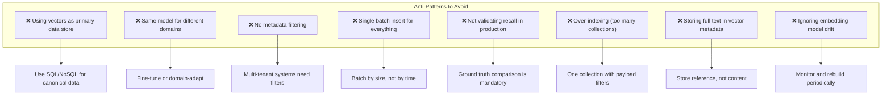
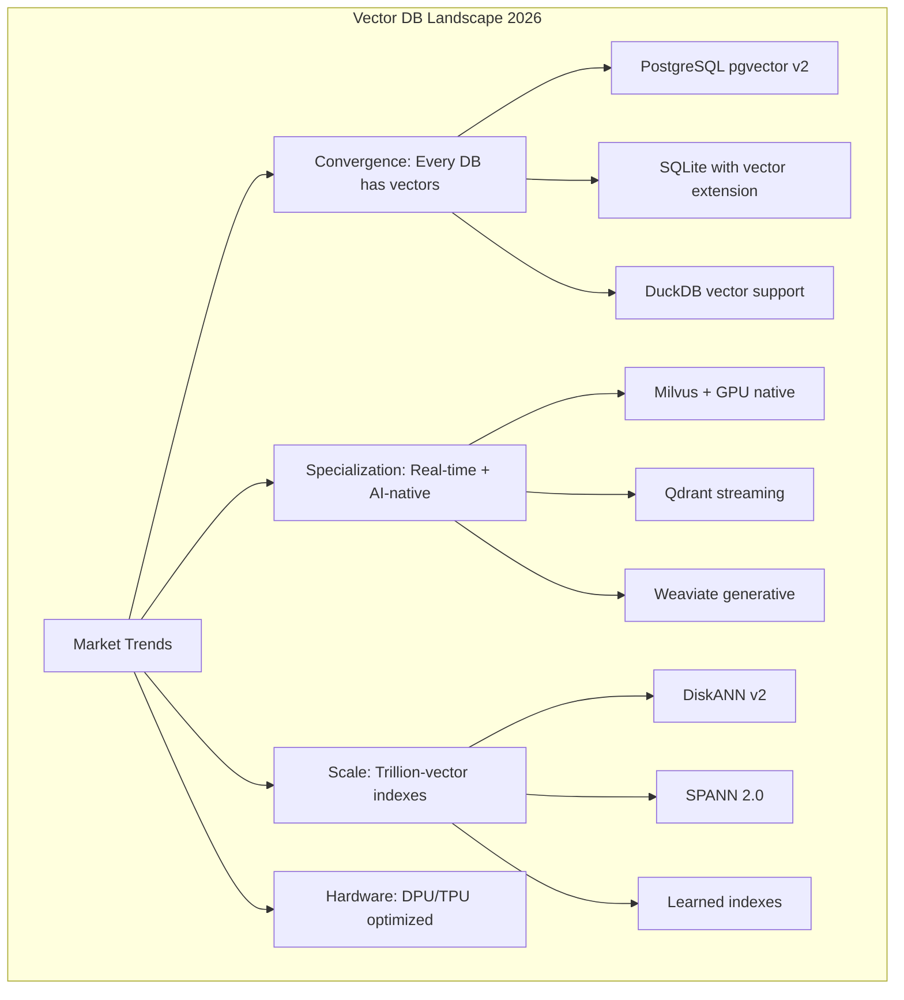

# Vector Search Anti-Patterns

> Author: **Tamilselvan** · ✉️ tamilselvan.sde@gmail.com · 🔗 [LinkedIn](https://www.linkedin.com/in/tamilselvan-ai/)
>




**Anti-Pattern 1: No Ground Truth Validation**

```python
# ❌ Bad: Deploy without recall validation
index = faiss.IndexHNSWFlat(768, 32)
index.add(vectors)

# ✓ Good: Validate recall before deployment
def validate_recall(index, queries, ground_truth):
    recall_at_10 = []
    for q, gt in zip(queries, ground_truth):
        _, indices = index.search(q, 10)
        recall = len(set(indices[0]) & set(gt)) / 10
        recall_at_10.append(recall)
    return np.mean(recall_at_10)

recall = validate_recall(index, test_queries, ground_truth)
assert recall > 0.95, f"Recall too low: {recall}"
```

**Anti-Pattern 2: Ignoring Embedding Drift**

```python
# ❌ Bad: Never checking if embedding distribution changes
model_v1 = SentenceTransformer('model-v1')
model_v2 = SentenceTransformer('model-v2')
# Using same index with different model

# ✓ Good: Monitor embedding drift
def detect_embedding_drift(reference_sample, new_sample, threshold=0.05):
    """Detect if embedding distribution has shifted."""
    from scipy.stats import ks_2samp
    
    drift_scores = []
    for dim in range(reference_sample.shape[1]):
        stat, p = ks_2samp(
            reference_sample[:, dim],
            new_sample[:, dim]
        )
        drift_scores.append(p)
    
    # Bonferroni correction
    significant_dims = sum(p < 0.05 / len(drift_scores) 
                          for p in drift_scores)
    drift_ratio = significant_dims / len(drift_scores)
    
    return drift_ratio > threshold
```

---

## Cost-Performance Optimization Reference

```python
def estimate_monthly_cost(
    n_vectors: int,
    dim: int,
    queries_per_second: int,
    index_type: str = "HNSW",
    cloud: str = "aws"
) -> dict:
    """Estimate monthly cost for vector DB deployment."""
    
    # Memory calculation
    vector_bytes = n_vectors * dim * 4  # float32
    
    if index_type == "HNSW":
        index_overhead = n_vectors * 32 * 2 * 4  # M=16, bidirectional
    elif index_type == "IVF_PQ":
        index_overhead = n_vectors * (dim // 8)  # PQ codes
    else:
        index_overhead = vector_bytes * 0.3
    
    total_gb = (vector_bytes + index_overhead) / 1e9
    
    # EC2 instance costs (approximate)
    instance_costs = {
        "aws": {
            16:    {"instance": "r6g.2xlarge", "cost": 350},
            32:    {"instance": "r6g.4xlarge", "cost": 700},
            64:    {"instance": "r6g.8xlarge", "cost": 1400},
            128:   {"instance": "r6g.16xlarge", "cost": 2800},
            256:   {"instance": "r6g.metal", "cost": 5600},
        },
        "gcp": {
            16:    {"instance": "n2-highmem-8", "cost": 360},
            32:    {"instance": "n2-highmem-16", "cost": 720},
            64:    {"instance": "n2-highmem-32", "cost": 1440},
            128:   {"instance": "n2-highmem-64", "cost": 2880},
            256:   {"instance": "n2-highmem-128", "cost": 5760},
        }
    }
    
    # Find appropriate instance
    required_gb = max(16, int(np.ceil(total_gb)))
    pricing = instance_costs.get(cloud, instance_costs["aws"])
    
    # Find the smallest instance that fits
    available_sizes = sorted(pricing.keys())
    instance_size = next(
        (s for s in available_sizes if s >= required_gb),
        max(available_sizes)
    )
    instance_info = pricing[instance_size]
    
    # Scale for QPS
    estimated_qps_per_node = 5000 if index_type == "HNSW" else 2000
    needed_nodes = max(1, int(np.ceil(queries_per_second / estimated_qps_per_node)))
    
    # Replication for HA
    total_nodes = needed_nodes * 2  # 2 replicas for HA
    
    return {
        "memory_gb": total_gb,
        "instance": instance_info["instance"],
        "compute_nodes": total_nodes,
        "instance_cost": instance_info["cost"] * total_nodes,
        "storage_cost_ebs": total_gb * 0.08 * 1.5,  # 1.5x for replication
        "total_monthly_estimate": (
            instance_info["cost"] * total_nodes + total_gb * 0.08 * 1.5
        ),
        "notes": f"Estimated for {index_type} on {cloud}"
    }

# Example
cost = estimate_monthly_cost(
    n_vectors=10_000_000,
    dim=768,
    queries_per_second=1000,
    index_type="HNSW"
)
print(json.dumps(cost, indent=2))
```

---

## Final Thoughts: The Vector DB Landscape in 2026



**Key Takeaways:**

1. **Vector DBs are becoming infrastructure** — like relational databases, they'll be assumed present in every stack
2. **Hybrid search is the new baseline** — pure vector or pure keyword is rarely optimal
3. **Quality > speed > cost** — optimize recall first, then latency, then cost
4. **Monitoring is non-negotiable** — recall drift, latency degradation, and OOM are silent killers
5. **The stack is still maturing** — expect breaking changes, plan for migrations
6. **GPU will become standard** — as models grow, GPU-accelerated vector search follows
7. **RAG is the killer app** — vector DBs enable LLMs to be accurate, grounded, and up-to-date
8. **Start simple, iterate fast** — Chroma → Qdrant → Milvus is a proven progression path

---

> *"Vector databases are to AI what relational databases were to the web — the foundational storage layer that makes intelligent applications possible."*

## REST API Quick Reference

### Qdrant REST API

```bash
# Health check
curl -s http://localhost:6333/healthz | jq .

# Create collection
curl -X PUT http://localhost:6333/collections/my_docs \
  -H "Content-Type: application/json" \
  -d '{
    "vectors": {
      "size": 768,
      "distance": "Cosine"
    },
    "optimizers_config": {
      "indexing_threshold": 10000
    }
  }' | jq .

# Upsert points
curl -X PUT http://localhost:6333/collections/my_docs/points \
  -H "Content-Type: application/json" \
  -d '{
    "points": [
      {
        "id": 1,
        "vector": [0.1, 0.2, 0.3, 0.4, 0.5],
        "payload": {
          "text": "Vector databases are awesome",
          "author": "John",
          "date": "2024-01-15"
        }
      }
    ]
  }' | jq .

# Search
curl -X POST http://localhost:6333/collections/my_docs/points/search \
  -H "Content-Type: application/json" \
  -d '{
    "vector": [0.1, 0.2, 0.3, 0.4, 0.5],
    "limit": 10,
    "with_payload": true,
    "filter": {
      "must": [
        {
          "key": "author",
          "match": {"value": "John"}
        }
      ]
    }
  }' | jq .

# Batch search (multiple queries)
curl -X POST http://localhost:6333/collections/my_docs/points/search/batch \
  -H "Content-Type: application/json" \
  -d '{
    "searches": [
      {"vector": [0.1, 0.2, 0.3], "limit": 5},
      {"vector": [0.4, 0.5, 0.6], "limit": 5}
    ]
  }' | jq .

# Recommend (find similar to positive, dissimilar to negative)
curl -X POST http://localhost:6333/collections/my_docs/points/recommend \
  -H "Content-Type: application/json" \
  -d '{
    "positive": [1, 2, 3],
    "negative": [4, 5],
    "limit": 10
  }' | jq .

# Scroll (list all points)
curl -X POST http://localhost:6333/collections/my_docs/points/scroll \
  -H "Content-Type: application/json" \
  -d '{"limit": 100, "with_payload": true}' | jq .

# Delete points
curl -X POST http://localhost:6333/collections/my_docs/points/delete \
  -H "Content-Type: application/json" \
  -d '{
    "filter": {
      "must": [
        {"key": "date", "range": {"lt": "2023-01-01"}}
      ]
    }
  }' | jq .

# Collection info
curl -s http://localhost:6333/collections/my_docs | jq .

# Delete collection
curl -X DELETE http://localhost:6333/collections/my_docs | jq .

# Snapshots
curl -X POST http://localhost:6333/collections/my_docs/snapshots | jq .
curl -s http://localhost:6333/collections/my_docs/snapshots | jq .
```

---

### Milvus REST API (v2.x)

```bash
# Check Milvus status
curl -s http://localhost:9091/api/v1/health | jq .

# List collections
curl -s http://localhost:9091/api/v1/collection | jq .

# Create collection
curl -X POST http://localhost:9091/api/v1/collection \
  -H "Content-Type: application/json" \
  -d '{
    "collection_name": "my_docs",
    "schema": {
      "fields": [
        {"fieldName": "id", "dataType": "Int64", "isPrimary": true},
        {"fieldName": "vector", "dataType": "FloatVector", "elementTypeParams": {"dim": 768}},
        {"fieldName": "text", "dataType": "VarChar", "elementTypeParams": {"max_length": 65535}}
      ]
    }
  }' | jq .

# Create index
curl -X POST http://localhost:9091/api/v1/index \
  -H "Content-Type: application/json" \
  -d '{
    "collection_name": "my_docs",
    "field_name": "vector",
    "index_name": "hnsw_idx",
    "params": [
      {"key": "metric_type", "value": "COSINE"},
      {"key": "index_type", "value": "HNSW"},
      {"key": "M", "value": "16"},
      {"key": "efConstruction", "value": "200"}
    ]
  }' | jq .

# Insert
curl -X POST http://localhost:9091/api/v1/insert \
  -H "Content-Type: application/json" \
  -d '{
    "collection_name": "my_docs",
    "fields_data": [
      {"fieldName": "id", "type": "Int64", "values": [1, 2]},
      {"fieldName": "vector", "type": "FloatVector", "values": [
        [0.1, 0.2, 0.3, 0.4, 0.5],
        [0.6, 0.7, 0.8, 0.9, 1.0]
      ]},
      {"fieldName": "text", "type": "VarChar", "values": ["doc1", "doc2"]}
    ]
  }' | jq .

# Search
curl -X POST http://localhost:9091/api/v1/search \
  -H "Content-Type: application/json" \
  -d '{
    "collection_name": "my_docs",
    "vector": [[0.1, 0.2, 0.3, 0.4, 0.5]],
    "search_params": [
      {"key": "metric_type", "value": "COSINE"},
      {"key": "params", "value": "{\"ef\": 100}"}
    ],
    "limit": 10,
    "output_fields": ["id", "text"]
  }' | jq .
```

---

### Elasticsearch REST API

```bash
# Create index with vector field
curl -X PUT http://localhost:9200/my_docs \
  -H "Content-Type: application/json" \
  -d '{
    "mappings": {
      "properties": {
        "vector": {
          "type": "dense_vector",
          "dims": 768,
          "index": true,
          "similarity": "cosine"
        },
        "text": {
          "type": "text"
        },
        "author": {
          "type": "keyword"
        }
      }
    }
  }' | jq .

# Index document
curl -X POST http://localhost:9200/my_docs/_doc \
  -H "Content-Type: application/json" \
  -d '{
    "vector": [0.1, 0.2, 0.3, 0.4, 0.5],
    "text": "Vector search in Elasticsearch",
    "author": "john"
  }' | jq .

# kNN search
curl -X POST http://localhost:9200/my_docs/_search \
  -H "Content-Type: application/json" \
  -d '{
    "knn": {
      "field": "vector",
      "query_vector": [0.1, 0.2, 0.3, 0.4, 0.5],
      "k": 10,
      "num_candidates": 100
    },
    "filter": [
      {"term": {"author": "john"}}
    ]
  }' | jq .

# Hybrid search (kNN + full-text)
curl -X POST http://localhost:9200/my_docs/_search \
  -H "Content-Type: application/json" \
  -d '{
    "query": {
      "bool": {
        "must": [
          {"match": {"text": "vector search"}}
        ]
      }
    },
    "knn": {
      "field": "vector",
      "query_vector": [0.1, 0.2, 0.3, 0.4, 0.5],
      "k": 10,
      "num_candidates": 100,
      "boost": 0.5
    },
    "rank": {"rrf": {}},
    "size": 10
  }' | jq .
```

---

### Pinecone REST API

```bash
# List indexes
curl -s https://api.pinecone.io/indexes \
  -H "Api-Key: $PINECONE_API_KEY" | jq .

# Create index
curl -X POST https://api.pinecone.io/indexes \
  -H "Api-Key: $PINECONE_API_KEY" \
  -H "Content-Type: application/json" \
  -d '{
    "name": "my-index",
    "dimension": 768,
    "metric": "cosine",
    "spec": {
      "pod": {
        "environment": "us-west1-gcp",
        "pod_type": "p1.x1"
      }
    }
  }' | jq .

# Upsert vectors
curl -X POST https://my-index-abc123.svc.us-west1-gcp.pinecone.io/vectors/upsert \
  -H "Api-Key: $PINECONE_API_KEY" \
  -H "Content-Type: application/json" \
  -d '{
    "vectors": [
      {
        "id": "vec1",
        "values": [0.1, 0.2, 0.3, 0.4, 0.5],
        "metadata": {"text": "doc1", "author": "john"}
      }
    ],
    "namespace": "my-namespace"
  }' | jq .

# Query
curl -X POST https://my-index-abc123.svc.us-west1-gcp.pinecone.io/query \
  -H "Api-Key: $PINECONE_API_KEY" \
  -H "Content-Type: application/json" \
  -d '{
    "vector": [0.1, 0.2, 0.3, 0.4, 0.5],
    "topK": 10,
    "filter": {"author": {"$eq": "john"}},
    "includeMetadata": true,
    "namespace": "my-namespace"
  }' | jq .

# Delete vectors
curl -X POST https://my-index-abc123.svc.us-west1-gcp.pinecone.io/vectors/delete \
  -H "Api-Key: $PINECONE_API_KEY" \
  -H "Content-Type: application/json" \
  -d '{
    "deleteAll": true,
    "namespace": "my-namespace"
  }' | jq .

# Describe index stats
curl -s https://my-index-abc123.svc.us-west1-gcp.pinecone.io/describe_index_stats \
  -H "Api-Key: $PINECONE_API_KEY" | jq .
```

---

### Weaviate REST API

```bash
# Schema: Create class
curl -X POST http://localhost:8080/v1/schema \
  -H "Content-Type: application/json" \
  -d '{
    "class": "Document",
    "properties": [
      {"name": "text", "dataType": ["text"]},
      {"name": "author", "dataType": ["string"]}
    ]
  }' | jq .

# Import object
curl -X POST http://localhost:8080/v1/objects \
  -H "Content-Type: application/json" \
  -d '{
    "class": "Document",
    "properties": {
      "text": "Weaviate vector search",
      "author": "john"
    },
    "vector": [0.1, 0.2, 0.3, 0.4, 0.5]
  }' | jq .

# Near text search (auto-embeds)
curl -X POST http://localhost:8080/v1/graphql \
  -H "Content-Type: application/json" \
  -d '{
    "query": "{
      Get {
        Document(
          nearText: {concepts: [\"vector search\"]},
          limit: 10
        ) {
          text
          author
          _additional {distance}
        }
      }
    }"
  }' | jq .

# Hybrid search
curl -X POST http://localhost:8080/v1/graphql \
  -H "Content-Type: application/json" \
  -d '{
    "query": "{
      Get {
        Document(
          hybrid: {
            query: \"vector search\",
            alpha: 0.5
          },
          limit: 10
        ) {
          text
          _additional {score}
        }
      }
    }"
  }' | jq .

# Nearby vector search
curl -X POST http://localhost:8080/v1/graphql \
  -H "Content-Type: application/json" \
  -d '{
    "query": "{
      Get {
        Document(
          nearVector: {
            vector: [0.1, 0.2, 0.3, 0.4, 0.5]
          },
          limit: 10
        ) {
          text
        }
      }
    }"
  }' | jq .
```

---

### OpenSearch REST API

```bash
# Create index with k-NN
curl -X PUT http://localhost:9200/my_docs \
  -H "Content-Type: application/json" \
  -d '{
    "settings": {
      "index.knn": true
    },
    "mappings": {
      "properties": {
        "vector": {
          "type": "knn_vector",
          "dimension": 768,
          "method": {
            "name": "hnsw",
            "space_type": "cosinesimil",
            "engine": "nmslib",
            "parameters": { "ef_construction": 200, "m": 16 }
          }
        }
      }
    }
  }' | jq .

# Bulk index
curl -X POST http://localhost:9200/_bulk \
  -H "Content-Type: application/json" \
  -d '{"index": {"_index": "my_docs", "_id": "1"}}
{"vector": [0.1, 0.2, 0.3, 0.4, 0.5], "text": "OS vector search"}
{"index": {"_index": "my_docs", "_id": "2"}}
{"vector": [0.6, 0.7, 0.8, 0.9, 1.0], "text": "Another doc"}
' | jq .

# k-NN search
curl -X POST http://localhost:9200/my_docs/_search \
  -H "Content-Type: application/json" \
  -d '{
    "size": 10,
    "query": {
      "knn": {
        "vector": {
          "vector": [0.1, 0.2, 0.3, 0.4, 0.5],
          "k": 10
        }
      }
    }
  }' | jq .
```

---

### pgvector via cURL (using psql)

```bash
# PostgreSQL cannot be queried via curl directly
# Use psql instead:

# Create extension and table
psql -h localhost -d vectordb -c "
  CREATE EXTENSION vector;
  CREATE TABLE documents (
    id SERIAL PRIMARY KEY,
    text TEXT,
    embedding vector(768)
  );
"

# Insert
psql -h localhost -d vectordb -c "
  INSERT INTO documents (text, embedding)
  VALUES ('Vector search is cool', '[0.1, 0.2, 0.3]'::vector);
"

# Create index
psql -h localhost -d vectordb -c "
  CREATE INDEX ON documents USING ivfflat (embedding vector_cosine_ops) WITH (lists = 100);
"

# Search (via psql)
psql -h localhost -d vectordb -c "
  SELECT text, 1 - (embedding <=> '[0.1, 0.2, 0.3]'::vector) AS similarity
  FROM documents
  ORDER BY embedding <=> '[0.1, 0.2, 0.3]'::vector
  LIMIT 10;
"
```

---

### pgvector via HTTP (using pg_tle or PostgREST)

```bash
# If using PostgREST for REST API on PostgreSQL:
# Search via HTTP
curl -s "http://localhost:3000/rpc/search_docs" \
  -H "Content-Type: application/json" \
  -d '{
    "query_embedding": [0.1, 0.2, 0.3, 0.4, 0.5],
    "match_threshold": 0.7,
    "match_count": 10
  }' | jq .

# With Supabase
curl -X POST "https://your-project.supabase.co/rest/v1/rpc/search_documents" \
  -H "apikey: $SUPABASE_ANON_KEY" \
  -H "Authorization: Bearer $SUPABASE_SERVICE_KEY" \
  -H "Content-Type: application/json" \
  -d '{
    "query_embedding": [0.1, 0.2, 0.3, 0.4, 0.5],
    "match_threshold": 0.7,
    "match_count": 10,
    "filter_author": "john"
  }' | jq .
```

---

## Vector DB CLI Quick Reference

```bash
# ===== Qdrant CLI =====
docker exec -it qdrant sh -c "
  # Create snapshot via CLI
  curl -X POST http://localhost:6333/collections/my_docs/snapshots
  
  # List snapshots
  curl -s http://localhost:6333/collections/my_docs/snapshots
  
  # Get collection info
  curl -s http://localhost:6333/collections/my_docs | jq '.result'
"

# ===== Milvus CLI =====
docker exec -it milvus-standalone milvus-cli

# Inside milvus-cli:
> connect -h localhost
> list collections
> describe collection -c my_docs
> search -c my_docs -d "0.1,0.2,0.3" -n 10

# ===== pgvector via psql =====
psql -h localhost -d vectordb -c "
  -- Check index size
  SELECT pg_size_pretty(pg_total_relation_size('documents'));
  
  -- Check vector index info
  SELECT * FROM pg_indexes WHERE tablename = 'documents';
  
  -- List all extensions
  SELECT * FROM pg_extension WHERE extname = 'vector';
"

# ===== FAISS via Python CLI =====
python -c "
import faiss
index = faiss.read_index('my_index.faiss')
print(f'Index has {index.ntotal} vectors')
print(f'Dimension: {index.d}')
"
```

---

## Comparison of API Styles

| Operation | Qdrant (REST) | Milvus (REST v2) | Pinecone (REST) | Elastic (REST) | pgvector (SQL) |
|-----------|--------------|-----------------|-----------------|----------------|----------------|
| **Create** | `PUT /collections/{name}` | `POST /api/v1/collection` | `POST /indexes` | `PUT /{index}` | `CREATE TABLE...` |
| **Insert** | `PUT .../points` | `POST .../insert` | `POST .../vectors/upsert` | `POST .../_doc` | `INSERT INTO...` |
| **Search** | `POST .../search` | `POST .../search` | `POST .../query` | `POST .../_search` | `SELECT...ORDER BY...` |
| **Delete** | `POST .../points/delete` | `DELETE .../delete` | `POST .../vectors/delete` | `DELETE .../_doc/{id}` | `DELETE FROM...` |
| **Filter** | Inline filter object | expr (string) | metadata filter | Elastic DSL | SQL WHERE |
| **Bulk** | Batch points | Multiple entities | Multiple vectors | Bulk endpoint | Batch INSERT |
| **Info** | `GET .../{name}` | `GET .../collection/{name}` | `GET .../describe_index_stats` | `GET .../{index}` | `\d+ documents` |

