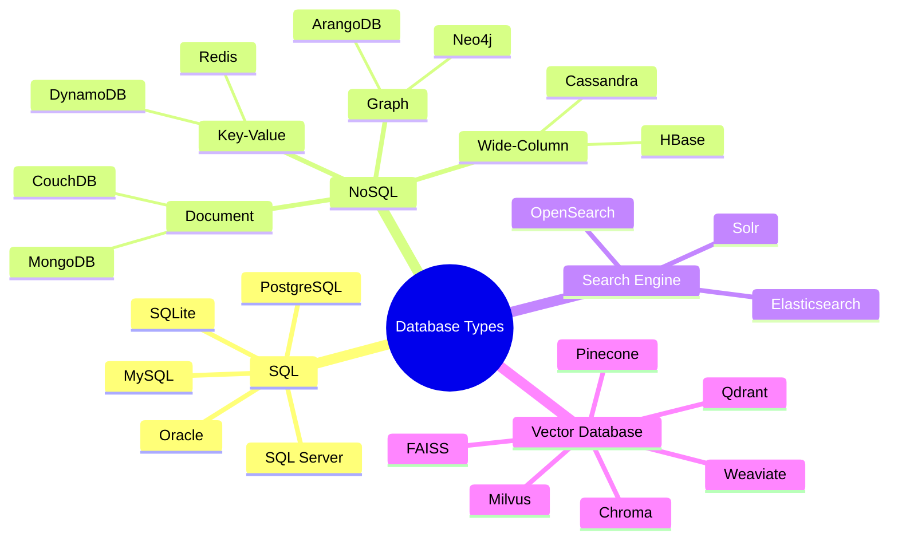
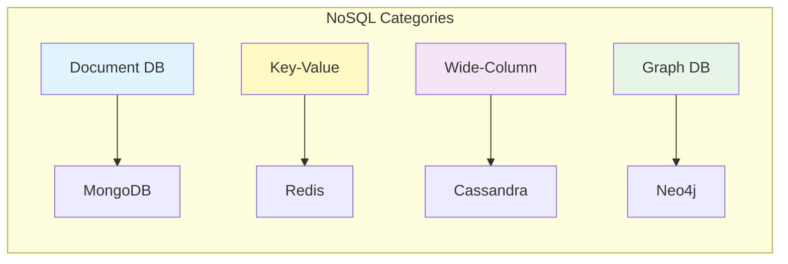
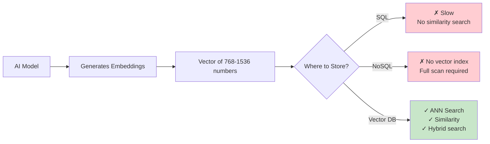
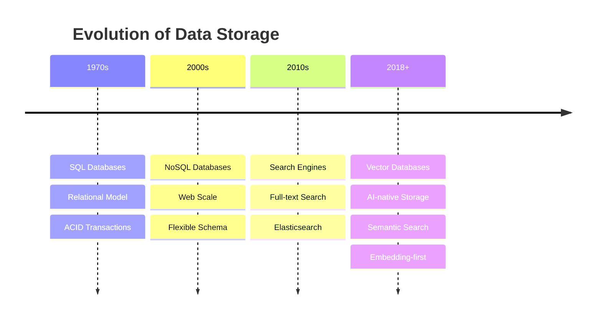
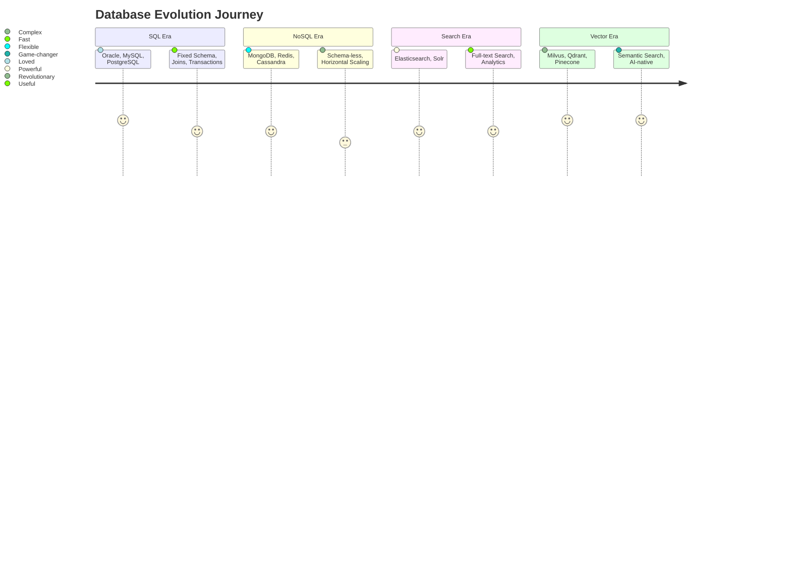

# Part 1: Introduction

> Author: **Tamilselvan** · ✉️ tamilselvan.sde@gmail.com · 🔗 [LinkedIn](https://www.linkedin.com/in/tamilselvan-ai/)
>

## What is a Database?

A **database** is an organized collection of structured information or data, typically stored electronically in a computer system. It is designed to efficiently store, retrieve, modify, and manage data.



---

## What is SQL Database?

**SQL (Structured Query Language)** databases are relational databases that store data in tables with predefined schemas. They use structured query language for defining and manipulating data.

**Key Characteristics:**
- Fixed schema (tables, columns, data types)
- ACID compliance (Atomicity, Consistency, Isolation, Durability)
- Relationships via foreign keys
- Powerful JOIN operations
- Exact match and range queries

```sql
-- SQL Example
CREATE TABLE users (
    id SERIAL PRIMARY KEY,
    name VARCHAR(100),
    email VARCHAR(255) UNIQUE,
    created_at TIMESTAMP DEFAULT NOW()
);

SELECT * FROM users WHERE name = 'Alice' AND created_at > '2024-01-01';
```

**What SQL is good at:**
- Exact lookups (`WHERE id = 42`)
- Range queries (`WHERE price BETWEEN 10 AND 100`)
- Aggregations (`GROUP BY`, `SUM`, `AVG`)
- Joins across related tables
- Transactions (bank transfers, orders)

---

## What is NoSQL?

**NoSQL** databases are non-relational databases designed for flexible schemas, horizontal scaling, and handling large volumes of unstructured or semi-structured data.



**Key Characteristics:**
- Flexible schema (schema-less or schema-on-read)
- BASE (Basically Available, Soft state, Eventual consistency)
- Horizontal scaling built-in
- Designed for specific data models

```javascript
// NoSQL Document Example (MongoDB)
{
  "name": "Alice",
  "email": "alice@example.com",
  "preferences": {
    "theme": "dark",
    "notifications": true
  },
  "tags": ["developer", "premium"]
}
```

---

## What Problems SQL Cannot Solve

```mermaid
graph TD
    subgraph "SQL Strengths"
        A1[Exact Match<br/>WHERE id=5] --> A2[✓ Works perfectly]
        B1[Range Query<br/>WHERE age>18] --> B2[✓ Works perfectly]
        C1[Sorted Data<br/>ORDER BY price] --> C2[✓ Works perfectly]
    end
    subgraph "SQL Weaknesses"
        D1[Semantic Search<br/>"Find similar documents"] --> D2[✗ Cannot do]
        E1[Image Search<br/>"Find similar photos"] --> E2[✗ Cannot do]
        F1[Recommendation<br/>"Users like you also..."] --> F2[✗ Cannot do]
        G1[Fuzzy Meaning<br/>"car" ≈ "automobile"] --> G2[✗ Cannot do]
    end
    style D1 fill:#ffcdd2
    style E1 fill:#ffcdd2
    style F1 fill:#ffcdd2
    style G1 fill:#ffcdd2
```

**Problems SQL Cannot Solve:**

| Problem | Why SQL Fails |
|---------|--------------|
| **Semantic Search** | SQL matches exact keywords, not meaning. "car" ≠ "automobile" in SQL |
| **Similarity Search** | No concept of "close to" or "similar to" |
| **Image Search** | Cannot compare pixel patterns for semantic similarity |
| **Recommendations** | Cannot compute "users similar to you" mathematically |
| **Natural Language** | Cannot understand query intent, only syntax |
| **Unstructured Data** | Binary, images, audio have no tabular structure |
| **High-dimensional data** | 1000+ dimension vectors cause "curse of dimensionality" |

> **ELI5:** Imagine SQL is like a librarian who only finds books if you tell them the exact shelf number. But if you say "find me a book like this one I just read," SQL has no idea what to do. Vector databases are the librarian who understands what you *mean*, not just what you *say*.

---

## Why AI Needs Vector DB

**The AI Revolution created a new data type: embeddings.**

Large Language Models (LLMs), image models, and audio models all represent data as **vectors** (lists of numbers). Traditional databases cannot efficiently store or search these vectors.



**Key AI Use Cases:**

1. **RAG (Retrieval-Augmented Generation)** - Give LLMs access to private documents
2. **Semantic Search** - Search by meaning, not keywords
3. **Recommendation Systems** - Find similar items/users
4. **Anomaly Detection** - Find unusual vectors
5. **Multimodal Search** - Search images with text, text with images
6. **Memory for Agents** - Store conversation history as vectors
7. **Deduplication** - Find near-duplicate documents

---

## Evolution of Databases





---

### Production Tip
> **When should you add a Vector DB?** If your application needs to understand "what content is similar to this content" — whether text, images, audio, or user behavior — you need a vector database. Start with a managed service (Pinecone, Weaviate Cloud) for prototyping, then evaluate self-hosted options (Milvus, Qdrant) for production at scale.

---

### Common Mistake
> **❌ Using a vector database as your primary database.** Vector DBs are specialized search engines, not general-purpose databases. Always pair them with a primary SQL/NoSQL database for transactions, user data, and canonical storage.

---

### Interview Tip
> **Q:** "Why can't we just use PostgreSQL with pgvector instead of a dedicated vector database?"
>
> **A:** For small datasets (<1M vectors), pgvector works fine. For production-scale (10M-1B vectors), dedicated vector DBs provide specialized ANN indexes (HNSW, IVF), distributed sharding, GPU acceleration, and 10-100x faster search with similar accuracy.

---

