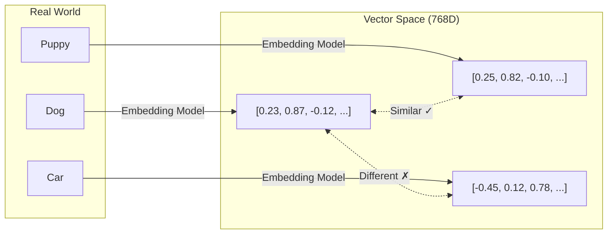
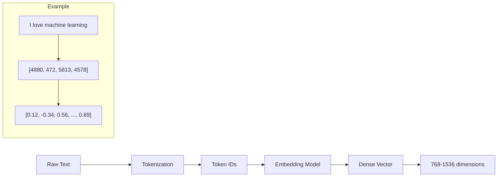
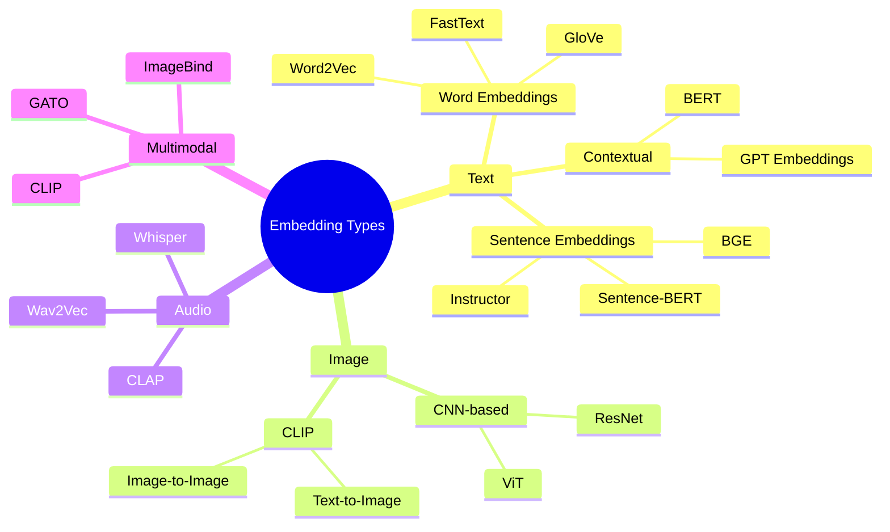
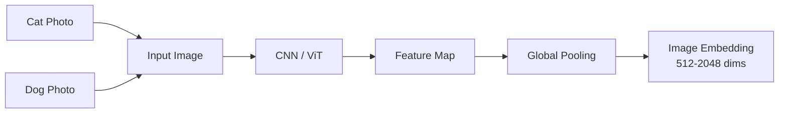
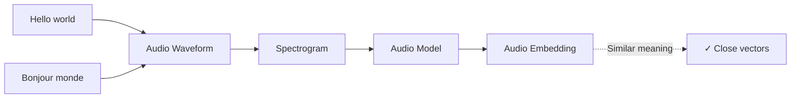
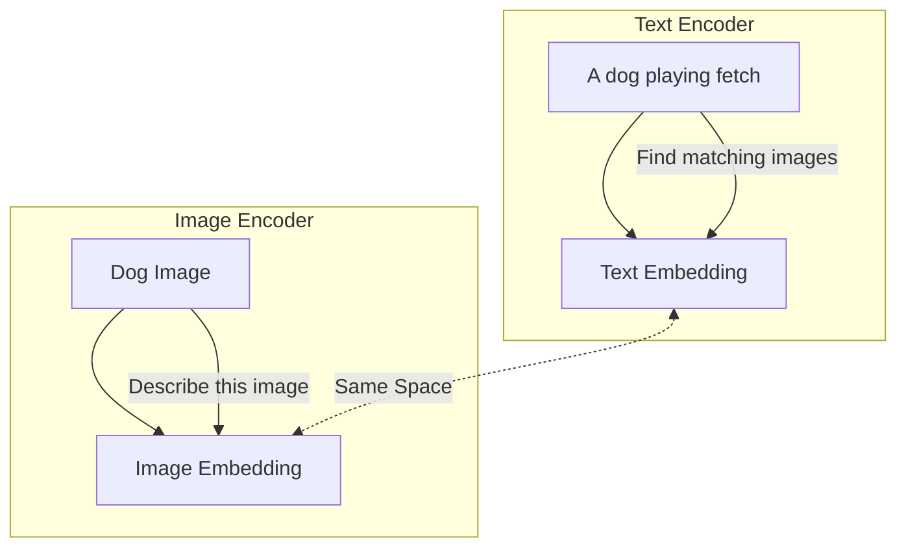
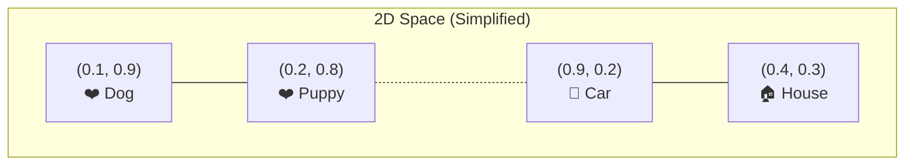
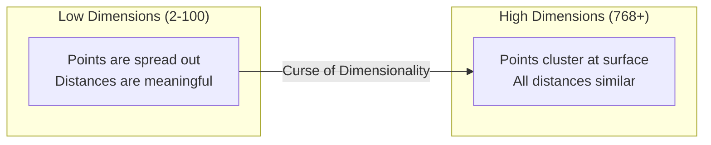
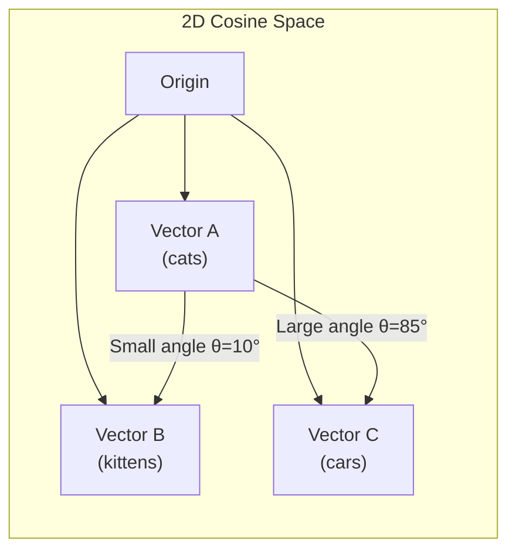
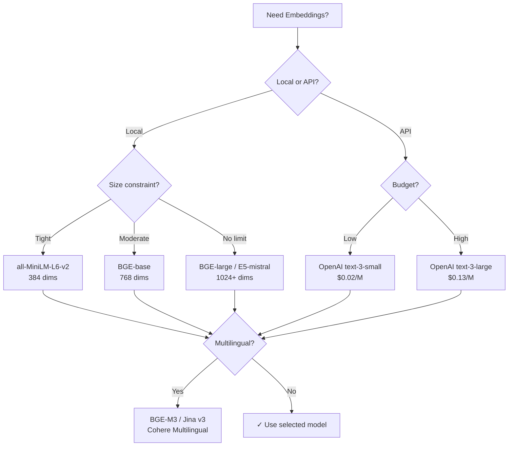

# Part 2: Embeddings

> Author: **Tamilselvan** · ✉️ tamilselvan.sde@gmail.com · 🔗 [LinkedIn](https://www.linkedin.com/in/tamilselvan-ai/)
>

## What is an Embedding?

An **embedding** is a numerical representation of data (text, image, audio, etc.) as a dense vector of floating-point numbers in a high-dimensional space.

**In simple terms:** An embedding is a "fingerprint" of the content that captures its semantic meaning.



> **Key Insight:** Similar content produces similar vectors. "Dog" and "Puppy" will have vectors that are "close" to each other, while "Car" will be "far away" from both.

---

## How Text Becomes Numbers

### The Process



### ELI5: How Text Becomes Numbers

> Imagine you have a 1000-question survey about every concept in the world:
> - Question 1: "Is this related to animals?" → Dog: 0.95, Car: 0.05
> - Question 2: "Is this related to transportation?" → Dog: 0.10, Car: 0.98
> - Question 3: "Is this cute?" → Dog: 0.90, Car: 0.20
>
> Each word gets a score for each question. The collection of all scores is the embedding vector. Words with similar meanings give similar answers across all questions.

### Behind the Scenes: Transformer Models

Modern embeddings come from transformer models (BERT, T5, etc.):

```python
# High-level pseudocode
def get_embedding(text):
    tokens = tokenizer(text)          # Step 1: Split into tokens
    hidden_states = transformer(tokens) # Step 2: Pass through neural net
    embedding = pool(hidden_states)    # Step 3: Aggregate into single vector
    return normalize(embedding)        # Step 4: Normalize to unit length
```

---

## Types of Embeddings



### Word Embeddings vs Sentence Embeddings

| Aspect | Word Embeddings | Sentence Embeddings |
|--------|----------------|-------------------|
| Input | Single word | Sentence / paragraph |
| Output | 1 vector per word | 1 vector per sentence |
| Context | Static (same vector for "bank" regardless of meaning) | Contextual ("bank river" vs "bank money" differ) |
| Model | Word2Vec, GloVe, FastText | Sentence-BERT, Instructor, BGE |
| Use Case | Word similarity, analogies | Semantic search, clustering |
| Dimension | 100-300 | 384-1536 |

### Image Embeddings

Image embeddings capture visual features:



### Audio Embeddings



### Multimodal Embeddings (CLIP)

CLIP (Contrastive Language-Image Pre-training) maps text AND images to the SAME vector space:



---

## Dimensionality & Vector Space

### What is Dimensionality?

**Dimension** = the number of numbers in a vector. Common sizes:

| Dimensions | Typical Use | Model Examples |
|-----------|-------------|---------------|
| 384 | Lightweight semantic search | `all-MiniLM-L6-v2`, `BGE-small` |
| 512 | Balanced performance | `BGE-base`, `GTE-base` |
| 768 | High accuracy | `BGE-large`, `Instructor-XL`, `E5-large` |
| 1024 | Very high accuracy | `OpenAI text-embedding-3-large` |
| 1536 | OpenAI standard | `text-embedding-ada-002`, `text-embedding-3-small` |

### Vector Space Intuition



> **Important:** Real embeddings live in 384-1536 dimensional spaces. We cannot visualize this, but the math works the same way — points that are "close" in this space are semantically similar.

### The Curse of Dimensionality

As dimensions increase, counter-intuitive things happen:
- All points become "far" from each other
- Distance metrics become less discriminative
- More data is needed to "fill" the space



**Why it matters for Vector DBs:**
- ANN algorithms are designed specifically to overcome the curse of dimensionality
- Indexing strategies (like Product Quantization) compress vectors to reduce effective dimensionality
- Normalization (L2) is critical for high-dimensional vectors

---

## Cosine Space

**Cosine similarity** measures the angle between two vectors, not their magnitude. This is the most commonly used metric for semantic search.



> **Note:** Cosine similarity = 1 when vectors point the same direction. = 0 when perpendicular. = -1 when opposite.

---

## Embedding Models Comparison

### Popular Models

| Model | Dimensions | Max Tokens | Performance | Cost | Best For |
|-------|-----------|------------|-------------|------|----------|
| **OpenAI text-embedding-3-small** | 512-1536 | 8191 | ★★★★★ | $0.02/M tokens | General purpose, production |
| **OpenAI text-embedding-3-large** | 256-3072 | 8191 | ★★★★★ | $0.13/M tokens | Best quality, enterprise |
| **OpenAI text-embedding-ada-002** | 1536 | 8191 | ★★★★☆ | $0.10/M tokens | Legacy, still solid |
| **BGE-small-en-v1.5** | 384 | 512 | ★★★☆☆ | Free | Lightweight, local |
| **BGE-base-en-v1.5** | 768 | 512 | ★★★★☆ | Free | Balanced, self-hosted |
| **BGE-large-en-v1.5** | 1024 | 512 | ★★★★☆ | Free | High accuracy, self-hosted |
| **BAAI/bge-m3** | 1024 | 8192 | ★★★★★ | Free | Multi-language, long context |
| **sentence-transformers/all-MiniLM-L6-v2** | 384 | 256 | ★★★☆☆ | Free | Fast, small, prototyping |
| **sentence-transformers/all-mpnet-base-v2** | 768 | 384 | ★★★★☆ | Free | Good quality |
| **intfloat/e5-large-v2** | 1024 | 512 | ★★★★★ | Free | High quality English |
| **intfloat/e5-mistral-7b-instruct** | 4096 | 4096 | ★★★★★ | Free | Best quality, large |
| **hkunlp/instructor-xl** | 768 | 512 | ★★★★★ | Free | Task-specific instructions |
| **BAAI/bge-reranker-v2-m3** | N/A (reranker) | 8192 | ★★★★★ | Free | Reranking |
| **Nomic Embed Text v1** | 768 | 8192 | ★★★★★ | Free | Long context, high quality |
| **gte-base-en-v1.5** | 768 | 8192 | ★★★★☆ | Free | Balanced, long context |
| **gte-large-en-v1.5** | 1024 | 8192 | ★★★★★ | Free | High quality |
| **jina-embeddings-v3** | 512-1024 | 8192 | ★★★★☆ | Free | Multi-lingual, task-specific |
| **Google Gecko (text-embedding)** | 768 | - | ★★★★★ | $0.0006/char | Google Cloud |
| **Cohere Embed v3** | 1024 | 512 | ★★★★★ | Paid | Enterprise, multilingual |
| **Voyage-2** | 1024 | 4000 | ★★★★☆ | Paid | General purpose |

### Model Selection Decision Tree



---

## Python Examples

### Installation

```bash
pip install sentence-transformers
pip install openai
pip install numpy
```

### Sentence-Transformers (Local)

```python
from sentence_transformers import SentenceTransformer

# Load model (downloads on first use)
model = SentenceTransformer('all-MiniLM-L6-v2')

# Encode sentences
sentences = [
    "I love machine learning",
    "Deep learning is fascinating",
    "The weather is nice today"
]

embeddings = model.encode(sentences)
print(f"Shape: {embeddings.shape}")  # (3, 384)
print(f"First embedding[:5]: {embeddings[0][:5]}")
# [ 0.0452, -0.0284,  0.0239, -0.0051,  0.0345, ...]

# Check similarity
from sklearn.metrics.pairwise import cosine_similarity
sim = cosine_similarity([embeddings[0]], [embeddings[1]])
print(f"Similarity (ML vs DL): {sim[0][0]:.4f}")  # ~0.85

sim2 = cosine_similarity([embeddings[0]], [embeddings[2]])
print(f"Similarity (ML vs weather): {sim2[0][0]:.4f}")  # ~0.15
```

### OpenAI Embeddings (API)

```python
import openai
import numpy as np

client = openai.OpenAI()

def get_embedding(text, model="text-embedding-3-small"):
    text = text.replace("\n", " ")
    return client.embeddings.create(
        input=[text], model=model
    ).data[0].embedding

text = "Vector databases are revolutionizing AI search"
embedding = get_embedding(text)
print(f"Dimension: {len(embedding)}")  # 1536
print(f"First 5 values: {embedding[:5]}")
# [0.0023, -0.0091, 0.0152, -0.0034, 0.0211, ...]
```

### BGE Model (Best Open-Source)

```python
from sentence_transformers import SentenceTransformer
from sklearn.metrics.pairwise import cosine_similarity

# BGE requires a prefix for optimal performance
model = SentenceTransformer('BAAI/bge-base-en-v1.5')

query = "How does machine learning work?"
docs = [
    "Machine learning uses data to train models",
    "Cats are domestic animals",
    "Neural networks learn from examples"
]

# Important: BGE uses different prefixes for query vs documents
query_emb = model.encode(query, normalize_embeddings=True)
doc_embs = model.encode(docs, normalize_embeddings=True)

scores = cosine_similarity([query_emb], doc_embs)[0]
for doc, score in zip(docs, scores):
    print(f"  {doc}: {score:.4f}")
# Machine learning uses...: 0.72
# Cats are domestic...: 0.12
# Neural networks learn...: 0.68
```

### Instructor Model (Task-Specific Instructions)

```python
from sentence_transformers import SentenceTransformer
import torch

model = SentenceTransformer('hkunlp/instructor-base')

# Instructor models take instructions
query_instruction = "Represent the question for retrieving documents:"
doc_instruction = "Represent the document for retrieval:"

query = model.encode(
    [[query_instruction, "What is the capital of France?"]]
)
doc = model.encode(
    [[doc_instruction, "Paris is the capital of France."]]
)

sim = cosine_similarity(query, doc)[0][0]
print(f"Similarity: {sim:.4f}")  # ~0.92
```

---

### Production Tip
> **Always normalize embeddings** (L2 normalization) when using cosine similarity. This ensures that only the direction matters, not the magnitude. Most vector DBs handle this automatically if you specify cosine similarity.

---

### Best Practice
> **Choosing dimensions:** Lower dimensions (384-512) are faster and use less memory. Higher dimensions (1024-1536) give better accuracy but require more compute. For production, benchmark YOUR specific data at different dimensions using a validation set.

---

### Common Mistake
> **❌ Using different models for indexing and searching.** The query encoder must match the document encoder. Vectors from different models exist in different vector spaces and cannot be compared.

---

### Interview Tip
> **Q:** "Why 384 or 768 or 1536 dimensions? Why not 100 or 10000?"
>
> **A:** These numbers come from model architecture. BERT-base uses 768 hidden units; the output inherits that dimension. Too few dimensions lose information (underfitting), too many cause the curse of dimensionality. 384-1536 is empirically the sweet spot for language.

---

## Embedding Visualization in 2D (t-SNE / UMAP)

While we can't visualize 768D space directly, we can project to 2D:

```python
import numpy as np
from sklearn.manifold import TSNE
import matplotlib.pyplot as plt

model = SentenceTransformer('all-MiniLM-L6-v2')

# 50 documents about various topics
documents = [
    "Machine learning algorithms", "Deep neural networks",
    "Python programming", "JavaScript web development",
    "Cats are mammals", "Dogs are pets",
    "Stock market trading", "Real estate investing"
]
embs = model.encode(documents)

# Reduce to 2D for visualization
tsne = TSNE(n_components=2, random_state=42)
emb_2d = tsne.fit_transform(embs)

# Plot (conceptual)
"""
            Machine learning ●   ● Deep learning
                              ↘ ↙
        Python ●────● JavaScript
                              
        Cats ●───● Dogs
                              
Stock market ●───● Real estate
"""
```

---

