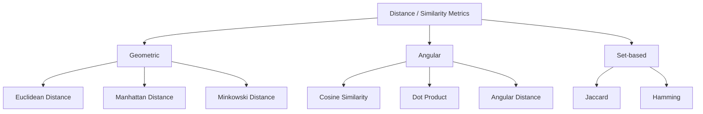
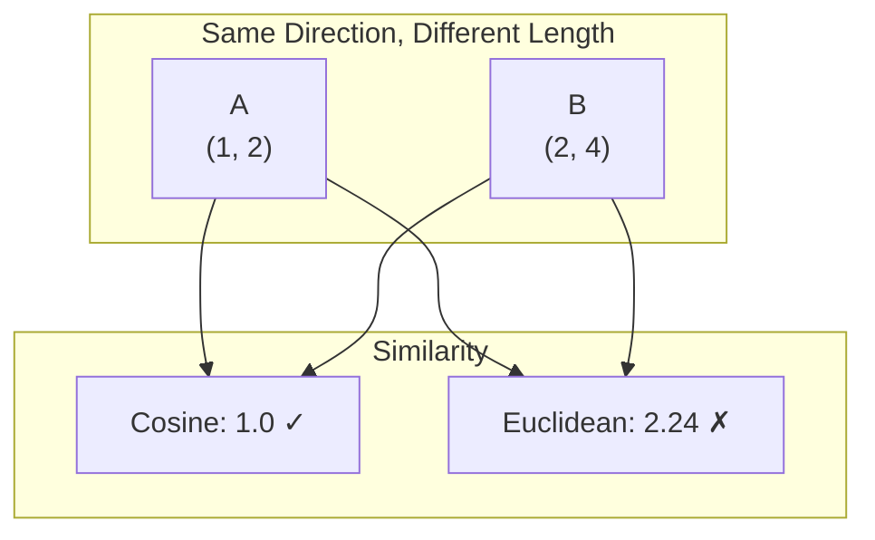

# Part 3: Similarity Search

> Author: **Tamilselvan** · ✉️ tamilselvan.sde@gmail.com · 🔗 [LinkedIn](https://www.linkedin.com/in/tamilselvan-ai/)
>

Similarity search is the core operation of vector databases. Given a query vector, find the "closest" vectors in the database.

## Distance Metrics Overview



## Dot Product

### Formula
```
dot(A, B) = Σ(Ai × Bi) for i = 1 to n

= A1×B1 + A2×B2 + ... + An×Bn
```

### ELI5
> Think of dot product as asking "how much does vector A point in the same direction as vector B?" If they point the same way, the dot product is large and positive. If opposite, it's negative.

### Python
```python
import numpy as np

a = np.array([0.3, 0.8, -0.2, 0.5])
b = np.array([0.4, 0.7, -0.1, 0.6])

dot_product = np.dot(a, b)
# or
dot_product = sum(ai * bi for ai, bi in zip(a, b))

print(f"Dot product: {dot_product:.4f}")  # 1.07
```

### When to Use
- **Default in many vector DBs** (Milvus, Qdrant) for normalized vectors
- When magnitude matters (e.g., recommendation systems)
- For normalized vectors, equivalent to cosine similarity

---

## Cosine Similarity

### Formula
```
cosine_sim(A, B) = dot(A, B) / (||A|| × ||B||)

where ||A|| = sqrt(Σ(Ai²))

= cos(θ) where θ is the angle between vectors
```

### ELI5
> Cosine similarity only cares about direction, not distance. Think of laser pointers from the origin. Cosine similarity measures the angle between the beams, ignoring how far they travel. Two vectors pointing in nearly the same direction are "similar" even if one is much longer.

### Python
```python
import numpy as np

def cosine_similarity(a, b):
    dot_product = np.dot(a, b)
    norm_a = np.linalg.norm(a)
    norm_b = np.linalg.norm(b)
    return dot_product / (norm_a * norm_b)

a = np.array([0.3, 0.8, -0.2, 0.5])
b = np.array([0.4, 0.7, -0.1, 0.6])

sim = cosine_similarity(a, b)
print(f"Cosine similarity: {sim:.4f}")  # ~0.98

# With scikit-learn
from sklearn.metrics.pairwise import cosine_similarity
sim = cosine_similarity([a], [b])[0][0]
```

### When to Use
- **Semantic text search** (most common)
- Document similarity
- When direction matters, magnitude doesn't
- Default choice for text embeddings

---

## Euclidean Distance (L2)

### Formula
```
euclidean(A, B) = sqrt(Σ(Ai - Bi)²)

= sqrt((A1-B1)² + (A2-B2)² + ... + (An-Bn)²)
```

### ELI5
> Euclidean distance is the "straight-line distance" between two points. If vectors are points in space, Euclidean distance is how far apart they are — like measuring with a ruler between two dots on a paper.

### Python
```python
import numpy as np

a = np.array([0.3, 0.8, -0.2, 0.5])
b = np.array([0.4, 0.7, -0.1, 0.6])

l2 = np.linalg.norm(a - b)
print(f"Euclidean distance: {l2:.4f}")  # ~0.17

# Manual
l2_manual = np.sqrt(np.sum((a - b) ** 2))
print(f"Euclidean distance (manual): {l2_manual:.4f}")
```

### When to Use
- Image similarity (CLIP embeddings)
- Clustering algorithms
- When magnitude matters
- Anomaly detection (unusual vectors are far from clusters)

---

## Comparison: Cosine vs Euclidean

For **normalized** vectors (||v|| = 1), cosine and Euclidean are equivalent:

```
cosine_sim = 1 - (euclidean² / 2)
```



> **Key Insight:** For text search, cosine similarity is preferred because "word frequency" variations shouldn't change meaning. For image search, Euclidean may be better because image features have meaningful magnitudes.

---

## Manhattan Distance (L1)

### Formula
```
manhattan(A, B) = Σ|Ai - Bi|

= |A1-B1| + |A2-B2| + ... + |An-Bn|
```

### Python
```python
import numpy as np

a = np.array([0.3, 0.8, -0.2, 0.5])
b = np.array([0.4, 0.7, -0.1, 0.6])

l1 = np.sum(np.abs(a - b))
print(f"Manhattan distance: {l1:.4f}")  # ~0.3
```

### When to Use
- High-dimensional sparse vectors
- When features are independent
- Robust to outliers compared to Euclidean
- Used in some recommendation systems

---

## Hamming Distance

### Formula
```
hamming(A, B) = number of positions where Ai ≠ Bi
```

### ELI5
> Hamming distance counts how many bits are different between two binary strings. Like comparing two license plates and counting how many characters differ.

### Python
```python
def hamming_distance(a, b):
    return sum(ai != bi for ai, bi in zip(a, b))

# Binary vectors
a = [1, 0, 0, 1, 1, 0, 1]
b = [1, 0, 1, 0, 1, 0, 1]
print(f"Hamming distance: {hamming_distance(a, b)}")  # 2
```

### When to Use
- Binary embeddings (e.g., locality-sensitive hashing)
- Near-duplicate detection
- Deduplication at scale

---

## Jaccard Similarity

### Formula
```
jaccard(A, B) = |A ∩ B| / |A ∪ B|
```

### ELI5
> Jaccard similarity compares two sets: how many items they share divided by the total unique items. If you and your friend both have 10 books and share 5, your Jaccard similarity is 5/15 = 0.33.

### Python
```python
def jaccard_similarity(set_a, set_b):
    intersection = len(set_a & set_b)
    union = len(set_a | set_b)
    return intersection / union if union > 0 else 0

a = {"cat", "dog", "bird", "fish"}
b = {"dog", "fish", "hamster"}
print(f"Jaccard: {jaccard_similarity(a, b):.4f}")  # 0.4
```

---

## Angular Distance

### Formula
```
angular_distance(A, B) = arccos(cosine_similarity(A, B)) / π
```

### Python
```python
import numpy as np

def angular_distance(a, b):
    cos_sim = np.dot(a, b) / (np.linalg.norm(a) * np.linalg.norm(b))
    cos_sim = np.clip(cos_sim, -1.0, 1.0)  # Numerical stability
    return np.arccos(cos_sim) / np.pi

a = np.array([0.3, 0.8, -0.2, 0.5])
b = np.array([0.4, 0.7, -0.1, 0.6])
print(f"Angular distance: {angular_distance(a, b):.4f}")
```

---

## Metric Summary Table

| Metric | Range | Symmetric | Triangle Inequality | Best For |
|--------|-------|-----------|-------------------|----------|
| Cosine Similarity | [-1, 1] | Yes | No | Text, semantic search |
| Dot Product | (-∞, ∞) | Yes | No | Recommendations, normalized vectors |
| Euclidean L2 | [0, ∞) | Yes | Yes | Images, clustering |
| Manhattan L1 | [0, ∞) | Yes | Yes | Sparse vectors, robust to outliers |
| Hamming | [0, n] | Yes | Yes | Binary vectors, dedup |
| Jaccard | [0, 1] | Yes | Yes* | Set similarity |
| Angular | [0, 1] | Yes | Yes | Proper metric version of cosine |

---

### Interview Tip
> **Q:** "Why is cosine similarity preferred for text embeddings?"
>
> **A:** Text embeddings from models like BERT produce vectors where the magnitude can vary with text length or word frequency, but the direction captures semantic meaning. Cosine similarity ignores magnitude, making it invariant to text length — "short dog" and "very fluffy dog" should both match "dog."

---

