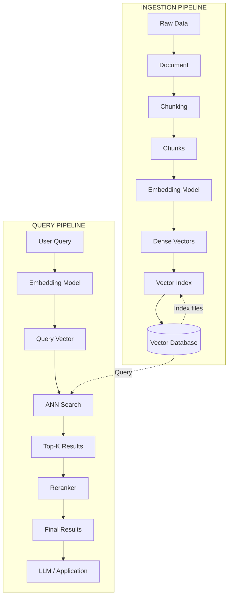
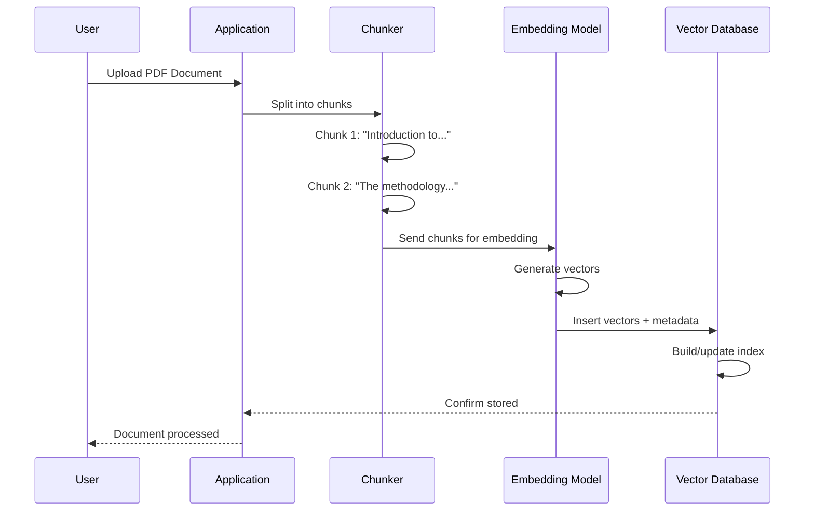
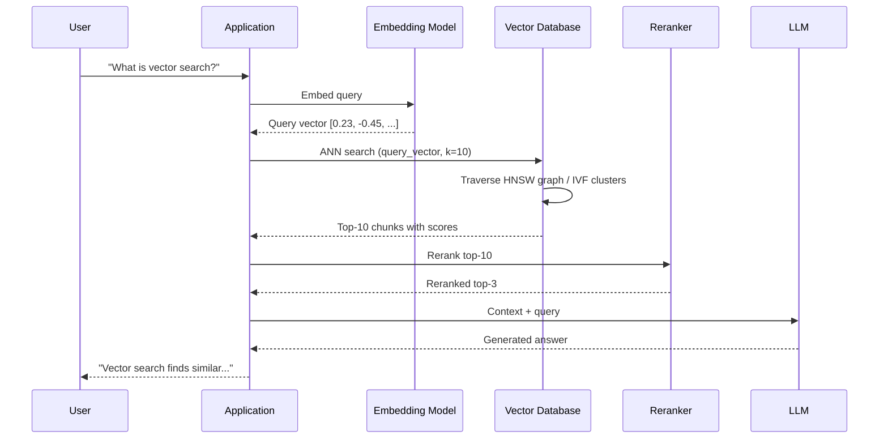
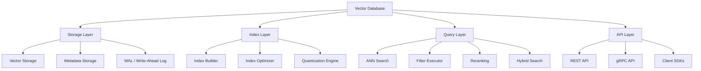
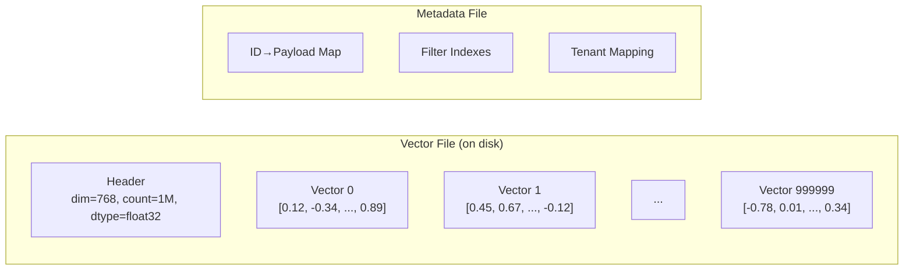
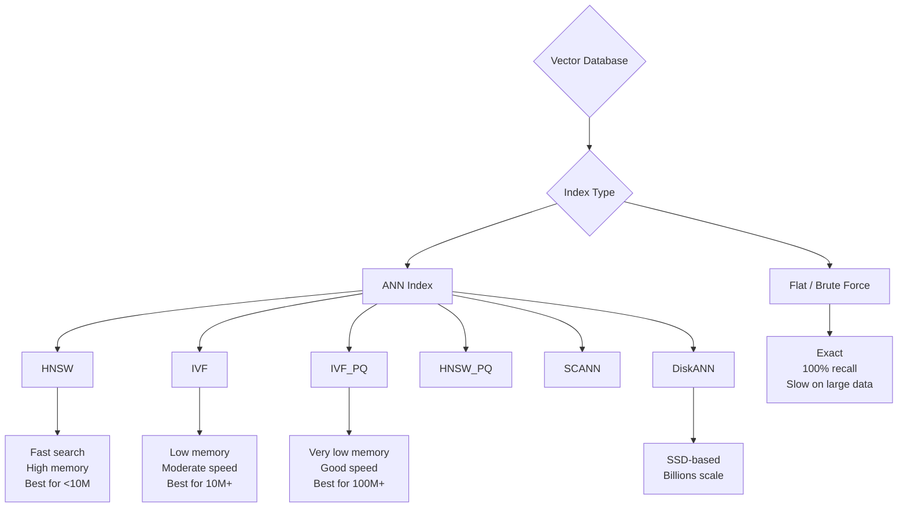

# Part 4: How Vector DB Works

> Author: **Tamilselvan** · ✉️ tamilselvan.sde@gmail.com · 🔗 [LinkedIn](https://www.linkedin.com/in/tamilselvan-ai/)
>

## End-to-End Flow



### Step-by-Step: Ingestion



### Step-by-Step: Query



---

## Inside a Vector DB: Architecture


---

## Core Components



---

## Storage Format: How Vectors Are Stored



**Storage Calculation:**
```
1 million vectors × 768 dimensions × 4 bytes (float32) = 3.07 GB
+ metadata overhead ~ 20-30%
Total ~ 3.7-4 GB per million vectors
```

---

## Index Types Supported



---

### ELI5: How Vector DB Works

> Imagine a giant library where every book has been given a secret code — a list of 1000 numbers. Books about cooking have similar codes. Books about space have different codes. When you ask "find me books like this recipe book," the librarian:
>
> 1. Converts your request into a code (embedding)
> 2. Doesn't check every single book (too slow!)
> 3. Uses a special map (index) to jump directly to the neighborhood of similar codes
> 4. Checks only the nearby books (ANN search)
> 5. Returns the closest matches
>
> This is 1000x faster than checking every book!

---

### Production Tip
> **Read vs Write optimization:** Vector DBs are designed for read-heavy workloads. Ingestion is typically batch-based (offline), while queries are real-time (online). Design your pipeline accordingly — use message queues (Kafka, RabbitMQ) between ingestion and indexing.

---

### Common Mistake
> **❌ Not separating embedding generation from vector storage.** Running an embedding model inline during query time adds 100-500ms latency. Pre-compute and cache embeddings whenever possible.

---

