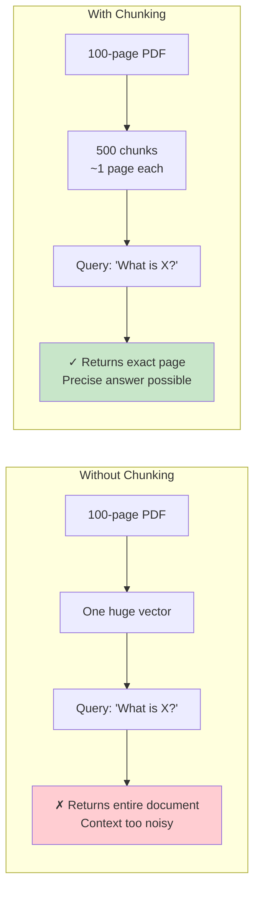
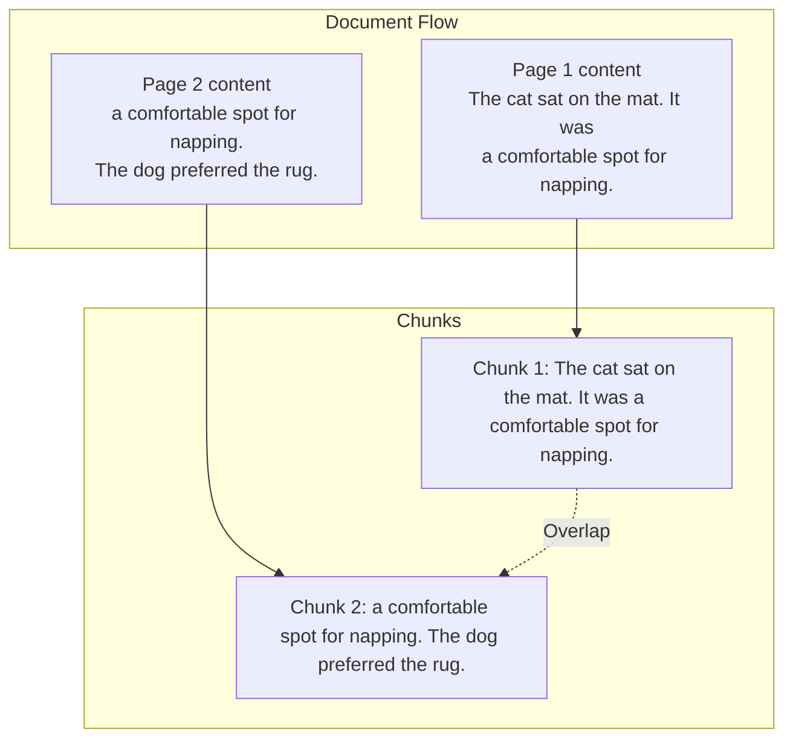
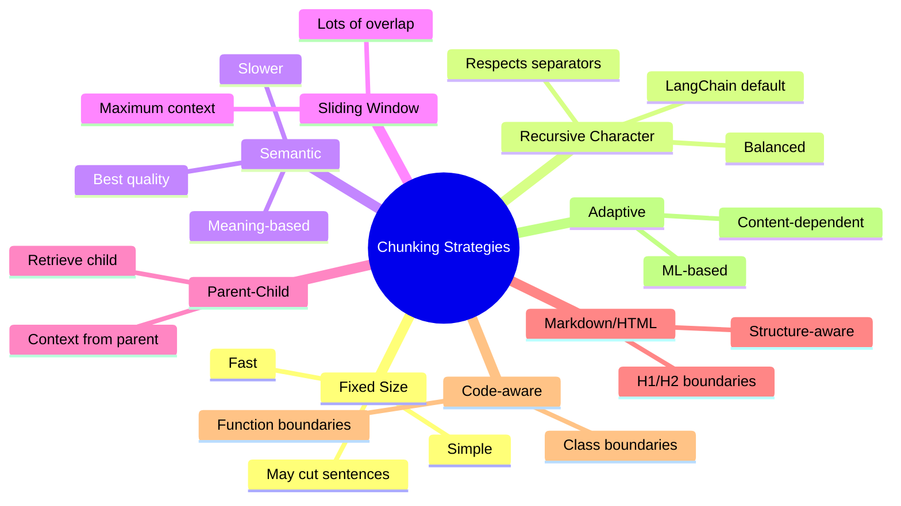
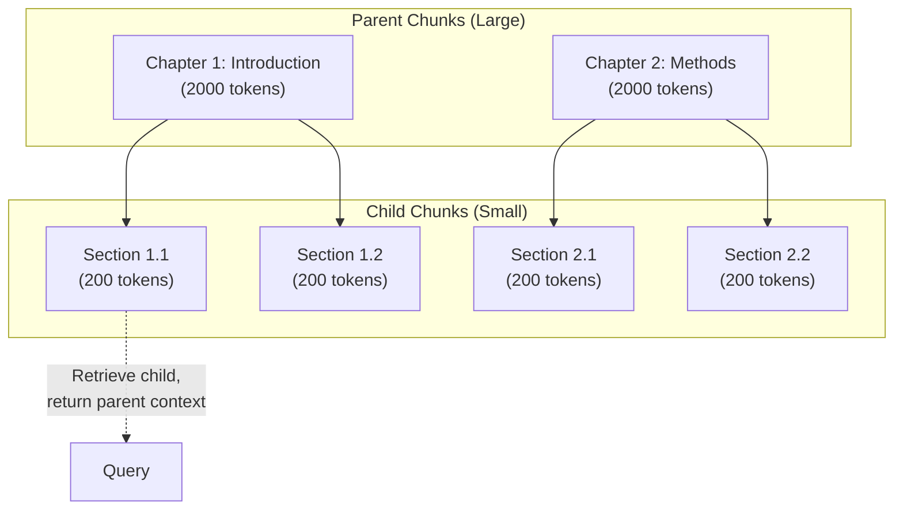
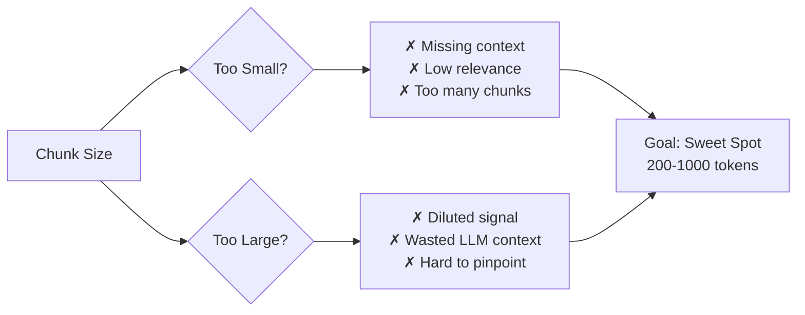

# Part 5: Chunking

> Author: **Tamilselvan** · ✉️ tamilselvan.sde@gmail.com · 🔗 [LinkedIn](https://www.linkedin.com/in/tamilselvan-ai/)
>

## Why Chunk?

**Chunking** is the process of splitting documents into smaller pieces before embedding. This is critical because:

1. **Embedding models have token limits** (usually 256-8192 tokens)
2. **Fine-grained retrieval** — smaller chunks mean more precise matches
3. **Better recall** — relevant information isn't buried inside a large document
4. **LLM context limits** — only send relevant chunks to the LLM



---

## Chunk Size & Overlap

### Chunk Size Guidelines

| Content Type | Recommended Chunk Size | Reason |
|-------------|----------------------|--------|
| Social media posts | 50-100 tokens | Short, self-contained |
| News articles | 200-500 tokens | One topic per chunk |
| Research papers | 300-1000 tokens | Sections are meaningful |
| Code files | 100-500 tokens | Functions/methods |
| Books | 500-2000 tokens | Chapters balance context |
| Legal documents | 1000-2000 tokens | Dense, contextual |

### Overlap

**Overlap** means sharing some text between adjacent chunks:



**Why overlap matters:**
- Prevents cutting off mid-sentence
- Ensures context continuity
- Improves retrieval for boundary content

**Recommended overlap:** 10-20% of chunk size

---

## Chunking Strategies



### 1. Fixed Size Chunking

```python
def fixed_size_chunks(text, chunk_size=500, overlap=50):
    chunks = []
    start = 0
    while start < len(text):
        end = min(start + chunk_size, len(text))
        chunks.append(text[start:end])
        start += chunk_size - overlap
    return chunks
```

**Pros:** Simple, fast, predictable
**Cons:** May cut sentences/words in half

### 2. Recursive Character Chunking (Recommended)

```python
from langchain.text_splitter import RecursiveCharacterTextSplitter

splitter = RecursiveCharacterTextSplitter(
    chunk_size=500,
    chunk_overlap=50,
    separators=["\n\n", "\n", ".", " ", ""],  # Tries in order
    length_function=len,
)

text = open("document.txt").read()
chunks = splitter.split_text(text)
```

**How it works:**
1. Try to split by `\n\n` (paragraph breaks)
2. If chunks too large, try `\n` (line breaks)
3. If still too large, try `.` (sentences)
4. Continue until chunks fit the size limit

### 3. Semantic Chunking

```python
from sentence_transformers import SentenceTransformer

def semantic_chunks(sentences, model, threshold=0.7):
    """Group sentences into chunks based on semantic coherence."""
    model = SentenceTransformer('all-MiniLM-L6-v2')
    embeddings = model.encode(sentences)
    
    chunks = []
    current_chunk = [sentences[0]]
    
    for i in range(1, len(sentences)):
        sim = cosine_similarity([embeddings[i]], [embeddings[i-1]])[0][0]
        if sim < threshold:
            chunks.append(" ".join(current_chunk))
            current_chunk = [sentences[i]]
        else:
            current_chunk.append(sentences[i])
    
    chunks.append(" ".join(current_chunk))
    return chunks
```

**Pros:** Groups related content, better retrieval
**Cons:** Slower, requires embedding model

### 4. Parent-Child Chunking



**Best for:** RAG pipelines where you want:
- Smaller chunks for better matching
- But larger context for the LLM

### 5. Markdown/HTML Chunking

```python
from langchain.text_splitter import MarkdownHeaderTextSplitter

splitter = MarkdownHeaderTextSplitter(
    headers_to_split_on=[
        ("#", "Header 1"),
        ("##", "Header 2"),
        ("###", "Header 3"),
    ]
)

chunks = splitter.split_text(markdown_text)
# Each chunk preserves its header hierarchy as metadata
```

---

## Production Recommendations

| Scenario | Strategy | Chunk Size | Overlap |
|----------|----------|------------|---------|
| QA Bot (docs) | Recursive Character | 500 tokens | 50 tokens |
| Code Assistant | Code-aware | 300 tokens | 30 tokens |
| Research Paper Analysis | Semantic | 1000 tokens | 100 tokens |
| Chat Memory | Fixed Size | 200 tokens | 20 tokens |
| Legal Document Review | Parent-Child | Parent: 2000, Child: 400 | 100 |
| Web Crawl Results | Recursive Character | 1000 tokens | 100 tokens |
| E-commerce Search | Semantic | 100 tokens | 10 tokens |

### Chunk Size vs Performance



### Best Practice
> **Experiment!** The optimal chunk size depends on your data, embedding model, and use case. Always A/B test different chunking strategies on a labeled dataset to measure recall@k.

---

### Common Mistake
> **❌ Using the same chunk size for all content.** A tweet (280 chars) and a research paper (10,000 words) need very different chunking strategies. Adapt chunk size to content type.

---

### Interview Tip
> **Q:** "How does chunk size affect retrieval quality?"
>
> **A:** Smaller chunks give better precision but can miss context. Larger chunks give better context but dilute relevance. The tradeoff is managed through techniques like parent-child chunking — retrieve small chunks for precision, then provide large parent chunks for context.

---

