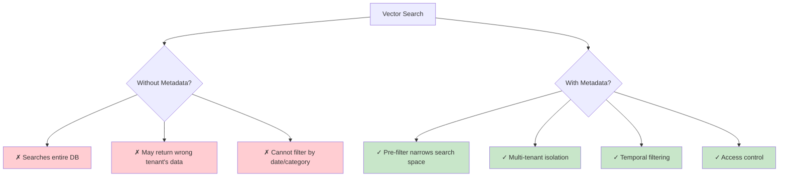
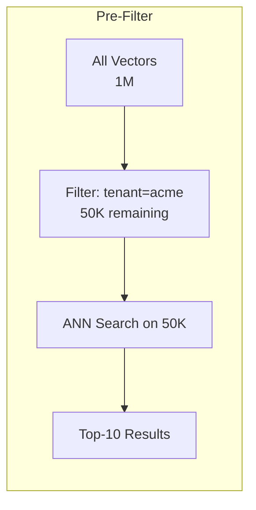
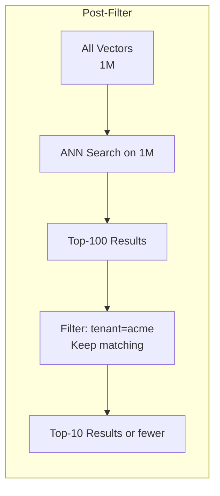
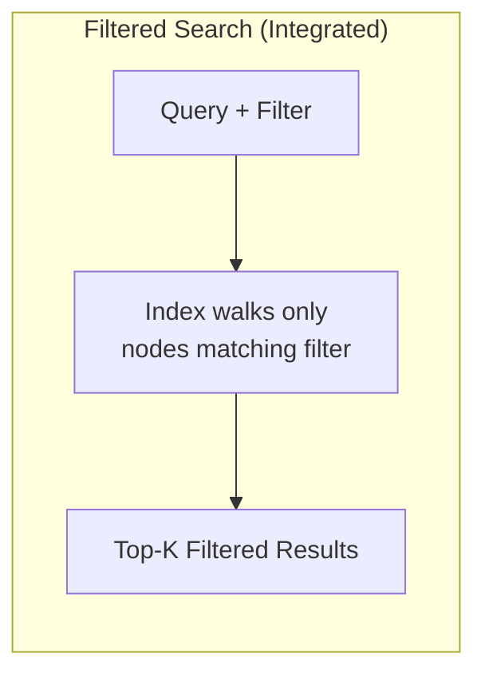
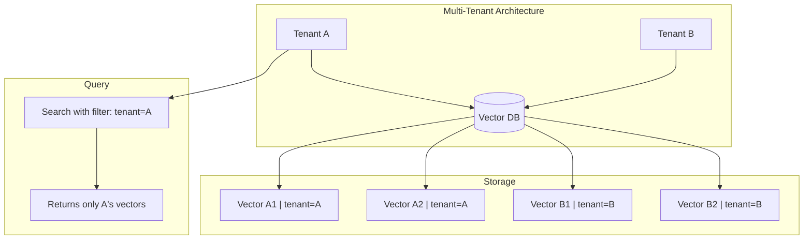

# Part 6: Metadata

> Author: **Tamilselvan** · ✉️ tamilselvan.sde@gmail.com · 🔗 [LinkedIn](https://www.linkedin.com/in/tamilselvan-ai/)
>

## What Metadata Stores

**Metadata** is structured data attached to each vector. It enables filtering, organization, and context for search results.

```python
# Example: A vector with metadata
{
    "id": "doc_123_chunk_5",
    "vector": [0.12, -0.34, 0.56, ...],  # 768-dim embedding
    "metadata": {
        "document_id": "doc_123",
        "title": "Introduction to Machine Learning",
        "author": "John Doe",
        "date": "2024-03-15",
        "page_number": 42,
        "chunk_index": 5,
        "language": "en",
        "category": "education",
        "tags": ["ML", "AI", "beginners"],
        "permission": "internal",
        "tenant_id": "org_acme",
        "version": 2,
        "source_url": "https://example.com/ml-intro.pdf"
    }
}
```

---

## Why Metadata Matters



---

## Filtering in Vector Search

There are two approaches to filtering:

### 1. Pre-Filtering
Filter first, then search among filtered vectors.



**Pros:** Guarantees filtered results
**Cons:** May be slow if filter is very selective, index may not cover filtered set well

### 2. Post-Filtering
Search first, then filter results.



**Pros:** Fast search, uses full index
**Cons:** May return fewer than k results after filtering

### 3. Filtered Search (Best)
Most modern vector DBs integrate filtering into the search itself.



---

## Filter Types

### Boolean Filter
```python
# Qdrant example
filter_condition = Filter(
    must=[
        FieldCondition(key="is_published", match=MatchValue(value=True))
    ]
)
```

### Range Filter
```python
# Milvus example
filter_condition = "page_number >= 10 and page_number <= 50"
```

### Geo Filter
```python
# Weaviate example
near_filter = {
    "geoRange": {
        "latitude": 40.7128,
        "longitude": -74.0060,
        "distance": 10000  # meters
    }
}
```

### Tag/List Filter
```python
# Pinecone example
filter_condition = {
    "tags": {"$in": ["machine-learning", "deep-learning"]},
    "language": {"$eq": "en"}
}
```

### Multi-condition Filter
```python
# Combined filter
filter_condition = {
    "$and": [
        {"tenant_id": {"$eq": "org_acme"}},
        {"date": {"$gte": "2024-01-01"}},
        {"$or": [
            {"category": {"$eq": "research"}},
            {"category": {"$eq": "engineering"}}
        ]}
    ]
}
```

---

## Tenant Isolation



**Tenant isolation strategies:**
1. **Metadata filter** — Add `tenant_id` to every vector, always filter by it
2. **Separate collection** — One collection per tenant (Qdrant, Milvus)
3. **Separate database** — One DB instance per tenant (Pinecone)
4. **Separate namespace** — Namespace per tenant (Pinecone)

---

## Examples

### Qdrant
```python
from qdrant_client import QdrantClient
from qdrant_client.models import Filter, FieldCondition, MatchValue

client = QdrantClient(":memory:")

# Search with metadata filter
results = client.search(
    collection_name="my_docs",
    query_vector=[0.1, 0.2, 0.3],
    query_filter=Filter(
        must=[
            FieldCondition(
                key="tenant_id",
                match=MatchValue(value="acme_corp")
            ),
            FieldCondition(
                key="date",
                range=Range(gte="2024-01-01")
            )
        ]
    ),
    limit=10
)
```

### Milvus
```python
from pymilvus import Collection

collection = Collection("my_docs")
collection.load()

results = collection.search(
    data=[[0.1, 0.2, 0.3]],
    anns_field="vector",
    param={"metric_type": "COSINE"},
    limit=10,
    expr="tenant_id == 'acme_corp' and page_number > 10",
    output_fields=["title", "page_number"]
)
```

### Pinecone
```python
import pinecone

index = pinecone.Index("my-index")

results = index.query(
    vector=[0.1, 0.2, 0.3],
    top_k=10,
    filter={
        "tenant_id": {"$eq": "acme_corp"},
        "date": {"$gte": "2024-01-01"},
        "category": {"$in": ["research", "engineering"]}
    },
    include_metadata=True
)
```

---

### Production Tip
> **Always filter by tenant_id at the database level, not application level.** If your search returns results from other tenants even for a millisecond, it's a security breach. Every query must include a tenant filter — make this a non-negotiable part of your query builder.

---

### Common Mistake
> **❌ Storing large metadata blobs.** Metadata is stored alongside vectors in memory. Keep metadata small (bytes, not KB). Store large payloads (full text) in an external object store; include only a reference in vector metadata.

---

### Interview Tip
> **Q:** "How does pre-filtering vs post-filtering affect performance?"
>
> **A:** Pre-filtering is safer (guarantees k results) but can bypass the ANN index if the filter is too restrictive, degrading to linear scan. Post-filtering is faster but may not return k results. Most modern vector DBs use integrated filtering (e.g., Qdrant's filterable HNSW) for the best of both worlds.

---
