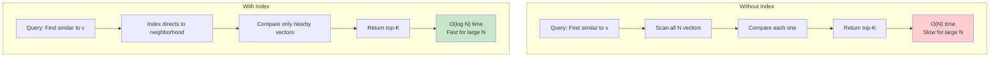
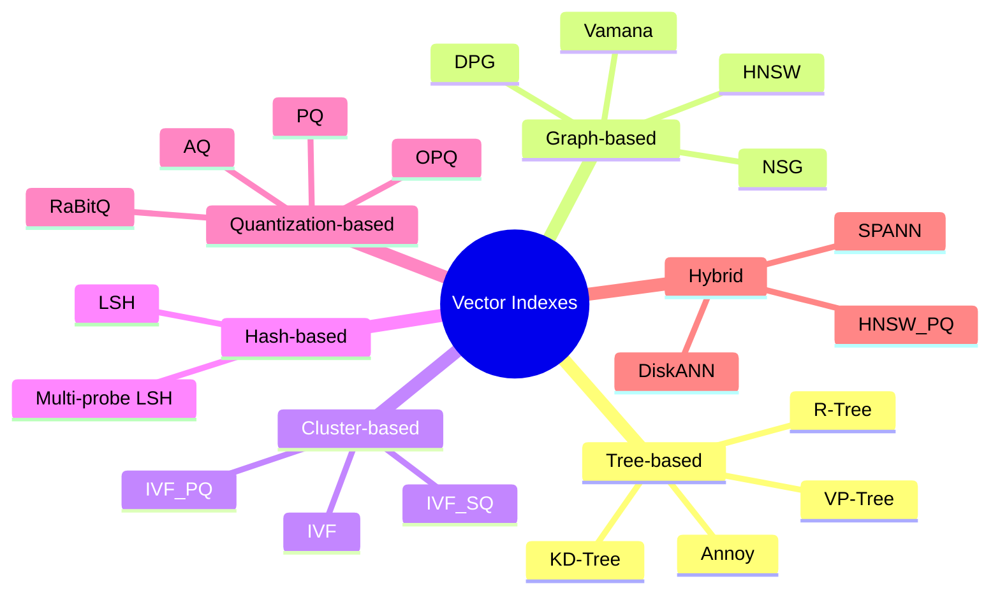

# Part 7: Indexing

> Author: **Tamilselvan** · ✉️ tamilselvan.sde@gmail.com · 🔗 [LinkedIn](https://www.linkedin.com/in/tamilselvan-ai/)
>

## What is an Index?

An **index** is a data structure that enables fast lookups without scanning all records. Think of it like a book's index — instead of reading every page to find "Machine Learning," you go straight to page 142.



---

## Why Index?

### Without Index: Brute Force (Flat Search)

```python
import numpy as np

def brute_force_search(query_vector, all_vectors, k=10):
    """O(N) - compare against every vector."""
    scores = []
    for i, vec in enumerate(all_vectors):
        sim = np.dot(query_vector, vec) / (
            np.linalg.norm(query_vector) * np.linalg.norm(vec)
        )
        scores.append((i, sim))
    scores.sort(key=lambda x: -x[1])
    return scores[:k]
```

| Vectors | Operations | Time (at 1M sim/s) |
|---------|-----------|-------------------|
| 1,000 | 1,000 | 1 ms |
| 1,000,000 | 1,000,000 | 1 second |
| 1,000,000,000 | 1,000,000,000 | 16 minutes |

**❌ Linear search does not scale.**

### With Index: Approximate Search

| Vectors | Operations | Time |
|---------|-----------|------|
| 1,000 | ~50 | 0.05 ms |
| 1,000,000 | ~200 | 0.2 ms |
| 1,000,000,000 | ~500 | 0.5 ms |

**✓ ANN index makes billion-scale search possible in milliseconds.**

---

## Vector Index Types



### Overview Table

| Index Type | Search Speed | Memory | Build Time | Recall | Scalability |
|-----------|-------------|--------|-----------|--------|-------------|
| **Flat (Brute Force)** | Very Slow | High | None | 100% | Low |
| **HNSW** | Very Fast | High | Slow | 95-99% | Medium (RAM) |
| **IVF** | Fast | Medium | Medium | 90-95% | Medium |
| **IVF_PQ** | Fast | Very Low | Medium | 85-95% | High |
| **IVF_SQ** | Fast | Low | Medium | 90-95% | High |
| **NSG** | Very Fast | Medium | Very Slow | 95-99% | Medium |
| **ScaNN** | Very Fast | Low | Slow | 95-98% | High |
| **DiskANN** | Fast | Very Low (SSD) | Slow | 90-95% | Very High |
| **SPANN** | Fast | Very Low (SSD) | Slow | 90-95% | Very High |
| **LSH** | Fast | Medium | Fast | 80-90% | High |
| **Annoy** | Fast | Medium | Fast | 85-95% | Medium |
| **PQ** | Slow (for search) | Very Low | Medium | Low | Very High |

---

### ELI5: Indexing

> Imagine you're looking for a book in a library:
>
> - **No index:** Check every single shelf. Takes all day. (Brute force)
> - **Tree index:** Ask a librarian → "Section 5, Aisle B, Shelf 3." Fast. (Tree)
> - **Graph index:** A friend tells you "that book is similar to these 10 books you already read," and each of those 10 points to more similar books. (HNSW)
> - **Cluster index:** "All ML books are in Section 5, go look there." (IVF)
> - **Compressed index:** Instead of reading full books, only read their summaries first, then check which seem relevant. (PQ)

---

### Interview Tip

> **Q:** "Which index should I choose for my use case?"
>
> **A:** It depends on three constraints:
> 1. **Memory budget** → PQ-based indexes if memory is tight
> 2. **Recall requirement** → HNSW if 99%+ recall needed
> 3. **Dataset size** → DiskANN/SPANN for billion-scale
>
> General guideline: <1M → HNSW | 1M-100M → IVF_PQ | 100M+ → DiskANN/SPANN

---

