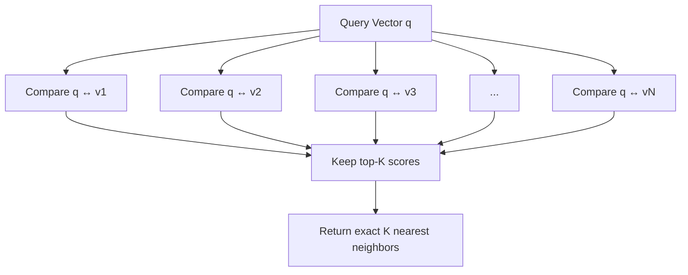
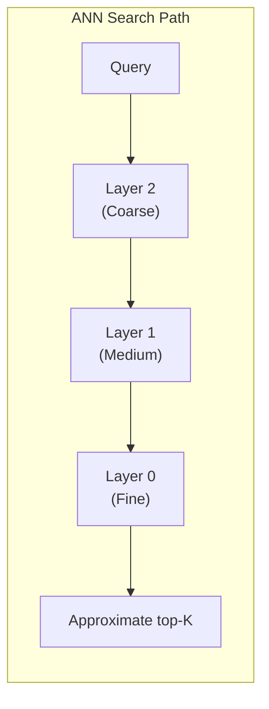
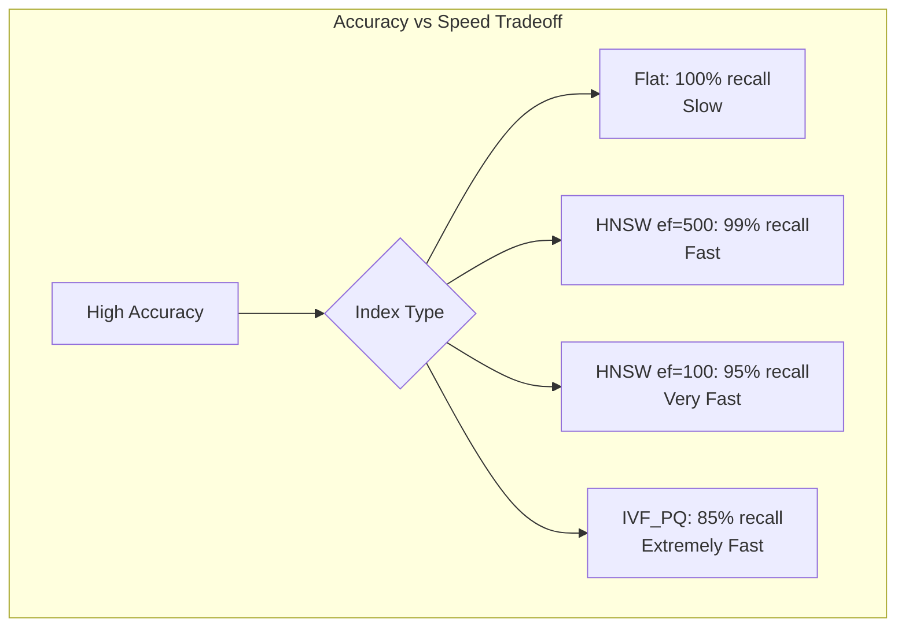

# Part 8: ANN vs KNN

> Author: **Tamilselvan** · ✉️ tamilselvan.sde@gmail.com · 🔗 [LinkedIn](https://www.linkedin.com/in/tamilselvan-ai/)
>

## Exact Search (KNN)

**K-Nearest Neighbors (KNN)** finds the exact k closest vectors by comparing the query against every single vector in the database.

### How KNN Works



```python
import numpy as np
from typing import List, Tuple

def knn_search(query: np.ndarray, 
               vectors: np.ndarray, 
               k: int = 10) -> List[Tuple[int, float]]:
    """Exact KNN - O(N*d) time, 100% recall."""
    # Compute all pairwise similarities
    scores = vectors @ query  # dot product for all
    # or cosine: cosine_similarity(vectors, [query])
    
    # Get top-k indices
    indices = np.argpartition(-scores, k)[:k]
    indices = indices[np.argsort(-scores[indices])]
    
    return [(i, scores[i]) for i in indices]
```

**Characteristics:**
- 100% recall (guaranteed exact)
- O(N × d) time complexity (N = vectors, d = dimensions)
- Not feasible for large datasets
- Used as baseline/ground truth

---

## Approximate Search (ANN)

**Approximate Nearest Neighbors (ANN)** finds vectors that are "close enough" to the query, trading some accuracy for massive speed gains.

### How ANN Works (e.g., HNSW)



```python
# ANN search (conceptual)
def ann_search(query, index, k=10, ef=100):
    """ANN - O(log N) time, ~95-99% recall."""
    candidates = index.get_entry_points()  # Starting nodes
    visited = set()
    
    while candidates:
        nearest = get_nearest(query, candidates)
        neighbors = index.get_neighbors(nearest)
        candidates.update(neighbors - visited)
        
        if len(candidates) > ef:
            candidates = prune_to_top(candidates, ef)
    
    return get_top_k(candidates, k)
```

**Characteristics:**
- 90-99% recall (tunable)
- O(log N) or O(√N) time
- Sub-millisecond for billion-scale
- Requires index building (offline)

---

## Tradeoffs



### Comparison Table

| Aspect | KNN (Exact) | ANN (Approximate) |
|--------|-------------|-------------------|
| **Recall** | 100% | 85-99% (tunable) |
| **Speed** | O(N) | O(log N) to O(√N) |
| **1M vectors** | ~1 second | ~1-10 milliseconds |
| **1B vectors** | ~1000 seconds | ~10-100 milliseconds |
| **Memory** | Full vectors (4-12GB/M) | Indexed + compressed (0.5-6GB/M) |
| **Build time** | None | Minutes to hours |
| **Use case** | Ground truth, validation | Production search |
| **Data structure** | None needed | Index required |

### Recall-Dimension Relationship

```
High Dimensionality (768+)
    → Curse of dimensionality
    → All vectors seem "far away"
    → ANN recall drops
    → Need better indexes (HNSW, not IVF)

Low Dimensionality (<100)  
    → ANN works very well
    → IVF/LSH can achieve near-100% recall
    → Simpler indexes suffice
```

### When to Use Each

| Scenario | Use KNN | Use ANN |
|----------|---------|---------|
| Tiny dataset (<10K) | ✓ | Optional |
| Ground truth generation | ✓ | ✗ |
| Research benchmarks | ✓ | ✗ |
| Production <1M vectors | ✓ If fast enough | ✓ |
| Production >1M vectors | ✗ | ✓ |
| Billion-scale | ✗ | ✓ |
| Real-time (<10ms) | ✗ | ✓ |
| High recall needed (99.9%) | ✓ | HNSW with large ef |

---

### ELI5: ANN vs KNN

> Imagine finding the 10 houses most similar to yours in a city of 1 million:
>
> **KNN:** Visit every single house, compare them all, pick the 10 most similar. Exhaustive. Accurate. Takes forever.
>
> **ANN:** Go to your neighborhood first. Check nearby houses. Ask neighbors for recommendations. Visit their suggestions. After checking a few hundred houses, you're confident you've found the 10 most similar ones. Much faster. Might miss one or two.

---

### Interview Tip

> **Q:** "How does ANN achieve sub-linear search time?"
>
> **A:** ANN algorithms structure vectors into an index that partitions the space:
> - **Tree-based** (KD-Tree, Annoy): Binary splits, O(log N) depth
> - **Graph-based** (HNSW): Navigable graph, O(log N) hops
> - **Cluster-based** (IVF): O(√N) centroid comparisons
> - **Hash-based** (LSH): O(1) hash lookups
>
> The key insight is that we don't need to compare against every vector — we just need to be "probably correct."

---

