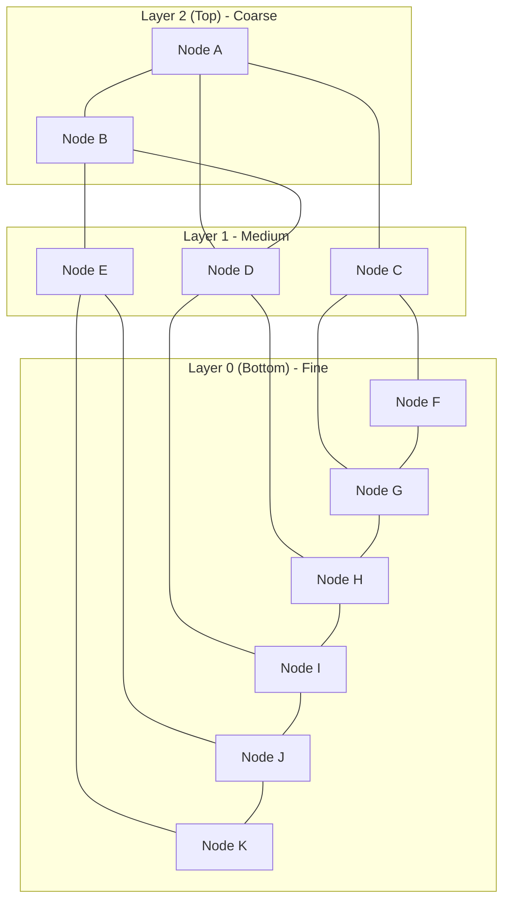
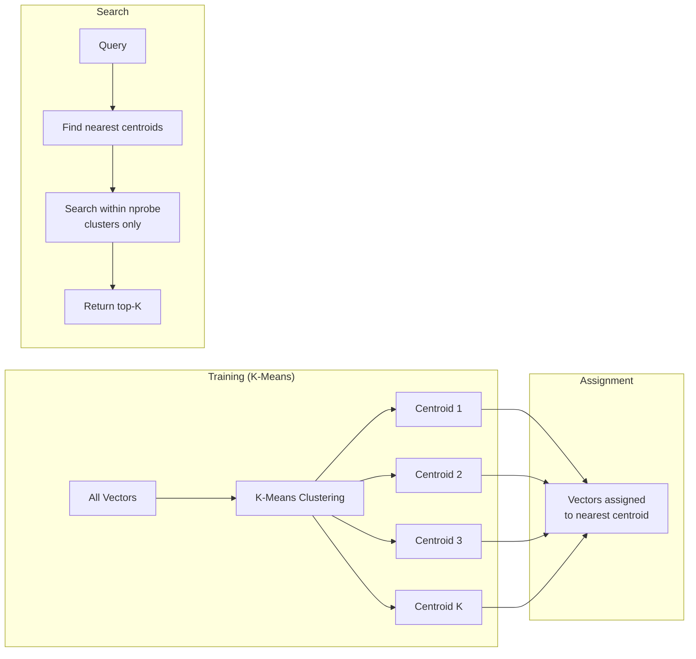
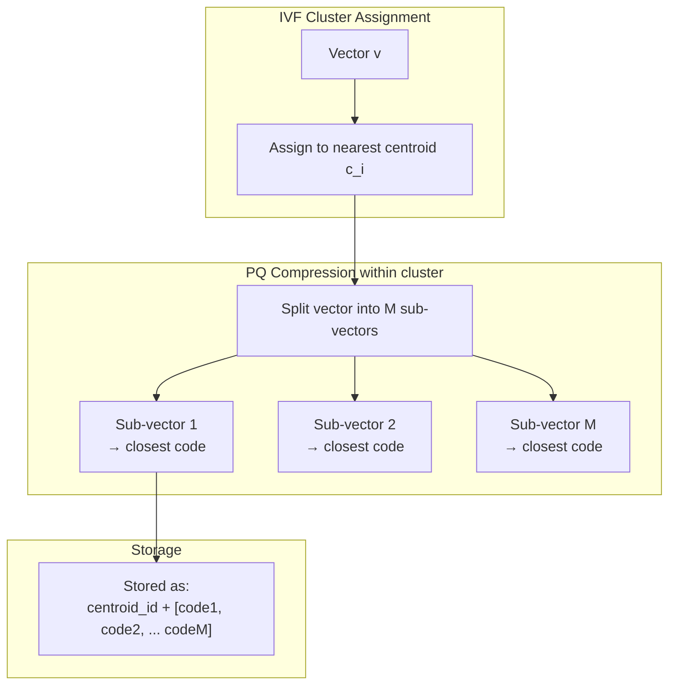
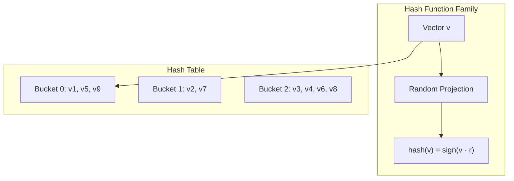
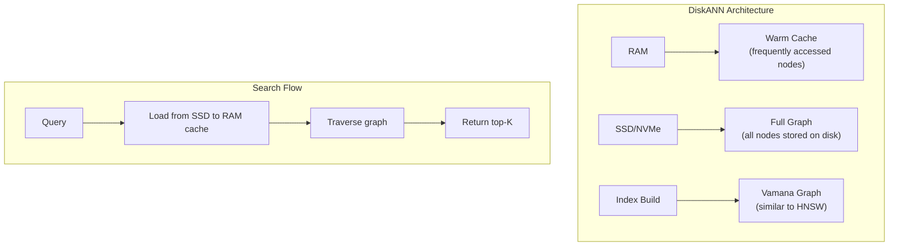
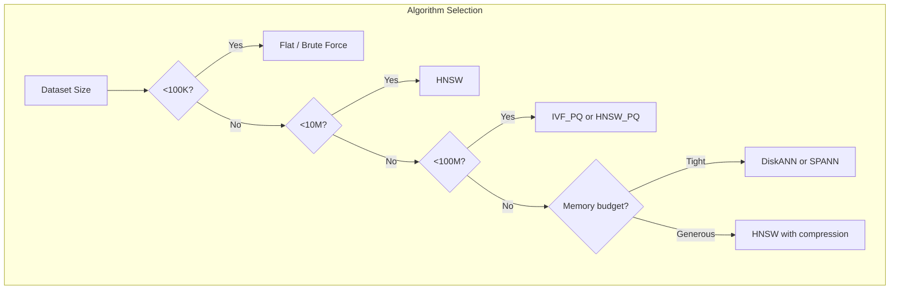

# Part 9: ANN Algorithms

> Author: **Tamilselvan** · ✉️ tamilselvan.sde@gmail.com · 🔗 [LinkedIn](https://www.linkedin.com/in/tamilselvan-ai/)
>

## HNSW (Hierarchical Navigable Small World)

**HNSW** is currently the most popular ANN algorithm, used by almost every vector database (Qdrant, Weaviate, Milvus, Pinecone, etc.).

### How It Works



**Key concepts:**
- Multi-layer graph (top = coarser, bottom = finest)
- Each layer is a "small world" graph
- Search starts at top layer, descends to bottom
- Bottom layer contains all vectors

**Parameters:**
- `M`: Number of connections per node (default 16)
- `efConstruction`: Build-time search width (default 80)
- `efSearch`: Query-time search width (tunable, 100-500)

**Pros:**
- Fastest search speed
- Excellent recall (95-99%)
- Well-understood and battle-tested

**Cons:**
- High memory usage (graph connections ~1-2 GB/million vectors)
- Slow index building
- No efficient deletion (some implementations add tombstoning)

---

## NSG (Navigable Small World Graph)

**NSG** is a graph-based algorithm that improves on HNSW by using a more optimized graph structure.

| Aspect | HNSW | NSG |
|--------|------|-----|
| Search speed | Very fast | Slightly faster |
| Build time | Slow | Much slower (needs full KNN graph) |
| Memory | High (M * edges) | Lower (monotonic graph) |
| Recall | 95-99% | 95-99% |
| Use case | General purpose | When build time is not critical |

---

## IVF (Inverted File Index)

**IVF** clusters vectors into groups and only searches the nearest clusters.

### How It Works



**Parameters:**
- `nlist`: Number of centroids/clusters (default: sqrt(N))
- `nprobe`: Number of nearest clusters to search (tunable)

**Pros:**
- Lower memory than HNSW
- Fast build time
- Good for large-scale with PQ

**Cons:**
- Slower than HNSW (but can be speed-tuned with nprobe)
- Recall drops with poor clustering
- Requires training

---

## IVFPQ (IVF + Product Quantization)

**IVFPQ** combines IVF with Product Quantization to drastically reduce memory.



**Memory comparison:**
```
100M vectors × 768 dims × float32
  = 307 GB (full vectors)

100M vectors × IVFPQ (M=96, nbits=8)
  = 100M × (96 × 1 byte)   → 9.6 GB
  + 4096 centroids × 768 × 4 → 13 MB
  + PQ codebooks → ~1 MB
  Total: ~9.6 GB (32x compression!)
```

**Pros:**
- Extremely memory efficient
- Good for 100M+ scale
- Fast with GPU acceleration

**Cons:**
- Lower recall (~85-95%)
- Some accuracy loss from compression
- Slower than pure HNSW

---

## IVF_SQ (IVF with Scalar Quantization)

**IVF_SQ** compresses vectors by reducing precision (e.g., float32 → float16 or int8).

| Quantization Type | Bytes per dimension | Compression | Memory for 1M × 768 |
|-------------------|-------------------|-------------|---------------------|
| float32 | 4 | 1x | 3.07 GB |
| float16 | 2 | 2x | 1.54 GB |
| int8 | 1 | 4x | 0.77 GB |
| int4 | 0.5 | 8x | 0.38 GB |

---

## LSH (Locality-Sensitive Hashing)

**LSH** uses hash functions that map similar vectors to the same hash bucket.



**When to use:**
- Binary or short vectors
- Very high recall not needed
- Need fast index building

---

## ScaNN (Scalable Nearest Neighbors)

**ScaNN** is Google's ANN algorithm that achieves state-of-the-art speed/accuracy tradeoffs.

**Key techniques:**
1. **Anisotropic quantization** — optimizes PQ for search, not reconstruction
2. **Score-aware quantization** — preserves ranking order
3. **AVX2/AVX512** — SIMD optimizations

```python
import scann

# Build ScaNN index
scann_index = scann.ScannBuilder(
    vectors_np, 100, "dot_product"
).tree(
    num_leaves=2000,
    num_leaves_to_search=100
).score_ah(
    2, anisotropic_quantization_threshold=0.2
).reorder(
    reordering_num_neighbors=100
).build()

# Search
neighbors, distances = scann_index.search(query, k=10)
```

**Pros:** Best speed/accuracy tradeoff, good recall
**Cons:** Less portable (C++ library), limited simplicity

---

## DiskANN

**DiskANN** is Microsoft's SSD-based ANN algorithm for billion-scale search.



**Key features:**
- Vectors stored on SSD (not RAM)
- Smart caching keeps hot nodes in memory
- Handles billion-scale on a single machine
- ~10-100ms latency for billion-scale

**Use case:** Very large datasets where RAM is insufficient

---

## SPANN (Similarity-aware Partitioned ANN)

**SPANN** is another disk-based approach from Microsoft that partitions vectors into clusters that fit on SSD.

**Comparison: DiskANN vs SPANN vs HNSW**

| Algorithm | Storage | 1B Vectors Memory | Search Time | Recall |
|-----------|---------|------------------|-------------|--------|
| HNSW | RAM | 100-200 GB | 1-5 ms | 99% |
| DiskANN | SSD | 2-10 GB (cache) | 10-50 ms | 95% |
| SPANN | SSD | 2-10 GB (cache) | 10-30 ms | 95-97% |

---

## Algorithm Comparison Summary



### Full Comparison Table

| Algorithm | Build Time | Search Time | Memory | Recall | Best For |
|-----------|-----------|-------------|--------|--------|----------|
| **Flat** | None | O(N) | Full vectors | 100% | Ground truth, <10K |
| **HNSW** | Slow | O(log N) | Very High | 99% | General purpose, <10M |
| **NSG** | Very Slow | O(log N) | High | 99% | Static datasets |
| **IVF** | Fast | O(√N) | Medium | 95% | Large, memory-constrained |
| **IVF_PQ** | Medium | O(√N) | Very Low | 90% | Very large, tight memory |
| **IVF_SQ** | Fast | O(√N) | Low | 93% | Balanced |
| **LSH** | Fast | O(1) | Medium | 85% | Binary vectors |
| **ScaNN** | Slow | O(log N) | Low | 98% | Large, high throughput |
| **DiskANN** | Slow | O(log N) | SSD + cache | 95% | Billion-scale |
| **SPANN** | Slow | O(log N) | SSD + cache | 95% | Billion-scale |
| **Annoy** | Fast | O(log N) | Medium | 92% | Prototyping |

---

### Production Tip

> **Index selection rule of thumb:**
> - **HNSW** if you have enough RAM and need lowest latency
> - **IVF_PQ** if memory is constrained
> - **DiskANN** if dataset is larger than available RAM
> - **Flat** for ground truth evaluation only

---

### Common Mistake

> **❌ Tuning only for speed without measuring recall.** Always establish ground truth (KNN results) for a subset of queries, then tune ANN parameters to meet your recall target (e.g., 95%). Never deploy an ANN index without validating recall on your data.

---

### Interview Tip

> **Q:** "Why does HNSW use so much memory?"
>
> **A:** HNSW stores a graph where each node has M edges (typically 16-64). For 1M vectors, that's 1M × M × 2 directions × 4 bytes (int32) = ~128-512 MB just for edges, plus the full vectors (3 GB for 768-dim float32). Total: 3-4 GB per million vectors.

---

