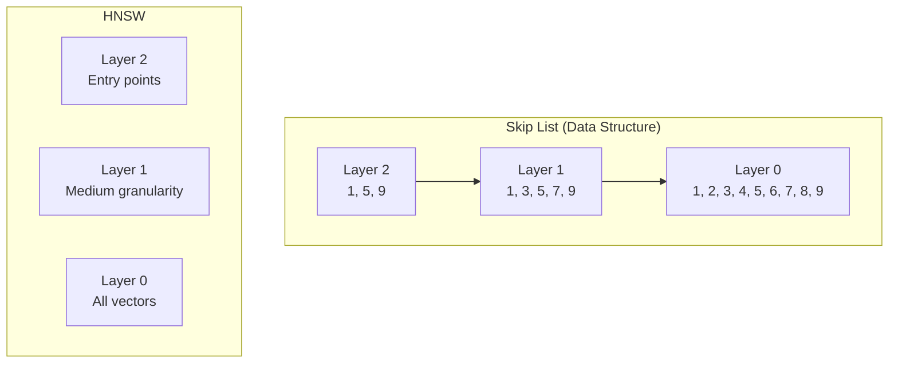
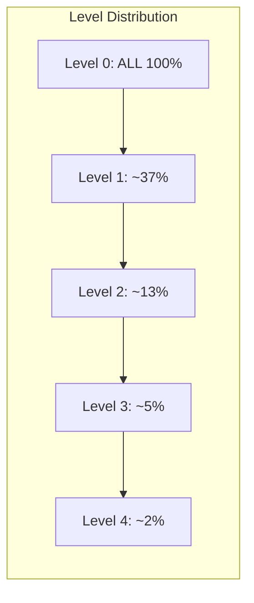
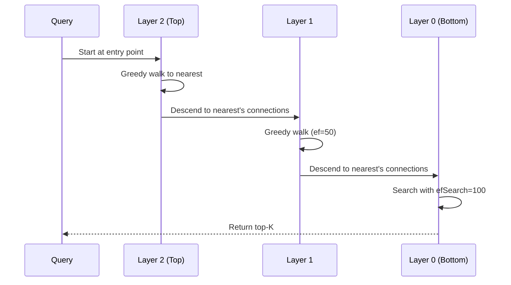
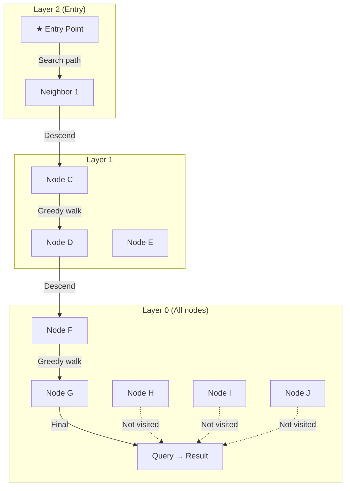

# Part 10: HNSW Deep Dive

> Author: **Tamilselvan** · ✉️ tamilselvan.sde@gmail.com · 🔗 [LinkedIn](https://www.linkedin.com/in/tamilselvan-ai/)
>

## The Paper

> **"Efficient and robust approximate nearest neighbor search using Hierarchical Navigable Small World graphs"** — Yury Malkov, Dmitry Yashunin (2016)

## How HNSW Works

HNSW combines **skip lists** with **navigable small world graphs**.

### Skip List Analogy



**Search intuition:**
1. Start at the top layer (few nodes, wide spacing)
2. Greedily traverse to the closest node in current layer
3. Descend to the next layer using current position
4. Repeat until bottom layer
5. Refine search at bottom layer

---

## Layer Creation

Each vector is assigned a random level `L = -ln(uniform(0,1)) × 1/ln(M)`

```python
import random
import math

def get_random_level(M: float = 16.0) -> int:
    """Determine which layer this node belongs to."""
    return int(-math.log(random.random()) * M)
```

**Distribution:**
```
Level 0: 100% of vectors
Level 1: ~37% of vectors
Level 2: ~13% of vectors
Level 3: ~5% of vectors
Level 4: ~2% of vectors
```



---

## Neighbor Selection

When inserting a new node, we need to select its neighbors. Two strategies:

### Simple Select
```python
def select_neighbors_simple(candidates, M):
    """Select M closest candidates."""
    candidates.sort(key=lambda x: x[1])  # Sort by distance
    return candidates[:M]
```

### Heuristic Select (Better)
```python
def select_neighbors_heuristic(candidates, M, extend_candidates):
    """Select diverse neighbors (Malkov's heuristic)."""
    # 1. Sort by distance
    # 2. Add closest first
    # 3. Only add if it improves cover of the space
    # This prevents all neighbors being in one direction
    candidates.sort(key=lambda x: x[1])
    selected = []
    
    for c in candidates:
        if not selected:
            selected.append(c)
        else:
            # Check if c is closer to any selected than to query
            too_close = any(
                distance(c[0], s[0]) < c[1]
                for s in selected
            )
            if not too_close:
                selected.append(c)
        if len(selected) >= M:
            break
    
    return selected
```

---

## Search Algorithm



```python
def hnsw_search(query, index, k=10, ef=100):
    """HNSW search algorithm."""
    # Start at entry point (top layer)
    current_node = index.entry_point
    current_dist = distance(query, current_node.vector)
    
    # Phase 1: Greedy traversal from top to bottom
    for layer in range(index.max_layer, 0, -1):
        changed = True
        while changed:
            changed = False
            for neighbor in current_node.neighbors[layer]:
                d = distance(query, neighbor.vector)
                if d < current_dist:
                    current_dist = d
                    current_node = neighbor
                    changed = True
    
    # Phase 2: Search at bottom layer with ef
    candidates = [(current_dist, current_node)]
    visited = {current_node.id}
    results = PriorityQueue()
    
    while candidates:
        dist, node = heappop(candidates)
        # Worst distance among results so far
        furthest = results[0][0] if results else float('inf')
        if dist > furthest and len(results) >= ef:
            break
        
        for neighbor in node.neighbors[0]:
            if neighbor.id not in visited:
                visited.add(neighbor.id)
                d = distance(query, neighbor.vector)
                heappush(candidates, (d, neighbor))
                
                if len(results) < ef:
                    heappush(results, (-d, neighbor))
                elif d < -results[0][0]:
                    heapreplace(results, (-d, neighbor))
    
    # Return top-k from results
    top_k = nlargest(k, results, key=lambda x: x[0])
    return [(node.id, -dist) for dist, node in top_k]
```

---

## Parameters Explained

### M (Connections per node)
| M | Memory | Search Speed | Recall | Build Time |
|---|--------|-------------|--------|-----------|
| 8 | Low | Slow | 90% | Fast |
| 16 | Medium | Fast | 95% | Medium |
| 32 | High | Very Fast | 98% | Slow |
| 64 | Very High | Extremely Fast | 99% | Very Slow |

**Default:** 16

### efConstruction (Build-time search width)
| efConstruction | Build Time | Index Quality | Recall |
|---------------|-----------|--------------|--------|
| 40 | Fast | Good | 93% |
| 80 | Medium | Better | 96% |
| 200 | Slow | Best | 99% |
| 500 | Very Slow | Optimal | 99.5% |

**Default:** 80
**Tip:** Use higher values for better recall, lower for faster builds

### efSearch (Query-time search width)
```python
# Trade-off: higher ef = better recall but slower
for ef in [50, 100, 200, 500]:
    recall = evaluate_recall(query_set, index, ef=ef)
    latency = measure_latency(query_set, index, ef=ef)
    print(f"ef={ef}: recall={recall:.1%}, latency={latency:.1f}ms")
```

**Typical range:** 100-500

---

## Visualization: HNSW Search Path



---

### ELI5: HNSW

> Imagine you're in a giant city looking for a coffee shop. You have a map book:
>
> **Layer 2 (Top):** World map showing only continents. You start here and get close to your target continent.
>
> **Layer 1:** A country map showing major cities. You find the right city.
>
> **Layer 0:** Detailed street map. You find the exact coffee shop.
>
> At each level, you don't check every street — you ask the nearest person (node) where to go next, and they point you in the right direction.

---

### Production Tip

> **HNSW best practices:**
> 1. Use `M=16` for most cases, `M=32` for high-recall needs
> 2. Set `efConstruction` 2-3x the value of `M`
> 3. Make `efSearch` tunable at query time (not build time)
> 4. For deletions, either use tombstoning or rebuild periodically
> 5. HNSW is sensitive to insertion order — batch insertions work better than streaming

---

### Interview Tip

> **Q:** "Why does HNSW have different layers?"
>
> **A:** The hierarchical structure mimics skip lists. Higher layers act as "express lanes," allowing the search to cover large distances in few hops. Without layers, you'd need to traverse many small steps. With layers, you can make giant leaps at the top, then refine at the bottom. This gives O(log N) search complexity.

---

