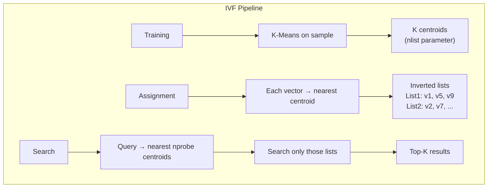
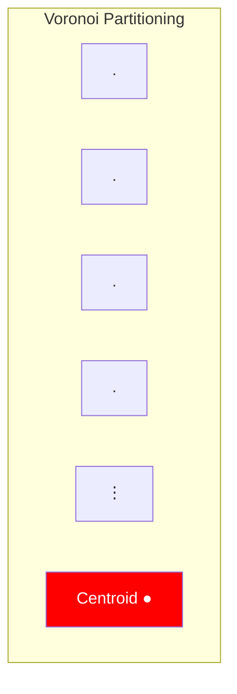
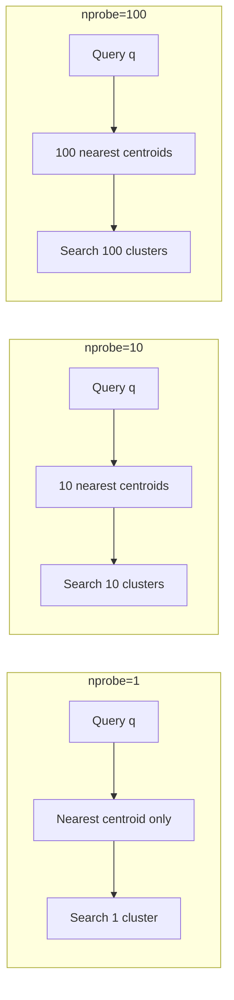

# Part 11: IVF Deep Dive

> Author: **Tamilselvan** · ✉️ tamilselvan.sde@gmail.com · 🔗 [LinkedIn](https://www.linkedin.com/in/tamilselvan-ai/)
>

## How IVF Works

**IVF (Inverted File Index)** partitions the vector space into regions (Voronoi cells) using k-means clustering, then only searches the regions closest to the query.



### Parameter: nlist

`nlist` = number of centroids (clusters)

```
nlist = sqrt(N) is a common heuristic
N=1M → nlist=1000
N=10M → nlist=3162
N=100M → nlist=10000
```

| nlist | Accuracy | Search Speed | Memory (centroids) | Build Time |
|-------|---------|-------------|-------------------|-----------|
| sqrt(N) | Good | Fast | Small | Medium |
| N/10 | High | Very Fast | Large | Slow |
| N/100 | Low | Slow (many per list) | Small | Fast |

---

## Centroids & Clusters

### Voronoi Diagram (2D visualization)



> In 2D, each centroid "owns" the region where it's the closest centroid. In high-D, the same principle applies — each centroid owns the vectors closest to it.

### K-Means Training

```python
from sklearn.cluster import MiniBatchKMeans
import numpy as np

def train_ivf(vectors, nlist=1000):
    """Train k-means for IVF index."""
    kmeans = MiniBatchKMeans(
        n_clusters=nlist,
        batch_size=10000,
        random_state=42
    )
    kmeans.fit(vectors)
    
    # Assign each vector to nearest centroid
    assignments = kmeans.predict(vectors)
    
    # Build inverted lists
    inverted_lists = [[] for _ in range(nlist)]
    for idx, centroid_id in enumerate(assignments):
        inverted_lists[centroid_id].append(idx)
    
    return kmeans.cluster_centers_, inverted_lists
```

---

## Search with nprobe

`nprobe` = number of nearest centroids to search



**Trade-off:**
```
nprobe=1   → Fast (1/1000 of data), recall ~60%
nprobe=10  → Medium (1/100 of data), recall ~85%
nprobe=100 → Slow (1/10 of data), recall ~95%
nprobe=nlist → Full scan, recall = KNN! (100%)
```

### Optimal nprobe

```python
def find_optimal_nprobe(vectors, queries, ground_truth, k=10):
    """Find nprobe that gives target recall."""
    for nprobe in [1, 5, 10, 20, 50, 100, 200]:
        results = ivf_search(queries, nprobe=nprobe, k=k)
        recall = compute_recall(results, ground_truth)
        latency = measure_latency(queries, nprobe=nprobe)
        print(f"nprobe={nprobe:3d}  recall={recall:.2%}  " 
              f"latency={latency:.1f}ms")
        if recall >= 0.95:
            return nprobe
```

---

### ELI5: IVF

> Imagine a giant mall directory:
>
> Instead of walking through ALL stores (brute force), the directory first tells you the store is in "Wing B, 2nd floor" (centroid assignment).
>
> When searching, you look at the directory → see which wings are closest to your query → only visit those wings.
>
> With nprobe=1, you search only the nearest wing. Fast but might miss something in a nearby wing. With nprobe=10, you search more wings. Slower but more thorough.

---

### Interview Tip

> **Q:** "What happens when nlist is too small or too large?"
>
> **A:** Too small → each cluster has too many vectors, search is slow. Too large → clusters may be empty, and k-means becomes unstable. The heuristic `nlist = sqrt(N)` balances these tradeoffs.

---

