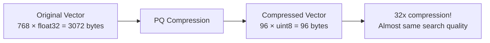
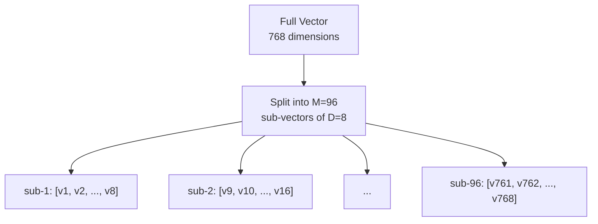
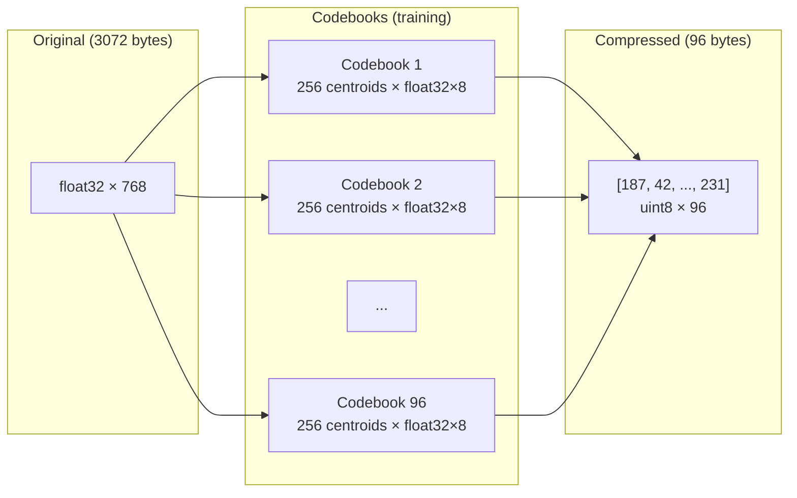
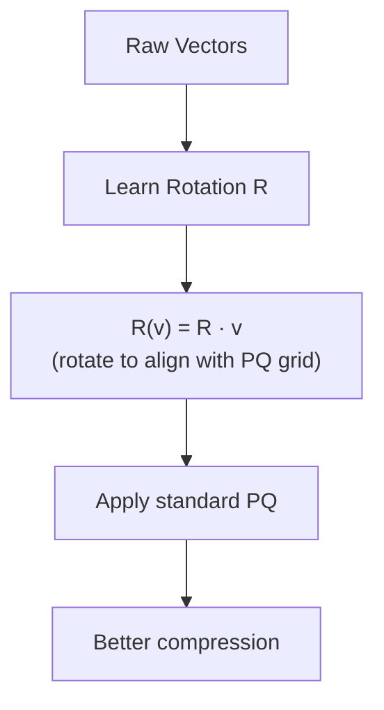

# Part 12: Product Quantization

> Author: **Tamilselvan** · ✉️ tamilselvan.sde@gmail.com · 🔗 [LinkedIn](https://www.linkedin.com/in/tamilselvan-ai/)
>

## Why Compress Vectors?

**Storage problem:** 1 billion vectors × 768 dimensions × 4 bytes = 3 TB

**Product Quantization** compresses vectors to 1/10 to 1/50 of their original size.



---

## How PQ Works

### Step 1: Split into Sub-vectors

```
Original vector v = [v1, v2, v3, ..., v768]  →  768 dimensions

Split into M sub-vectors of D dimensions each:
M × D = 768 (where M = 96, D = 8)

v = [v1...v8][v9...v16][v17...v24]...[v761...v768]
    └─────┘ └──────┘ └───────┘   └─────────┘
    Sub-1    Sub-2    Sub-3      Sub-M (M=96)
```



### Step 2: Train Codebooks

For each sub-space, learn k centroids using k-means:

```python
# For each of M sub-spaces:
for m in range(M):
    sub_vectors = all_vectors[:, m*D : (m+1)*D]  # shape: (N, D)
    kmeans = KMeans(n_clusters=256)  # 256 = 8-bit code
    kmeans.fit(sub_vectors)
    codebook[m] = kmeans.cluster_centers_  # shape: (256, D)
```

### Step 3: Encode Each Sub-vector

Each sub-vector is replaced by the index of its nearest centroid:

```
Original: [v1...v8] [v9...v16] ... [v761...v768]
             ↓         ↓              ↓
Codes:     [42]      [187]         [231]
Compressed: 1 byte    1 byte         1 byte
         Total: 96 bytes (vs 3072 bytes original)
```

### Visualization



---

## Memory Reduction

### Memory Comparison

| Method | 1M vectors (768d) | 10M vectors | 100M vectors | 1B vectors |
|--------|------------------|-------------|-------------|-----------|
| **Full float32** | 3.07 GB | 30.7 GB | 307 GB | 3.07 TB |
| **HNSW (M=16)** | 4.5 GB | 45 GB | 450 GB | 4.5 TB |
| **PQ M=96** | 96 MB | 960 MB | 9.6 GB | 96 GB |
| **PQ M=48** | 48 MB | 480 MB | 4.8 GB | 48 GB |
| **IVF+PQ** | 200 MB | 2 GB | 20 GB | 200 GB |

### Search with PQ (Asymmetric Distance Computation)

```python
def pq_distance(query, codes, codebooks):
    """ADC: Asymmetric Distance Computation."""
    M = len(codes)
    D = query.shape[0] // M
    total_dist = 0.0
    
    for m in range(M):
        sub_q = query[m*D : (m+1)*D]
        code = codes[m]
        centroid = codebooks[m][code]
        
        # Pre-compute distances for speed
        # d = ||sub_q - centroid||²
        diff = sub_q - centroid
        total_dist += np.dot(diff, diff)
    
    return np.sqrt(total_dist)
```

**Why it works:** The query is kept in full precision while database vectors are quantized. This "asymmetric" approach preserves much of the accuracy.

---

### ELI5: Product Quantization

> Imagine describing faces:
>
> - **Full vector:** "The person's nose is 3.42 cm long, 1.89 cm wide, at a 23 degree angle, with nostrils 0.76 cm apart..." (very precise but takes 100 words)
>
> - **PQ:** "Nose type: 42 (out of 256 standard nose shapes), Eye type: 187, Mouth type: 231" (much shorter, but "close enough")
>
> Each face has 96 different features, each described by a single number (0-255). You lose some detail but can now describe 1000 faces in the space of 10 full descriptions.

---

### Production Tip

> **PQ parameter guidelines:**
> - `M = dimensions / 8` usually works well (e.g., M=96 for 768d)
> - `nbits = 8` per code (256 centroids per sub-space) is standard
> - Higher M = better compression = lower accuracy
> - Lower M = weaker compression = better accuracy
> - Always validate recall: PQ can drop 5-15% vs uncompressed

---

### Common Mistake

> **❌ Using the same PQ configuration for all data distributions.** PQ assumes data is evenly distributed across all dimensions. If your data has uneven variance (some dimensions more important), consider OPQ (Optimized Product Quantization) which rotates the data first.

---

### Interview Tip

> **Q:** "How does PQ maintain search quality despite 20-50x compression?"
>
> **A:** Three reasons: (1) **Asymmetric distance** — the query is uncompressed, only DB vectors are compressed. (2) **Clustering minimizes error within each sub-space.** (3) **Ranking preservation** — even if absolute distances shift, the relative ordering of near vs far items is mostly preserved. Good enough for top-K retrieval.

---

## Optimized PQ (OPQ)

OPQ adds a rotation matrix to align data variance with sub-vector boundaries:



**Improvement:** 1-5% better recall vs standard PQ at the same compression ratio.

---
