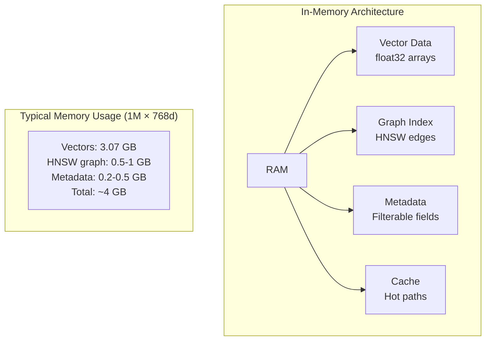
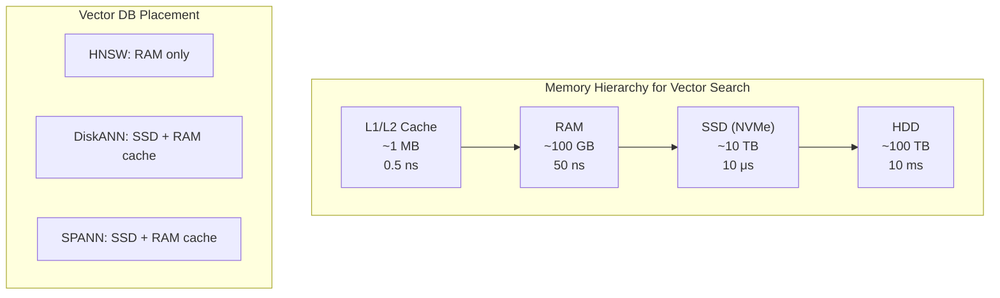
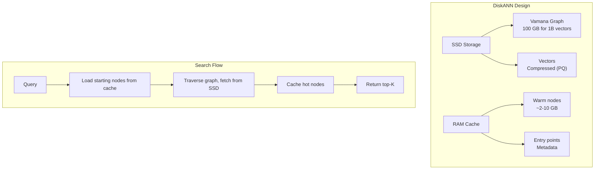
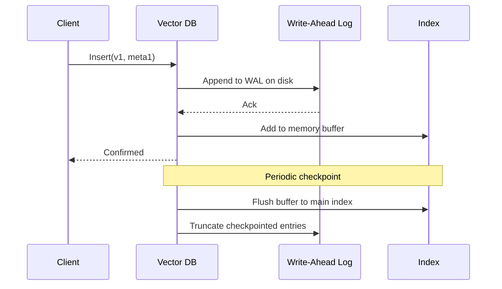

# Part 13: Storage

> Author: **Tamilselvan** · ✉️ tamilselvan.sde@gmail.com · 🔗 [LinkedIn](https://www.linkedin.com/in/tamilselvan-ai/)
>

## RAM (In-Memory Storage)

Most vector databases store indexes and vectors primarily in RAM for maximum performance.



### Memory Mapping (mmap)

Many vector DBs use **memory-mapped files** to extend effective RAM:

```python
import numpy as np
import mmap

# Memory-map a large vector file
with open('vectors.bin', 'r+b') as f:
    # Map the entire file
    mmapped = mmap.mmap(f.fileno(), 0)
    
    # Access as numpy array without loading all into RAM
    vectors = np.frombuffer(
        mmapped, dtype=np.float32
    ).reshape(-1, 768)
    
    # Access individual vectors on demand
    vector_42 = vectors[42]  # OS loads this page on demand
```

**Benefits:**
- OS handles caching (hot vectors stay in RAM, cold evicted)
- Larger-than-RAM datasets possible
- Fast restart (no rebuild needed)

---

## SSD & DiskANN

For billion-scale datasets, SSD-based approaches become necessary.



### DiskANN Architecture



---

## Persistence & Durability

### Write-Ahead Log (WAL)



### Persistence Strategies

| Strategy | Durability | Write Speed | Read Speed | Recovery Time |
|----------|-----------|-------------|------------|---------------|
| **mmap only** | None (OS dependent) | Fast | Fast | Instant |
| **WAL + periodic flush** | Crash-safe | Medium | Fast | Seconds |
| **Synchronous write** | Full durability | Slow | Fast | None |
| **Replication** | Network-durable | Medium | Fast | Instant via failover |

---

### Production Tip

> **Memory planning formula:**
> - Vectors: `N × D × 4 bytes` (float32)
> - HNSW edges: `N × M × 2 × 4 bytes` (≈50% of vectors)
> - PQ codes: `N × (D/8) × 1 byte` (≈3% of vectors)
> - Metadata: `N × ~100 bytes` (approximate)
> - Total ≈ `N × (4×D + 32 + 100 + overhead)`

---

