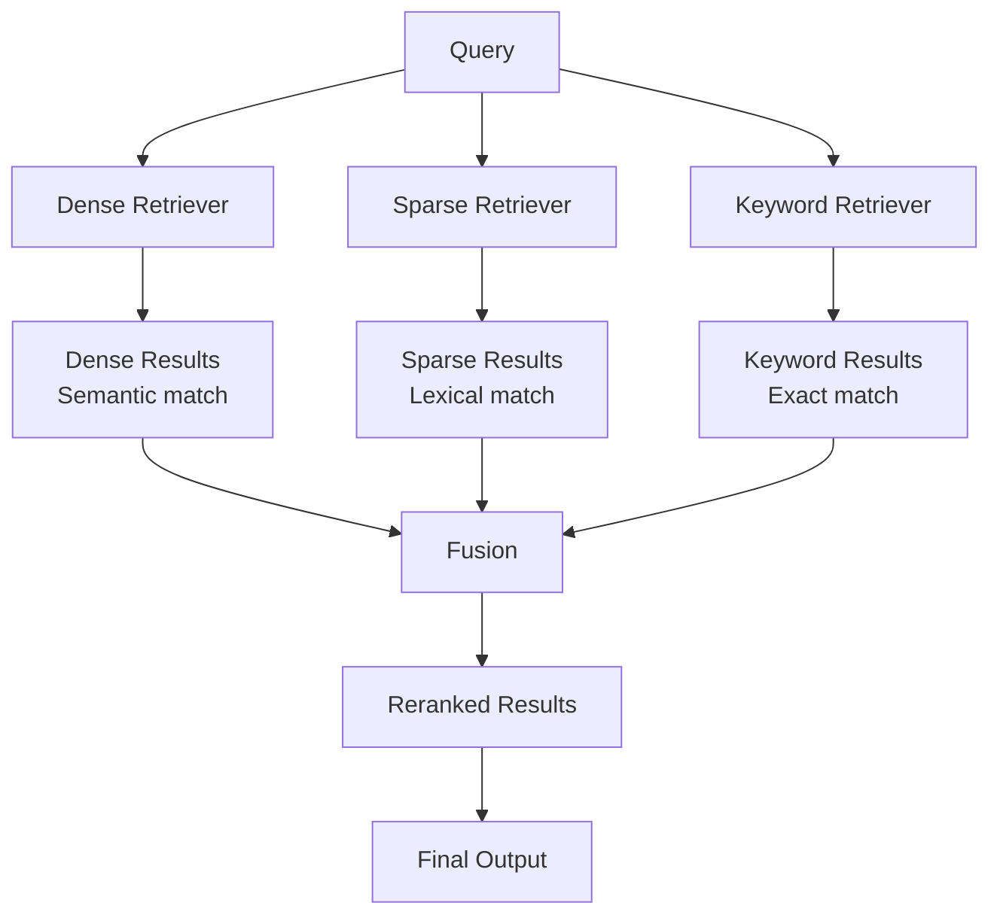
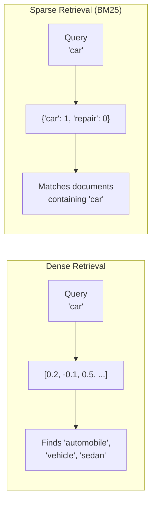
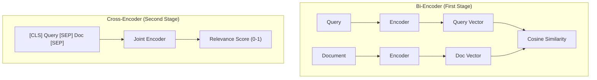

# Part 14: Retrieval

> Author: **Tamilselvan** · ✉️ tamilselvan.sde@gmail.com · 🔗 [LinkedIn](https://www.linkedin.com/in/tamilselvan-ai/)
>

## Vector Search

**Pure vector search** finds vectors closest to the query vector using a distance metric.

```python
# Pure vector search
results = vector_db.search(
    query_vector=embedding,
    metric="cosine",
    k=10
)
# Returns: [(id, score), ...]
```

## Hybrid Search

**Hybrid search** combines multiple retrieval methods for better results.



---

## Sparse vs Dense Retrieval



### Comparison

| Aspect | Dense (Vector) | Sparse (BM25) |
|--------|---------------|---------------|
| **Semantic understanding** | Excellent | None |
| **Exact keyword match** | Poor | Excellent |
| **Handles synonyms** | Yes | No |
| **Rare terms** | Can miss | Captures well |
| **Context awareness** | Yes | No |
| **Out-of-vocabulary** | Sub-word tokens | N/A |
| **Latency** | 1-50ms | <1ms |

---

## BM25 (Sparse Retrieval)

**BM25** is the industry-standard keyword scoring algorithm.

```python
from rank_bm25 import BM25Okapi

corpus = [
    "The cat sat on the mat",
    "The dog played in the park",
    "Vector databases store embeddings"
]
tokenized = [doc.split() for doc in corpus]
bm25 = BM25Okapi(tokenized)

query = "cat mat"
scores = bm25.get_scores(query.split())
# [1.82, 0.0, 0.0]
```

**BM25 formula:**
```
score(Q, D) = Σ(idf(qi) × f(qi, D) × (k1 + 1) / (f(qi, D) + k1 × (1 - b + b × |D|/avgdl)))
```

Where:
- `f(qi, D)` = frequency of term qi in document D
- `|D|` = document length
- `avgdl` = average document length
- `k1` = saturation parameter (typically 1.2-2.0)
- `b` = length normalization (typically 0.75)

---

## Reciprocal Rank Fusion (RRF)

**RRF** combines results from multiple ranked lists:

```python
def reciprocal_rank_fusion(results_list, k=60):
    """Combine ranked results from different retrieval methods."""
    scores = {}
    for results in results_list:
        for rank, (doc_id, score) in enumerate(results):
            scores[doc_id] = scores.get(doc_id, 0) + 1 / (k + rank)
    # Sort by combined score
    return sorted(scores.items(), key=lambda x: -x[1])

dense_results = [(1, 0.9), (3, 0.8), (5, 0.7)]  # (id, score)
sparse_results = [(2, 0.8), (3, 0.7), (1, 0.6)]  # (id, score)

final = reciprocal_rank_fusion([dense_results, sparse_results])
print(final)  # [(1, 2/k+1 + 1/k+3), (3, 1/k+2 + 1/k+2), ...]
```

**Why RRF works:** It's robust to score calibration differences — you can't compare cosine similarity to BM25 scores directly, but ranks are comparable.

---

## MMR (Maximum Marginal Relevance)

**MMR** diversifies search results by penalizing redundancy:

```python
import numpy as np
from sklearn.metrics.pairwise import cosine_similarity

def mmr(query_emb, doc_embs, lambda_param=0.7, k=10):
    """Diversify results using MMR."""
    selected = []
    candidates = list(range(len(doc_embs)))
    
    # Similarity to query
    query_sim = cosine_similarity([query_emb], doc_embs)[0]
    
    for _ in range(k):
        mmr_scores = {}
        for idx in candidates:
            # Similarity to query
            sim_to_query = query_sim[idx]
            
            # Max similarity to already selected (redundancy)
            if selected:
                sim_to_selected = max(
                    cosine_similarity([doc_embs[idx]], [doc_embs[s]])[0][0]
                    for s in selected
                )
            else:
                sim_to_selected = 0
            
            # MMR = relevance - redundancy
            mmr_scores[idx] = (
                lambda_param * sim_to_query 
                - (1 - lambda_param) * sim_to_selected
            )
        
        best = max(mmr_scores, key=mmr_scores.get)
        selected.append(best)
        candidates.remove(best)
    
    return selected
```

| Lambda | Behavior |
|--------|----------|
| 1.0 | Pure relevance (no diversity) |
| 0.7 | Relevance-focused, slight diversity |
| 0.5 | Balanced relevance/diversity |
| 0.3 | Diversity-focused |
| 0.0 | Pure diversity |

---

## Cross-Encoder Reranking

**Cross-encoders** jointly process query + document for more accurate relevance scoring.



```python
from sentence_transformers import CrossEncoder

# Load cross-encoder model
cross_encoder = CrossEncoder('cross-encoder/ms-marco-MiniLM-L-6-v2')

# Rerank top-100 results
query = "What is vector search?"
candidates = [
    "Vector search finds similar vectors",
    "SQL uses exact matching",
    ...
]

# Score all pairs
pairs = [[query, doc] for doc in candidates]
scores = cross_encoder.predict(pairs)

# Rerank by cross-encoder score
reranked = sorted(zip(candidates, scores), key=lambda x: -x[1])
```

**Performance comparison:**
```
Bi-encoder (first stage):
  1000 documents × ~5ms = 5 seconds → score approximate

Cross-encoder (second stage):
  100 documents × ~50ms = 5 seconds → score accurate
  
Combined: ~10 seconds for quality results vs 50ms for bi-encoder only
           or 50 seconds for cross-encoder on all 1000
```

**Best practice:** Use bi-encoder for first pass (get top-50), then cross-encoder for reranking (get top-10).

---

### ELI5: Hybrid Search

> Imagine finding a recipe:
>
> - **Dense search:** "Like the recipe I made last week" → finds similar recipes by meaning
> - **Sparse/BM25:** "Find recipes with 'chocolate' and 'vegan'" → matches exact keywords
> - **Hybrid:** First find recipes with chocolate (BM25), then rank by how similar they are to your favorite recipe (dense). Best of both.
> - **Reranker:** After getting the top 50 candidates, read each one carefully to pick the best 10.

---

### Interview Tip

> **Q:** "Why use hybrid search instead of just dense vectors?"
>
> **A:** Dense vectors capture meaning but miss rare/important keywords. If someone searches for "Python 3.12 async bug fix," dense search finds "similar bugs," but BM25 finds documents containing "3.12" and "async" and "bug fix" specifically. Hybrid combines both signal types for robust retrieval.

---

