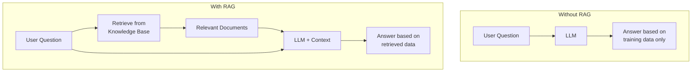
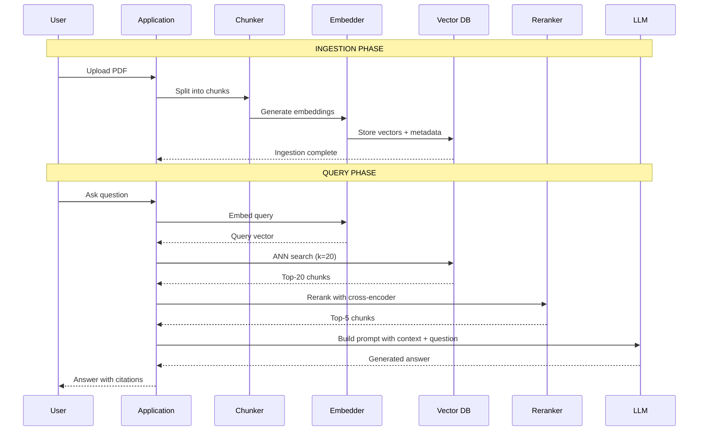
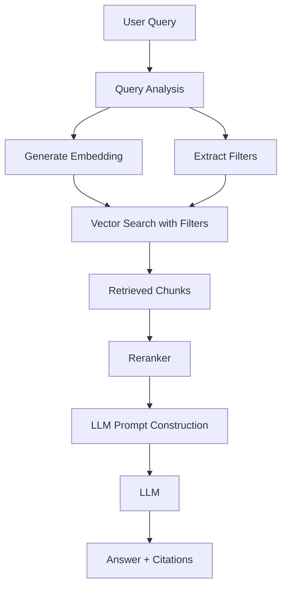
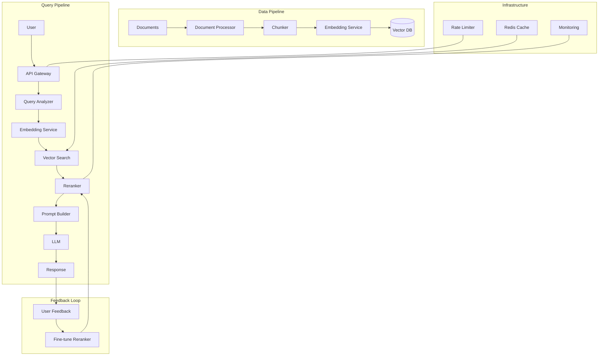
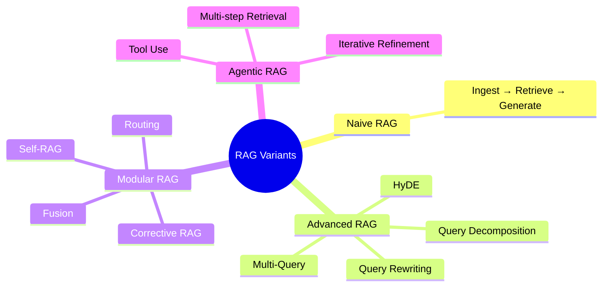

# Part 15: RAG Pipeline

> Author: **Tamilselvan** · ✉️ tamilselvan.sde@gmail.com · 🔗 [LinkedIn](https://www.linkedin.com/in/tamilselvan-ai/)
>

## What is RAG?

**Retrieval-Augmented Generation (RAG)** is a technique that enhances LLM outputs by first retrieving relevant information from a knowledge base, then feeding it to the LLM as context.



---

## Complete RAG Flow



---

## Enhanced RAG with Metadata Filtering



### Python RAG Implementation

```python
import openai
from sentence_transformers import SentenceTransformer
from qdrant_client import QdrantClient

class RAGPipeline:
    def __init__(self):
        self.embedder = SentenceTransformer('all-MiniLM-L6-v2')
        self.db = QdrantClient(":memory:")
        self.llm = openai.OpenAI()
        
    def ingest(self, chunks, metadata_list):
        """Store chunks in vector DB."""
        vectors = self.embedder.encode(chunks)
        self.db.upload_collection(
            collection_name="docs",
            vectors=vectors.tolist(),
            payload=[{"text": c, **m} 
                     for c, m in zip(chunks, metadata_list)]
        )
    
    def query(self, question, k=5):
        """Retrieve and generate answer."""
        # 1. Embed query
        query_vec = self.embedder.encode(question)
        
        # 2. Retrieve from vector DB
        results = self.db.search(
            collection_name="docs",
            query_vector=query_vec,
            limit=k
        )
        
        # 3. Build context
        context = "\n\n".join([
            r.payload["text"] for r in results
        ])
        
        # 4. Generate with LLM
        prompt = f"""Answer the question based on the context below.
        
Context:
{context}

Question: {question}

Answer:"""
        
        response = self.llm.chat.completions.create(
            model="gpt-4",
            messages=[{"role": "user", "content": prompt}]
        )
        
        return response.choices[0].message.content
```

---

## Production RAG Architecture



### Advanced RAG Techniques



### Techniques Summary

| Technique | Description | Improvement |
|-----------|-------------|-------------|
| **HyDE** | Generate hypothetical doc from query, embed that | Better query representation |
| **Multi-Query** | Generate multiple query variants, combine results | Better recall |
| **Query Rewriting** | LLM rewrites ambiguous queries | Better precision |
| **Context Compression** | Condense retrieved chunks | Fit more in context |
| **Self-RAG** | LLM decides when to retrieve | Less hallucination |
| **Corrective RAG** | Verify retrieved docs, retry if needed | Higher quality |
| **Hybrid Search** | Dense + sparse fusion | Better coverage |
| **Agentic RAG** | Multi-tool, multi-step retrieval | Complex reasoning |

---

### ELI5: RAG

> Imagine taking an open-book test:
>
> - **Without RAG (Closed book):** You answer from memory. Might get things wrong or make stuff up.
> - **RAG (Open book):** First you look up the answer in your notes. Then you explain it in your own words.
> - **Good RAG:** You highlight the most relevant parts. You check that you have the right page. Then you explain clearly.
> - **Great RAG:** You skim multiple chapters, cross-reference, check which info is most reliable, then synthesize a comprehensive answer.

---

### Production Tip

> **RAG pipeline latency breakdown (typical):**
> 1. Embedding: 50-200ms (API) or 10-50ms (local)
> 2. Vector search: 5-50ms
> 3. Reranking: 50-500ms (per chunk analyzed)
> 4. LLM generation: 500ms-5s
> **Total: ~1-6 seconds**
>
> Optimize by: caching frequent queries, batching embeddings, using smaller rerankers for first pass.

---

### Common Mistake

> **❌ Not including citations in RAG output.** Users (and evaluators) need to know which source documents support the answer. Always return source references with every RAG response.

---

