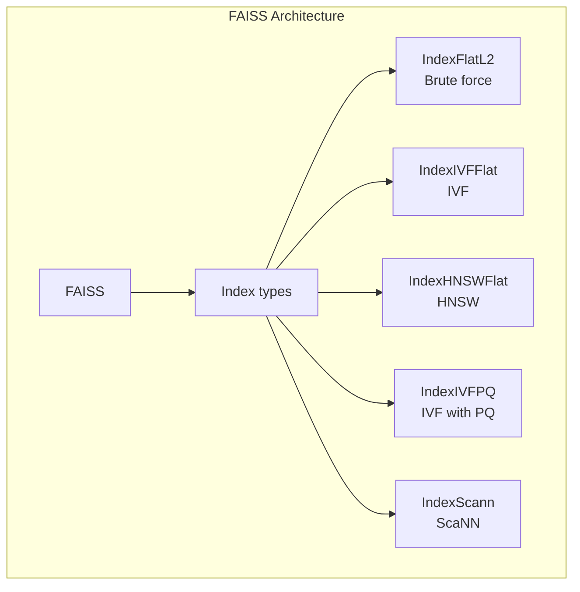
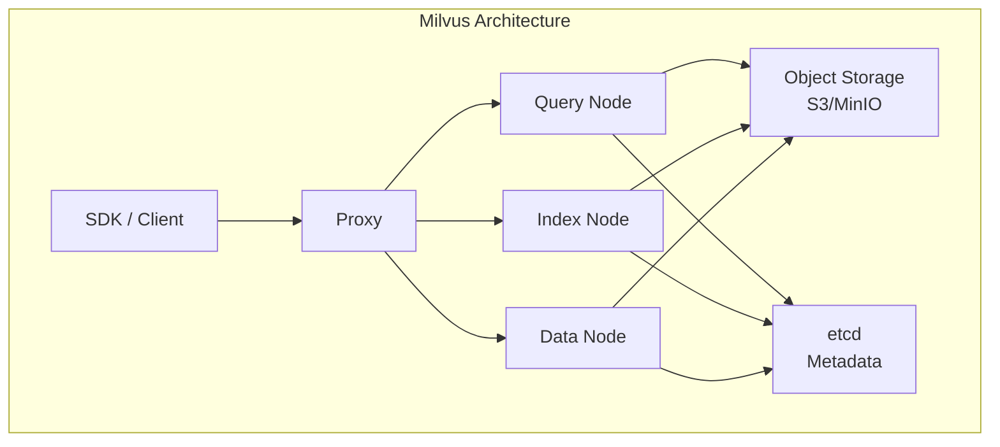
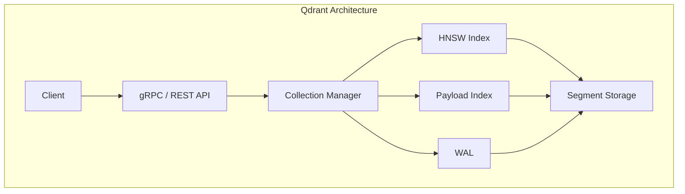

# Part 17: Popular Vector Databases

> Author: **Tamilselvan** · ✉️ tamilselvan.sde@gmail.com · 🔗 [LinkedIn](https://www.linkedin.com/in/tamilselvan-ai/)
>

## FAISS

**FAISS (Facebook AI Similarity Search)** is a library, not a database — but it's the foundation most vector DBs are built on.



```python
import faiss
import numpy as np

# Create vectors
vectors = np.random.random((100000, 768)).astype('float32')

# Build HNSW index
index = faiss.IndexHNSWFlat(768, 32)  # 768 dims, M=32
index.hnsw.efConstruction = 200
index.add(vectors)

# Search
query = np.random.random((1, 768)).astype('float32')
distances, indices = index.search(query, k=10)
```

**Best for:** Building custom vector search solutions, research, GPU-accelerated search.

---

## Milvus

**Milvus** is an open-source vector database designed for billion-scale similarity search.



```python
from pymilvus import Collection, CollectionSchema, FieldSchema, DataType

# Create schema
fields = [
    FieldSchema("id", DataType.INT64, is_primary=True),
    FieldSchema("vector", DataType.FLOAT_VECTOR, dim=768),
    FieldSchema("text", DataType.VARCHAR, max_length=1000),
    FieldSchema("author", DataType.VARCHAR, max_length=100),
]
schema = CollectionSchema(fields, "Document collection")
collection = Collection("documents", schema)

# Create index
index_params = {
    "metric_type": "COSINE",
    "index_type": "HNSW",
    "params": {"M": 16, "efConstruction": 200}
}
collection.create_index("vector", index_params)

# Search
results = collection.search(
    data=[query_vector],
    anns_field="vector",
    param={"metric_type": "COSINE", "params": {"ef": 100}},
    limit=10,
    expr="author == 'John Doe'"
)
```

**Best for:** Large-scale production, GPU acceleration, complex filtering.

---

## Qdrant

**Qdrant** is a Rust-based vector database focused on filtering and performance.



```python
from qdrant_client import QdrantClient
from qdrant_client.models import (
    VectorParams, Distance, PointStruct, Filter, FieldCondition, Range
)

client = QdrantClient(host="localhost", port=6333)

# Create collection
client.create_collection(
    collection_name="docs",
    vectors_config=VectorParams(size=768, distance=Distance.COSINE),
    optimizers_config={"default_segment_number": 2},
    replication_factor=2
)

# Insert
client.upsert(
    collection_name="docs",
    points=[
        PointStruct(
            id=1,
            vector=[0.1, 0.2, ...],
            payload={"text": "Document content", "date": "2024-01-01"}
        )
    ]
)

# Search with filter
results = client.search(
    collection_name="docs",
    query_vector=[0.1, 0.2, ...],
    query_filter=Filter(
        must=[
            FieldCondition(
                key="date",
                range=Range(gte="2024-01-01")
            )
        ]
    ),
    limit=10
)
```

**Best for:** Filter-heavy workloads, production deployments, Rust performance.

---

## Pinecone

**Pinecone** is a fully-managed cloud vector database with zero infrastructure overhead.

```python
import pinecone

# Initialize
pinecone.init(api_key="your-api-key")
index = pinecone.Index("my-index")

# Insert
index.upsert(
    vectors=[
        ("id1", [0.1, 0.2, ...], {"text": "doc1", "author": "John"}),
        ("id2", [0.3, 0.4, ...], {"text": "doc2", "author": "Jane"})
    ]
)

# Query
results = index.query(
    vector=[0.1, 0.2, ...],
    top_k=10,
    filter={"author": {"$eq": "John"}},
    include_metadata=True
)
```

**Best for:** Managed service, no-ops, prototyping, teams without infrastructure expertise.

---

## Weaviate

**Weaviate** is an AI-native vector database with built-in modules.

```python
import weaviate

client = weaviate.Client("http://localhost:8080")

# Define schema with auto-schema
class_obj = {
    "class": "Document",
    "properties": [
        {"name": "text", "dataType": ["text"]},
        {"name": "author", "dataType": ["string"]}
    ],
    "vectorizer": "text2vec-transformers"  # Built-in embedding
}
client.schema.create_class(class_obj)

# Import (auto-embeds using configured module)
client.data_object.create(
    data_object={
        "text": "Machine learning is...",
        "author": "John"
    },
    class_name="Document"
)

# Search (auto-embeds query)
results = client.query.get("Document", ["text", "author"]) \
    .with_near_text({"concepts": ["AI techniques"]}) \
    .with_limit(10) \
    .do()
```

**Best for:** All-in-one AI stack, built-in vectorizers, GraphQL API.

---

## Chroma

**Chroma** is a lightweight, developer-friendly embedding database.

```python
import chromadb

client = chromadb.Client()

# Create collection
collection = client.create_collection("docs")

# Add
collection.add(
    documents=["Document 1", "Document 2"],
    metadatas=[{"source": "pdf"}, {"source": "web"}],
    ids=["doc1", "doc2"]
)

# Query (auto-embeds using default model)
results = collection.query(
    query_texts=["machine learning"],
    n_results=10
)
```

**Best for:** Prototyping, small projects, local development, quick embeddings.

---

## Redis

**Redis** added vector search capabilities via Redis Stack.

```python
import redis
from redis.commands.search.field import VectorField, TextField
from redis.commands.search.query import Query

r = redis.Redis(host="localhost", port=6379)

# Create index
r.ft("idx:docs").create_index([
    VectorField("vector", "FLAT", {"TYPE": "FLOAT32", "DIM": 768, "DISTANCE_METRIC": "COSINE"}),
    TextField("text")
])

# Search
query = f"*=>[KNN 10 @vector $vec AS score]"
results = r.ft("idx:docs").search(
    Query(query).sort_by("score").paging(0, 10).dialect(2),
    {"vec": query_vector.tobytes()}
)
```

**Best for:** Redis-native apps, caching, simple vector search needs.

---

## Elasticsearch

**Elasticsearch** supports vector search with its `dense_vector` field type.

```python
# Index mapping
mapping = {
    "properties": {
        "text": {"type": "text"},
        "vector": {
            "type": "dense_vector",
            "dims": 768,
            "index": True,
            "similarity": "cosine"
        }
    }
}

# Search
query = {
    "knn": {
        "field": "vector",
        "query_vector": query_vector,
        "k": 10,
        "num_candidates": 100
    }
}
```

**Best for:** Full-text + vector search hybrid, existing Elastic deployments.

---

## OpenSearch

**OpenSearch** is the open-source fork of Elasticsearch with k-NN plugin.

```python
# Create index with k-NN
index_body = {
    "settings": {
        "index": {
            "knn": True,
            "knn.algo_param.ef_search": 100
        }
    },
    "mappings": {
        "properties": {
            "vector": {
                "type": "knn_vector",
                "dimension": 768,
                "method": {
                    "name": "hnsw",
                    "space_type": "cosinesimil",
                    "engine": "nmslib",
                    "parameters": {"ef_construction": 200, "m": 16}
                }
            }
        }
    }
}
```

**Best for:** OpenSearch users, hybrid search, log analytics.

---

## LanceDB

**LanceDB** is an embedded vector database built on Lance columnar format.

```python
import lancedb

db = lancedb.connect("./data")
table = db.create_table("docs", [
    {"vector": [0.1, 0.2, ...], "text": "doc1"},
    {"vector": [0.3, 0.4, ...], "text": "doc2"}
])

# Search
results = table.search([0.1, 0.2, ...], metric="cosine").limit(10).to_pandas()
```

**Best for:** Embedded/small deployments, data science workflows.

---

## pgvector

**pgvector** adds vector search to PostgreSQL.

```sql
-- Enable extension
CREATE EXTENSION vector;

-- Create table
CREATE TABLE documents (
    id SERIAL PRIMARY KEY,
    text TEXT,
    embedding vector(768)
);

-- Create index
CREATE INDEX ON documents USING ivfflat (embedding vector_cosine_ops)
    WITH (lists = 100);

-- Search
SELECT text, 1 - (embedding <=> '[0.1, 0.2, ...]') AS similarity
FROM documents
ORDER BY embedding <=> '[0.1, 0.2, ...]'
LIMIT 10;
```

```python
import psycopg2

conn = psycopg2.connect("dbname=vectordb")
cur = conn.cursor()

cur.execute("""
    SELECT text, 1 - (embedding <=> %s::vector) AS similarity
    FROM documents
    ORDER BY embedding <=> %s::vector
    LIMIT 10
""", (query_vector, query_vector))
```

**Best for:** PostgreSQL users, small-medium datasets, transactional + vector search.

---

## Comparison Table

| Feature | FAISS | Milvus | Qdrant | Pinecone | Weaviate | Chroma | pgvector |
|---------|-------|--------|--------|----------|----------|--------|----------|
| **Type** | Library | DB | DB | Managed | DB | DB | Extension |
| **Open Source** | ✓ | ✓ | ✓ | ✗ | ✓ | ✓ | ✓ |
| **Cloud Managed** | N/A | Zilliz | Qdrant Cloud | ✓ | Weaviate Cloud | ✗ | Various |
| **Vector Index** | HNSW, IVF, PQ | HNSW, IVF, | HNSW | HNSW | HNSW | HNSW | IVFFlat |
| **GPU Support** | ✓ | ✓ | Limited | ✗ | ✓ | ✗ | ✗ |
| **Filtering** | Limited | ✓ | ✓ | ✓ | ✓ | Limited | SQL |
| **Hybrid Search** | ✗ | ✓ (v2.3+) | ✓ | ✓ | ✓ | ✗ | ✗ |
| **Embedding** | ✗ | ✗ | ✗ | ✗ | ✓ (built-in) | ✓ (auto) | ✗ |
| **Max Scale** | Memory | 1B+ | 100M+ | 1B+ | 100M+ | 1M+ | 10M+ |
| **Language** | C++ | Go + C++ | Rust | Go | Go | Python | C |
| **Latency (p99)** | ~1ms | ~10ms | ~5ms | ~5ms | ~10ms | ~5ms | ~20ms |
| **Setup Effort** | Low | High | Medium | None | Medium | Low | Low |
| **Best For** | Research | Large prod | Filter-heavy | Managed | All-in-one | Prototyping | SQL users |

---

