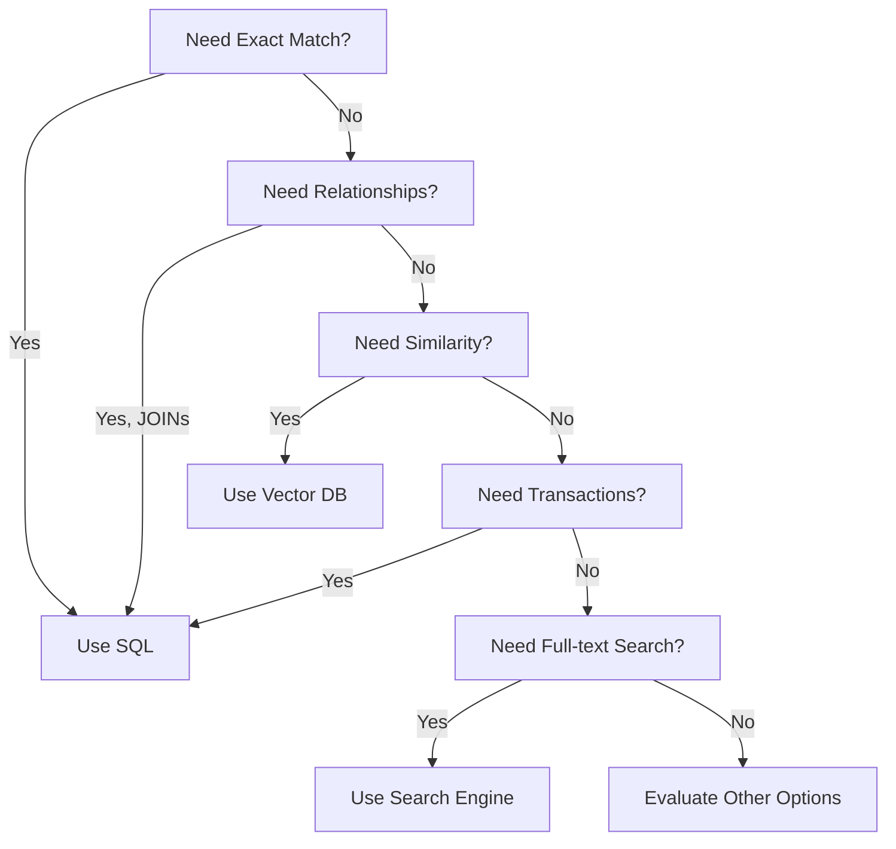
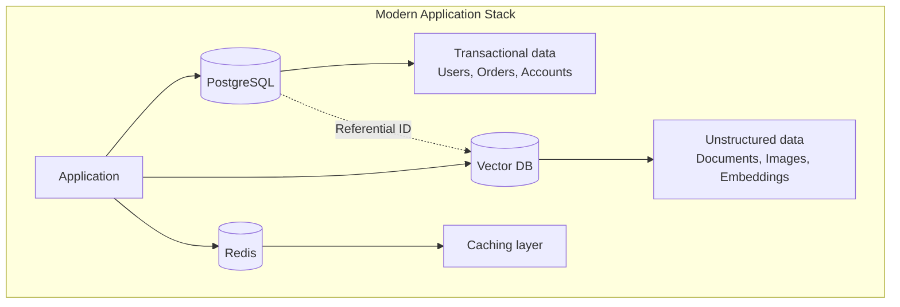

# Part 18: SQL vs Vector DB

> Author: **Tamilselvan** · ✉️ tamilselvan.sde@gmail.com · 🔗 [LinkedIn](https://www.linkedin.com/in/tamilselvan-ai/)
>

## Complete Comparison

| Dimension | SQL Database | Vector Database |
|-----------|-------------|----------------|
| **Data Model** | Tables (rows × columns) | High-dimensional vectors |
| **Query Type** | Exact match, range, join | Similarity search, ANN |
| **Search** | `WHERE id = 42` | `find similar to [0.1, 0.2, ...]` |
| **Index** | B-tree, Hash, GiST | HNSW, IVF, PQ |
| **ACID** | Full | Partial (varies) |
| **Horizontal Scaling** | Complex (sharding) | Built-in (sharding + replication) |
| **Data Types** | Primitives, JSON, arrays | Vectors + metadata |
| **Use Case** | Transactions, reporting | Similarity search, AI |
| **Typical Latency** | <1ms for indexed queries | 1-50ms |
| **Throughput** | 10K QPS | 1K-10K QPS |
| **Storage** | Row/column oriented | Vector + index files |
| **Best For** | OLTP, OLAP, CRUD | Semantic search, RAG, recommendations |

### When to Use SQL

### SQL + Vector DB: The Best of Both

**Typical pattern:**
- SQL stores: users, orders, products, canonical data
- Vector DB stores: embeddings, chunks, vectors
- Redis caches: frequent query results, session data

---

### Production Tip

> **Don't choose — use both.** SQL + Vector DB is the standard production architecture. Use each for what it's best at: SQL for transactions, vector DB for similarity search. Reference vectors by their ID from SQL tables.

---

### Interview Tip

> **Q:** "Could pgvector replace a dedicated vector database?"
>
> **A:** For small datasets (<10M, <10GB), yes! For larger: pgvector uses IVFFlat (not HNSW) which is slower, doesn't scale horizontally, and lacks specialized filtering. Dedicated vector DBs offer 10-100x better performance at scale along with GPU indexing, distributed search, and compression.

---
