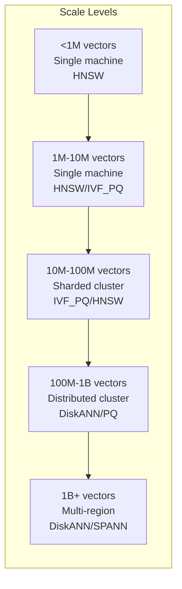
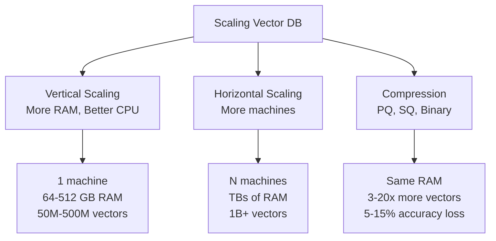
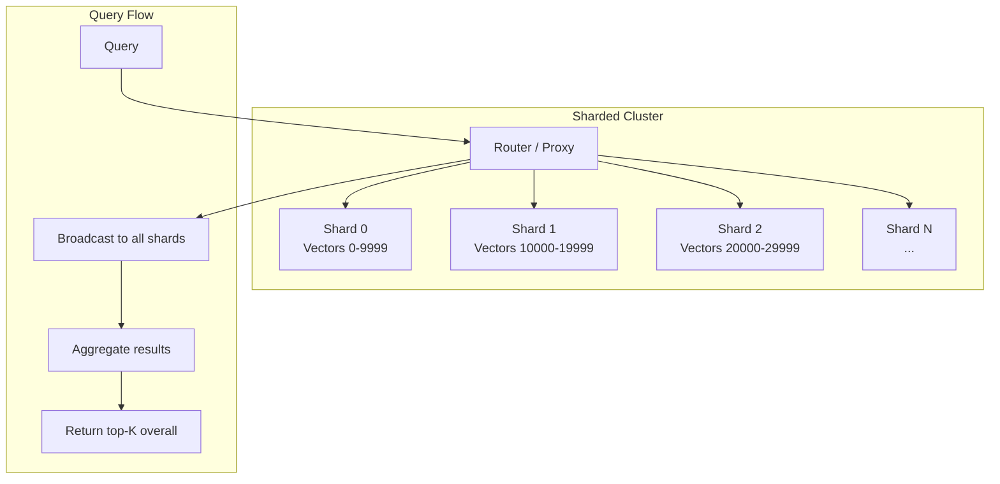
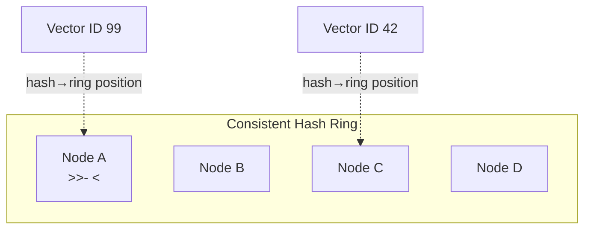
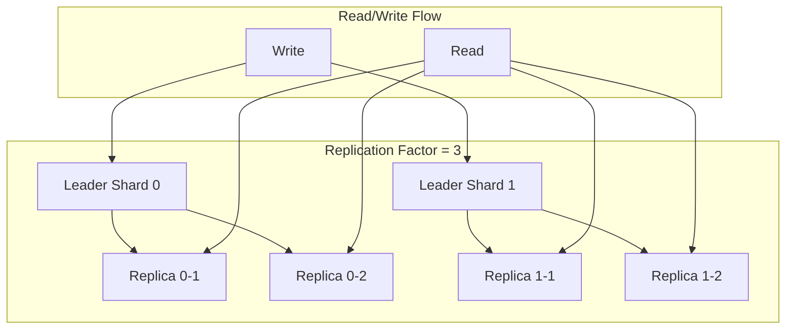
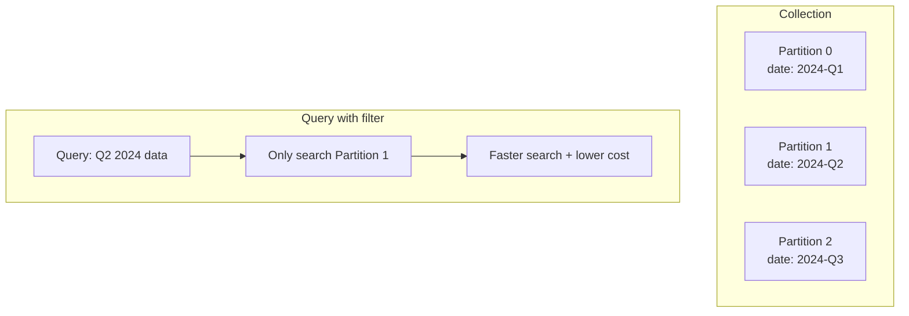
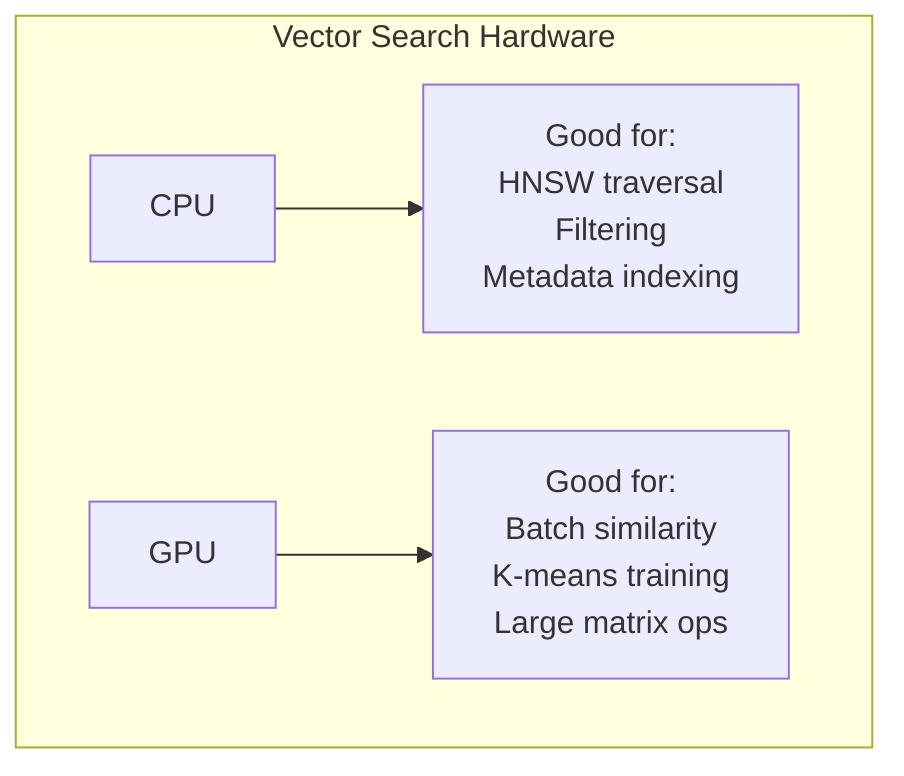

# Part 19: Scaling

> Author: **Tamilselvan** · ✉️ tamilselvan.sde@gmail.com · 🔗 [LinkedIn](https://www.linkedin.com/in/tamilselvan-ai/)
>

## Millions to Billions

### Scaling Dimensions

---

## Sharding

**Sharding** splits data across multiple machines (shards).

### Sharding Strategies

| Strategy | Description | Pros | Cons |
|----------|-------------|------|------|
| **Hash-based** | hash(vector_id) → shard | Even distribution | Hard to rebalance |
| **Range-based** | ID range → shard | Good for sequential access | Skew possible |
| **Location-based** | geo_hash → shard | Locality-preserving | Complex routing |
| **Tenant-based** | tenant_id → shard | Tenant isolation | Variable shard sizes |

### Consistent Hashing

**Benefits:** Adding/removing nodes only relocates ~1/N of data.

---

## Replication

**Replication** creates copies of data for fault tolerance and read scaling.

| Replication Factor | Fault Tolerance | Write Cost | Read Throughput |
|-------------------|----------------|------------|-----------------|
| 1 | None | 1x | 1x |
| 2 | 1 node | 2x | 2x |
| 3 | 2 nodes | 3x | 3x |

**Raft/PAXOS consensus:** Used by Milvus, Qdrant for consistent replication.

---

## Partitioning

**Partitioning** splits a collection into smaller physical segments for easier management.

**Use cases:**
- Time-based partitioning (search recent data only)
- Geo-based partitioning (search data in region only)
- Category-based partitioning (search specific category only)

---

## GPU vs CPU

### Performance Comparison

| Operation | CPU (32 cores) | GPU (A100) | GPU Speedup |
|-----------|---------------|------------|-------------|
| Brute force (1M × 768) | 50ms | 1ms | 50x |
| IVF training (10M) | 5 min | 10 sec | 30x |
| HNSW build (10M) | 30 min | 5 min | 6x |
| Search (1M, HNSW) | 2ms | 1ms | 2x |

**When GPU helps:**
- Large batch searches
- Frequent index rebuilding
- Real-time training
- High-throughput scenarios

**When CPU is fine:**
- Low-latency single queries
- Small-medium indexes
- Filter-heavy workloads

---

### Production Tip

> **Scaling checklist:**
> 1. Start with single node + HNSW
> 2. At ~60% memory usage → add PQ compression
> 3. At ~80% memory usage → add sharding
> 4. At 5+ shards → add replication
> 5. At 50+ shards → consider multi-region

---

