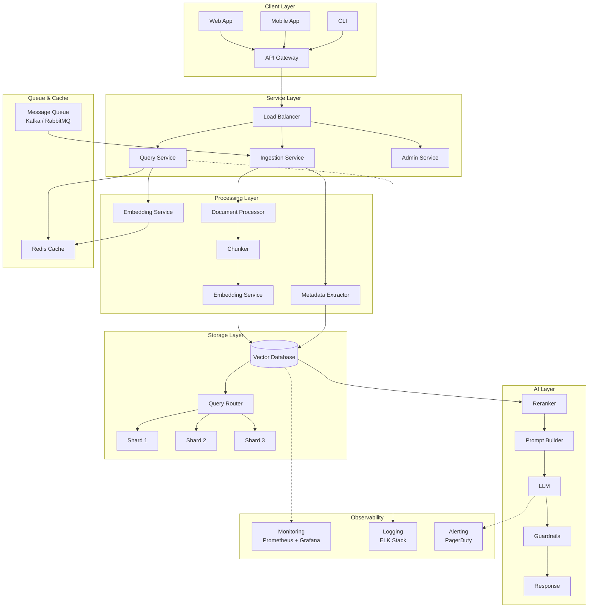
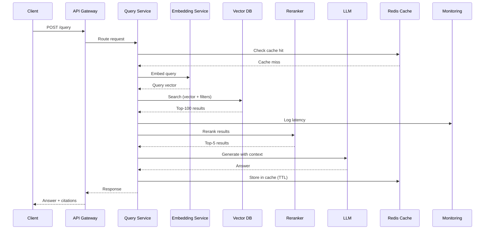

# Part 20: Production Architecture

> Author: **Tamilselvan** · ✉️ tamilselvan.sde@gmail.com · 🔗 [LinkedIn](https://www.linkedin.com/in/tamilselvan-ai/)
>

## Full Production Stack



---

## Microservice Architecture



---

## Containerized Deployment

```yaml
# docker-compose.yml (simplified)
version: '3.8'
services:
  api:
    image: my-app:latest
    ports: ["8000:8000"]
    depends_on: [qdrant, redis]
    
  qdrant:
    image: qdrant/qdrant:latest
    volumes:
      - ./qdrant_storage:/qdrant/storage
    environment:
      - QDRANT__SERVICE__GRPC_PORT=6334
    ports: ["6333:6333", "6334:6334"]
    
  redis:
    image: redis:7-alpine
    ports: ["6379:6379"]
    
  embedding-service:
    image: sentence-transformers:latest
    ports: ["8001:8001"]
    deploy:
      replicas: 3  # Scale embedding workers
      
  monitor:
    image: prom/prometheus:latest
    volumes:
      - ./prometheus.yml:/etc/prometheus/prometheus.yml
```

---

## Kubernetes Production

```yaml
apiVersion: apps/v1
kind: StatefulSet
metadata:
  name: qdrant
spec:
  replicas: 3
  serviceName: qdrant
  template:
    spec:
      containers:
      - name: qdrant
        image: qdrant/qdrant:v1.8.0
        ports:
        - containerPort: 6333
        - containerPort: 6334
        volumeMounts:
        - name: storage
          mountPath: /qdrant/storage
        resources:
          requests:
            memory: "16Gi"
            cpu: "4"
          limits:
            memory: "32Gi"
            cpu: "8"
  volumeClaimTemplates:
  - metadata:
      name: storage
    spec:
      storageClassName: fast-ssd
      accessModes: ["ReadWriteOnce"]
      resources:
        requests:
          storage: 500Gi
```

### Production Checklist

| Component | Requirement | Recommendation |
|-----------|-------------|---------------|
| **RAM** | N × D × 4 × 1.5 (overhead) | 64-512 GB |
| **CPU** | HNSW/search mostly single-threaded | High clock speed, ≥8 cores |
| **SSD** | WAL, persistence, DiskANN | NVMe, ≥1 TB, high IOPS |
| **Network** | Inter-node communication | 10+ Gbps, low latency |
| **Backup** | Point-in-time recovery | Daily snapshots, WAL archiving |
| **Monitoring** | Latency, recall, memory, QPS | Prometheus + Grafana |
| **Alerting** | p99 latency >100ms, recall <90% | PagerDuty / OpsGenie |

---

### Production Tip

> **Deployment order matters:**
> 1. Deploy vector DB cluster first
> 2. Deploy embedding service (warm up model)
> 3. Deploy ingestion pipeline
> 4. Load initial data
> 5. Verify recall with ground-truth queries
> 6. Deploy query service
> 7. Enable caching
> 8. Turn on production traffic

---

