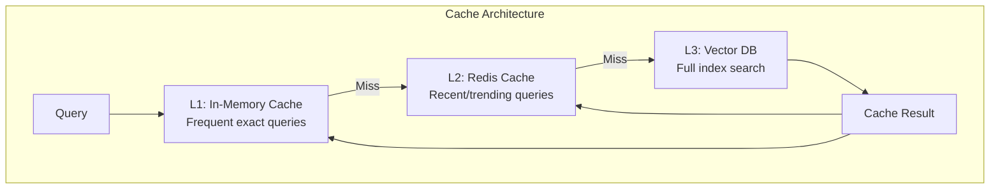
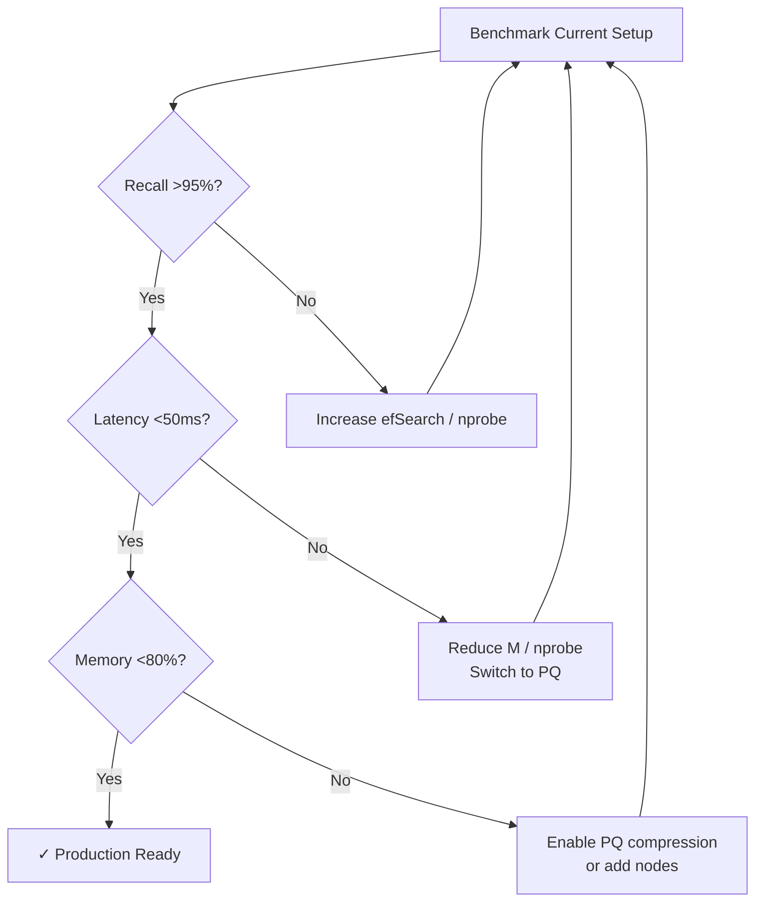

# Part 21: Optimization

> Author: **Tamilselvan** · ✉️ tamilselvan.sde@gmail.com · 🔗 [LinkedIn](https://www.linkedin.com/in/tamilselvan-ai/)
>

## Batch Insert

**Never insert vectors one at a time in production.**

```python
# ❌ Slow: one at a time
for vector in vectors:
    index.add(vector)

# ✓ Fast: batch insert
index.add(vectors)  # FAISS: native batch
client.upsert(points=all_points)  # Qdrant: batch via points parameter
```

**Batch size recommendations:**

| Database | Recommended Batch Size | Notes |
|----------|----------------------|-------|
| FAISS | 10,000-100,000 | Matrix operations love large batches |
| Qdrant | 100-1,000 | Memory-bounded per request |
| Milvus | 1,000-10,000 | Depends on shard count |
| Pinecone | 100-1,000 | API rate limits apply |

---

## Async Operations

```python
import asyncio
from qdrant_client import AsyncQdrantClient

async def search_concurrent(queries):
    client = AsyncQdrantClient(host="localhost")
    
    # Run multiple searches concurrently
    tasks = [
        client.search(
            collection_name="docs",
            query_vector=q,
            limit=10
        )
        for q in queries
    ]
    
    results = await asyncio.gather(*tasks)
    return results
```

---

## Compression Techniques

### Scalar Quantization (SQ)

```python
import numpy as np

def sq_compress(vectors, bits=8):
    """Reduce float32 to uint8."""
    # Find min/max per dimension
    mins = vectors.min(axis=0)
    maxs = vectors.max(axis=0)
    
    # Quantize to [0, 255]
    compressed = ((vectors - mins) / (maxs - mins) * 255).astype(np.uint8)
    return compressed, mins, maxs

def sq_decompress(compressed, mins, maxs):
    """Restore approximate original."""
    return compressed.astype(np.float32) / 255 * (maxs - mins) + mins
```

| SQ Type | Bytes/Dim | Compression | Recall Impact |
|---------|----------|-------------|---------------|
| float32 | 4 | 1x | None |
| float16 | 2 | 2x | Minimal (<0.5%) |
| int8 | 1 | 4x | 1-3% drop |
| int4 | 0.5 | 8x | 3-5% drop |
| binary | 0.03125 | 128x | 10-20% drop |

---

## Caching Strategies

### Multi-Level Cache



### Cache Key Design

```python
def cache_key(query_text, filters, k):
    """Deterministic cache key for vector search."""
    # Include everything that affects results
    key_parts = [
        f"q:{hash(query_text)}",
        f"f:{json.dumps(filters, sort_keys=True)}",
        f"k:{k}",
        f"v:{EMBEDDING_MODEL_VERSION}"
    ]
    return ":".join(key_parts)
```

---

## Hybrid Retrieval Tuning

```python
def hybrid_search(query, alpha=0.5):
    """Tune the balance between dense and sparse retrieval."""
    dense_results = vector_search(query, k=50)
    sparse_results = bm25_search(query, k=50)
    
    # RRF fusion
    combined = {}
    for rank, (doc_id, _) in enumerate(dense_results):
        combined[doc_id] = (1 - alpha) * (1 / (60 + rank))
    for rank, (doc_id, _) in enumerate(sparse_results):
        current = combined.get(doc_id, 0)
        combined[doc_id] = current + alpha * (1 / (60 + rank))
    
    return sorted(combined.items(), key=lambda x: -x[1])[:10]
```

| Alpha | Behavior |
|-------|----------|
| 0.0 | Pure dense (semantic) |
| 0.3 | Dense-weighted hybrid |
| 0.5 | Balanced hybrid |
| 0.7 | Sparse-weighted hybrid |
| 1.0 | Pure sparse (BM25) |

---

## Index Tuning

### Optimization Flow



### Key Parameters to Tune

| Parameter | Effect | Trade-off |
|-----------|--------|-----------|
| HNSW M | Connections per node | +M = +recall, +memory |
| HNSW efConstruction | Build quality | +ef = +recall, +build time |
| HNSW efSearch | Search quality | +ef = +recall, -speed |
| IVF nlist | Number of clusters | +nlist = -speed, +accuracy |
| IVF nprobe | Clusters to search | +nprobe = +recall, -speed |
| PQ M | Sub-vectors | +M = -memory, -recall |
| Batch size | Insert throughput | +batch = +speed, +memory |

---

### Production Tip

> **Performance tuning rule of thumb:**
> - Start with highest recall (HNSW, large ef)
> - Measure baseline latency
> - Trade memory for speed (reduce M)
> - Trade accuracy for memory (add PQ)
> - Stop when SLAs are met

---

### Common Mistake

> **❌ Tuning without measuring.** Every change should be validated against:
> - A ground-truth set (exact KNN results)
> - A latency benchmark (p50, p95, p99)
> - Memory usage
>
> Change ONE parameter at a time.

---

