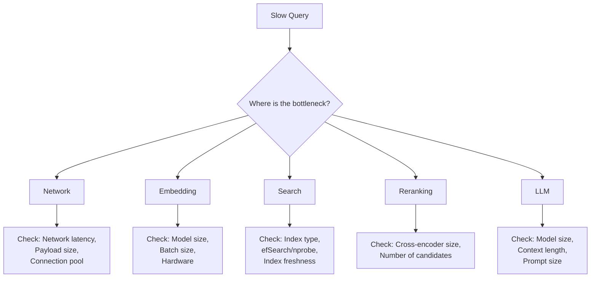

# Part 24: Troubleshooting

> Author: **Tamilselvan** · ✉️ tamilselvan.sde@gmail.com · 🔗 [LinkedIn](https://www.linkedin.com/in/tamilselvan-ai/)
>

## Bad Recall

### Symptoms
- Search results don't match expectations
- Users complain about irrelevant results
- A/B test shows lower engagement

### Root Causes & Solutions

| Cause | Diagnosis | Solution |
|-------|-----------|----------|
| **Wrong embedding model** | Test known similar pairs | Use consistent model for indexing and querying |
| **Low efSearch/nprobe** | Check index parameters | Increase efSearch or nprobe |
| **Index needs rebuild** | Compare recall to ground truth | Rebuild index |
| **Data distribution changed** | Compare old vs new data stats | Retrain IVF centroids |
| **Filter accidentally applied** | Check query logs | Verify filter logic |
| **PQ compression too aggressive** | Compare PQ vs full vector recall | Use lower compression ratio |
| **Chunks too large** | Check chunk content relevance | Reduce chunk size |

### Debugging Script

```python
def diagnose_recall(query, expected_ids, actual_ids):
    """Diagnose recall issues."""
    recall = len(set(expected_ids) & set(actual_ids)) / len(expected_ids)
    
    if recall < 0.5:
        print("CRITICAL: Recall below 50%")
        print("Check: embedding model, index type, filter conditions")
    elif recall < 0.8:
        print("WARNING: Recall below 80%")
        print("Check: efSearch/nprobe, PQ settings, index freshness")
    elif recall < 0.95:
        print("ACCEPTABLE: Recall 80-95%")
        print("Consider increasing efSearch or reducing PQ compression")
    else:
        print("GOOD: Recall above 95%")
```

---

## Slow Search

### Bottleneck Analysis



### Common Causes

| Issue | Symptom | Fix |
|-------|---------|-----|
| **No index** | Full scan O(N) | Create HNSW/IVF index |
| **efSearch too high** | p99 >100ms | Reduce efSearch (200→100) |
| **nprobe too high** | p99 >50ms | Reduce nprobe (100→20) |
| **Too many reranked candidates** | Reranking >500ms | Reduce candidates (100→50) |
| **Large payload in results** | High network transfer | Exclude large fields, load separately |
| **No connection pooling** | Connection overhead | Use connection pool (gRPC) |
| **Slow embedding model** | Embedding >200ms | Use smaller model or GPU |
| **Cross-node latency** | >1ms per hop | Co-locate services |

---

## Memory Issues

### Memory Monitoring

```python
import psutil

def check_memory_status():
    mem = psutil.virtual_memory()
    print(f"Total: {mem.total / 1e9:.1f} GB")
    print(f"Used: {mem.used / 1e9:.1f} GB ({mem.percent:.0f}%)")
    print(f"Available: {mem.available / 1e9:.1f} GB")
    
    if mem.percent > 90:
        print("CRITICAL: Memory above 90%")
        print("Actions: Add nodes, enable PQ, reduce vector dimensions")
    elif mem.percent > 75:
        print("WARNING: Memory above 75%")
        print("Plan: Add resources or enable compression soon")
```

### OOM Prevention

| Strategy | Description | Impact |
|----------|-------------|--------|
| **Enable PQ** | Compress vectors 10-50x | 5-10% recall drop |
| **Float16** | Halve precision | <0.5% recall drop |
| **Int8 quantization** | Quarter precision | 1-3% recall drop |
| **Memory-mapped files** | Use disk for cold data | 2-10x latency for cold |
| **Reduce M (HNSW)** | Fewer graph connections | Slower search, lower recall |
| **Reduce collection count** | Merge small collections | Operational complexity |

---

## Wrong Embeddings

### Symptoms
- Similar queries return unrelated results
- Random scores don't make sense
- All results have very low similarity

### Checks

```python
def validate_embeddings(embeddings, sample_pairs):
    """Validate embedding quality."""
    for text1, text2, expected_similar in sample_pairs:
        emb1 = model.encode(text1)
        emb2 = model.encode(text2)
        sim = cosine_similarity([emb1], [emb2])[0][0]
        
        if expected_similar and sim < 0.5:
            print(f"ISSUE: Similar texts have low similarity ({sim:.3f})")
            print(f"  Text 1: {text1}")
            print(f"  Text 2: {text2}")
        elif not expected_similar and sim > 0.7:
            print(f"ISSUE: Different texts have high similarity ({sim:.3f})")
            print(f"  Text 1: {text1}")
            print(f"  Text 2: {text2}")
```

### Common Embedding Bugs

| Bug | Symptom | Fix |
|-----|---------|-----|
| **Different models for index vs query** | Inconsistent results | Use same model |
| **Forgetting to normalize** | Cosine similarity ≠ dot product | Normalize or use correct metric |
| **Wrong tokenization** | Truncated/mangled input | Check tokenizer |
| **Model not fine-tuned for domain** | Domain-specific terms mismatched | Fine-tune or use domain model |
| **Random initialization** | Embeddings not reproducible | Set random seed |

---

## Duplicate Vectors

### Detection

```python
import numpy as np

def find_duplicates(vectors, threshold=0.99):
    """Find near-duplicate vectors."""
    from sklearn.metrics.pairwise import cosine_similarity
    
    # Compute pairwise similarity (careful: O(N²) for large sets)
    sim_matrix = cosine_similarity(vectors)
    
    # Find pairs above threshold
    duplicates = []
    for i in range(len(vectors)):
        for j in range(i+1, len(vectors)):
            if sim_matrix[i][j] > threshold:
                duplicates.append((i, j, sim_matrix[i][j]))
    
    return duplicates
```

### Prevention
- Hash-based deduplication before insertion
- Store content hash as metadata
- Check for existing vector by ID before insert
- Periodic cleanup for near-duplicates

---

## Metadata Mismatch

### Symptoms
- Filters return unexpected results
- Tenants see wrong data
- Date-range queries miss documents

### Solutions

| Issue | Debug | Fix |
|-------|-------|-----|
| **Null/empty metadata field** | Check payload schema | Validate before insert |
| **Type mismatch** | Check field type (int vs string) | Cast to correct type |
| **Missing index on filter field** | Check if filter is slow | Create payload index |
| **Tenant ID not added** | Check ingestion code | Always add tenant_id |
| **Filter applied incorrectly** | Check filter logic | Unit test filter conditions |

---

### Production Tip

> **Troubleshooting checklist (in order):**
> 1. Check logs for errors
> 2. Verify embedding model consistency
> 3. Check index type and parameters
> 4. Compare recall against ground truth
> 5. Profile latency by component
> 6. Check memory and disk usage
> 7. Verify network connectivity
> 8. Test with minimal query (no filters)
> 9. Test with known ground-truth queries
> 10. If all else fails, rebuild index from scratch

---

