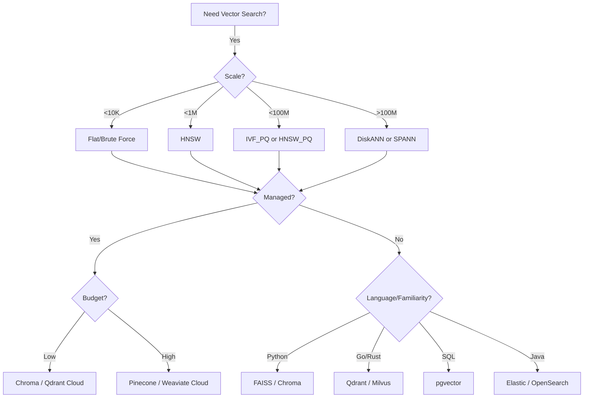
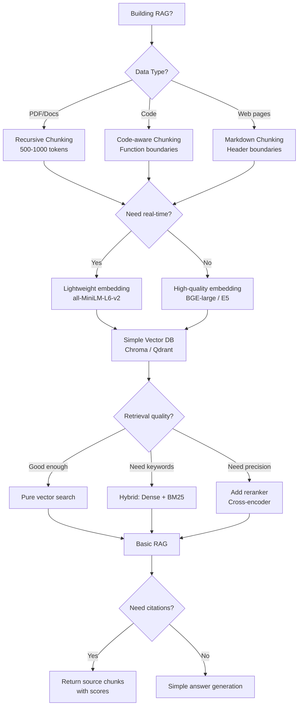
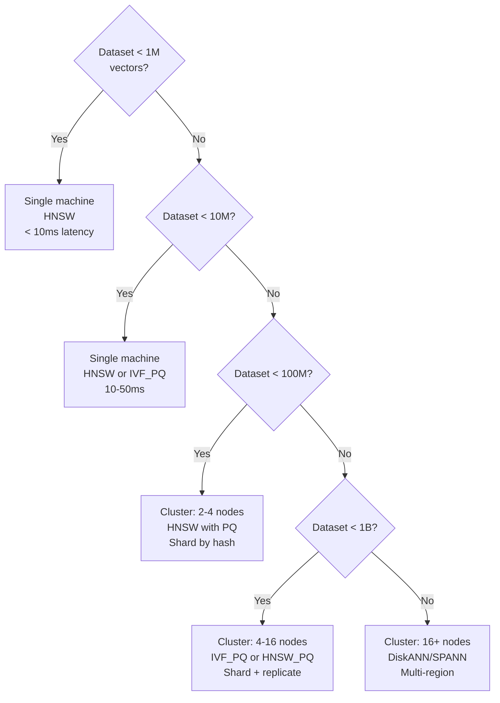

# Part 25: Cheat Sheets

> Author: **Tamilselvan** · ✉️ tamilselvan.sde@gmail.com · 🔗 [LinkedIn](https://www.linkedin.com/in/tamilselvan-ai/)
>

## Quick Reference Flowcharts

### Vector Database Selection



### RAG Pipeline Decision



---

## One-Page Summaries

### ANN Algorithm Cheat Sheet

| Algorithm | Type | Speed | Memory | Recall | Build | Use Case |
|-----------|------|-------|--------|--------|-------|----------|
| **Flat** | Exact | ★ | ★★★★ | 100% | None | Ground truth |
| **HNSW** | Graph | ★★★★ | ★★ | 99% | Slow | General purpose |
| **IVF** | Cluster | ★★★ | ★★★ | 95% | Fast | Large datasets |
| **IVF_PQ** | Cluster+Compress | ★★★ | ★★★★★ | 90% | Medium | Memory-constrained |
| **ScaNN** | Graph+PQ | ★★★★ | ★★★★ | 98% | Slow | High throughput |
| **DiskANN** | Graph+Disk | ★★★ | ★★★★★ | 95% | Slow | Billion-scale |
| **LSH** | Hash | ★★★ | ★★★ | 85% | Fast | Binary vectors |

### Distance Metrics Cheat Sheet

### Distance Metrics Cheat Sheet

| Metric | Range | Formula | Best For |
|--------|-------|---------|----------|
| Cosine Similarity | [-1, 1] | `A·B / (|A||B|)` | Text, semantics |
| Dot Product | (-∞, ∞) | `Σ(Ai×Bi)` | Recommendations |
| Euclidean (L2) | [0, ∞) | `√Σ(Ai-Bi)²` | Images, clusters |
| Manhattan (L1) | [0, ∞) | `Σ|Ai-Bi|` | Sparse vectors |
| Hamming | [0, n] | `count(Ai≠Bi)` | Binary vectors |
| Jaccard | [0, 1] | `|A∩B|/|A∪B|` | Sets, tags |
| Angular | [0, 1] | `arccos(cosine)/π` | Metric space |

### HNSW Parameters Quick Guide

| Parameter | Effect | Low | High | Default |
|-----------|--------|-----|------|---------|
| **M** | Graph connectivity | 4 (low mem) | 64 (high recall) | 16 |
| **efConstruction** | Build quality | 40 (fast build) | 500 (best index) | 80 |
| **efSearch** | Search quality | 50 (fast) | 500 (accurate) | 100 |

### IVF Parameters Quick Guide

| Parameter | Effect | Low | High | Heuristic |
|-----------|--------|-----|------|-----------|
| **nlist** | Number of clusters | 100 (fast build) | 10000 (accurate) | `√N` |
| **nprobe** | Clusters to search | 1 (fast) | nlist (exact) | `nlist/10` |

### PQ Parameters Quick Guide

| Parameter | Effect | Low | High | Rule |
|-----------|--------|-----|------|------|
| **M** | Sub-vectors | 32 (weak compression) | 128 (strong compression) | `dim/8` |
| **nbits** | Bits per code | 4 (16 centroids) | 16 (65536 centroids) | 8 (256 centroids) |

---

## Performance Reference Table

### Latency Benchmarks (1M vectors, 768d, single machine)

| Index | efSearch/nprobe | Latency (p50) | Latency (p99) | Recall |
|------|----------------|---------------|---------------|--------|
| Flat | N/A | 500ms | 600ms | 100% |
| HNSW (M=16) | ef=100 | 2ms | 5ms | 95% |
| HNSW (M=16) | ef=200 | 5ms | 10ms | 99% |
| IVF (nlist=1000) | nprobe=10 | 10ms | 20ms | 90% |
| IVF (nlist=1000) | nprobe=100 | 50ms | 100ms | 97% |
| IVF_PQ (M=96) | nprobe=100 | 20ms | 40ms | 92% |
| ScaNN | Default | 3ms | 8ms | 98% |
| DiskANN | Default | 15ms | 50ms | 95% |

### Memory Estimates

```
Raw vectors:  N × D × 4 bytes
HNSW graph:   N × M × 2 × 4 bytes ≈ 50% of vectors
IVF centroid: nlist × D × 4 bytes ≈ negligible
PQ codes:     N × M × 1 byte ≈ 3% of vectors

Example: 10M vectors × 768d
  Raw:        30.7 GB
  HNSW:      ~46 GB
  IVF_PQ:    ~1 GB + 30 MB centroids
  IVF_SQ8:   ~7.7 GB
```

---

## Production Decision Tree



---

## Quick Setup Commands

### Qdrant
```bash
docker run -p 6333:6333 -p 6334:6334 qdrant/qdrant
# Python client
pip install qdrant-client
```

### Milvus
```bash
docker compose -f milvus-standalone-docker-compose.yml up -d
# Python client
pip install pymilvus
```

### Chroma
```bash
pip install chromadb
# Run: chroma run --path ./chroma_data
```

### pgvector
```bash
docker run -e POSTGRES_PASSWORD=password -p 5432:5432 pgvector/pgvector:pg16
# Python client
pip install psycopg2-binary
```

### FAISS
```bash
pip install faiss-cpu
# or
pip install faiss-gpu
```

---

## Common Production Configurations

### Small Scale (< 1M vectors)
```yaml
# Qdrant config
index:
  type: hnsw
  hnsw:
    m: 16
    ef_construct: 200
    full_scan_threshold: 10000
optimizer:
  default_segment_number: 2
  memmap_threshold_kb: 20000
```

### Medium Scale (1M-10M vectors)
```yaml
# Qdrant config
index:
  type: hnsw
  hnsw:
    m: 16
    ef_construct: 200
optimizer:
  default_segment_number: 4
  memmap_threshold_kb: 50000
```

### Large Scale (10M-100M vectors)
```yaml
# Qdrant config
index:
  type: hnsw
  hnsw:
    m: 16
    ef_construct: 200
optimizer:
  default_segment_number: 8
  memmap_threshold_kb: 200000
```

---

## Top 10 Rules for Production Vector Search

1. **Always validate recall** against ground truth before deploying
2. **Always filter by tenant** at the database level
3. **Batch inserts** never one at a time
4. **Monitor memory** — OOM is the #1 production incident
5. **Use the same embedding model** for indexing and querying
6. **Add a reranker** for production RAG quality
7. **Normalize embeddings** when using cosine similarity
8. **Cache frequent queries** — 10-50% hit rate is common
9. **Have a fallback** — pure BM25 or SQL search when vector DB is down
10. **Benchmark on your data** — public benchmarks don't represent your distribution

---

