# Vector Database Complete Guide

> **The Single Most Comprehensive Beginner-to-Advanced Guide on Vector Databases**
>
> Covers: Embeddings · Similarity Search · ANN Algorithms · HNSW · IVF · Product Quantization · RAG Pipelines · Production Architecture · 100+ Interview Questions

---

# Table of Contents

<details>
<summary><b>Part 1: Introduction</b></summary>

- [What is a Database?](#what-is-a-database)
- [What is SQL Database](#what-is-sql-database)
- [What is NoSQL](#what-is-nosql)
- [What Problems SQL Cannot Solve](#what-problems-sql-cannot-solve)
- [Why AI Needs Vector DB](#why-ai-needs-vector-db)
- [Evolution of Databases](#evolution-of-databases)
</details>

<details>
<summary><b>Part 2: Embeddings</b></summary>

- [What is an Embedding](#what-is-an-embedding)
- [How Text Becomes Numbers](#how-text-becomes-numbers)
- [Types of Embeddings](#types-of-embeddings)
- [Dimensionality & Vector Space](#dimensionality--vector-space)
- [Embedding Models Comparison](#embedding-models-comparison)
- [Python Examples](#python-examples)
</details>

<details>
<summary><b>Part 3: Similarity Search</b></summary>

- [Dot Product](#dot-product)
- [Cosine Similarity](#cosine-similarity)
- [Euclidean Distance](#euclidean-distance)
- [Manhattan Distance](#manhattan-distance)
- [Hamming Distance](#hamming-distance)
- [Jaccard Similarity](#jaccard-similarity)
- [Angular Distance](#angular-distance)
</details>

<details>
<summary><b>Part 4: How Vector DB Works</b></summary>

- [End-to-End Flow](#end-to-end-flow)
- [Ingestion Pipeline](#ingestion-pipeline)
- [Query Pipeline](#query-pipeline)
</details>

<details>
<summary><b>Part 5: Chunking</b></summary>

- [Why Chunk](#why-chunk)
- [Chunk Size & Overlap](#chunk-size--overlap)
- [Chunking Strategies](#chunking-strategies)
- [Production Recommendations](#production-recommendations)
</details>

<details>
<summary><b>Part 6: Metadata</b></summary>

- [What Metadata Stores](#what-metadata-stores)
- [Filtering](#filtering)
- [Examples](#examples-1)
</details>

<details>
<summary><b>Part 7: Indexing</b></summary>

- [What is an Index](#what-is-an-index)
- [Why Index](#why-index)
- [Vector Index Types](#vector-index-types)
</details>

<details>
<summary><b>Part 8: ANN vs KNN</b></summary>

- [Exact Search (KNN)](#exact-search-knn)
- [Approximate Search (ANN)](#approximate-search-ann)
- [Tradeoffs](#tradeoffs)
</details>

<details>
<summary><b>Part 9: ANN Algorithms</b></summary>

- [HNSW](#hnsw)
- [NSG](#nsg)
- [IVF](#ivf)
- [IVFPQ](#ivfpq)
- [LSH](#lsh)
- [ScaNN](#scann)
- [DiskANN](#diskann)
- [Algorithm Comparison](#algorithm-comparison)
</details>

<details>
<summary><b>Part 10: HNSW Deep Dive</b></summary>

- [How HNSW Works](#how-hnsw-works)
- [Layer Creation](#layer-creation)
- [Neighbor Selection](#neighbor-selection)
- [Search](#search)
- [Parameters](#parameters)
</details>

<details>
<summary><b>Part 11: IVF Deep Dive</b></summary>

- [How IVF Works](#how-ivf-works)
- [Centroids & Clusters](#centroids--clusters)
- [Training](#training)
- [Search with nprobe](#search-with-nprobe)
</details>

<details>
<summary><b>Part 12: Product Quantization</b></summary>

- [Why Compress Vectors](#why-compress-vectors)
- [Sub-vectors & Codebooks](#sub-vectors--codebooks)
- [Memory Reduction](#memory-reduction)
</details>

<details>
<summary><b>Part 13: Storage</b></summary>

- [RAM](#ram)
- [SSD & DiskANN](#ssd--diskann)
- [Memory Mapping](#memory-mapping)
- [Persistence](#persistence)
</details>

<details>
<summary><b>Part 14: Retrieval</b></summary>

- [Vector Search](#vector-search)
- [Hybrid Search](#hybrid-search)
- [Sparse & Dense Retrieval](#sparse--dense-retrieval)
- [BM25](#bm25)
- [Reciprocal Rank Fusion](#reciprocal-rank-fusion)
- [MMR](#mmr)
- [Cross-Encoder Reranking](#cross-encoder-reranking)
</details>

<details>
<summary><b>Part 15: RAG Pipeline</b></summary>

- [Complete RAG Flow](#complete-rag-flow)
- [Production RAG Architecture](#production-rag-architecture)
</details>

<details>
<summary><b>Part 16: Filtering</b></summary>

- [Metadata Filtering](#metadata-filtering)
- [Boolean, Range, Geo Filters](#boolean-range-geo-filters)
- [Tenant Isolation](#tenant-isolation)
- [Namespaces](#namespaces)
</details>

<details>
<summary><b>Part 17: Popular Vector Databases</b></summary>

- [FAISS](#faiss)
- [Milvus](#milvus)
- [Qdrant](#qdrant)
- [Pinecone](#pinecone)
- [Weaviate](#weaviate)
- [Chroma](#chroma)
- [Redis](#redis)
- [Elasticsearch](#elasticsearch)
- [OpenSearch](#opensearch)
- [LanceDB](#lancedb)
- [pgvector](#pgvector)
- [Comparison Table](#comparison-table)
</details>

<details>
<summary><b>Part 18: SQL vs Vector DB</b></summary>

- [Complete Comparison](#complete-comparison)
- [When to Use What](#when-to-use-what)
</details>

<details>
<summary><b>Part 19: Scaling</b></summary>

- [Millions to Billions](#millions-to-billions)
- [Sharding](#sharding)
- [Replication](#replication)
- [Partitioning](#partitioning)
- [GPU vs CPU](#gpu-vs-cpu)
</details>

<details>
<summary><b>Part 20: Production Architecture</b></summary>

- [Full Production Stack](#full-production-stack)
- [Microservice Architecture](#microservice-architecture)
</details>

<details>
<summary><b>Part 21: Optimization</b></summary>

- [Batch Insert](#batch-insert)
- [Async](#async)
- [Compression](#compression)
- [Caching](#caching)
- [Quantization](#quantization)
- [Index Tuning](#index-tuning)
</details>

<details>
<summary><b>Part 22: Interview Questions</b></summary>

- [100 Vector DB Interview Questions with Answers](#100-vector-db-interview-questions-with-answers)
</details>

<details>
<summary><b>Part 23: Coding Examples</b></summary>

- [FAISS](#faiss-1)
- [Qdrant](#qdrant-1)
- [Milvus](#milvus-1)
- [Chroma](#chroma-1)
- [pgvector](#pgvector-1)
- [LanceDB](#lancedb-1)
- [OpenSearch](#opensearch-1)
</details>

<details>
<summary><b>Part 24: Troubleshooting</b></summary>

- [Bad Recall](#bad-recall)
- [Slow Search](#slow-search)
- [Memory Issues](#memory-issues)
- [Wrong Embeddings](#wrong-embeddings)
- [Duplicate Vectors](#duplicate-vectors)
- [Metadata Mismatch](#metadata-mismatch)
</details>

<details>
<summary><b>Part 25: Cheat Sheets</b></summary>

- [Quick Reference Flowcharts](#quick-reference-flowcharts)
- [Decision Trees](#decision-trees)
- [One-Page Summaries](#one-page-summaries)
</details>

---

# Part 1: Introduction

## What is a Database?

A **database** is an organized collection of structured information or data, typically stored electronically in a computer system. It is designed to efficiently store, retrieve, modify, and manage data.

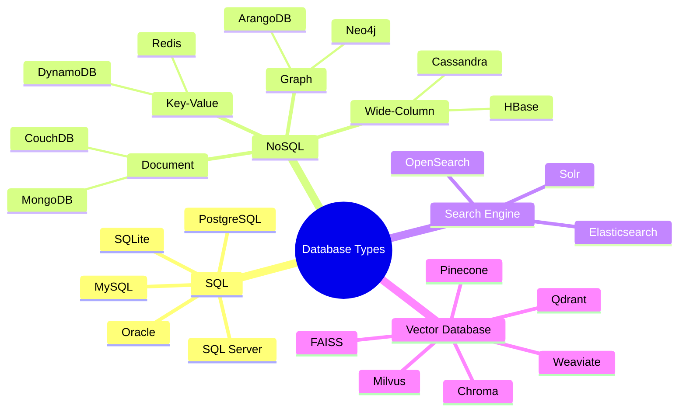

---

## What is SQL Database?

**SQL (Structured Query Language)** databases are relational databases that store data in tables with predefined schemas. They use structured query language for defining and manipulating data.

**Key Characteristics:**
- Fixed schema (tables, columns, data types)
- ACID compliance (Atomicity, Consistency, Isolation, Durability)
- Relationships via foreign keys
- Powerful JOIN operations
- Exact match and range queries

```sql
-- SQL Example
CREATE TABLE users (
    id SERIAL PRIMARY KEY,
    name VARCHAR(100),
    email VARCHAR(255) UNIQUE,
    created_at TIMESTAMP DEFAULT NOW()
);

SELECT * FROM users WHERE name = 'Alice' AND created_at > '2024-01-01';
```

**What SQL is good at:**
- Exact lookups (`WHERE id = 42`)
- Range queries (`WHERE price BETWEEN 10 AND 100`)
- Aggregations (`GROUP BY`, `SUM`, `AVG`)
- Joins across related tables
- Transactions (bank transfers, orders)

---

## What is NoSQL?

**NoSQL** databases are non-relational databases designed for flexible schemas, horizontal scaling, and handling large volumes of unstructured or semi-structured data.

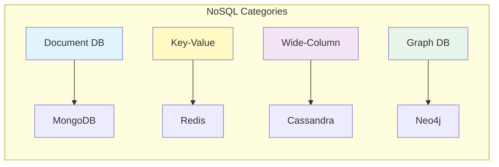

**Key Characteristics:**
- Flexible schema (schema-less or schema-on-read)
- BASE (Basically Available, Soft state, Eventual consistency)
- Horizontal scaling built-in
- Designed for specific data models

```javascript
// NoSQL Document Example (MongoDB)
{
  "name": "Alice",
  "email": "alice@example.com",
  "preferences": {
    "theme": "dark",
    "notifications": true
  },
  "tags": ["developer", "premium"]
}
```

---

## What Problems SQL Cannot Solve

```mermaid
graph TD
    subgraph "SQL Strengths"
        A1[Exact Match<br/>WHERE id=5] --> A2[✓ Works perfectly]
        B1[Range Query<br/>WHERE age>18] --> B2[✓ Works perfectly]
        C1[Sorted Data<br/>ORDER BY price] --> C2[✓ Works perfectly]
    end
    subgraph "SQL Weaknesses"
        D1[Semantic Search<br/>"Find similar documents"] --> D2[✗ Cannot do]
        E1[Image Search<br/>"Find similar photos"] --> E2[✗ Cannot do]
        F1[Recommendation<br/>"Users like you also..."] --> F2[✗ Cannot do]
        G1[Fuzzy Meaning<br/>"car" ≈ "automobile"] --> G2[✗ Cannot do]
    end
    style D1 fill:#ffcdd2
    style E1 fill:#ffcdd2
    style F1 fill:#ffcdd2
    style G1 fill:#ffcdd2
```

**Problems SQL Cannot Solve:**

| Problem | Why SQL Fails |
|---------|--------------|
| **Semantic Search** | SQL matches exact keywords, not meaning. "car" ≠ "automobile" in SQL |
| **Similarity Search** | No concept of "close to" or "similar to" |
| **Image Search** | Cannot compare pixel patterns for semantic similarity |
| **Recommendations** | Cannot compute "users similar to you" mathematically |
| **Natural Language** | Cannot understand query intent, only syntax |
| **Unstructured Data** | Binary, images, audio have no tabular structure |
| **High-dimensional data** | 1000+ dimension vectors cause "curse of dimensionality" |

> **ELI5:** Imagine SQL is like a librarian who only finds books if you tell them the exact shelf number. But if you say "find me a book like this one I just read," SQL has no idea what to do. Vector databases are the librarian who understands what you *mean*, not just what you *say*.

---

## Why AI Needs Vector DB

**The AI Revolution created a new data type: embeddings.**

Large Language Models (LLMs), image models, and audio models all represent data as **vectors** (lists of numbers). Traditional databases cannot efficiently store or search these vectors.

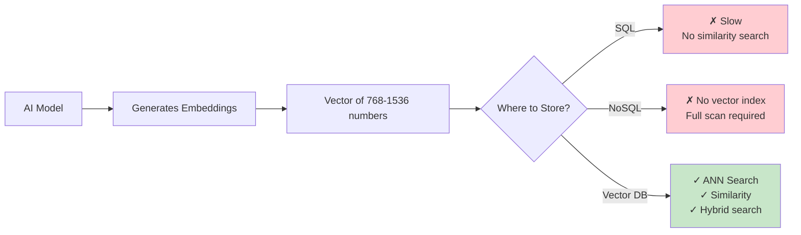

**Key AI Use Cases:**

1. **RAG (Retrieval-Augmented Generation)** - Give LLMs access to private documents
2. **Semantic Search** - Search by meaning, not keywords
3. **Recommendation Systems** - Find similar items/users
4. **Anomaly Detection** - Find unusual vectors
5. **Multimodal Search** - Search images with text, text with images
6. **Memory for Agents** - Store conversation history as vectors
7. **Deduplication** - Find near-duplicate documents

---

## Evolution of Databases

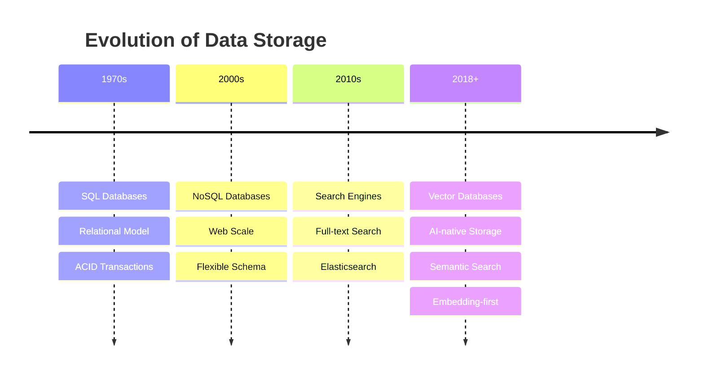

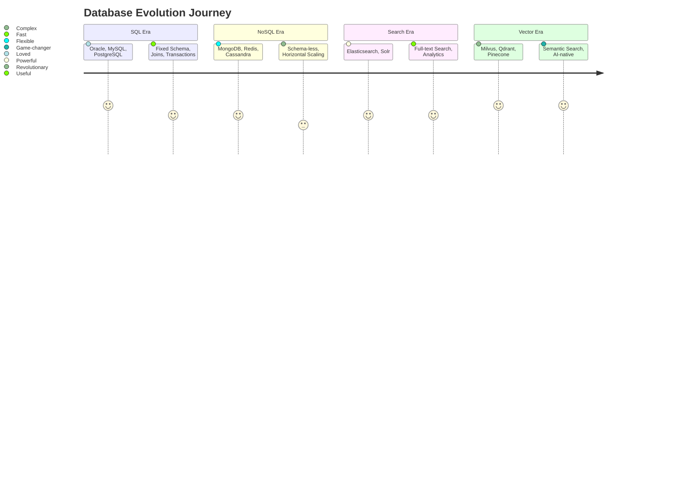

---

### Production Tip
> **When should you add a Vector DB?** If your application needs to understand "what content is similar to this content" — whether text, images, audio, or user behavior — you need a vector database. Start with a managed service (Pinecone, Weaviate Cloud) for prototyping, then evaluate self-hosted options (Milvus, Qdrant) for production at scale.

---

### Common Mistake
> **❌ Using a vector database as your primary database.** Vector DBs are specialized search engines, not general-purpose databases. Always pair them with a primary SQL/NoSQL database for transactions, user data, and canonical storage.

---

### Interview Tip
> **Q:** "Why can't we just use PostgreSQL with pgvector instead of a dedicated vector database?"
>
> **A:** For small datasets (<1M vectors), pgvector works fine. For production-scale (10M-1B vectors), dedicated vector DBs provide specialized ANN indexes (HNSW, IVF), distributed sharding, GPU acceleration, and 10-100x faster search with similar accuracy.

---

# Part 2: Embeddings

## What is an Embedding?

An **embedding** is a numerical representation of data (text, image, audio, etc.) as a dense vector of floating-point numbers in a high-dimensional space.

**In simple terms:** An embedding is a "fingerprint" of the content that captures its semantic meaning.

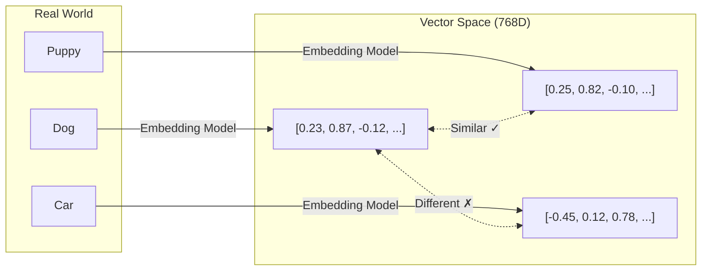

> **Key Insight:** Similar content produces similar vectors. "Dog" and "Puppy" will have vectors that are "close" to each other, while "Car" will be "far away" from both.

---

## How Text Becomes Numbers

### The Process

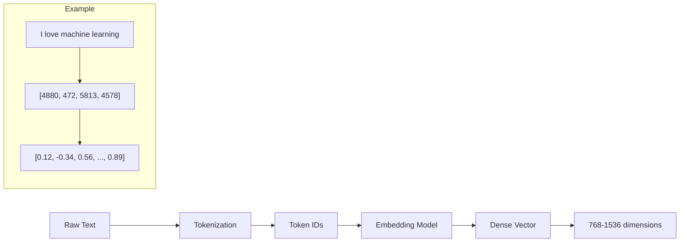

### ELI5: How Text Becomes Numbers

> Imagine you have a 1000-question survey about every concept in the world:
> - Question 1: "Is this related to animals?" → Dog: 0.95, Car: 0.05
> - Question 2: "Is this related to transportation?" → Dog: 0.10, Car: 0.98
> - Question 3: "Is this cute?" → Dog: 0.90, Car: 0.20
>
> Each word gets a score for each question. The collection of all scores is the embedding vector. Words with similar meanings give similar answers across all questions.

### Behind the Scenes: Transformer Models

Modern embeddings come from transformer models (BERT, T5, etc.):

```python
# High-level pseudocode
def get_embedding(text):
    tokens = tokenizer(text)          # Step 1: Split into tokens
    hidden_states = transformer(tokens) # Step 2: Pass through neural net
    embedding = pool(hidden_states)    # Step 3: Aggregate into single vector
    return normalize(embedding)        # Step 4: Normalize to unit length
```

---

## Types of Embeddings

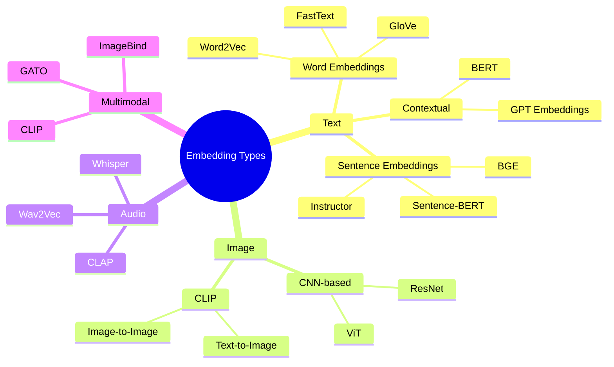

### Word Embeddings vs Sentence Embeddings

| Aspect | Word Embeddings | Sentence Embeddings |
|--------|----------------|-------------------|
| Input | Single word | Sentence / paragraph |
| Output | 1 vector per word | 1 vector per sentence |
| Context | Static (same vector for "bank" regardless of meaning) | Contextual ("bank river" vs "bank money" differ) |
| Model | Word2Vec, GloVe, FastText | Sentence-BERT, Instructor, BGE |
| Use Case | Word similarity, analogies | Semantic search, clustering |
| Dimension | 100-300 | 384-1536 |

### Image Embeddings

Image embeddings capture visual features:

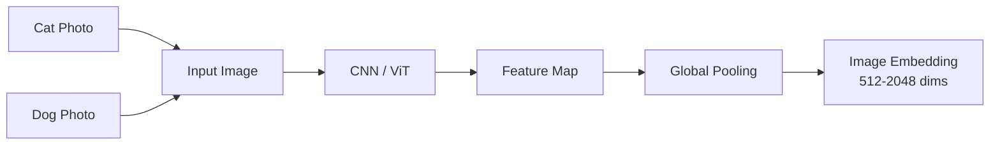

### Audio Embeddings

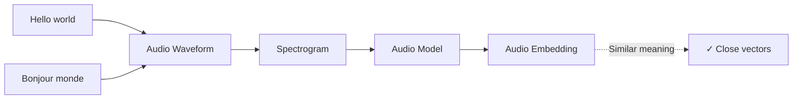

### Multimodal Embeddings (CLIP)

CLIP (Contrastive Language-Image Pre-training) maps text AND images to the SAME vector space:

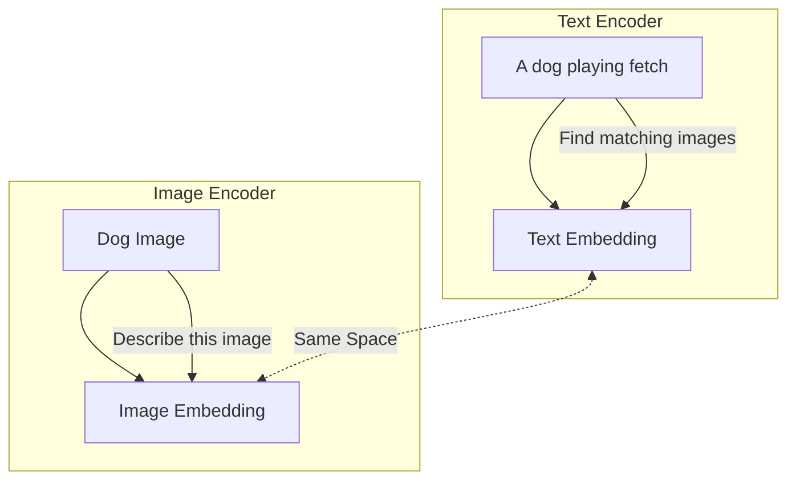

---

## Dimensionality & Vector Space

### What is Dimensionality?

**Dimension** = the number of numbers in a vector. Common sizes:

| Dimensions | Typical Use | Model Examples |
|-----------|-------------|---------------|
| 384 | Lightweight semantic search | `all-MiniLM-L6-v2`, `BGE-small` |
| 512 | Balanced performance | `BGE-base`, `GTE-base` |
| 768 | High accuracy | `BGE-large`, `Instructor-XL`, `E5-large` |
| 1024 | Very high accuracy | `OpenAI text-embedding-3-large` |
| 1536 | OpenAI standard | `text-embedding-ada-002`, `text-embedding-3-small` |

### Vector Space Intuition

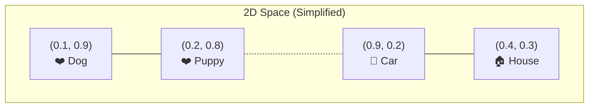

> **Important:** Real embeddings live in 384-1536 dimensional spaces. We cannot visualize this, but the math works the same way — points that are "close" in this space are semantically similar.

### The Curse of Dimensionality

As dimensions increase, counter-intuitive things happen:
- All points become "far" from each other
- Distance metrics become less discriminative
- More data is needed to "fill" the space

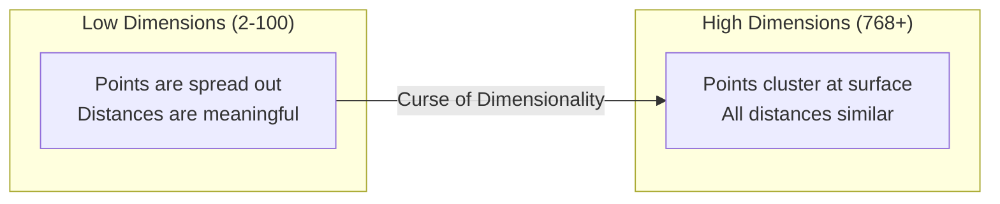

**Why it matters for Vector DBs:**
- ANN algorithms are designed specifically to overcome the curse of dimensionality
- Indexing strategies (like Product Quantization) compress vectors to reduce effective dimensionality
- Normalization (L2) is critical for high-dimensional vectors

---

## Cosine Space

**Cosine similarity** measures the angle between two vectors, not their magnitude. This is the most commonly used metric for semantic search.

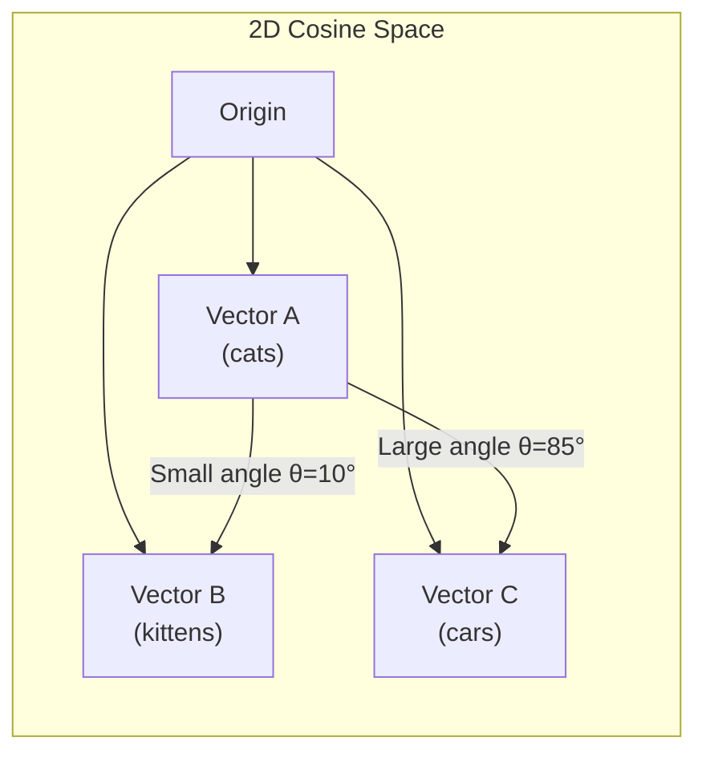

> **Note:** Cosine similarity = 1 when vectors point the same direction. = 0 when perpendicular. = -1 when opposite.

---

## Embedding Models Comparison

### Popular Models

| Model | Dimensions | Max Tokens | Performance | Cost | Best For |
|-------|-----------|------------|-------------|------|----------|
| **OpenAI text-embedding-3-small** | 512-1536 | 8191 | ★★★★★ | $0.02/M tokens | General purpose, production |
| **OpenAI text-embedding-3-large** | 256-3072 | 8191 | ★★★★★ | $0.13/M tokens | Best quality, enterprise |
| **OpenAI text-embedding-ada-002** | 1536 | 8191 | ★★★★☆ | $0.10/M tokens | Legacy, still solid |
| **BGE-small-en-v1.5** | 384 | 512 | ★★★☆☆ | Free | Lightweight, local |
| **BGE-base-en-v1.5** | 768 | 512 | ★★★★☆ | Free | Balanced, self-hosted |
| **BGE-large-en-v1.5** | 1024 | 512 | ★★★★☆ | Free | High accuracy, self-hosted |
| **BAAI/bge-m3** | 1024 | 8192 | ★★★★★ | Free | Multi-language, long context |
| **sentence-transformers/all-MiniLM-L6-v2** | 384 | 256 | ★★★☆☆ | Free | Fast, small, prototyping |
| **sentence-transformers/all-mpnet-base-v2** | 768 | 384 | ★★★★☆ | Free | Good quality |
| **intfloat/e5-large-v2** | 1024 | 512 | ★★★★★ | Free | High quality English |
| **intfloat/e5-mistral-7b-instruct** | 4096 | 4096 | ★★★★★ | Free | Best quality, large |
| **hkunlp/instructor-xl** | 768 | 512 | ★★★★★ | Free | Task-specific instructions |
| **BAAI/bge-reranker-v2-m3** | N/A (reranker) | 8192 | ★★★★★ | Free | Reranking |
| **Nomic Embed Text v1** | 768 | 8192 | ★★★★★ | Free | Long context, high quality |
| **gte-base-en-v1.5** | 768 | 8192 | ★★★★☆ | Free | Balanced, long context |
| **gte-large-en-v1.5** | 1024 | 8192 | ★★★★★ | Free | High quality |
| **jina-embeddings-v3** | 512-1024 | 8192 | ★★★★☆ | Free | Multi-lingual, task-specific |
| **Google Gecko (text-embedding)** | 768 | - | ★★★★★ | $0.0006/char | Google Cloud |
| **Cohere Embed v3** | 1024 | 512 | ★★★★★ | Paid | Enterprise, multilingual |
| **Voyage-2** | 1024 | 4000 | ★★★★☆ | Paid | General purpose |

### Model Selection Decision Tree

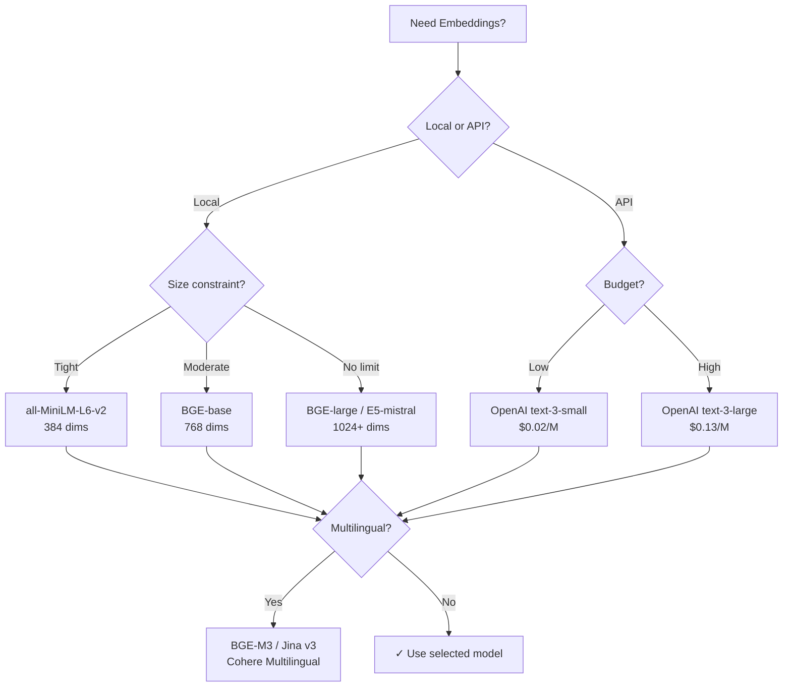

---

## Python Examples

### Installation

```bash
pip install sentence-transformers
pip install openai
pip install numpy
```

### Sentence-Transformers (Local)

```python
from sentence_transformers import SentenceTransformer

# Load model (downloads on first use)
model = SentenceTransformer('all-MiniLM-L6-v2')

# Encode sentences
sentences = [
    "I love machine learning",
    "Deep learning is fascinating",
    "The weather is nice today"
]

embeddings = model.encode(sentences)
print(f"Shape: {embeddings.shape}")  # (3, 384)
print(f"First embedding[:5]: {embeddings[0][:5]}")
# [ 0.0452, -0.0284,  0.0239, -0.0051,  0.0345, ...]

# Check similarity
from sklearn.metrics.pairwise import cosine_similarity
sim = cosine_similarity([embeddings[0]], [embeddings[1]])
print(f"Similarity (ML vs DL): {sim[0][0]:.4f}")  # ~0.85

sim2 = cosine_similarity([embeddings[0]], [embeddings[2]])
print(f"Similarity (ML vs weather): {sim2[0][0]:.4f}")  # ~0.15
```

### OpenAI Embeddings (API)

```python
import openai
import numpy as np

client = openai.OpenAI()

def get_embedding(text, model="text-embedding-3-small"):
    text = text.replace("\n", " ")
    return client.embeddings.create(
        input=[text], model=model
    ).data[0].embedding

text = "Vector databases are revolutionizing AI search"
embedding = get_embedding(text)
print(f"Dimension: {len(embedding)}")  # 1536
print(f"First 5 values: {embedding[:5]}")
# [0.0023, -0.0091, 0.0152, -0.0034, 0.0211, ...]
```

### BGE Model (Best Open-Source)

```python
from sentence_transformers import SentenceTransformer
from sklearn.metrics.pairwise import cosine_similarity

# BGE requires a prefix for optimal performance
model = SentenceTransformer('BAAI/bge-base-en-v1.5')

query = "How does machine learning work?"
docs = [
    "Machine learning uses data to train models",
    "Cats are domestic animals",
    "Neural networks learn from examples"
]

# Important: BGE uses different prefixes for query vs documents
query_emb = model.encode(query, normalize_embeddings=True)
doc_embs = model.encode(docs, normalize_embeddings=True)

scores = cosine_similarity([query_emb], doc_embs)[0]
for doc, score in zip(docs, scores):
    print(f"  {doc}: {score:.4f}")
# Machine learning uses...: 0.72
# Cats are domestic...: 0.12
# Neural networks learn...: 0.68
```

### Instructor Model (Task-Specific Instructions)

```python
from sentence_transformers import SentenceTransformer
import torch

model = SentenceTransformer('hkunlp/instructor-base')

# Instructor models take instructions
query_instruction = "Represent the question for retrieving documents:"
doc_instruction = "Represent the document for retrieval:"

query = model.encode(
    [[query_instruction, "What is the capital of France?"]]
)
doc = model.encode(
    [[doc_instruction, "Paris is the capital of France."]]
)

sim = cosine_similarity(query, doc)[0][0]
print(f"Similarity: {sim:.4f}")  # ~0.92
```

---

### Production Tip
> **Always normalize embeddings** (L2 normalization) when using cosine similarity. This ensures that only the direction matters, not the magnitude. Most vector DBs handle this automatically if you specify cosine similarity.

---

### Best Practice
> **Choosing dimensions:** Lower dimensions (384-512) are faster and use less memory. Higher dimensions (1024-1536) give better accuracy but require more compute. For production, benchmark YOUR specific data at different dimensions using a validation set.

---

### Common Mistake
> **❌ Using different models for indexing and searching.** The query encoder must match the document encoder. Vectors from different models exist in different vector spaces and cannot be compared.

---

### Interview Tip
> **Q:** "Why 384 or 768 or 1536 dimensions? Why not 100 or 10000?"
>
> **A:** These numbers come from model architecture. BERT-base uses 768 hidden units; the output inherits that dimension. Too few dimensions lose information (underfitting), too many cause the curse of dimensionality. 384-1536 is empirically the sweet spot for language.

---

## Embedding Visualization in 2D (t-SNE / UMAP)

While we can't visualize 768D space directly, we can project to 2D:

```python
import numpy as np
from sklearn.manifold import TSNE
import matplotlib.pyplot as plt

model = SentenceTransformer('all-MiniLM-L6-v2')

# 50 documents about various topics
documents = [
    "Machine learning algorithms", "Deep neural networks",
    "Python programming", "JavaScript web development",
    "Cats are mammals", "Dogs are pets",
    "Stock market trading", "Real estate investing"
]
embs = model.encode(documents)

# Reduce to 2D for visualization
tsne = TSNE(n_components=2, random_state=42)
emb_2d = tsne.fit_transform(embs)

# Plot (conceptual)
"""
            Machine learning ●   ● Deep learning
                              ↘ ↙
        Python ●────● JavaScript
                              
        Cats ●───● Dogs
                              
Stock market ●───● Real estate
"""
```

---

# Part 3: Similarity Search

Similarity search is the core operation of vector databases. Given a query vector, find the "closest" vectors in the database.

## Distance Metrics Overview

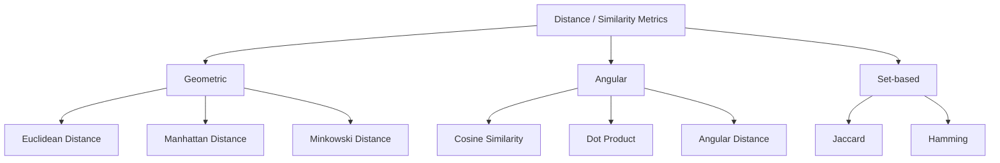

## Dot Product

### Formula
```
dot(A, B) = Σ(Ai × Bi) for i = 1 to n

= A1×B1 + A2×B2 + ... + An×Bn
```

### ELI5
> Think of dot product as asking "how much does vector A point in the same direction as vector B?" If they point the same way, the dot product is large and positive. If opposite, it's negative.

### Python
```python
import numpy as np

a = np.array([0.3, 0.8, -0.2, 0.5])
b = np.array([0.4, 0.7, -0.1, 0.6])

dot_product = np.dot(a, b)
# or
dot_product = sum(ai * bi for ai, bi in zip(a, b))

print(f"Dot product: {dot_product:.4f}")  # 1.07
```

### When to Use
- **Default in many vector DBs** (Milvus, Qdrant) for normalized vectors
- When magnitude matters (e.g., recommendation systems)
- For normalized vectors, equivalent to cosine similarity

---

## Cosine Similarity

### Formula
```
cosine_sim(A, B) = dot(A, B) / (||A|| × ||B||)

where ||A|| = sqrt(Σ(Ai²))

= cos(θ) where θ is the angle between vectors
```

### ELI5
> Cosine similarity only cares about direction, not distance. Think of laser pointers from the origin. Cosine similarity measures the angle between the beams, ignoring how far they travel. Two vectors pointing in nearly the same direction are "similar" even if one is much longer.

### Python
```python
import numpy as np

def cosine_similarity(a, b):
    dot_product = np.dot(a, b)
    norm_a = np.linalg.norm(a)
    norm_b = np.linalg.norm(b)
    return dot_product / (norm_a * norm_b)

a = np.array([0.3, 0.8, -0.2, 0.5])
b = np.array([0.4, 0.7, -0.1, 0.6])

sim = cosine_similarity(a, b)
print(f"Cosine similarity: {sim:.4f}")  # ~0.98

# With scikit-learn
from sklearn.metrics.pairwise import cosine_similarity
sim = cosine_similarity([a], [b])[0][0]
```

### When to Use
- **Semantic text search** (most common)
- Document similarity
- When direction matters, magnitude doesn't
- Default choice for text embeddings

---

## Euclidean Distance (L2)

### Formula
```
euclidean(A, B) = sqrt(Σ(Ai - Bi)²)

= sqrt((A1-B1)² + (A2-B2)² + ... + (An-Bn)²)
```

### ELI5
> Euclidean distance is the "straight-line distance" between two points. If vectors are points in space, Euclidean distance is how far apart they are — like measuring with a ruler between two dots on a paper.

### Python
```python
import numpy as np

a = np.array([0.3, 0.8, -0.2, 0.5])
b = np.array([0.4, 0.7, -0.1, 0.6])

l2 = np.linalg.norm(a - b)
print(f"Euclidean distance: {l2:.4f}")  # ~0.17

# Manual
l2_manual = np.sqrt(np.sum((a - b) ** 2))
print(f"Euclidean distance (manual): {l2_manual:.4f}")
```

### When to Use
- Image similarity (CLIP embeddings)
- Clustering algorithms
- When magnitude matters
- Anomaly detection (unusual vectors are far from clusters)

---

## Comparison: Cosine vs Euclidean

For **normalized** vectors (||v|| = 1), cosine and Euclidean are equivalent:

```
cosine_sim = 1 - (euclidean² / 2)
```

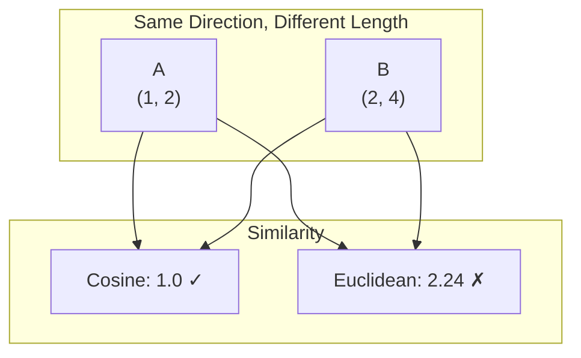

> **Key Insight:** For text search, cosine similarity is preferred because "word frequency" variations shouldn't change meaning. For image search, Euclidean may be better because image features have meaningful magnitudes.

---

## Manhattan Distance (L1)

### Formula
```
manhattan(A, B) = Σ|Ai - Bi|

= |A1-B1| + |A2-B2| + ... + |An-Bn|
```

### Python
```python
import numpy as np

a = np.array([0.3, 0.8, -0.2, 0.5])
b = np.array([0.4, 0.7, -0.1, 0.6])

l1 = np.sum(np.abs(a - b))
print(f"Manhattan distance: {l1:.4f}")  # ~0.3
```

### When to Use
- High-dimensional sparse vectors
- When features are independent
- Robust to outliers compared to Euclidean
- Used in some recommendation systems

---

## Hamming Distance

### Formula
```
hamming(A, B) = number of positions where Ai ≠ Bi
```

### ELI5
> Hamming distance counts how many bits are different between two binary strings. Like comparing two license plates and counting how many characters differ.

### Python
```python
def hamming_distance(a, b):
    return sum(ai != bi for ai, bi in zip(a, b))

# Binary vectors
a = [1, 0, 0, 1, 1, 0, 1]
b = [1, 0, 1, 0, 1, 0, 1]
print(f"Hamming distance: {hamming_distance(a, b)}")  # 2
```

### When to Use
- Binary embeddings (e.g., locality-sensitive hashing)
- Near-duplicate detection
- Deduplication at scale

---

## Jaccard Similarity

### Formula
```
jaccard(A, B) = |A ∩ B| / |A ∪ B|
```

### ELI5
> Jaccard similarity compares two sets: how many items they share divided by the total unique items. If you and your friend both have 10 books and share 5, your Jaccard similarity is 5/15 = 0.33.

### Python
```python
def jaccard_similarity(set_a, set_b):
    intersection = len(set_a & set_b)
    union = len(set_a | set_b)
    return intersection / union if union > 0 else 0

a = {"cat", "dog", "bird", "fish"}
b = {"dog", "fish", "hamster"}
print(f"Jaccard: {jaccard_similarity(a, b):.4f}")  # 0.4
```

---

## Angular Distance

### Formula
```
angular_distance(A, B) = arccos(cosine_similarity(A, B)) / π
```

### Python
```python
import numpy as np

def angular_distance(a, b):
    cos_sim = np.dot(a, b) / (np.linalg.norm(a) * np.linalg.norm(b))
    cos_sim = np.clip(cos_sim, -1.0, 1.0)  # Numerical stability
    return np.arccos(cos_sim) / np.pi

a = np.array([0.3, 0.8, -0.2, 0.5])
b = np.array([0.4, 0.7, -0.1, 0.6])
print(f"Angular distance: {angular_distance(a, b):.4f}")
```

---

## Metric Summary Table

| Metric | Range | Symmetric | Triangle Inequality | Best For |
|--------|-------|-----------|-------------------|----------|
| Cosine Similarity | [-1, 1] | Yes | No | Text, semantic search |
| Dot Product | (-∞, ∞) | Yes | No | Recommendations, normalized vectors |
| Euclidean L2 | [0, ∞) | Yes | Yes | Images, clustering |
| Manhattan L1 | [0, ∞) | Yes | Yes | Sparse vectors, robust to outliers |
| Hamming | [0, n] | Yes | Yes | Binary vectors, dedup |
| Jaccard | [0, 1] | Yes | Yes* | Set similarity |
| Angular | [0, 1] | Yes | Yes | Proper metric version of cosine |

---

### Interview Tip
> **Q:** "Why is cosine similarity preferred for text embeddings?"
>
> **A:** Text embeddings from models like BERT produce vectors where the magnitude can vary with text length or word frequency, but the direction captures semantic meaning. Cosine similarity ignores magnitude, making it invariant to text length — "short dog" and "very fluffy dog" should both match "dog."

---

# Part 4: How Vector DB Works

## End-to-End Flow

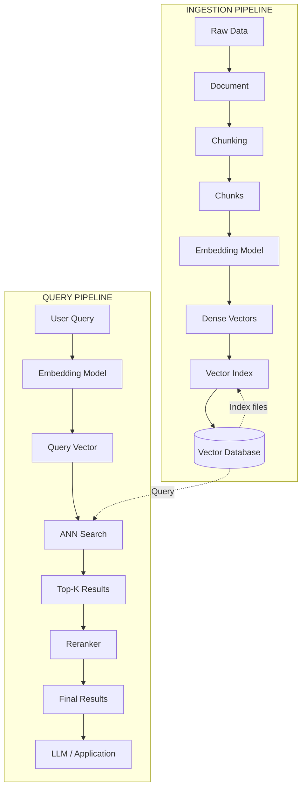

### Step-by-Step: Ingestion

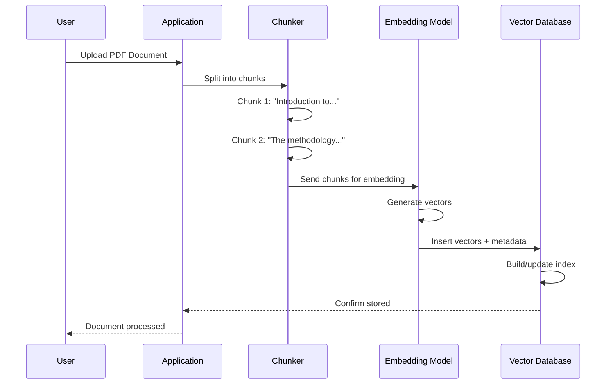

### Step-by-Step: Query

```mermaid
sequenceDiagram
    participant User
    participant App as Application
    participant Embedder as Embedding Model
    participant DB as Vector Database
    participant Reranker
    participant LLM
    
    User->>App: "What is vector search?"
    App->>Embedder: Embed query
    Embedder-->>App: Query vector [0.23, -0.45, ...]
    App->>DB: ANN search (query_vector, k=10)
    DB->>DB: Traverse HNSW graph / IVF clusters
    DB-->>App: Top-10 chunks with scores
    App->>Reranker: Rerank top-10
    Reranker-->>App: Reranked top-3
    App->>LLM: Context + query
    LLM-->>App: Generated answer
    App-->>User: "Vector search finds similar..."
```

---

## Inside a Vector DB: Architecture

```mermaid
architecture-beta
    group api[API Layer]
    group index[Index Layer]
    group storage[Storage Layer]
    
    service client(Users/client)[Client] in api
    service embedder(Users/robot)[Embedding Service] in api
    service filter(Users/gear)[Filter Engine] in api
    
    service hnsw(Users/database)[HNSW Index] in index
    service ivf(Users/database)[IVF Index] in index
    service pq(Users/compress)[Product Quantization] in index
    
    service ram(Users/device)[RAM] in storage
    service ssd(Users/device)[SSD/Disk] in storage
    service cache(Users/database)[Cache] in storage
    
    client:R <--> L:filter
    filter:R --> L:hnsw
    filter:R --> L:ivf
    hnsw:T <--> B:pq
    ivf:T <--> B:pq
    pq:T <--> B:ram
    ram:T <--> B:ssd
    ram:T <--> B:cache
```

---

## Core Components

```mermaid
graph TD
    A[Vector Database] --> B[Storage Layer]
    A --> C[Index Layer]
    A --> D[Query Layer]
    A --> E[API Layer]
    
    B --> B1[Vector Storage]
    B --> B2[Metadata Storage]
    B --> B3[WAL / Write-Ahead Log]
    
    C --> C1[Index Builder]
    C --> C2[Index Optimizer]
    C --> C3[Quantization Engine]
    
    D --> D1[ANN Search]
    D --> D2[Filter Executor]
    D --> D3[Reranking]
    D --> D4[Hybrid Search]
    
    E --> E1[REST API]
    E --> E2[gRPC API]
    E --> E3[Client SDKs]
```

---

## Storage Format: How Vectors Are Stored

```mermaid
graph LR
    subgraph "Vector File (on disk)"
        A["Header<br/>dim=768, count=1M, dtype=float32"]
        B["Vector 0<br/>[0.12, -0.34, ..., 0.89]"]
        C["Vector 1<br/>[0.45, 0.67, ..., -0.12]"]
        D["..."]
        E["Vector 999999<br/>[-0.78, 0.01, ..., 0.34]"]
    end
    
    subgraph "Metadata File"
        F["ID→Payload Map"]
        G["Filter Indexes"]
        H["Tenant Mapping"]
    end
```

**Storage Calculation:**
```
1 million vectors × 768 dimensions × 4 bytes (float32) = 3.07 GB
+ metadata overhead ~ 20-30%
Total ~ 3.7-4 GB per million vectors
```

---

## Index Types Supported

```mermaid
graph TD
    A{Vector Database} --> B{Index Type}
    B --> C[Flat / Brute Force]
    B --> D[ANN Index]
    
    D --> E[HNSW]
    D --> F[IVF]
    D --> G[IVF_PQ]
    D --> H[HNSW_PQ]
    D --> I[SCANN]
    D --> J[DiskANN]
    
    C --> K[Exact<br/>100% recall<br/>Slow on large data]
    E --> L[Fast search<br/>High memory<br/>Best for <10M]
    F --> M[Low memory<br/>Moderate speed<br/>Best for 10M+]
    G --> N[Very low memory<br/>Good speed<br/>Best for 100M+]
    J --> O[SSD-based<br/>Billions scale]
```

---

### ELI5: How Vector DB Works

> Imagine a giant library where every book has been given a secret code — a list of 1000 numbers. Books about cooking have similar codes. Books about space have different codes. When you ask "find me books like this recipe book," the librarian:
>
> 1. Converts your request into a code (embedding)
> 2. Doesn't check every single book (too slow!)
> 3. Uses a special map (index) to jump directly to the neighborhood of similar codes
> 4. Checks only the nearby books (ANN search)
> 5. Returns the closest matches
>
> This is 1000x faster than checking every book!

---

### Production Tip
> **Read vs Write optimization:** Vector DBs are designed for read-heavy workloads. Ingestion is typically batch-based (offline), while queries are real-time (online). Design your pipeline accordingly — use message queues (Kafka, RabbitMQ) between ingestion and indexing.

---

### Common Mistake
> **❌ Not separating embedding generation from vector storage.** Running an embedding model inline during query time adds 100-500ms latency. Pre-compute and cache embeddings whenever possible.

---

# Part 5: Chunking

## Why Chunk?

**Chunking** is the process of splitting documents into smaller pieces before embedding. This is critical because:

1. **Embedding models have token limits** (usually 256-8192 tokens)
2. **Fine-grained retrieval** — smaller chunks mean more precise matches
3. **Better recall** — relevant information isn't buried inside a large document
4. **LLM context limits** — only send relevant chunks to the LLM

```mermaid
graph LR
    subgraph "Without Chunking"
        A["100-page PDF"] --> B["One huge vector"]
        B --> C["Query: 'What is X?'"]
        C --> D["✗ Returns entire document<br/>Context too noisy"]
    end
    subgraph "With Chunking"
        E["100-page PDF"] --> F["500 chunks<br/>~1 page each"]
        F --> G["Query: 'What is X?'"]
        G --> H["✓ Returns exact page<br/>Precise answer possible"]
    end
    style D fill:#ffcdd2
    style H fill:#c8e6c9
```

---

## Chunk Size & Overlap

### Chunk Size Guidelines

| Content Type | Recommended Chunk Size | Reason |
|-------------|----------------------|--------|
| Social media posts | 50-100 tokens | Short, self-contained |
| News articles | 200-500 tokens | One topic per chunk |
| Research papers | 300-1000 tokens | Sections are meaningful |
| Code files | 100-500 tokens | Functions/methods |
| Books | 500-2000 tokens | Chapters balance context |
| Legal documents | 1000-2000 tokens | Dense, contextual |

### Overlap

**Overlap** means sharing some text between adjacent chunks:

```mermaid
graph TD
    subgraph "Document Flow"
        A["Page 1 content<br/>The cat sat on the mat. It was<br/>a comfortable spot for napping."]
        B["Page 2 content<br/>a comfortable spot for napping.<br/>The dog preferred the rug."]
    end
    subgraph "Chunks"
        C["Chunk 1: The cat sat on the mat. It was a comfortable spot for napping."]
        D["Chunk 2: a comfortable spot for napping. The dog preferred the rug."]
    end
    A --> C
    B --> D
    C -.->|Overlap| D
```

**Why overlap matters:**
- Prevents cutting off mid-sentence
- Ensures context continuity
- Improves retrieval for boundary content

**Recommended overlap:** 10-20% of chunk size

---

## Chunking Strategies

```mermaid
mindmap
  root((Chunking Strategies))
    Fixed Size
      Simple
      Fast
      May cut sentences
    Recursive Character
      Respects separators
      Balanced
      LangChain default
    Semantic
      Meaning-based
      Best quality
      Slower
    Sliding Window
      Maximum context
      Lots of overlap
    Parent-Child
      Retrieve child
      Context from parent
    Markdown/HTML
      Structure-aware
      H1/H2 boundaries
    Code-aware
      Function boundaries
      Class boundaries
    Adaptive
      ML-based
      Content-dependent
```

### 1. Fixed Size Chunking

```python
def fixed_size_chunks(text, chunk_size=500, overlap=50):
    chunks = []
    start = 0
    while start < len(text):
        end = min(start + chunk_size, len(text))
        chunks.append(text[start:end])
        start += chunk_size - overlap
    return chunks
```

**Pros:** Simple, fast, predictable
**Cons:** May cut sentences/words in half

### 2. Recursive Character Chunking (Recommended)

```python
from langchain.text_splitter import RecursiveCharacterTextSplitter

splitter = RecursiveCharacterTextSplitter(
    chunk_size=500,
    chunk_overlap=50,
    separators=["\n\n", "\n", ".", " ", ""],  # Tries in order
    length_function=len,
)

text = open("document.txt").read()
chunks = splitter.split_text(text)
```

**How it works:**
1. Try to split by `\n\n` (paragraph breaks)
2. If chunks too large, try `\n` (line breaks)
3. If still too large, try `.` (sentences)
4. Continue until chunks fit the size limit

### 3. Semantic Chunking

```python
from sentence_transformers import SentenceTransformer

def semantic_chunks(sentences, model, threshold=0.7):
    """Group sentences into chunks based on semantic coherence."""
    model = SentenceTransformer('all-MiniLM-L6-v2')
    embeddings = model.encode(sentences)
    
    chunks = []
    current_chunk = [sentences[0]]
    
    for i in range(1, len(sentences)):
        sim = cosine_similarity([embeddings[i]], [embeddings[i-1]])[0][0]
        if sim < threshold:
            chunks.append(" ".join(current_chunk))
            current_chunk = [sentences[i]]
        else:
            current_chunk.append(sentences[i])
    
    chunks.append(" ".join(current_chunk))
    return chunks
```

**Pros:** Groups related content, better retrieval
**Cons:** Slower, requires embedding model

### 4. Parent-Child Chunking

```mermaid
graph TD
    subgraph "Parent Chunks (Large)"
        A["Chapter 1: Introduction<br/>(2000 tokens)"]
        B["Chapter 2: Methods<br/>(2000 tokens)"]
    end
    subgraph "Child Chunks (Small)"
        A1["Section 1.1<br/>(200 tokens)"]
        A2["Section 1.2<br/>(200 tokens)"]
        B1["Section 2.1<br/>(200 tokens)"]
        B2["Section 2.2<br/>(200 tokens)"]
    end
    
    A --> A1
    A --> A2
    B --> B1
    B --> B2
    
    A1 -.->|Retrieve child,<br/>return parent context| Q[Query]
```

**Best for:** RAG pipelines where you want:
- Smaller chunks for better matching
- But larger context for the LLM

### 5. Markdown/HTML Chunking

```python
from langchain.text_splitter import MarkdownHeaderTextSplitter

splitter = MarkdownHeaderTextSplitter(
    headers_to_split_on=[
        ("#", "Header 1"),
        ("##", "Header 2"),
        ("###", "Header 3"),
    ]
)

chunks = splitter.split_text(markdown_text)
# Each chunk preserves its header hierarchy as metadata
```

---

## Production Recommendations

| Scenario | Strategy | Chunk Size | Overlap |
|----------|----------|------------|---------|
| QA Bot (docs) | Recursive Character | 500 tokens | 50 tokens |
| Code Assistant | Code-aware | 300 tokens | 30 tokens |
| Research Paper Analysis | Semantic | 1000 tokens | 100 tokens |
| Chat Memory | Fixed Size | 200 tokens | 20 tokens |
| Legal Document Review | Parent-Child | Parent: 2000, Child: 400 | 100 |
| Web Crawl Results | Recursive Character | 1000 tokens | 100 tokens |
| E-commerce Search | Semantic | 100 tokens | 10 tokens |

### Chunk Size vs Performance

```mermaid
graph LR
    A[Chunk Size] --> B{Too Small?}
    A --> C{Too Large?}
    
    B --> D["✗ Missing context<br/>✗ Low relevance<br/>✗ Too many chunks"]
    C --> E["✗ Diluted signal<br/>✗ Wasted LLM context<br/>✗ Hard to pinpoint"]
    
    D --> F["Goal: Sweet Spot<br/>200-1000 tokens"]
    E --> F
```

### Best Practice
> **Experiment!** The optimal chunk size depends on your data, embedding model, and use case. Always A/B test different chunking strategies on a labeled dataset to measure recall@k.

---

### Common Mistake
> **❌ Using the same chunk size for all content.** A tweet (280 chars) and a research paper (10,000 words) need very different chunking strategies. Adapt chunk size to content type.

---

### Interview Tip
> **Q:** "How does chunk size affect retrieval quality?"
>
> **A:** Smaller chunks give better precision but can miss context. Larger chunks give better context but dilute relevance. The tradeoff is managed through techniques like parent-child chunking — retrieve small chunks for precision, then provide large parent chunks for context.

---

# Part 6: Metadata

## What Metadata Stores

**Metadata** is structured data attached to each vector. It enables filtering, organization, and context for search results.

```python
# Example: A vector with metadata
{
    "id": "doc_123_chunk_5",
    "vector": [0.12, -0.34, 0.56, ...],  # 768-dim embedding
    "metadata": {
        "document_id": "doc_123",
        "title": "Introduction to Machine Learning",
        "author": "John Doe",
        "date": "2024-03-15",
        "page_number": 42,
        "chunk_index": 5,
        "language": "en",
        "category": "education",
        "tags": ["ML", "AI", "beginners"],
        "permission": "internal",
        "tenant_id": "org_acme",
        "version": 2,
        "source_url": "https://example.com/ml-intro.pdf"
    }
}
```

---

## Why Metadata Matters

```mermaid
graph TD
    A[Vector Search] --> B{Without Metadata?}
    A --> C{With Metadata?}
    
    B --> D["✗ Searches entire DB"]
    B --> E["✗ May return wrong tenant's data"]
    B --> F["✗ Cannot filter by date/category"]
    
    C --> G["✓ Pre-filter narrows search space"]
    C --> H["✓ Multi-tenant isolation"]
    C --> I["✓ Temporal filtering"]
    C --> J["✓ Access control"]
    
    style D fill:#ffcdd2
    style E fill:#ffcdd2
    style F fill:#ffcdd2
    style G fill:#c8e6c9
    style H fill:#c8e6c9
    style I fill:#c8e6c9
    style J fill:#c8e6c9
```

---

## Filtering in Vector Search

There are two approaches to filtering:

### 1. Pre-Filtering
Filter first, then search among filtered vectors.

```mermaid
graph LR
    subgraph "Pre-Filter"
        A[All Vectors<br/>1M] --> B[Filter: tenant=acme<br/>50K remaining]
        B --> C[ANN Search on 50K]
        C --> D[Top-10 Results]
    end
```

**Pros:** Guarantees filtered results
**Cons:** May be slow if filter is very selective, index may not cover filtered set well

### 2. Post-Filtering
Search first, then filter results.

```mermaid
graph LR
    subgraph "Post-Filter"
        E[All Vectors<br/>1M] --> F[ANN Search on 1M]
        F --> G[Top-100 Results]
        G --> H[Filter: tenant=acme<br/>Keep matching]
        H --> I[Top-10 Results or fewer]
    end
```

**Pros:** Fast search, uses full index
**Cons:** May return fewer than k results after filtering

### 3. Filtered Search (Best)
Most modern vector DBs integrate filtering into the search itself.

```mermaid
graph LR
    subgraph "Filtered Search (Integrated)"
        J[Query + Filter] --> K[Index walks only<br/>nodes matching filter]
        K --> L[Top-K Filtered Results]
    end
```

---

## Filter Types

### Boolean Filter
```python
# Qdrant example
filter_condition = Filter(
    must=[
        FieldCondition(key="is_published", match=MatchValue(value=True))
    ]
)
```

### Range Filter
```python
# Milvus example
filter_condition = "page_number >= 10 and page_number <= 50"
```

### Geo Filter
```python
# Weaviate example
near_filter = {
    "geoRange": {
        "latitude": 40.7128,
        "longitude": -74.0060,
        "distance": 10000  # meters
    }
}
```

### Tag/List Filter
```python
# Pinecone example
filter_condition = {
    "tags": {"$in": ["machine-learning", "deep-learning"]},
    "language": {"$eq": "en"}
}
```

### Multi-condition Filter
```python
# Combined filter
filter_condition = {
    "$and": [
        {"tenant_id": {"$eq": "org_acme"}},
        {"date": {"$gte": "2024-01-01"}},
        {"$or": [
            {"category": {"$eq": "research"}},
            {"category": {"$eq": "engineering"}}
        ]}
    ]
}
```

---

## Tenant Isolation

```mermaid
graph TB
    subgraph "Multi-Tenant Architecture"
        A[Tenant A] --> C[(Vector DB)]
        B[Tenant B] --> C
    end
    subgraph "Storage"
        C --> D["Vector A1 | tenant=A"]
        C --> E["Vector A2 | tenant=A"]
        C --> F["Vector B1 | tenant=B"]
        C --> G["Vector B2 | tenant=B"]
    end
    subgraph "Query"
        A --> H["Search with filter: tenant=A"]
        H --> I[Returns only A's vectors]
    end
```

**Tenant isolation strategies:**
1. **Metadata filter** — Add `tenant_id` to every vector, always filter by it
2. **Separate collection** — One collection per tenant (Qdrant, Milvus)
3. **Separate database** — One DB instance per tenant (Pinecone)
4. **Separate namespace** — Namespace per tenant (Pinecone)

---

## Examples

### Qdrant
```python
from qdrant_client import QdrantClient
from qdrant_client.models import Filter, FieldCondition, MatchValue

client = QdrantClient(":memory:")

# Search with metadata filter
results = client.search(
    collection_name="my_docs",
    query_vector=[0.1, 0.2, 0.3],
    query_filter=Filter(
        must=[
            FieldCondition(
                key="tenant_id",
                match=MatchValue(value="acme_corp")
            ),
            FieldCondition(
                key="date",
                range=Range(gte="2024-01-01")
            )
        ]
    ),
    limit=10
)
```

### Milvus
```python
from pymilvus import Collection

collection = Collection("my_docs")
collection.load()

results = collection.search(
    data=[[0.1, 0.2, 0.3]],
    anns_field="vector",
    param={"metric_type": "COSINE"},
    limit=10,
    expr="tenant_id == 'acme_corp' and page_number > 10",
    output_fields=["title", "page_number"]
)
```

### Pinecone
```python
import pinecone

index = pinecone.Index("my-index")

results = index.query(
    vector=[0.1, 0.2, 0.3],
    top_k=10,
    filter={
        "tenant_id": {"$eq": "acme_corp"},
        "date": {"$gte": "2024-01-01"},
        "category": {"$in": ["research", "engineering"]}
    },
    include_metadata=True
)
```

---

### Production Tip
> **Always filter by tenant_id at the database level, not application level.** If your search returns results from other tenants even for a millisecond, it's a security breach. Every query must include a tenant filter — make this a non-negotiable part of your query builder.

---

### Common Mistake
> **❌ Storing large metadata blobs.** Metadata is stored alongside vectors in memory. Keep metadata small (bytes, not KB). Store large payloads (full text) in an external object store; include only a reference in vector metadata.

---

### Interview Tip
> **Q:** "How does pre-filtering vs post-filtering affect performance?"
>
> **A:** Pre-filtering is safer (guarantees k results) but can bypass the ANN index if the filter is too restrictive, degrading to linear scan. Post-filtering is faster but may not return k results. Most modern vector DBs use integrated filtering (e.g., Qdrant's filterable HNSW) for the best of both worlds.

---
# Part 7: Indexing

## What is an Index?

An **index** is a data structure that enables fast lookups without scanning all records. Think of it like a book's index — instead of reading every page to find "Machine Learning," you go straight to page 142.

```mermaid
graph TD
    subgraph "Without Index"
        A[Query: Find similar to v] --> B[Scan all N vectors]
        B --> C[Compare each one]
        C --> D[Return top-K]
        D --> E["O(N) time<br/>Slow for large N"]
    end
    subgraph "With Index"
        F[Query: Find similar to v] --> G[Index directs to neighborhood]
        G --> H[Compare only nearby vectors]
        H --> I[Return top-K]
        I --> J["O(log N) time<br/>Fast for large N"]
    end
    style E fill:#ffcdd2
    style J fill:#c8e6c9
```

---

## Why Index?

### Without Index: Brute Force (Flat Search)

```python
import numpy as np

def brute_force_search(query_vector, all_vectors, k=10):
    """O(N) - compare against every vector."""
    scores = []
    for i, vec in enumerate(all_vectors):
        sim = np.dot(query_vector, vec) / (
            np.linalg.norm(query_vector) * np.linalg.norm(vec)
        )
        scores.append((i, sim))
    scores.sort(key=lambda x: -x[1])
    return scores[:k]
```

| Vectors | Operations | Time (at 1M sim/s) |
|---------|-----------|-------------------|
| 1,000 | 1,000 | 1 ms |
| 1,000,000 | 1,000,000 | 1 second |
| 1,000,000,000 | 1,000,000,000 | 16 minutes |

**❌ Linear search does not scale.**

### With Index: Approximate Search

| Vectors | Operations | Time |
|---------|-----------|------|
| 1,000 | ~50 | 0.05 ms |
| 1,000,000 | ~200 | 0.2 ms |
| 1,000,000,000 | ~500 | 0.5 ms |

**✓ ANN index makes billion-scale search possible in milliseconds.**

---

## Vector Index Types

```mermaid
mindmap
  root((Vector Indexes))
    Tree-based
      KD-Tree
      VP-Tree
      R-Tree
      Annoy
    Graph-based
      HNSW
      NSG
      Vamana
      DPG
    Cluster-based
      IVF
      IVF_PQ
      IVF_SQ
    Hash-based
      LSH
      Multi-probe LSH
    Quantization-based
      PQ
      OPQ
      AQ
      RaBitQ
    Hybrid
      HNSW_PQ
      DiskANN
      SPANN
```

### Overview Table

| Index Type | Search Speed | Memory | Build Time | Recall | Scalability |
|-----------|-------------|--------|-----------|--------|-------------|
| **Flat (Brute Force)** | Very Slow | High | None | 100% | Low |
| **HNSW** | Very Fast | High | Slow | 95-99% | Medium (RAM) |
| **IVF** | Fast | Medium | Medium | 90-95% | Medium |
| **IVF_PQ** | Fast | Very Low | Medium | 85-95% | High |
| **IVF_SQ** | Fast | Low | Medium | 90-95% | High |
| **NSG** | Very Fast | Medium | Very Slow | 95-99% | Medium |
| **ScaNN** | Very Fast | Low | Slow | 95-98% | High |
| **DiskANN** | Fast | Very Low (SSD) | Slow | 90-95% | Very High |
| **SPANN** | Fast | Very Low (SSD) | Slow | 90-95% | Very High |
| **LSH** | Fast | Medium | Fast | 80-90% | High |
| **Annoy** | Fast | Medium | Fast | 85-95% | Medium |
| **PQ** | Slow (for search) | Very Low | Medium | Low | Very High |

---

### ELI5: Indexing

> Imagine you're looking for a book in a library:
>
> - **No index:** Check every single shelf. Takes all day. (Brute force)
> - **Tree index:** Ask a librarian → "Section 5, Aisle B, Shelf 3." Fast. (Tree)
> - **Graph index:** A friend tells you "that book is similar to these 10 books you already read," and each of those 10 points to more similar books. (HNSW)
> - **Cluster index:** "All ML books are in Section 5, go look there." (IVF)
> - **Compressed index:** Instead of reading full books, only read their summaries first, then check which seem relevant. (PQ)

---

### Interview Tip

> **Q:** "Which index should I choose for my use case?"
>
> **A:** It depends on three constraints:
> 1. **Memory budget** → PQ-based indexes if memory is tight
> 2. **Recall requirement** → HNSW if 99%+ recall needed
> 3. **Dataset size** → DiskANN/SPANN for billion-scale
>
> General guideline: <1M → HNSW | 1M-100M → IVF_PQ | 100M+ → DiskANN/SPANN

---

# Part 8: ANN vs KNN

## Exact Search (KNN)

**K-Nearest Neighbors (KNN)** finds the exact k closest vectors by comparing the query against every single vector in the database.

### How KNN Works

```mermaid
graph TD
    A[Query Vector q] --> B[Compare q ↔ v1]
    A --> C[Compare q ↔ v2]
    A --> D[Compare q ↔ v3]
    A --> E[...]
    A --> F[Compare q ↔ vN]
    B --> G[Keep top-K scores]
    C --> G
    D --> G
    E --> G
    F --> G
    G --> H[Return exact K nearest neighbors]
```

```python
import numpy as np
from typing import List, Tuple

def knn_search(query: np.ndarray, 
               vectors: np.ndarray, 
               k: int = 10) -> List[Tuple[int, float]]:
    """Exact KNN - O(N*d) time, 100% recall."""
    # Compute all pairwise similarities
    scores = vectors @ query  # dot product for all
    # or cosine: cosine_similarity(vectors, [query])
    
    # Get top-k indices
    indices = np.argpartition(-scores, k)[:k]
    indices = indices[np.argsort(-scores[indices])]
    
    return [(i, scores[i]) for i in indices]
```

**Characteristics:**
- 100% recall (guaranteed exact)
- O(N × d) time complexity (N = vectors, d = dimensions)
- Not feasible for large datasets
- Used as baseline/ground truth

---

## Approximate Search (ANN)

**Approximate Nearest Neighbors (ANN)** finds vectors that are "close enough" to the query, trading some accuracy for massive speed gains.

### How ANN Works (e.g., HNSW)

```mermaid
graph LR
    subgraph "ANN Search Path"
        A[Query] --> B["Layer 2<br/>(Coarse)"]
        B --> C["Layer 1<br/>(Medium)"]
        C --> D["Layer 0<br/>(Fine)"]
        D --> E[Approximate top-K]
    end
```

```python
# ANN search (conceptual)
def ann_search(query, index, k=10, ef=100):
    """ANN - O(log N) time, ~95-99% recall."""
    candidates = index.get_entry_points()  # Starting nodes
    visited = set()
    
    while candidates:
        nearest = get_nearest(query, candidates)
        neighbors = index.get_neighbors(nearest)
        candidates.update(neighbors - visited)
        
        if len(candidates) > ef:
            candidates = prune_to_top(candidates, ef)
    
    return get_top_k(candidates, k)
```

**Characteristics:**
- 90-99% recall (tunable)
- O(log N) or O(√N) time
- Sub-millisecond for billion-scale
- Requires index building (offline)

---

## Tradeoffs

```mermaid
graph TB
    subgraph "Accuracy vs Speed Tradeoff"
        A[High Accuracy] --> B{Index Type}
        B --> C[Flat: 100% recall<br/>Slow]
        B --> D[HNSW ef=500: 99% recall<br/>Fast]
        B --> E[HNSW ef=100: 95% recall<br/>Very Fast]
        B --> F[IVF_PQ: 85% recall<br/>Extremely Fast]
    end
```

### Comparison Table

| Aspect | KNN (Exact) | ANN (Approximate) |
|--------|-------------|-------------------|
| **Recall** | 100% | 85-99% (tunable) |
| **Speed** | O(N) | O(log N) to O(√N) |
| **1M vectors** | ~1 second | ~1-10 milliseconds |
| **1B vectors** | ~1000 seconds | ~10-100 milliseconds |
| **Memory** | Full vectors (4-12GB/M) | Indexed + compressed (0.5-6GB/M) |
| **Build time** | None | Minutes to hours |
| **Use case** | Ground truth, validation | Production search |
| **Data structure** | None needed | Index required |

### Recall-Dimension Relationship

```
High Dimensionality (768+)
    → Curse of dimensionality
    → All vectors seem "far away"
    → ANN recall drops
    → Need better indexes (HNSW, not IVF)

Low Dimensionality (<100)  
    → ANN works very well
    → IVF/LSH can achieve near-100% recall
    → Simpler indexes suffice
```

### When to Use Each

| Scenario | Use KNN | Use ANN |
|----------|---------|---------|
| Tiny dataset (<10K) | ✓ | Optional |
| Ground truth generation | ✓ | ✗ |
| Research benchmarks | ✓ | ✗ |
| Production <1M vectors | ✓ If fast enough | ✓ |
| Production >1M vectors | ✗ | ✓ |
| Billion-scale | ✗ | ✓ |
| Real-time (<10ms) | ✗ | ✓ |
| High recall needed (99.9%) | ✓ | HNSW with large ef |

---

### ELI5: ANN vs KNN

> Imagine finding the 10 houses most similar to yours in a city of 1 million:
>
> **KNN:** Visit every single house, compare them all, pick the 10 most similar. Exhaustive. Accurate. Takes forever.
>
> **ANN:** Go to your neighborhood first. Check nearby houses. Ask neighbors for recommendations. Visit their suggestions. After checking a few hundred houses, you're confident you've found the 10 most similar ones. Much faster. Might miss one or two.

---

### Interview Tip

> **Q:** "How does ANN achieve sub-linear search time?"
>
> **A:** ANN algorithms structure vectors into an index that partitions the space:
> - **Tree-based** (KD-Tree, Annoy): Binary splits, O(log N) depth
> - **Graph-based** (HNSW): Navigable graph, O(log N) hops
> - **Cluster-based** (IVF): O(√N) centroid comparisons
> - **Hash-based** (LSH): O(1) hash lookups
>
> The key insight is that we don't need to compare against every vector — we just need to be "probably correct."

---

# Part 9: ANN Algorithms

## HNSW (Hierarchical Navigable Small World)

**HNSW** is currently the most popular ANN algorithm, used by almost every vector database (Qdrant, Weaviate, Milvus, Pinecone, etc.).

### How It Works

```mermaid
graph TD
    subgraph "Layer 2 (Top) - Coarse"
        A1["Node A"]
        A2["Node B"]
    end
    subgraph "Layer 1 - Medium"
        B1["Node C"]
        B2["Node D"]
        B3["Node E"]
    end
    subgraph "Layer 0 (Bottom) - Fine"
        C1["Node F"]
        C2["Node G"]
        C3["Node H"]
        C4["Node I"]
        C5["Node J"]
        C6["Node K"]
    end
    
    A1 --- A2
    A1 --- B1
    A1 --- B2
    A2 --- B2
    A2 --- B3
    B1 --- C1
    B1 --- C2
    B2 --- C3
    B2 --- C4
    B3 --- C5
    B3 --- C6
    C1 --- C2
    C2 --- C3
    C3 --- C4
    C4 --- C5
    C5 --- C6
```

**Key concepts:**
- Multi-layer graph (top = coarser, bottom = finest)
- Each layer is a "small world" graph
- Search starts at top layer, descends to bottom
- Bottom layer contains all vectors

**Parameters:**
- `M`: Number of connections per node (default 16)
- `efConstruction`: Build-time search width (default 80)
- `efSearch`: Query-time search width (tunable, 100-500)

**Pros:**
- Fastest search speed
- Excellent recall (95-99%)
- Well-understood and battle-tested

**Cons:**
- High memory usage (graph connections ~1-2 GB/million vectors)
- Slow index building
- No efficient deletion (some implementations add tombstoning)

---

## NSG (Navigable Small World Graph)

**NSG** is a graph-based algorithm that improves on HNSW by using a more optimized graph structure.

| Aspect | HNSW | NSG |
|--------|------|-----|
| Search speed | Very fast | Slightly faster |
| Build time | Slow | Much slower (needs full KNN graph) |
| Memory | High (M * edges) | Lower (monotonic graph) |
| Recall | 95-99% | 95-99% |
| Use case | General purpose | When build time is not critical |

---

## IVF (Inverted File Index)

**IVF** clusters vectors into groups and only searches the nearest clusters.

### How It Works

```mermaid
graph LR
    subgraph "Training (K-Means)"
        A[All Vectors] --> B[K-Means Clustering]
        B --> C[Centroid 1]
        B --> D[Centroid 2]
        B --> E[Centroid 3]
        B --> F[Centroid K]
    end
    subgraph "Assignment"
        C --> G["Vectors assigned<br/>to nearest centroid"]
        D --> G
        E --> G
        F --> G
    end
    subgraph "Search"
        H[Query] --> I[Find nearest centroids]
        I --> J["Search within nprobe<br/>clusters only"]
        J --> K[Return top-K]
    end
```

**Parameters:**
- `nlist`: Number of centroids/clusters (default: sqrt(N))
- `nprobe`: Number of nearest clusters to search (tunable)

**Pros:**
- Lower memory than HNSW
- Fast build time
- Good for large-scale with PQ

**Cons:**
- Slower than HNSW (but can be speed-tuned with nprobe)
- Recall drops with poor clustering
- Requires training

---

## IVFPQ (IVF + Product Quantization)

**IVFPQ** combines IVF with Product Quantization to drastically reduce memory.

```mermaid
graph TD
    subgraph "IVF Cluster Assignment"
        A[Vector v] --> B[Assign to nearest centroid c_i]
    end
    subgraph "PQ Compression within cluster"
        B --> C[Split vector into M sub-vectors]
        C --> D["Sub-vector 1<br/>→ closest code"]
        C --> E["Sub-vector 2<br/>→ closest code"]
        C --> F["Sub-vector M<br/>→ closest code"]
    end
    subgraph "Storage"
        D --> G["Stored as:<br/>centroid_id + [code1, code2, ... codeM]"]
    end
```

**Memory comparison:**
```
100M vectors × 768 dims × float32
  = 307 GB (full vectors)

100M vectors × IVFPQ (M=96, nbits=8)
  = 100M × (96 × 1 byte)   → 9.6 GB
  + 4096 centroids × 768 × 4 → 13 MB
  + PQ codebooks → ~1 MB
  Total: ~9.6 GB (32x compression!)
```

**Pros:**
- Extremely memory efficient
- Good for 100M+ scale
- Fast with GPU acceleration

**Cons:**
- Lower recall (~85-95%)
- Some accuracy loss from compression
- Slower than pure HNSW

---

## IVF_SQ (IVF with Scalar Quantization)

**IVF_SQ** compresses vectors by reducing precision (e.g., float32 → float16 or int8).

| Quantization Type | Bytes per dimension | Compression | Memory for 1M × 768 |
|-------------------|-------------------|-------------|---------------------|
| float32 | 4 | 1x | 3.07 GB |
| float16 | 2 | 2x | 1.54 GB |
| int8 | 1 | 4x | 0.77 GB |
| int4 | 0.5 | 8x | 0.38 GB |

---

## LSH (Locality-Sensitive Hashing)

**LSH** uses hash functions that map similar vectors to the same hash bucket.

```mermaid
graph TB
    subgraph "Hash Function Family"
        A["Vector v"] --> B["Random Projection"]
        B --> C["hash(v) = sign(v · r)"]
    end
    subgraph "Hash Table"
        D["Bucket 0: v1, v5, v9"]
        E["Bucket 1: v2, v7"]
        F["Bucket 2: v3, v4, v6, v8"]
    end
    A --> D
```

**When to use:**
- Binary or short vectors
- Very high recall not needed
- Need fast index building

---

## ScaNN (Scalable Nearest Neighbors)

**ScaNN** is Google's ANN algorithm that achieves state-of-the-art speed/accuracy tradeoffs.

**Key techniques:**
1. **Anisotropic quantization** — optimizes PQ for search, not reconstruction
2. **Score-aware quantization** — preserves ranking order
3. **AVX2/AVX512** — SIMD optimizations

```python
import scann

# Build ScaNN index
scann_index = scann.ScannBuilder(
    vectors_np, 100, "dot_product"
).tree(
    num_leaves=2000,
    num_leaves_to_search=100
).score_ah(
    2, anisotropic_quantization_threshold=0.2
).reorder(
    reordering_num_neighbors=100
).build()

# Search
neighbors, distances = scann_index.search(query, k=10)
```

**Pros:** Best speed/accuracy tradeoff, good recall
**Cons:** Less portable (C++ library), limited simplicity

---

## DiskANN

**DiskANN** is Microsoft's SSD-based ANN algorithm for billion-scale search.

```mermaid
graph TD
    subgraph "DiskANN Architecture"
        A[RAM] --> B["Warm Cache<br/>(frequently accessed nodes)"]
        C[SSD/NVMe] --> D["Full Graph<br/>(all nodes stored on disk)"]
        E[Index Build] --> F["Vamana Graph<br/>(similar to HNSW)"]
    end
    subgraph "Search Flow"
        G[Query] --> H[Load from SSD to RAM cache]
        H --> I[Traverse graph]
        I --> J[Return top-K]
    end
```

**Key features:**
- Vectors stored on SSD (not RAM)
- Smart caching keeps hot nodes in memory
- Handles billion-scale on a single machine
- ~10-100ms latency for billion-scale

**Use case:** Very large datasets where RAM is insufficient

---

## SPANN (Similarity-aware Partitioned ANN)

**SPANN** is another disk-based approach from Microsoft that partitions vectors into clusters that fit on SSD.

**Comparison: DiskANN vs SPANN vs HNSW**

| Algorithm | Storage | 1B Vectors Memory | Search Time | Recall |
|-----------|---------|------------------|-------------|--------|
| HNSW | RAM | 100-200 GB | 1-5 ms | 99% |
| DiskANN | SSD | 2-10 GB (cache) | 10-50 ms | 95% |
| SPANN | SSD | 2-10 GB (cache) | 10-30 ms | 95-97% |

---

## Algorithm Comparison Summary

```mermaid
graph TB
    subgraph "Algorithm Selection"
        A[Dataset Size] --> B{<100K?}
        B -->|Yes| C[Flat / Brute Force]
        B -->|No| D{<10M?}
        D -->|Yes| E[HNSW]
        D -->|No| F{<100M?}
        F -->|Yes| G[IVF_PQ or HNSW_PQ]
        F -->|No| H{Memory budget?}
        H -->|Tight| I[DiskANN or SPANN]
        H -->|Generous| J[HNSW with compression]
    end
```

### Full Comparison Table

| Algorithm | Build Time | Search Time | Memory | Recall | Best For |
|-----------|-----------|-------------|--------|--------|----------|
| **Flat** | None | O(N) | Full vectors | 100% | Ground truth, <10K |
| **HNSW** | Slow | O(log N) | Very High | 99% | General purpose, <10M |
| **NSG** | Very Slow | O(log N) | High | 99% | Static datasets |
| **IVF** | Fast | O(√N) | Medium | 95% | Large, memory-constrained |
| **IVF_PQ** | Medium | O(√N) | Very Low | 90% | Very large, tight memory |
| **IVF_SQ** | Fast | O(√N) | Low | 93% | Balanced |
| **LSH** | Fast | O(1) | Medium | 85% | Binary vectors |
| **ScaNN** | Slow | O(log N) | Low | 98% | Large, high throughput |
| **DiskANN** | Slow | O(log N) | SSD + cache | 95% | Billion-scale |
| **SPANN** | Slow | O(log N) | SSD + cache | 95% | Billion-scale |
| **Annoy** | Fast | O(log N) | Medium | 92% | Prototyping |

---

### Production Tip

> **Index selection rule of thumb:**
> - **HNSW** if you have enough RAM and need lowest latency
> - **IVF_PQ** if memory is constrained
> - **DiskANN** if dataset is larger than available RAM
> - **Flat** for ground truth evaluation only

---

### Common Mistake

> **❌ Tuning only for speed without measuring recall.** Always establish ground truth (KNN results) for a subset of queries, then tune ANN parameters to meet your recall target (e.g., 95%). Never deploy an ANN index without validating recall on your data.

---

### Interview Tip

> **Q:** "Why does HNSW use so much memory?"
>
> **A:** HNSW stores a graph where each node has M edges (typically 16-64). For 1M vectors, that's 1M × M × 2 directions × 4 bytes (int32) = ~128-512 MB just for edges, plus the full vectors (3 GB for 768-dim float32). Total: 3-4 GB per million vectors.

---

# Part 10: HNSW Deep Dive

## The Paper

> **"Efficient and robust approximate nearest neighbor search using Hierarchical Navigable Small World graphs"** — Yury Malkov, Dmitry Yashunin (2016)

## How HNSW Works

HNSW combines **skip lists** with **navigable small world graphs**.

### Skip List Analogy

```mermaid
graph TB
    subgraph "Skip List (Data Structure)"
        L2["Layer 2<br/>1, 5, 9"]
        L1["Layer 1<br/>1, 3, 5, 7, 9"]
        L0["Layer 0<br/>1, 2, 3, 4, 5, 6, 7, 8, 9"]
    end
    L2 --> L1 --> L0
    
    subgraph "HNSW"
        H2["Layer 2<br/>Entry points"]
        H1["Layer 1<br/>Medium granularity"]
        H0["Layer 0<br/>All vectors"]
    end
```

**Search intuition:**
1. Start at the top layer (few nodes, wide spacing)
2. Greedily traverse to the closest node in current layer
3. Descend to the next layer using current position
4. Repeat until bottom layer
5. Refine search at bottom layer

---

## Layer Creation

Each vector is assigned a random level `L = -ln(uniform(0,1)) × 1/ln(M)`

```python
import random
import math

def get_random_level(M: float = 16.0) -> int:
    """Determine which layer this node belongs to."""
    return int(-math.log(random.random()) * M)
```

**Distribution:**
```
Level 0: 100% of vectors
Level 1: ~37% of vectors
Level 2: ~13% of vectors
Level 3: ~5% of vectors
Level 4: ~2% of vectors
```

```mermaid
graph LR
    subgraph "Level Distribution"
        A["Level 0: ALL 100%"]
        B["Level 1: ~37%"]
        C["Level 2: ~13%"]
        D["Level 3: ~5%"]
        E["Level 4: ~2%"]
    end
    A --> B --> C --> D --> E
```

---

## Neighbor Selection

When inserting a new node, we need to select its neighbors. Two strategies:

### Simple Select
```python
def select_neighbors_simple(candidates, M):
    """Select M closest candidates."""
    candidates.sort(key=lambda x: x[1])  # Sort by distance
    return candidates[:M]
```

### Heuristic Select (Better)
```python
def select_neighbors_heuristic(candidates, M, extend_candidates):
    """Select diverse neighbors (Malkov's heuristic)."""
    # 1. Sort by distance
    # 2. Add closest first
    # 3. Only add if it improves cover of the space
    # This prevents all neighbors being in one direction
    candidates.sort(key=lambda x: x[1])
    selected = []
    
    for c in candidates:
        if not selected:
            selected.append(c)
        else:
            # Check if c is closer to any selected than to query
            too_close = any(
                distance(c[0], s[0]) < c[1]
                for s in selected
            )
            if not too_close:
                selected.append(c)
        if len(selected) >= M:
            break
    
    return selected
```

---

## Search Algorithm

```mermaid
sequenceDiagram
    participant Query
    participant Layer2 as Layer 2 (Top)
    participant Layer1 as Layer 1
    participant Layer0 as Layer 0 (Bottom)
    
    Query->>Layer2: Start at entry point
    Layer2->>Layer2: Greedy walk to nearest
    Layer2->>Layer1: Descend to nearest's connections
    Layer1->>Layer1: Greedy walk (ef=50)
    Layer1->>Layer0: Descend to nearest's connections
    Layer0->>Layer0: Search with efSearch=100
    Layer0-->>Query: Return top-K
```

```python
def hnsw_search(query, index, k=10, ef=100):
    """HNSW search algorithm."""
    # Start at entry point (top layer)
    current_node = index.entry_point
    current_dist = distance(query, current_node.vector)
    
    # Phase 1: Greedy traversal from top to bottom
    for layer in range(index.max_layer, 0, -1):
        changed = True
        while changed:
            changed = False
            for neighbor in current_node.neighbors[layer]:
                d = distance(query, neighbor.vector)
                if d < current_dist:
                    current_dist = d
                    current_node = neighbor
                    changed = True
    
    # Phase 2: Search at bottom layer with ef
    candidates = [(current_dist, current_node)]
    visited = {current_node.id}
    results = PriorityQueue()
    
    while candidates:
        dist, node = heappop(candidates)
        # Worst distance among results so far
        furthest = results[0][0] if results else float('inf')
        if dist > furthest and len(results) >= ef:
            break
        
        for neighbor in node.neighbors[0]:
            if neighbor.id not in visited:
                visited.add(neighbor.id)
                d = distance(query, neighbor.vector)
                heappush(candidates, (d, neighbor))
                
                if len(results) < ef:
                    heappush(results, (-d, neighbor))
                elif d < -results[0][0]:
                    heapreplace(results, (-d, neighbor))
    
    # Return top-k from results
    top_k = nlargest(k, results, key=lambda x: x[0])
    return [(node.id, -dist) for dist, node in top_k]
```

---

## Parameters Explained

### M (Connections per node)
| M | Memory | Search Speed | Recall | Build Time |
|---|--------|-------------|--------|-----------|
| 8 | Low | Slow | 90% | Fast |
| 16 | Medium | Fast | 95% | Medium |
| 32 | High | Very Fast | 98% | Slow |
| 64 | Very High | Extremely Fast | 99% | Very Slow |

**Default:** 16

### efConstruction (Build-time search width)
| efConstruction | Build Time | Index Quality | Recall |
|---------------|-----------|--------------|--------|
| 40 | Fast | Good | 93% |
| 80 | Medium | Better | 96% |
| 200 | Slow | Best | 99% |
| 500 | Very Slow | Optimal | 99.5% |

**Default:** 80
**Tip:** Use higher values for better recall, lower for faster builds

### efSearch (Query-time search width)
```python
# Trade-off: higher ef = better recall but slower
for ef in [50, 100, 200, 500]:
    recall = evaluate_recall(query_set, index, ef=ef)
    latency = measure_latency(query_set, index, ef=ef)
    print(f"ef={ef}: recall={recall:.1%}, latency={latency:.1f}ms")
```

**Typical range:** 100-500

---

## Visualization: HNSW Search Path

```mermaid
graph TB
    subgraph "Layer 2 (Entry)"
        A["★ Entry Point"]
        B["Neighbor 1"]
    end
    subgraph "Layer 1"
        C["Node C"]
        D["Node D"]
        E["Node E"]
    end
    subgraph "Layer 0 (All nodes)"
        F["Node F"]
        G["Node G"]
        H["Node H"]
        I["Node I"]
        J["Node J"]
        K["Query → Result"]
    end
    
    A -->|"Search path"| B
    B -->|"Descend"| C
    C -->|"Greedy walk"| D
    D -->|"Descend"| F
    F -->|"Greedy walk"| G
    G -->|"Final"| K
    H -.->|"Not visited"| K
    I -.->|"Not visited"| K
    J -.->|"Not visited"| K
```

---

### ELI5: HNSW

> Imagine you're in a giant city looking for a coffee shop. You have a map book:
>
> **Layer 2 (Top):** World map showing only continents. You start here and get close to your target continent.
>
> **Layer 1:** A country map showing major cities. You find the right city.
>
> **Layer 0:** Detailed street map. You find the exact coffee shop.
>
> At each level, you don't check every street — you ask the nearest person (node) where to go next, and they point you in the right direction.

---

### Production Tip

> **HNSW best practices:**
> 1. Use `M=16` for most cases, `M=32` for high-recall needs
> 2. Set `efConstruction` 2-3x the value of `M`
> 3. Make `efSearch` tunable at query time (not build time)
> 4. For deletions, either use tombstoning or rebuild periodically
> 5. HNSW is sensitive to insertion order — batch insertions work better than streaming

---

### Interview Tip

> **Q:** "Why does HNSW have different layers?"
>
> **A:** The hierarchical structure mimics skip lists. Higher layers act as "express lanes," allowing the search to cover large distances in few hops. Without layers, you'd need to traverse many small steps. With layers, you can make giant leaps at the top, then refine at the bottom. This gives O(log N) search complexity.

---

# Part 11: IVF Deep Dive

## How IVF Works

**IVF (Inverted File Index)** partitions the vector space into regions (Voronoi cells) using k-means clustering, then only searches the regions closest to the query.

```mermaid
graph TD
    subgraph "IVF Pipeline"
        A[Training] --> B[K-Means on sample]
        B --> C["K centroids<br/>(nlist parameter)"]
        
        D[Assignment] --> E[Each vector → nearest centroid]
        E --> F["Inverted lists<br/>List1: v1, v5, v9<br/>List2: v2, v7, ..."]
        
        G[Search] --> H[Query → nearest nprobe centroids]
        H --> I[Search only those lists]
        I --> J[Top-K results]
    end
```

### Parameter: nlist

`nlist` = number of centroids (clusters)

```
nlist = sqrt(N) is a common heuristic
N=1M → nlist=1000
N=10M → nlist=3162
N=100M → nlist=10000
```

| nlist | Accuracy | Search Speed | Memory (centroids) | Build Time |
|-------|---------|-------------|-------------------|-----------|
| sqrt(N) | Good | Fast | Small | Medium |
| N/10 | High | Very Fast | Large | Slow |
| N/100 | Low | Slow (many per list) | Small | Fast |

---

## Centroids & Clusters

### Voronoi Diagram (2D visualization)

```mermaid
graph TB
    subgraph "Voronoi Partitioning"
        A["."]
        B["."]
        C["."]
        D["."]
        E["⋮"]
        F["Centroid ●"]
        style F fill:#f00,color:#fff
    end
```

> In 2D, each centroid "owns" the region where it's the closest centroid. In high-D, the same principle applies — each centroid owns the vectors closest to it.

### K-Means Training

```python
from sklearn.cluster import MiniBatchKMeans
import numpy as np

def train_ivf(vectors, nlist=1000):
    """Train k-means for IVF index."""
    kmeans = MiniBatchKMeans(
        n_clusters=nlist,
        batch_size=10000,
        random_state=42
    )
    kmeans.fit(vectors)
    
    # Assign each vector to nearest centroid
    assignments = kmeans.predict(vectors)
    
    # Build inverted lists
    inverted_lists = [[] for _ in range(nlist)]
    for idx, centroid_id in enumerate(assignments):
        inverted_lists[centroid_id].append(idx)
    
    return kmeans.cluster_centers_, inverted_lists
```

---

## Search with nprobe

`nprobe` = number of nearest centroids to search

```mermaid
graph LR
    subgraph "nprobe=1"
        A[Query q] --> B[Nearest centroid only]
        B --> C[Search 1 cluster]
    end
    subgraph "nprobe=10"
        D[Query q] --> E[10 nearest centroids]
        E --> F[Search 10 clusters]
    end
    subgraph "nprobe=100"
        G[Query q] --> H[100 nearest centroids]
        H --> I[Search 100 clusters]
    end
```

**Trade-off:**
```
nprobe=1   → Fast (1/1000 of data), recall ~60%
nprobe=10  → Medium (1/100 of data), recall ~85%
nprobe=100 → Slow (1/10 of data), recall ~95%
nprobe=nlist → Full scan, recall = KNN! (100%)
```

### Optimal nprobe

```python
def find_optimal_nprobe(vectors, queries, ground_truth, k=10):
    """Find nprobe that gives target recall."""
    for nprobe in [1, 5, 10, 20, 50, 100, 200]:
        results = ivf_search(queries, nprobe=nprobe, k=k)
        recall = compute_recall(results, ground_truth)
        latency = measure_latency(queries, nprobe=nprobe)
        print(f"nprobe={nprobe:3d}  recall={recall:.2%}  " 
              f"latency={latency:.1f}ms")
        if recall >= 0.95:
            return nprobe
```

---

### ELI5: IVF

> Imagine a giant mall directory:
>
> Instead of walking through ALL stores (brute force), the directory first tells you the store is in "Wing B, 2nd floor" (centroid assignment).
>
> When searching, you look at the directory → see which wings are closest to your query → only visit those wings.
>
> With nprobe=1, you search only the nearest wing. Fast but might miss something in a nearby wing. With nprobe=10, you search more wings. Slower but more thorough.

---

### Interview Tip

> **Q:** "What happens when nlist is too small or too large?"
>
> **A:** Too small → each cluster has too many vectors, search is slow. Too large → clusters may be empty, and k-means becomes unstable. The heuristic `nlist = sqrt(N)` balances these tradeoffs.

---

# Part 12: Product Quantization

## Why Compress Vectors?

**Storage problem:** 1 billion vectors × 768 dimensions × 4 bytes = 3 TB

**Product Quantization** compresses vectors to 1/10 to 1/50 of their original size.

```mermaid
graph LR
    A[Original Vector<br/>768 × float32 = 3072 bytes] --> B[PQ Compression]
    B --> C[Compressed Vector<br/>96 × uint8 = 96 bytes]
    C --> D["32x compression!<br/>Almost same search quality"]
```

---

## How PQ Works

### Step 1: Split into Sub-vectors

```
Original vector v = [v1, v2, v3, ..., v768]  →  768 dimensions

Split into M sub-vectors of D dimensions each:
M × D = 768 (where M = 96, D = 8)

v = [v1...v8][v9...v16][v17...v24]...[v761...v768]
    └─────┘ └──────┘ └───────┘   └─────────┘
    Sub-1    Sub-2    Sub-3      Sub-M (M=96)
```

```mermaid
graph TD
    A["Full Vector<br/>768 dimensions"] --> B["Split into M=96<br/>sub-vectors of D=8"]
    B --> C["sub-1: [v1, v2, ..., v8]"]
    B --> D["sub-2: [v9, v10, ..., v16]"]
    B --> E["..."]
    B --> F["sub-96: [v761, v762, ..., v768]"]
```

### Step 2: Train Codebooks

For each sub-space, learn k centroids using k-means:

```python
# For each of M sub-spaces:
for m in range(M):
    sub_vectors = all_vectors[:, m*D : (m+1)*D]  # shape: (N, D)
    kmeans = KMeans(n_clusters=256)  # 256 = 8-bit code
    kmeans.fit(sub_vectors)
    codebook[m] = kmeans.cluster_centers_  # shape: (256, D)
```

### Step 3: Encode Each Sub-vector

Each sub-vector is replaced by the index of its nearest centroid:

```
Original: [v1...v8] [v9...v16] ... [v761...v768]
             ↓         ↓              ↓
Codes:     [42]      [187]         [231]
Compressed: 1 byte    1 byte         1 byte
         Total: 96 bytes (vs 3072 bytes original)
```

### Visualization

```mermaid
graph LR
    subgraph "Original (3072 bytes)"
        O["float32 × 768"]
    end
    subgraph "Codebooks (training)"
        CB1["Codebook 1<br/>256 centroids × float32×8"]
        CB2["Codebook 2<br/>256 centroids × float32×8"]
        CB3["..."]
        CB96["Codebook 96<br/>256 centroids × float32×8"]
    end
    subgraph "Compressed (96 bytes)"
        C["[187, 42, ..., 231]<br/>uint8 × 96"]
    end
    
    O --> CB1
    O --> CB2
    O --> CB96
    CB1 --> C
    CB2 --> C
    CB96 --> C
```

---

## Memory Reduction

### Memory Comparison

| Method | 1M vectors (768d) | 10M vectors | 100M vectors | 1B vectors |
|--------|------------------|-------------|-------------|-----------|
| **Full float32** | 3.07 GB | 30.7 GB | 307 GB | 3.07 TB |
| **HNSW (M=16)** | 4.5 GB | 45 GB | 450 GB | 4.5 TB |
| **PQ M=96** | 96 MB | 960 MB | 9.6 GB | 96 GB |
| **PQ M=48** | 48 MB | 480 MB | 4.8 GB | 48 GB |
| **IVF+PQ** | 200 MB | 2 GB | 20 GB | 200 GB |

### Search with PQ (Asymmetric Distance Computation)

```python
def pq_distance(query, codes, codebooks):
    """ADC: Asymmetric Distance Computation."""
    M = len(codes)
    D = query.shape[0] // M
    total_dist = 0.0
    
    for m in range(M):
        sub_q = query[m*D : (m+1)*D]
        code = codes[m]
        centroid = codebooks[m][code]
        
        # Pre-compute distances for speed
        # d = ||sub_q - centroid||²
        diff = sub_q - centroid
        total_dist += np.dot(diff, diff)
    
    return np.sqrt(total_dist)
```

**Why it works:** The query is kept in full precision while database vectors are quantized. This "asymmetric" approach preserves much of the accuracy.

---

### ELI5: Product Quantization

> Imagine describing faces:
>
> - **Full vector:** "The person's nose is 3.42 cm long, 1.89 cm wide, at a 23 degree angle, with nostrils 0.76 cm apart..." (very precise but takes 100 words)
>
> - **PQ:** "Nose type: 42 (out of 256 standard nose shapes), Eye type: 187, Mouth type: 231" (much shorter, but "close enough")
>
> Each face has 96 different features, each described by a single number (0-255). You lose some detail but can now describe 1000 faces in the space of 10 full descriptions.

---

### Production Tip

> **PQ parameter guidelines:**
> - `M = dimensions / 8` usually works well (e.g., M=96 for 768d)
> - `nbits = 8` per code (256 centroids per sub-space) is standard
> - Higher M = better compression = lower accuracy
> - Lower M = weaker compression = better accuracy
> - Always validate recall: PQ can drop 5-15% vs uncompressed

---

### Common Mistake

> **❌ Using the same PQ configuration for all data distributions.** PQ assumes data is evenly distributed across all dimensions. If your data has uneven variance (some dimensions more important), consider OPQ (Optimized Product Quantization) which rotates the data first.

---

### Interview Tip

> **Q:** "How does PQ maintain search quality despite 20-50x compression?"
>
> **A:** Three reasons: (1) **Asymmetric distance** — the query is uncompressed, only DB vectors are compressed. (2) **Clustering minimizes error within each sub-space.** (3) **Ranking preservation** — even if absolute distances shift, the relative ordering of near vs far items is mostly preserved. Good enough for top-K retrieval.

---

## Optimized PQ (OPQ)

OPQ adds a rotation matrix to align data variance with sub-vector boundaries:

```mermaid
graph TD
    A[Raw Vectors] --> B[Learn Rotation R]
    B --> C["R(v) = R · v<br/>(rotate to align with PQ grid)"]
    C --> D[Apply standard PQ]
    D --> E[Better compression]
```

**Improvement:** 1-5% better recall vs standard PQ at the same compression ratio.

---
# Part 13: Storage

## RAM (In-Memory Storage)

Most vector databases store indexes and vectors primarily in RAM for maximum performance.

```mermaid
graph TB
    subgraph "In-Memory Architecture"
        A[RAM] --> B[Vector Data<br/>float32 arrays]
        A --> C[Graph Index<br/>HNSW edges]
        A --> D[Metadata<br/>Filterable fields]
        A --> E[Cache<br/>Hot paths]
    end
    subgraph "Typical Memory Usage (1M × 768d)"
        F["Vectors: 3.07 GB<br/>HNSW graph: 0.5-1 GB<br/>Metadata: 0.2-0.5 GB<br/>Total: ~4 GB"]
    end
```

### Memory Mapping (mmap)

Many vector DBs use **memory-mapped files** to extend effective RAM:

```python
import numpy as np
import mmap

# Memory-map a large vector file
with open('vectors.bin', 'r+b') as f:
    # Map the entire file
    mmapped = mmap.mmap(f.fileno(), 0)
    
    # Access as numpy array without loading all into RAM
    vectors = np.frombuffer(
        mmapped, dtype=np.float32
    ).reshape(-1, 768)
    
    # Access individual vectors on demand
    vector_42 = vectors[42]  # OS loads this page on demand
```

**Benefits:**
- OS handles caching (hot vectors stay in RAM, cold evicted)
- Larger-than-RAM datasets possible
- Fast restart (no rebuild needed)

---

## SSD & DiskANN

For billion-scale datasets, SSD-based approaches become necessary.

```mermaid
graph TD
    subgraph "Memory Hierarchy for Vector Search"
        A["L1/L2 Cache<br/>~1 MB<br/>0.5 ns"] --> B["RAM<br/>~100 GB<br/>50 ns"]
        B --> C["SSD (NVMe)<br/>~10 TB<br/>10 μs"]
        C --> D["HDD<br/>~100 TB<br/>10 ms"]
    end
    subgraph "Vector DB Placement"
        E["HNSW: RAM only"]
        F["DiskANN: SSD + RAM cache"]
        G["SPANN: SSD + RAM cache"]
    end
```

### DiskANN Architecture

```mermaid
graph TB
    subgraph "DiskANN Design"
        A[SSD Storage] --> B["Vamana Graph<br/>100 GB for 1B vectors"]
        A --> C["Vectors<br/>Compressed (PQ)"]
        D[RAM Cache] --> E["Warm nodes<br/>~2-10 GB"]
        D --> F["Entry points<br/>Metadata"]
    end
    subgraph "Search Flow"
        G[Query] --> H[Load starting nodes from cache]
        H --> I[Traverse graph, fetch from SSD]
        I --> J[Cache hot nodes]
        J --> K[Return top-K]
    end
```

---

## Persistence & Durability

### Write-Ahead Log (WAL)

```mermaid
sequenceDiagram
    participant Client
    participant DB as Vector DB
    participant WAL as Write-Ahead Log
    participant Index
    
    Client->>DB: Insert(v1, meta1)
    DB->>WAL: Append to WAL on disk
    WAL-->>DB: Ack
    DB->>Index: Add to memory buffer
    DB-->>Client: Confirmed
    
    Note over DB,Index: Periodic checkpoint
    DB->>Index: Flush buffer to main index
    DB->>WAL: Truncate checkpointed entries
```

### Persistence Strategies

| Strategy | Durability | Write Speed | Read Speed | Recovery Time |
|----------|-----------|-------------|------------|---------------|
| **mmap only** | None (OS dependent) | Fast | Fast | Instant |
| **WAL + periodic flush** | Crash-safe | Medium | Fast | Seconds |
| **Synchronous write** | Full durability | Slow | Fast | None |
| **Replication** | Network-durable | Medium | Fast | Instant via failover |

---

### Production Tip

> **Memory planning formula:**
> - Vectors: `N × D × 4 bytes` (float32)
> - HNSW edges: `N × M × 2 × 4 bytes` (≈50% of vectors)
> - PQ codes: `N × (D/8) × 1 byte` (≈3% of vectors)
> - Metadata: `N × ~100 bytes` (approximate)
> - Total ≈ `N × (4×D + 32 + 100 + overhead)`

---

# Part 14: Retrieval

## Vector Search

**Pure vector search** finds vectors closest to the query vector using a distance metric.

```python
# Pure vector search
results = vector_db.search(
    query_vector=embedding,
    metric="cosine",
    k=10
)
# Returns: [(id, score), ...]
```

## Hybrid Search

**Hybrid search** combines multiple retrieval methods for better results.

```mermaid
graph TD
    A[Query] --> B[Dense Retriever]
    A --> C[Sparse Retriever]
    A --> D[Keyword Retriever]
    
    B --> E[Dense Results<br/>Semantic match]
    C --> F[Sparse Results<br/>Lexical match]
    D --> G[Keyword Results<br/>Exact match]
    
    E --> H[Fusion]
    F --> H
    G --> H
    
    H --> I[Reranked Results]
    I --> J[Final Output]
```

---

## Sparse vs Dense Retrieval

```mermaid
graph LR
    subgraph "Dense Retrieval"
        A["Query<br/>'car'"] --> B["[0.2, -0.1, 0.5, ...]"]
        B --> C["Finds 'automobile',<br/>'vehicle', 'sedan'"]
    end
    subgraph "Sparse Retrieval (BM25)"
        D["Query<br/>'car'"] --> E["{'car': 1, 'repair': 0}"]
        E --> F["Matches documents<br/>containing 'car'"]
    end
```

### Comparison

| Aspect | Dense (Vector) | Sparse (BM25) |
|--------|---------------|---------------|
| **Semantic understanding** | Excellent | None |
| **Exact keyword match** | Poor | Excellent |
| **Handles synonyms** | Yes | No |
| **Rare terms** | Can miss | Captures well |
| **Context awareness** | Yes | No |
| **Out-of-vocabulary** | Sub-word tokens | N/A |
| **Latency** | 1-50ms | <1ms |

---

## BM25 (Sparse Retrieval)

**BM25** is the industry-standard keyword scoring algorithm.

```python
from rank_bm25 import BM25Okapi

corpus = [
    "The cat sat on the mat",
    "The dog played in the park",
    "Vector databases store embeddings"
]
tokenized = [doc.split() for doc in corpus]
bm25 = BM25Okapi(tokenized)

query = "cat mat"
scores = bm25.get_scores(query.split())
# [1.82, 0.0, 0.0]
```

**BM25 formula:**
```
score(Q, D) = Σ(idf(qi) × f(qi, D) × (k1 + 1) / (f(qi, D) + k1 × (1 - b + b × |D|/avgdl)))
```

Where:
- `f(qi, D)` = frequency of term qi in document D
- `|D|` = document length
- `avgdl` = average document length
- `k1` = saturation parameter (typically 1.2-2.0)
- `b` = length normalization (typically 0.75)

---

## Reciprocal Rank Fusion (RRF)

**RRF** combines results from multiple ranked lists:

```python
def reciprocal_rank_fusion(results_list, k=60):
    """Combine ranked results from different retrieval methods."""
    scores = {}
    for results in results_list:
        for rank, (doc_id, score) in enumerate(results):
            scores[doc_id] = scores.get(doc_id, 0) + 1 / (k + rank)
    # Sort by combined score
    return sorted(scores.items(), key=lambda x: -x[1])

dense_results = [(1, 0.9), (3, 0.8), (5, 0.7)]  # (id, score)
sparse_results = [(2, 0.8), (3, 0.7), (1, 0.6)]  # (id, score)

final = reciprocal_rank_fusion([dense_results, sparse_results])
print(final)  # [(1, 2/k+1 + 1/k+3), (3, 1/k+2 + 1/k+2), ...]
```

**Why RRF works:** It's robust to score calibration differences — you can't compare cosine similarity to BM25 scores directly, but ranks are comparable.

---

## MMR (Maximum Marginal Relevance)

**MMR** diversifies search results by penalizing redundancy:

```python
import numpy as np
from sklearn.metrics.pairwise import cosine_similarity

def mmr(query_emb, doc_embs, lambda_param=0.7, k=10):
    """Diversify results using MMR."""
    selected = []
    candidates = list(range(len(doc_embs)))
    
    # Similarity to query
    query_sim = cosine_similarity([query_emb], doc_embs)[0]
    
    for _ in range(k):
        mmr_scores = {}
        for idx in candidates:
            # Similarity to query
            sim_to_query = query_sim[idx]
            
            # Max similarity to already selected (redundancy)
            if selected:
                sim_to_selected = max(
                    cosine_similarity([doc_embs[idx]], [doc_embs[s]])[0][0]
                    for s in selected
                )
            else:
                sim_to_selected = 0
            
            # MMR = relevance - redundancy
            mmr_scores[idx] = (
                lambda_param * sim_to_query 
                - (1 - lambda_param) * sim_to_selected
            )
        
        best = max(mmr_scores, key=mmr_scores.get)
        selected.append(best)
        candidates.remove(best)
    
    return selected
```

| Lambda | Behavior |
|--------|----------|
| 1.0 | Pure relevance (no diversity) |
| 0.7 | Relevance-focused, slight diversity |
| 0.5 | Balanced relevance/diversity |
| 0.3 | Diversity-focused |
| 0.0 | Pure diversity |

---

## Cross-Encoder Reranking

**Cross-encoders** jointly process query + document for more accurate relevance scoring.

```mermaid
graph TB
    subgraph "Bi-Encoder (First Stage)"
        A["Query"] --> C["Encoder"]
        B["Document"] --> D["Encoder"]
        C --> E["Query Vector"]
        D --> F["Doc Vector"]
        E --> G["Cosine Similarity"]
        F --> G
    end
    subgraph "Cross-Encoder (Second Stage)"
        H["[CLS] Query [SEP] Doc [SEP]"] --> I["Joint Encoder"]
        I --> J["Relevance Score (0-1)"]
    end
```

```python
from sentence_transformers import CrossEncoder

# Load cross-encoder model
cross_encoder = CrossEncoder('cross-encoder/ms-marco-MiniLM-L-6-v2')

# Rerank top-100 results
query = "What is vector search?"
candidates = [
    "Vector search finds similar vectors",
    "SQL uses exact matching",
    ...
]

# Score all pairs
pairs = [[query, doc] for doc in candidates]
scores = cross_encoder.predict(pairs)

# Rerank by cross-encoder score
reranked = sorted(zip(candidates, scores), key=lambda x: -x[1])
```

**Performance comparison:**
```
Bi-encoder (first stage):
  1000 documents × ~5ms = 5 seconds → score approximate

Cross-encoder (second stage):
  100 documents × ~50ms = 5 seconds → score accurate
  
Combined: ~10 seconds for quality results vs 50ms for bi-encoder only
           or 50 seconds for cross-encoder on all 1000
```

**Best practice:** Use bi-encoder for first pass (get top-50), then cross-encoder for reranking (get top-10).

---

### ELI5: Hybrid Search

> Imagine finding a recipe:
>
> - **Dense search:** "Like the recipe I made last week" → finds similar recipes by meaning
> - **Sparse/BM25:** "Find recipes with 'chocolate' and 'vegan'" → matches exact keywords
> - **Hybrid:** First find recipes with chocolate (BM25), then rank by how similar they are to your favorite recipe (dense). Best of both.
> - **Reranker:** After getting the top 50 candidates, read each one carefully to pick the best 10.

---

### Interview Tip

> **Q:** "Why use hybrid search instead of just dense vectors?"
>
> **A:** Dense vectors capture meaning but miss rare/important keywords. If someone searches for "Python 3.12 async bug fix," dense search finds "similar bugs," but BM25 finds documents containing "3.12" and "async" and "bug fix" specifically. Hybrid combines both signal types for robust retrieval.

---

# Part 15: RAG Pipeline

## What is RAG?

**Retrieval-Augmented Generation (RAG)** is a technique that enhances LLM outputs by first retrieving relevant information from a knowledge base, then feeding it to the LLM as context.

```mermaid
graph TD
    subgraph "Without RAG"
        A[User Question] --> B[LLM]
        B --> C[Answer based on<br/>training data only]
    end
    subgraph "With RAG"
        D[User Question] --> E[Retrieve from<br/>Knowledge Base]
        E --> F[Relevant Documents]
        F --> G[LLM + Context]
        D --> G
        G --> H[Answer based on<br/>retrieved data]
    end
```

---

## Complete RAG Flow

```mermaid
sequenceDiagram
    participant User
    participant App as Application
    participant Chunker
    participant Embedder
    participant VDB as Vector DB
    participant Reranker
    participant LLM
    
    Note over User,LLM: INGESTION PHASE
    User->>App: Upload PDF
    App->>Chunker: Split into chunks
    Chunker->>Embedder: Generate embeddings
    Embedder->>VDB: Store vectors + metadata
    VDB-->>App: Ingestion complete
    
    Note over User,LLM: QUERY PHASE
    User->>App: Ask question
    App->>Embedder: Embed query
    Embedder-->>App: Query vector
    App->>VDB: ANN search (k=20)
    VDB-->>App: Top-20 chunks
    App->>Reranker: Rerank with cross-encoder
    Reranker-->>App: Top-5 chunks
    App->>LLM: Build prompt with context + question
    LLM-->>App: Generated answer
    App-->>User: Answer with citations
```

---

## Enhanced RAG with Metadata Filtering

```mermaid
graph TB
    A[User Query] --> B[Query Analysis]
    B --> C[Generate Embedding]
    B --> D[Extract Filters]
    
    C --> E[Vector Search with Filters]
    D --> E
    
    E --> F[Retrieved Chunks]
    F --> G[Reranker]
    G --> H[LLM Prompt Construction]
    H --> I[LLM]
    I --> J[Answer + Citations]
```

### Python RAG Implementation

```python
import openai
from sentence_transformers import SentenceTransformer
from qdrant_client import QdrantClient

class RAGPipeline:
    def __init__(self):
        self.embedder = SentenceTransformer('all-MiniLM-L6-v2')
        self.db = QdrantClient(":memory:")
        self.llm = openai.OpenAI()
        
    def ingest(self, chunks, metadata_list):
        """Store chunks in vector DB."""
        vectors = self.embedder.encode(chunks)
        self.db.upload_collection(
            collection_name="docs",
            vectors=vectors.tolist(),
            payload=[{"text": c, **m} 
                     for c, m in zip(chunks, metadata_list)]
        )
    
    def query(self, question, k=5):
        """Retrieve and generate answer."""
        # 1. Embed query
        query_vec = self.embedder.encode(question)
        
        # 2. Retrieve from vector DB
        results = self.db.search(
            collection_name="docs",
            query_vector=query_vec,
            limit=k
        )
        
        # 3. Build context
        context = "\n\n".join([
            r.payload["text"] for r in results
        ])
        
        # 4. Generate with LLM
        prompt = f"""Answer the question based on the context below.
        
Context:
{context}

Question: {question}

Answer:"""
        
        response = self.llm.chat.completions.create(
            model="gpt-4",
            messages=[{"role": "user", "content": prompt}]
        )
        
        return response.choices[0].message.content
```

---

## Production RAG Architecture

```mermaid
graph TB
    subgraph "Data Pipeline"
        A[Documents] --> B[Document Processor]
        B --> C[Chunker]
        C --> D[Embedding Service]
        D --> E[(Vector DB)]
    end
    
    subgraph "Query Pipeline"
        F[User] --> G[API Gateway]
        G --> H[Query Analyzer]
        H --> I[Embedding Service]
        I --> J[Vector Search]
        J --> K[Reranker]
        K --> L[Prompt Builder]
        L --> M[LLM]
        M --> N[Response]
    end
    
    subgraph "Infrastructure"
        O[Redis Cache] --> J
        P[Monitoring] --- K
        Q[Rate Limiter] --- G
    end
    
    subgraph "Feedback Loop"
        N --> R[User Feedback]
        R --> S[Fine-tune Reranker]
        S --> K
    end
```

### Advanced RAG Techniques

```mermaid
mindmap
  root((RAG Variants))
    Naive RAG
      Ingest → Retrieve → Generate
    Advanced RAG
      Query Rewriting
      Query Decomposition
      HyDE
      Multi-Query
    Modular RAG
      Routing
      Fusion
      Self-RAG
      Corrective RAG
    Agentic RAG
      Tool Use
      Multi-step Retrieval
      Iterative Refinement
```

### Techniques Summary

| Technique | Description | Improvement |
|-----------|-------------|-------------|
| **HyDE** | Generate hypothetical doc from query, embed that | Better query representation |
| **Multi-Query** | Generate multiple query variants, combine results | Better recall |
| **Query Rewriting** | LLM rewrites ambiguous queries | Better precision |
| **Context Compression** | Condense retrieved chunks | Fit more in context |
| **Self-RAG** | LLM decides when to retrieve | Less hallucination |
| **Corrective RAG** | Verify retrieved docs, retry if needed | Higher quality |
| **Hybrid Search** | Dense + sparse fusion | Better coverage |
| **Agentic RAG** | Multi-tool, multi-step retrieval | Complex reasoning |

---

### ELI5: RAG

> Imagine taking an open-book test:
>
> - **Without RAG (Closed book):** You answer from memory. Might get things wrong or make stuff up.
> - **RAG (Open book):** First you look up the answer in your notes. Then you explain it in your own words.
> - **Good RAG:** You highlight the most relevant parts. You check that you have the right page. Then you explain clearly.
> - **Great RAG:** You skim multiple chapters, cross-reference, check which info is most reliable, then synthesize a comprehensive answer.

---

### Production Tip

> **RAG pipeline latency breakdown (typical):**
> 1. Embedding: 50-200ms (API) or 10-50ms (local)
> 2. Vector search: 5-50ms
> 3. Reranking: 50-500ms (per chunk analyzed)
> 4. LLM generation: 500ms-5s
> **Total: ~1-6 seconds**
>
> Optimize by: caching frequent queries, batching embeddings, using smaller rerankers for first pass.

---

### Common Mistake

> **❌ Not including citations in RAG output.** Users (and evaluators) need to know which source documents support the answer. Always return source references with every RAG response.

---

# Part 16: Filtering

## Metadata Filtering

Vector databases support structured filtering alongside vector similarity search.

### Filter Types by Database

| Filter Type | Qdrant | Milvus | Pinecone | Weaviate | Elastic |
|-------------|--------|--------|----------|----------|---------|
| **Equality** | `MatchValue` | `==` | `$eq` | `Equal` | `term` |
| **Range** | `Range` | `>` `<` | `$gt` `$lt` | `GreaterThan` | `range` |
| **List/IN** | `MatchAny` | `in` | `$in` | `ContainsAny` | `terms` |
| **Boolean** | `MatchValue` | `==` | `$eq` | `Equal` | `term` |
| **Geo** | `GeoRadius` | `geo_distance` | Not built-in | `GeoRange` | `geo_shape` |
| **Text** | `MatchText` | `like` | Not built-in | `Like` | `match` |
| **Exists** | `IsEmpty` | `exists` | `$exists` | `Not` | `exists` |
| **Nested** | `NestedCondition` | `json_contains` | Limited | Limited | `nested` |

---

## Boolean, Range, Geo Filters

### Boolean Filter
```python
# Find published documents
{
    "is_published": True
}
```

### Range Filter
```python
# Find recent documents between page 10-50
{
    "date": {"$gte": "2024-01-01", "$lte": "2024-12-31"},
    "page_number": {"$gte": 10, "$lte": 50}
}
```

### Geo Filter
```python
# Find nearby points of interest
{
    "location": {
        "$geo_radius": {
            "center": [40.7128, -74.0060],
            "radius": 10000  # meters
        }
    }
}
```

### Compound Filter (AND/OR/NOT)
```python
{
    "$and": [
        {"tenant_id": "company_a"},
        {"$or": [
            {"category": "engineering"},
            {"category": "research"}
        ]},
        {"$not": {"status": "archived"}}
    ]
}
```

---

## Tenant Isolation

### Strategy 1: Filter by Tenant ID
```python
# Add tenant_id to every vector
vectors.append({
    "id": doc_id,
    "vector": embedding,
    "payload": {
        "tenant_id": tenant_id,
        "text": chunk_text,
        ...
    }
})

# Always filter by tenant_id in queries
results = db.search(
    query_vector=query_emb,
    filter={
        "tenant_id": {"$eq": current_tenant}
    }
)
```

### Strategy 2: Separate Collections
```python
# One collection per tenant
for tenant in tenants:
    db.create_collection(
        collection_name=f"docs_{tenant}",
        vectors_config=VectorParams(size=768, distance=Distance.COSINE)
    )

# Query tenant-specific collection
results = db.search(
    collection_name=f"docs_{current_tenant}",
    query_vector=query_emb
)
```

### Strategy 3: Namespaces (Pinecone)
```python
# One index, multiple namespaces
index.query(
    vector=query_emb,
    top_k=10,
    namespace=f"tenant_{tenant_id}"  # Isolated namespace
)
```

---

### Production Tip

> **Multi-tenant performance considerations:**
> - **Metadata filter:** Best for many small tenants. Each query still scans the index but narrows results via filter.
> - **Separate collections:** Best for few large tenants. Each collection gets its own index, optimized for that tenant's data size.
> - **Separate DB instances:** Best for compliance/isolation requirements. Most expensive.

---

# Part 17: Popular Vector Databases

## FAISS

**FAISS (Facebook AI Similarity Search)** is a library, not a database — but it's the foundation most vector DBs are built on.

```mermaid
graph TB
    subgraph "FAISS Architecture"
        A[FAISS] --> B[Index types]
        B --> C["IndexFlatL2<br/>Brute force"]
        B --> D["IndexIVFFlat<br/>IVF"]
        B --> E["IndexHNSWFlat<br/>HNSW"]
        B --> F["IndexIVFPQ<br/>IVF with PQ"]
        B --> G["IndexScann<br/>ScaNN"]
    end
```

```python
import faiss
import numpy as np

# Create vectors
vectors = np.random.random((100000, 768)).astype('float32')

# Build HNSW index
index = faiss.IndexHNSWFlat(768, 32)  # 768 dims, M=32
index.hnsw.efConstruction = 200
index.add(vectors)

# Search
query = np.random.random((1, 768)).astype('float32')
distances, indices = index.search(query, k=10)
```

**Best for:** Building custom vector search solutions, research, GPU-accelerated search.

---

## Milvus

**Milvus** is an open-source vector database designed for billion-scale similarity search.

```mermaid
graph TB
    subgraph "Milvus Architecture"
        A[SDK / Client] --> B[Proxy]
        B --> C[Query Node]
        B --> D[Index Node]
        B --> E[Data Node]
        C --> F[Object Storage<br/>S3/MinIO]
        D --> F
        E --> F
        C --> G[etcd<br/>Metadata]
        D --> G
        E --> G
    end
```

```python
from pymilvus import Collection, CollectionSchema, FieldSchema, DataType

# Create schema
fields = [
    FieldSchema("id", DataType.INT64, is_primary=True),
    FieldSchema("vector", DataType.FLOAT_VECTOR, dim=768),
    FieldSchema("text", DataType.VARCHAR, max_length=1000),
    FieldSchema("author", DataType.VARCHAR, max_length=100),
]
schema = CollectionSchema(fields, "Document collection")
collection = Collection("documents", schema)

# Create index
index_params = {
    "metric_type": "COSINE",
    "index_type": "HNSW",
    "params": {"M": 16, "efConstruction": 200}
}
collection.create_index("vector", index_params)

# Search
results = collection.search(
    data=[query_vector],
    anns_field="vector",
    param={"metric_type": "COSINE", "params": {"ef": 100}},
    limit=10,
    expr="author == 'John Doe'"
)
```

**Best for:** Large-scale production, GPU acceleration, complex filtering.

---

## Qdrant

**Qdrant** is a Rust-based vector database focused on filtering and performance.

```mermaid
graph TB
    subgraph "Qdrant Architecture"
        A[Client] --> B[gRPC / REST API]
        B --> C[Collection Manager]
        C --> D[HNSW Index]
        C --> E[Payload Index]
        C --> F[WAL]
        D --> G[Segment Storage]
        E --> G
        F --> G
    end
```

```python
from qdrant_client import QdrantClient
from qdrant_client.models import (
    VectorParams, Distance, PointStruct, Filter, FieldCondition, Range
)

client = QdrantClient(host="localhost", port=6333)

# Create collection
client.create_collection(
    collection_name="docs",
    vectors_config=VectorParams(size=768, distance=Distance.COSINE),
    optimizers_config={"default_segment_number": 2},
    replication_factor=2
)

# Insert
client.upsert(
    collection_name="docs",
    points=[
        PointStruct(
            id=1,
            vector=[0.1, 0.2, ...],
            payload={"text": "Document content", "date": "2024-01-01"}
        )
    ]
)

# Search with filter
results = client.search(
    collection_name="docs",
    query_vector=[0.1, 0.2, ...],
    query_filter=Filter(
        must=[
            FieldCondition(
                key="date",
                range=Range(gte="2024-01-01")
            )
        ]
    ),
    limit=10
)
```

**Best for:** Filter-heavy workloads, production deployments, Rust performance.

---

## Pinecone

**Pinecone** is a fully-managed cloud vector database with zero infrastructure overhead.

```python
import pinecone

# Initialize
pinecone.init(api_key="your-api-key")
index = pinecone.Index("my-index")

# Insert
index.upsert(
    vectors=[
        ("id1", [0.1, 0.2, ...], {"text": "doc1", "author": "John"}),
        ("id2", [0.3, 0.4, ...], {"text": "doc2", "author": "Jane"})
    ]
)

# Query
results = index.query(
    vector=[0.1, 0.2, ...],
    top_k=10,
    filter={"author": {"$eq": "John"}},
    include_metadata=True
)
```

**Best for:** Managed service, no-ops, prototyping, teams without infrastructure expertise.

---

## Weaviate

**Weaviate** is an AI-native vector database with built-in modules.

```python
import weaviate

client = weaviate.Client("http://localhost:8080")

# Define schema with auto-schema
class_obj = {
    "class": "Document",
    "properties": [
        {"name": "text", "dataType": ["text"]},
        {"name": "author", "dataType": ["string"]}
    ],
    "vectorizer": "text2vec-transformers"  # Built-in embedding
}
client.schema.create_class(class_obj)

# Import (auto-embeds using configured module)
client.data_object.create(
    data_object={
        "text": "Machine learning is...",
        "author": "John"
    },
    class_name="Document"
)

# Search (auto-embeds query)
results = client.query.get("Document", ["text", "author"]) \
    .with_near_text({"concepts": ["AI techniques"]}) \
    .with_limit(10) \
    .do()
```

**Best for:** All-in-one AI stack, built-in vectorizers, GraphQL API.

---

## Chroma

**Chroma** is a lightweight, developer-friendly embedding database.

```python
import chromadb

client = chromadb.Client()

# Create collection
collection = client.create_collection("docs")

# Add
collection.add(
    documents=["Document 1", "Document 2"],
    metadatas=[{"source": "pdf"}, {"source": "web"}],
    ids=["doc1", "doc2"]
)

# Query (auto-embeds using default model)
results = collection.query(
    query_texts=["machine learning"],
    n_results=10
)
```

**Best for:** Prototyping, small projects, local development, quick embeddings.

---

## Redis

**Redis** added vector search capabilities via Redis Stack.

```python
import redis
from redis.commands.search.field import VectorField, TextField
from redis.commands.search.query import Query

r = redis.Redis(host="localhost", port=6379)

# Create index
r.ft("idx:docs").create_index([
    VectorField("vector", "FLAT", {"TYPE": "FLOAT32", "DIM": 768, "DISTANCE_METRIC": "COSINE"}),
    TextField("text")
])

# Search
query = f"*=>[KNN 10 @vector $vec AS score]"
results = r.ft("idx:docs").search(
    Query(query).sort_by("score").paging(0, 10).dialect(2),
    {"vec": query_vector.tobytes()}
)
```

**Best for:** Redis-native apps, caching, simple vector search needs.

---

## Elasticsearch

**Elasticsearch** supports vector search with its `dense_vector` field type.

```python
# Index mapping
mapping = {
    "properties": {
        "text": {"type": "text"},
        "vector": {
            "type": "dense_vector",
            "dims": 768,
            "index": True,
            "similarity": "cosine"
        }
    }
}

# Search
query = {
    "knn": {
        "field": "vector",
        "query_vector": query_vector,
        "k": 10,
        "num_candidates": 100
    }
}
```

**Best for:** Full-text + vector search hybrid, existing Elastic deployments.

---

## OpenSearch

**OpenSearch** is the open-source fork of Elasticsearch with k-NN plugin.

```python
# Create index with k-NN
index_body = {
    "settings": {
        "index": {
            "knn": True,
            "knn.algo_param.ef_search": 100
        }
    },
    "mappings": {
        "properties": {
            "vector": {
                "type": "knn_vector",
                "dimension": 768,
                "method": {
                    "name": "hnsw",
                    "space_type": "cosinesimil",
                    "engine": "nmslib",
                    "parameters": {"ef_construction": 200, "m": 16}
                }
            }
        }
    }
}
```

**Best for:** OpenSearch users, hybrid search, log analytics.

---

## LanceDB

**LanceDB** is an embedded vector database built on Lance columnar format.

```python
import lancedb

db = lancedb.connect("./data")
table = db.create_table("docs", [
    {"vector": [0.1, 0.2, ...], "text": "doc1"},
    {"vector": [0.3, 0.4, ...], "text": "doc2"}
])

# Search
results = table.search([0.1, 0.2, ...], metric="cosine").limit(10).to_pandas()
```

**Best for:** Embedded/small deployments, data science workflows.

---

## pgvector

**pgvector** adds vector search to PostgreSQL.

```sql
-- Enable extension
CREATE EXTENSION vector;

-- Create table
CREATE TABLE documents (
    id SERIAL PRIMARY KEY,
    text TEXT,
    embedding vector(768)
);

-- Create index
CREATE INDEX ON documents USING ivfflat (embedding vector_cosine_ops)
    WITH (lists = 100);

-- Search
SELECT text, 1 - (embedding <=> '[0.1, 0.2, ...]') AS similarity
FROM documents
ORDER BY embedding <=> '[0.1, 0.2, ...]'
LIMIT 10;
```

```python
import psycopg2

conn = psycopg2.connect("dbname=vectordb")
cur = conn.cursor()

cur.execute("""
    SELECT text, 1 - (embedding <=> %s::vector) AS similarity
    FROM documents
    ORDER BY embedding <=> %s::vector
    LIMIT 10
""", (query_vector, query_vector))
```

**Best for:** PostgreSQL users, small-medium datasets, transactional + vector search.

---

## Comparison Table

| Feature | FAISS | Milvus | Qdrant | Pinecone | Weaviate | Chroma | pgvector |
|---------|-------|--------|--------|----------|----------|--------|----------|
| **Type** | Library | DB | DB | Managed | DB | DB | Extension |
| **Open Source** | ✓ | ✓ | ✓ | ✗ | ✓ | ✓ | ✓ |
| **Cloud Managed** | N/A | Zilliz | Qdrant Cloud | ✓ | Weaviate Cloud | ✗ | Various |
| **Vector Index** | HNSW, IVF, PQ | HNSW, IVF, | HNSW | HNSW | HNSW | HNSW | IVFFlat |
| **GPU Support** | ✓ | ✓ | Limited | ✗ | ✓ | ✗ | ✗ |
| **Filtering** | Limited | ✓ | ✓ | ✓ | ✓ | Limited | SQL |
| **Hybrid Search** | ✗ | ✓ (v2.3+) | ✓ | ✓ | ✓ | ✗ | ✗ |
| **Embedding** | ✗ | ✗ | ✗ | ✗ | ✓ (built-in) | ✓ (auto) | ✗ |
| **Max Scale** | Memory | 1B+ | 100M+ | 1B+ | 100M+ | 1M+ | 10M+ |
| **Language** | C++ | Go + C++ | Rust | Go | Go | Python | C |
| **Latency (p99)** | ~1ms | ~10ms | ~5ms | ~5ms | ~10ms | ~5ms | ~20ms |
| **Setup Effort** | Low | High | Medium | None | Medium | Low | Low |
| **Best For** | Research | Large prod | Filter-heavy | Managed | All-in-one | Prototyping | SQL users |

---

# Part 18: SQL vs Vector DB

## Complete Comparison

| Dimension | SQL Database | Vector Database |
|-----------|-------------|----------------|
| **Data Model** | Tables (rows × columns) | High-dimensional vectors |
| **Query Type** | Exact match, range, join | Similarity search, ANN |
| **Search** | `WHERE id = 42` | `find similar to [0.1, 0.2, ...]` |
| **Index** | B-tree, Hash, GiST | HNSW, IVF, PQ |
| **ACID** | Full | Partial (varies) |
| **Horizontal Scaling** | Complex (sharding) | Built-in (sharding + replication) |
| **Data Types** | Primitives, JSON, arrays | Vectors + metadata |
| **Use Case** | Transactions, reporting | Similarity search, AI |
| **Typical Latency** | <1ms for indexed queries | 1-50ms |
| **Throughput** | 10K QPS | 1K-10K QPS |
| **Storage** | Row/column oriented | Vector + index files |
| **Best For** | OLTP, OLAP, CRUD | Semantic search, RAG, recommendations |

### When to Use SQL

```mermaid
graph TD
    A[Need Exact Match?] -->|Yes| B[Use SQL]
    A -->|No| C[Need Relationships?]
    C -->|Yes, JOINs| B
    C -->|No| D[Need Similarity?]
    D -->|Yes| E[Use Vector DB]
    D -->|No| F[Need Transactions?]
    F -->|Yes| B
    F -->|No| G[Need Full-text Search?]
    G -->|Yes| H[Use Search Engine]
    G -->|No| I[Evaluate Other Options]
```

### SQL + Vector DB: The Best of Both

```mermaid
graph TB
    subgraph "Modern Application Stack"
        A[Application]
        B[(PostgreSQL)] --> C[Transactional data<br/>Users, Orders, Accounts]
        D[(Vector DB)] --> E[Unstructured data<br/>Documents, Images, Embeddings]
        F[(Redis)] --> G[Caching layer]
        
        A --> B
        A --> D
        A --> F
        
        B -.->|Referential ID| D
    end
```

**Typical pattern:**
- SQL stores: users, orders, products, canonical data
- Vector DB stores: embeddings, chunks, vectors
- Redis caches: frequent query results, session data

---

### Production Tip

> **Don't choose — use both.** SQL + Vector DB is the standard production architecture. Use each for what it's best at: SQL for transactions, vector DB for similarity search. Reference vectors by their ID from SQL tables.

---

### Interview Tip

> **Q:** "Could pgvector replace a dedicated vector database?"
>
> **A:** For small datasets (<10M, <10GB), yes! For larger: pgvector uses IVFFlat (not HNSW) which is slower, doesn't scale horizontally, and lacks specialized filtering. Dedicated vector DBs offer 10-100x better performance at scale along with GPU indexing, distributed search, and compression.

---
# Part 19: Scaling

## Millions to Billions

```mermaid
graph LR
    subgraph "Scale Levels"
        A["<1M vectors<br/>Single machine<br/>HNSW"] --> B["1M-10M vectors<br/>Single machine<br/>HNSW/IVF_PQ"]
        B --> C["10M-100M vectors<br/>Sharded cluster<br/>IVF_PQ/HNSW"]
        C --> D["100M-1B vectors<br/>Distributed cluster<br/>DiskANN/PQ"]
        D --> E["1B+ vectors<br/>Multi-region<br/>DiskANN/SPANN"]
    end
```

### Scaling Dimensions

```mermaid
graph TB
    A[Scaling Vector DB] --> B[Vertical Scaling<br/>More RAM, Better CPU]
    A --> C[Horizontal Scaling<br/>More machines]
    A --> D[Compression<br/>PQ, SQ, Binary]
    
    B --> E["1 machine<br/>64-512 GB RAM<br/>50M-500M vectors"]
    C --> F["N machines<br/>TBs of RAM<br/>1B+ vectors"]
    D --> G["Same RAM<br/>3-20x more vectors<br/>5-15% accuracy loss"]
```

---

## Sharding

**Sharding** splits data across multiple machines (shards).

```mermaid
graph TB
    subgraph "Sharded Cluster"
        A[Router / Proxy] --> B[Shard 0<br/>Vectors 0-9999]
        A --> C[Shard 1<br/>Vectors 10000-19999]
        A --> D[Shard 2<br/>Vectors 20000-29999]
        A --> E[Shard N<br/>...]
    end
    subgraph "Query Flow"
        F[Query] --> A
        A --> G[Broadcast to all shards]
        G --> H[Aggregate results]
        H --> I[Return top-K overall]
    end
```

### Sharding Strategies

| Strategy | Description | Pros | Cons |
|----------|-------------|------|------|
| **Hash-based** | hash(vector_id) → shard | Even distribution | Hard to rebalance |
| **Range-based** | ID range → shard | Good for sequential access | Skew possible |
| **Location-based** | geo_hash → shard | Locality-preserving | Complex routing |
| **Tenant-based** | tenant_id → shard | Tenant isolation | Variable shard sizes |

### Consistent Hashing

```mermaid
graph TB
    subgraph "Consistent Hash Ring"
        A["Node A<br/>>>-  <"]
        B["Node B"]
        C["Node C"]
        D["Node D"]
    end
    E["Vector ID 42"] -.->|"hash→ring position"| C
    F["Vector ID 99"] -.->|"hash→ring position"| A
```

**Benefits:** Adding/removing nodes only relocates ~1/N of data.

---

## Replication

**Replication** creates copies of data for fault tolerance and read scaling.

```mermaid
graph TB
    subgraph "Replication Factor = 3"
        A[Leader Shard 0] --> B[Replica 0-1]
        A --> C[Replica 0-2]
        
        D[Leader Shard 1] --> E[Replica 1-1]
        D --> F[Replica 1-2]
    end
    subgraph "Read/Write Flow"
        G[Write] --> A
        G --> D
        H[Read] --> B
        H --> C
        H --> E
        H --> F
    end
```

| Replication Factor | Fault Tolerance | Write Cost | Read Throughput |
|-------------------|----------------|------------|-----------------|
| 1 | None | 1x | 1x |
| 2 | 1 node | 2x | 2x |
| 3 | 2 nodes | 3x | 3x |

**Raft/PAXOS consensus:** Used by Milvus, Qdrant for consistent replication.

---

## Partitioning

**Partitioning** splits a collection into smaller physical segments for easier management.

```mermaid
graph TB
    subgraph "Collection"
        A[Partition 0<br/>date: 2024-Q1]
        B[Partition 1<br/>date: 2024-Q2]
        C[Partition 2<br/>date: 2024-Q3]
    end
    subgraph "Query with filter"
        D[Query: Q2 2024 data]
        D --> E["Only search Partition 1"]
        E --> F[Faster search + lower cost]
    end
```

**Use cases:**
- Time-based partitioning (search recent data only)
- Geo-based partitioning (search data in region only)
- Category-based partitioning (search specific category only)

---

## GPU vs CPU

```mermaid
graph TB
    subgraph "Vector Search Hardware"
        A[CPU] --> B["Good for:<br/>HNSW traversal<br/>Filtering<br/>Metadata indexing"]
        C[GPU] --> D["Good for:<br/>Batch similarity<br/>K-means training<br/>Large matrix ops"]
    end
```

### Performance Comparison

| Operation | CPU (32 cores) | GPU (A100) | GPU Speedup |
|-----------|---------------|------------|-------------|
| Brute force (1M × 768) | 50ms | 1ms | 50x |
| IVF training (10M) | 5 min | 10 sec | 30x |
| HNSW build (10M) | 30 min | 5 min | 6x |
| Search (1M, HNSW) | 2ms | 1ms | 2x |

**When GPU helps:**
- Large batch searches
- Frequent index rebuilding
- Real-time training
- High-throughput scenarios

**When CPU is fine:**
- Low-latency single queries
- Small-medium indexes
- Filter-heavy workloads

---

### Production Tip

> **Scaling checklist:**
> 1. Start with single node + HNSW
> 2. At ~60% memory usage → add PQ compression
> 3. At ~80% memory usage → add sharding
> 4. At 5+ shards → add replication
> 5. At 50+ shards → consider multi-region

---

# Part 20: Production Architecture

## Full Production Stack

```mermaid
graph TB
    subgraph "Client Layer"
        A[Web App] --> B[API Gateway]
        C[Mobile App] --> B
        D[CLI] --> B
    end
    
    subgraph "Service Layer"
        B --> E[Load Balancer]
        E --> F[Query Service]
        E --> G[Ingestion Service]
        E --> H[Admin Service]
    end
    
    subgraph "Processing Layer"
        F --> I[Embedding Service]
        G --> J[Document Processor]
        J --> K[Chunker]
        K --> L[Embedding Service]
        G --> M[Metadata Extractor]
    end
    
    subgraph "Queue & Cache"
        N[Message Queue<br/>Kafka / RabbitMQ] --> G
        F --> O[Redis Cache]
    end
    
    subgraph "Storage Layer"
        L --> P[(Vector Database)]
        M --> P
        I --> O
        P --> Q[Query Router]
        Q --> R[Shard 1]
        Q --> S[Shard 2]
        Q --> T[Shard 3]
    end
    
    subgraph "AI Layer"
        P --> U[Reranker]
        U --> V[Prompt Builder]
        V --> W[LLM]
        W --> X[Guardrails]
        X --> Y[Response]
    end
    
    subgraph "Observability"
        Z[Monitoring<br/>Prometheus + Grafana]
        AA[Logging<br/>ELK Stack]
        AB[Alerting<br/>PagerDuty]
    end
    
    P -.-> Z
    F -.-> AA
    W -.-> AB
```

---

## Microservice Architecture

```mermaid
sequenceDiagram
    participant Client
    participant GW as API Gateway
    participant QS as Query Service
    participant ES as Embedding Service
    participant VDB as Vector DB
    participant RR as Reranker
    participant LLM
    participant Cache as Redis Cache
    participant Monitor as Monitoring
    
    Client->>GW: POST /query
    GW->>QS: Route request
    QS->>Cache: Check cache hit
    Cache-->>QS: Cache miss
    
    QS->>ES: Embed query
    ES-->>QS: Query vector
    
    QS->>VDB: Search (vector + filters)
    VDB-->>QS: Top-100 results
    
    QS->>Monitor: Log latency
    QS->>RR: Rerank results
    RR-->>QS: Top-5 results
    
    QS->>LLM: Generate with context
    LLM-->>QS: Answer
    
    QS->>Cache: Store in cache (TTL)
    QS-->>GW: Response
    GW-->>Client: Answer + citations
```

---

## Containerized Deployment

```yaml
# docker-compose.yml (simplified)
version: '3.8'
services:
  api:
    image: my-app:latest
    ports: ["8000:8000"]
    depends_on: [qdrant, redis]
    
  qdrant:
    image: qdrant/qdrant:latest
    volumes:
      - ./qdrant_storage:/qdrant/storage
    environment:
      - QDRANT__SERVICE__GRPC_PORT=6334
    ports: ["6333:6333", "6334:6334"]
    
  redis:
    image: redis:7-alpine
    ports: ["6379:6379"]
    
  embedding-service:
    image: sentence-transformers:latest
    ports: ["8001:8001"]
    deploy:
      replicas: 3  # Scale embedding workers
      
  monitor:
    image: prom/prometheus:latest
    volumes:
      - ./prometheus.yml:/etc/prometheus/prometheus.yml
```

---

## Kubernetes Production

```yaml
apiVersion: apps/v1
kind: StatefulSet
metadata:
  name: qdrant
spec:
  replicas: 3
  serviceName: qdrant
  template:
    spec:
      containers:
      - name: qdrant
        image: qdrant/qdrant:v1.8.0
        ports:
        - containerPort: 6333
        - containerPort: 6334
        volumeMounts:
        - name: storage
          mountPath: /qdrant/storage
        resources:
          requests:
            memory: "16Gi"
            cpu: "4"
          limits:
            memory: "32Gi"
            cpu: "8"
  volumeClaimTemplates:
  - metadata:
      name: storage
    spec:
      storageClassName: fast-ssd
      accessModes: ["ReadWriteOnce"]
      resources:
        requests:
          storage: 500Gi
```

### Production Checklist

| Component | Requirement | Recommendation |
|-----------|-------------|---------------|
| **RAM** | N × D × 4 × 1.5 (overhead) | 64-512 GB |
| **CPU** | HNSW/search mostly single-threaded | High clock speed, ≥8 cores |
| **SSD** | WAL, persistence, DiskANN | NVMe, ≥1 TB, high IOPS |
| **Network** | Inter-node communication | 10+ Gbps, low latency |
| **Backup** | Point-in-time recovery | Daily snapshots, WAL archiving |
| **Monitoring** | Latency, recall, memory, QPS | Prometheus + Grafana |
| **Alerting** | p99 latency >100ms, recall <90% | PagerDuty / OpsGenie |

---

### Production Tip

> **Deployment order matters:**
> 1. Deploy vector DB cluster first
> 2. Deploy embedding service (warm up model)
> 3. Deploy ingestion pipeline
> 4. Load initial data
> 5. Verify recall with ground-truth queries
> 6. Deploy query service
> 7. Enable caching
> 8. Turn on production traffic

---

# Part 21: Optimization

## Batch Insert

**Never insert vectors one at a time in production.**

```python
# ❌ Slow: one at a time
for vector in vectors:
    index.add(vector)

# ✓ Fast: batch insert
index.add(vectors)  # FAISS: native batch
client.upsert(points=all_points)  # Qdrant: batch via points parameter
```

**Batch size recommendations:**

| Database | Recommended Batch Size | Notes |
|----------|----------------------|-------|
| FAISS | 10,000-100,000 | Matrix operations love large batches |
| Qdrant | 100-1,000 | Memory-bounded per request |
| Milvus | 1,000-10,000 | Depends on shard count |
| Pinecone | 100-1,000 | API rate limits apply |

---

## Async Operations

```python
import asyncio
from qdrant_client import AsyncQdrantClient

async def search_concurrent(queries):
    client = AsyncQdrantClient(host="localhost")
    
    # Run multiple searches concurrently
    tasks = [
        client.search(
            collection_name="docs",
            query_vector=q,
            limit=10
        )
        for q in queries
    ]
    
    results = await asyncio.gather(*tasks)
    return results
```

---

## Compression Techniques

### Scalar Quantization (SQ)

```python
import numpy as np

def sq_compress(vectors, bits=8):
    """Reduce float32 to uint8."""
    # Find min/max per dimension
    mins = vectors.min(axis=0)
    maxs = vectors.max(axis=0)
    
    # Quantize to [0, 255]
    compressed = ((vectors - mins) / (maxs - mins) * 255).astype(np.uint8)
    return compressed, mins, maxs

def sq_decompress(compressed, mins, maxs):
    """Restore approximate original."""
    return compressed.astype(np.float32) / 255 * (maxs - mins) + mins
```

| SQ Type | Bytes/Dim | Compression | Recall Impact |
|---------|----------|-------------|---------------|
| float32 | 4 | 1x | None |
| float16 | 2 | 2x | Minimal (<0.5%) |
| int8 | 1 | 4x | 1-3% drop |
| int4 | 0.5 | 8x | 3-5% drop |
| binary | 0.03125 | 128x | 10-20% drop |

---

## Caching Strategies

### Multi-Level Cache

```mermaid
graph TB
    subgraph "Cache Architecture"
        A[Query] --> B[L1: In-Memory Cache<br/>Frequent exact queries]
        B -->|Miss| C[L2: Redis Cache<br/>Recent/trending queries]
        C -->|Miss| D[L3: Vector DB<br/>Full index search]
        D --> E[Cache Result]
        E --> C
        E --> B
    end
```

### Cache Key Design

```python
def cache_key(query_text, filters, k):
    """Deterministic cache key for vector search."""
    # Include everything that affects results
    key_parts = [
        f"q:{hash(query_text)}",
        f"f:{json.dumps(filters, sort_keys=True)}",
        f"k:{k}",
        f"v:{EMBEDDING_MODEL_VERSION}"
    ]
    return ":".join(key_parts)
```

---

## Hybrid Retrieval Tuning

```python
def hybrid_search(query, alpha=0.5):
    """Tune the balance between dense and sparse retrieval."""
    dense_results = vector_search(query, k=50)
    sparse_results = bm25_search(query, k=50)
    
    # RRF fusion
    combined = {}
    for rank, (doc_id, _) in enumerate(dense_results):
        combined[doc_id] = (1 - alpha) * (1 / (60 + rank))
    for rank, (doc_id, _) in enumerate(sparse_results):
        current = combined.get(doc_id, 0)
        combined[doc_id] = current + alpha * (1 / (60 + rank))
    
    return sorted(combined.items(), key=lambda x: -x[1])[:10]
```

| Alpha | Behavior |
|-------|----------|
| 0.0 | Pure dense (semantic) |
| 0.3 | Dense-weighted hybrid |
| 0.5 | Balanced hybrid |
| 0.7 | Sparse-weighted hybrid |
| 1.0 | Pure sparse (BM25) |

---

## Index Tuning

### Optimization Flow

```mermaid
graph TD
    A[Benchmark Current Setup] --> B{Recall >95%?}
    B -->|Yes| C{Latency <50ms?}
    B -->|No| D[Increase efSearch / nprobe]
    D --> A
    C -->|Yes| E{Memory <80%?}
    C -->|No| F[Reduce M / nprobe<br/>Switch to PQ]
    F --> A
    E -->|Yes| G[✓ Production Ready]
    E -->|No| H[Enable PQ compression<br/>or add nodes]
    H --> A
```

### Key Parameters to Tune

| Parameter | Effect | Trade-off |
|-----------|--------|-----------|
| HNSW M | Connections per node | +M = +recall, +memory |
| HNSW efConstruction | Build quality | +ef = +recall, +build time |
| HNSW efSearch | Search quality | +ef = +recall, -speed |
| IVF nlist | Number of clusters | +nlist = -speed, +accuracy |
| IVF nprobe | Clusters to search | +nprobe = +recall, -speed |
| PQ M | Sub-vectors | +M = -memory, -recall |
| Batch size | Insert throughput | +batch = +speed, +memory |

---

### Production Tip

> **Performance tuning rule of thumb:**
> - Start with highest recall (HNSW, large ef)
> - Measure baseline latency
> - Trade memory for speed (reduce M)
> - Trade accuracy for memory (add PQ)
> - Stop when SLAs are met

---

### Common Mistake

> **❌ Tuning without measuring.** Every change should be validated against:
> - A ground-truth set (exact KNN results)
> - A latency benchmark (p50, p95, p99)
> - Memory usage
>
> Change ONE parameter at a time.

---

# Part 22: Interview Questions

## 100 Vector DB Interview Questions with Answers

### Beginner Level (1-25)

**Q1: What is a vector database?**

> **A:** A vector database is a specialized database system designed to store, index, and search high-dimensional vectors (embeddings). It enables similarity search — finding vectors that are "closest" to a given query vector using distance metrics like cosine similarity or Euclidean distance.

**Q2: How is a vector database different from a traditional SQL database?**

> **A:** SQL databases store structured data in tables and support exact match queries. Vector databases store embeddings (lists of floats) and support similarity search. SQL answers "equals," vector DBs answer "similar to."

**Q3: What is an embedding?**

> **A:** An embedding is a dense vector representation of data (text, image, audio) that captures semantic meaning in a high-dimensional space. Similar content produces similar vectors.

**Q4: What is cosine similarity?**

> **A:** Cosine similarity measures the cosine of the angle between two vectors, ranges from -1 to 1, with 1 meaning identical direction (similar) and -1 meaning opposite direction (dissimilar).

**Q5: What is the curse of dimensionality?**

> **A:** In high-dimensional spaces (>100 dimensions), all vectors appear roughly equidistant, making distance metrics less discriminative. This is why specialized ANN algorithms are needed.

**Q6: What is ANN search?**

> **A:** Approximate Nearest Neighbor search — finds "close enough" vectors without comparing against every vector in the database. Sacrifices a small amount of recall for massive speed gains.

**Q7: What is recall in vector search?**

> **A:** Recall = (number of true nearest neighbors found) / (total true nearest neighbors). 100% recall means all exact nearest neighbors were found. ANN typically targets 90-99% recall.

**Q8: What is HNSW?**

> **A:** Hierarchical Navigable Small World — the most popular ANN algorithm. It uses a multi-layer graph structure for extremely fast approximate nearest neighbor search with high recall.

**Q9: What is IVF?**

> **A:** Inverted File Index — clusters vectors using k-means, then searches only the nearest clusters. Balances speed and memory usage.

**Q10: What is Product Quantization (PQ)?**

> **A:** A compression technique that splits vectors into sub-vectors and quantizes each using a learned codebook. Reduces memory by 10-50x with minimal accuracy loss.

**Q11: What is RAG?**

> **A:** Retrieval-Augmented Generation — a technique where relevant documents are retrieved from a vector database and provided as context to an LLM to generate accurate, grounded answers.

**Q12: What is the difference between dense and sparse retrieval?**

> **A:** Dense retrieval uses embeddings (semantic matching, understands synonyms). Sparse retrieval (BM25) uses exact keyword matching (captures rare terms, no semantic understanding).

**Q13: What is chunking and why is it important?**

> **A:** Chunking splits documents into smaller pieces for embedding. It's important because models have token limits, smaller chunks enable more precise retrieval, and LLM context windows are limited.

**Q14: What is metadata filtering?**

> **A:** Attaching structured fields (date, author, tenant, category) to vectors to enable filtered search — only returning vectors matching certain criteria in addition to similarity.

**Q15: What is pre-filtering vs post-filtering?**

> **A:** Pre-filtering: filter vectors first, then search. Post-filtering: search first, then filter results. Most modern DBs use integrated filtering for both efficiency and correctness.

**Q16: What is a vector index?**

> **A:** A data structure that enables fast approximate nearest neighbor search by organizing vectors for efficient traversal instead of linear scan.

**Q17: What is `efSearch` in HNSW?**

> **A:** A query-time parameter controlling search breadth. Higher values = more candidates considered = better recall but slower search. Typically set between 100-500.

**Q18: What is `nprobe` in IVF?**

> **A:** The number of nearest clusters to search. Higher values = better recall but slower search. Set based on recall requirements.

**Q19: What are the advantages of HNSW over IVF?**

> **A:** HNSW offers faster search, higher recall at the same speed, and no training phase. IVF uses less memory and builds faster.

**Q20: What is the purpose of normalization in vector search?**

> **A:** Normalization makes vectors unit-length so that cosine similarity = dot product. This simplifies distance computations and ensures only direction matters.

**Q21: What embedding dimensions does OpenAI's text-embedding-3-small use?**

> **A:** It supports 512-1536 dimensions (configurable). Default is 1536.

**Q22: What is BM25?**

> **A:** A ranking function for keyword search that scores documents based on term frequency and inverse document frequency, with saturation and length normalization.

**Q23: What is the role of a reranker in a RAG pipeline?**

> **A:** A reranker (typically a cross-encoder) takes the top-k results from the first-stage retrieval and scores them more accurately, improving result quality before sending to the LLM.

**Q24: What is RRF (Reciprocal Rank Fusion)?**

> **A:** A method for combining multiple ranked lists by averaging reciprocal ranks. Robust to differences in score scales between different retrieval methods.

**Q25: What is MMR (Maximum Marginal Relevance)?**

> **A:** A diversity-promoting algorithm that selects results balancing relevance to query and dissimilarity to already-selected results.

---

### Intermediate Level (26-50)

**Q26: Explain how HNSW search works step by step.**

> **A:** (1) Start at entry point at the top layer. (2) Greedily traverse to the closest neighbor at the current layer. (3) Repeat until no closer neighbor found. (4) Descend to the next layer. (5) Repeat from the nearest node. (6) At the bottom layer, expand search with ef candidates. (7) Return top-k results.

**Q27: How does IVFPQ combine IVF and PQ?**

> **A:** IVF first assigns each vector to its nearest centroid. Within each cluster, PQ compresses the residual (vector - centroid). Search is done by computing distances to centroids, then ADC (asymmetric distance computation) within selected clusters.

**Q28: What is the difference between symmetric and asymmetric distance computation?**

> **A:** Symmetric: both query and DB vectors are quantized. Asymmetric: query remains uncompressed, only DB vectors are quantized. Asymmetric gives better accuracy.

**Q29: How do you choose the number of clusters for IVF?**

> **A:** Common heuristic: `nlist = sqrt(N)`. For N=1M, nlist=1000. Adjust based on data distribution and query requirements.

**Q30: What is the memory calculation for storing 10M vectors of 768 dimensions?**

> **A:** Raw: 10M × 768 × 4 bytes = 30.7 GB. HNSW: add ~15 GB for edges. Total ~46 GB. With PQ (M=96): 10M × 96 × 1 = 0.96 GB + centroids ~ negligible.

**Q31: Explain the tradeoff in choosing M parameter for HNSW.**

> **A:** Higher M (>16): faster search, better recall, more memory. Lower M (<16): slower search, lower recall, less memory. M=16 is the recommended default for most use cases.

**Q32: How does quantization affect search quality?**

> **A:** Quantization introduces approximation error. float32→float16: negligible loss (<0.5%). float32→int8: 1-3% recall drop. PQ (M=96): 5-10% drop. Binary quantization: 10-20% drop.

**Q33: What is sharding and why is it needed?**

> **A:** Sharding splits a dataset across multiple machines when it doesn't fit on one. Each shard holds a subset of vectors and searches independently. Results are merged by a coordinator.

**Q34: What is consistent hashing?**

> **A:** A hash-ring-based technique for distributing data across nodes where adding/removing nodes only requires relocating ~1/N of data, minimizing disruption.

**Q35: How does replication affect read and write throughput?**

> **A:** Write throughput decreases (each write goes to N replicas). Read throughput increases (reads can be served by any replica). Replication factor = R → R-1 node fault tolerance.

**Q36: What is DiskANN and when would you use it?**

> **A:** Microsoft's SSD-based ANN algorithm. Use when your dataset is too large for available RAM. Vectors are stored on SSD with a RAM cache for hot nodes.

**Q37: How does GPU acceleration help vector search?**

> **A:** GPUs excel at matrix operations (batch distance computation, k-means training). Speedup: 50x for brute force, 30x for index training, 2x for HNSW search.

**Q38: What is the role of a cross-encoder in retrieval?**

> **A:** Cross-encoders jointly process query + document for accurate relevance scoring. Much more accurate than bi-encoders but too slow for initial retrieval (used for reranking top-50/-100).

**Q39: How do you measure recall in production?**

> **A:** Sample queries → run exact KNN → compare ANN results → compute recall@k. Monitor over time to detect index degradation.

**Q40: What is the difference between vector database and vector indexing library (FAISS)?**

> **A:** FAISS is a library for vector index construction and search. A vector database adds persistence, CRUD operations, filtering, distributed architecture, replication, and a query API.

**Q41: How would you design a multi-tenant vector database?**

> **A:** Options: (1) Tenant ID as metadata filter. (2) Separate collection per tenant. (3) Separate DB instance per tenant. Choice depends on number of tenants, data per tenant, isolation requirements.

**Q42: What is HyDE (Hypothetical Document Embedding)?**

> **A:** A technique where the LLM generates a hypothetical document answering the query, then the hypothetical document's embedding is used for retrieval. Improves retrieval for complex queries.

**Q43: What is the optimal chunk size for RAG?**

> **A:** Typically 300-1000 tokens. Depends on content type: short chunks for precise retrieval, larger chunks for more context. Use parent-child chunking for best results.

**Q44: How do you handle vector updates in production?**

> **A:** Options: (1) Delete + re-insert (standard). (2) Update in place (if supported). (3) Soft delete with tombstone. (4) Version-based with periodic compaction.

**Q45: What is the difference between dot product and cosine similarity?**

> **A:** Dot product = Σ(ai × bi). Cosine similarity = dot(A,B) / (||A|| × ||B||). For normalized vectors, they're equivalent. Dot product preserves magnitude info, cosine doesn't.

**Q46: How would you benchmark a vector database?**

> **A:** Use ANN benchmarks library. Measure: QPS (queries per second), latency (p50/p95/p99), recall@k, build time, memory usage. Test at different scales and concurrency levels.

**Q47: What is the impact of increasing dimensions on vector search?**

> **A:** Higher dimensions = more compute per distance calculation, stronger curse of dimensionality, more memory. Benefits: better semantic representation, higher accuracy potential.

**Q48: How does sliding window chunking work?**

> **A:** Create overlapping chunks by sliding a window across text by a fixed stride. Each token appears in multiple chunks. Maximizes context preservation at the cost of more storage.

**Q49: What is adaptive chunking?**

> **A:** ML-based chunking that determines optimal chunk boundaries based on content. Can split at topic changes or semantic boundaries rather than fixed token counts.

**Q50: How do you handle out-of-vocabulary words in sparse retrieval?**

> **A:** Sparse retrieval (BM25) can only match exact tokens. For OOV terms, there's no match. Dense retrieval handles OOV through sub-word tokenization in the embedding model.

---

### Advanced Level (51-75)

**Q51: Explain the HNSW insertion algorithm in detail.**

> **A:** (1) Assign a random layer L using exponential distribution. (2) Find entry point at top layer. (3) Greedy traverse to nearest at each layer down to L+1. (4) At layer L and below: find efConstruction nearest neighbors. (5) Select M neighbors using heuristic. (6) Connect bidirectionally. (7) Prune existing connections if needed.

**Q52: How does HNSW's heuristic neighbor selection work?**

> **A:** The heuristic prioritizes diverse coverage: select closest candidate first, then add subsequent candidates only if they're closer to the query than to any already-selected neighbor. This prevents all neighbors from being in one direction.

**Q53: Explain the concept of "small world" graphs in ANN.**

> **A:** Small world graphs have O(log N) diameter — any node can reach any other in few hops. This makes them ideal for search: you can traverse from a random node to the query's nearest neighbor in O(log N) steps.

**Q54: What is the complexity of HNSW search and build?**

> **A:** Search: O(log N) greedy traversals × O(M) distance computations per hop. Build: O(N log N) — each insertion traverses the graph. Memory: O(N × M) edges.

**Q55: How does PQ achieve better recall than Scalar Quantization at the same compression ratio?**

> **A:** PQ learns cluster centroids per sub-space, adapting to data distribution. SQ applies uniform quantization per dimension regardless of distribution. PQ's learned codebooks better preserve relative distances.

**Q56: What is OPQ and how does it improve PQ?**

> **A:** Optimized Product Quantization adds a rotation matrix to align data variance with sub-vector boundaries. This reduces quantization error, improving recall by 1-5% at the same compression ratio.

**Q57: Explain the asymmetry in PQ distance computation.**

> **A:** ADC (Asymmetric Distance Computation): query is kept as float32, DB vectors are codes. For each sub-vector, pre-compute distance from query sub-vector to all codebook centroids. Lookup in O(1) per sub-vector. The query isn't quantized, preserving accuracy.

**Q58: How would you implement a hybrid search system?**

> **A:** (1) Index documents in both vector DB (dense) and inverted index (sparse). (2) For each query, run both searches in parallel. (3) Merge using RRF (reciprocal rank fusion). (4) Rerank with cross-encoder. (5) Return top-k.

**Q59: What is the CAP theorem tradeoff in vector databases?**

> **A:** Vector DBs typically prioritize availability and partition tolerance over strong consistency. Most use eventual consistency for vector indexes (which are "always overwritable") with strong consistency for metadata.

**Q60: How do you handle vector database backup and restore?**

> **A:** (1) WAL-based continuous archiving for durability. (2) Periodic snapshot of index files. (3) For restore: replay WAL from last snapshot. (4) For large-scale: use replication for high availability, skip traditional backup.

**Q61: What is SPANN and how does it differ from DiskANN?**

> **A:** SPANN uses a partitioned inverted index on SSD (cluster-based) while DiskANN uses a Vamana graph. SPANN generally has better recall at the cost of more RAM. Both are Microsoft algorithms for billion-scale disk-based search.

**Q62: How does LSH work for nearest neighbor search?**

> **A:** LSH uses random projections to hash similar vectors to the same bucket with high probability. Multiple hash tables increase recall. Query hashes to a bucket and only compares against vectors in the same bucket.

**Q63: What is the theory behind LSH?**

> **A:** LSH families have the property: if d(p,q) < r1 → P(h(p)=h(q)) ≥ p1, and if d(p,q) > r2 → P(h(p)=h(q)) ≤ p2. Where r1 < r2 and p1 > p2. This guarantees similar vectors collide more often.

**Q64: How do you choose the number of shards?**

> **A:** shards = ceil(total_vectors / vectors_per_shard). Target 50-80% memory per shard for headroom. Consider: query concurrency (more shards = more parallelism), rebalancing overhead.

**Q65: Explain the tradeoffs in PQ parameter M selection.**

> **A:** Higher M (more sub-vectors) = more compression = less memory = lower recall. M=dim/8 is common (M=96 for 768d). M=dim/4 gives better recall but 2x memory. M=dim/16 is aggressive compression with notable recall loss.

**Q66: What is the relationship between efConstruction and recall?**

> **A:** efConstruction determines search width during HNSW index building. Higher efConstruction = more thorough neighbor selection = better graph quality = higher recall. Returns diminish after efConstruction ≈ 2-3x M.

**Q67: How do you detect and handle index drift over time?**

> **A:** Index drift: as vectors are added/deleted, index quality degrades. Detection: monitor recall@k against ground-truth queries. Handling: periodic full rebuild, or incremental maintenance (harder for HNSW).

**Q68: What is the role of WAL in vector databases?**

> **A:** Write-Ahead Log ensures durability. All writes are appended to WAL before being applied to the index. On crash, the WAL is replayed. WAL can be truncated after checkpointed.

**Q69: How does memory-mapped I/O work in vector search?**

> **A:** mmap maps a file directly into virtual memory. The OS handles page loading — accessed pages are pulled from disk to RAM on demand. Hot pages stay in RAM (page cache), cold pages are evicted. Allows >RAM datasets with minimal code.

**Q70: Design a system that needs to search 1B vectors with <100ms latency.**

> **A:** Use DiskANN or SPANN for SSD-based approach. Shard across 4-8 machines. Use PQ for compression. Implement read replicas for query scaling. Cache frequent queries in Redis. Monitor recall vs latency tradeoff.

**Q71: How would you implement sliding window chunking efficiently?**

> **A:** Use a deque to maintain the window. Slide by stride tokens, yield window tokens. For overlap: stride < window_size. For zero overlap: stride = window_size. Can parallelize with token-level offsets.

**Q72: What is the impact of embedding model choice on vector DB performance?**

> **A:** Model determines: dimension (affects memory/speed), vector distribution (affects index quality), language coverage, token limit (affects chunking strategy). Switching models invalidates existing indexes.

**Q73: How do you version embeddings in production?**

> **A:** Include model version + dimension in collection name (e.g., "docs_v3_768"). Store version as metadata. Run side-by-side during migration. Gradually rebuild indexes with new model. A/B test before cutover.

**Q74: What is the optimal batch size for vector insertion and why?**

> **A:** 1000-10000 vectors per batch. Too small: high overhead per operation. Too large: memory spike during indexing, potential timeouts. Tune based on vector dimension and hardware.

**Q75: Explain how k-means initialization affects IVF quality.**

> **A:** Poor initialization (random) can lead to empty clusters and unbalanced assignments. Better: k-means++ (spreads initial centroids) or PCA-based initialization (uses principal components). Balanced clusters = better recall.

---

### Expert Level (76-100)

**Q76: Prove that HNSW search has O(log N) complexity.**

> **A:** Each layer reduces the search space exponentially. Top layer has ~1 node, next ~M, next ~M², etc. The number of layers is proportional to log(N) / log(M). Each layer requires O(1) hops. Total: O(log N / log M) = O(log N).

**Q77: How does Vamana (DiskANN's graph structure) differ from HNSW?**

> **A:** Vamana uses a single-layer graph with a "robust" pruning condition. It's designed for SSD: minimizes random I/O by keeping graph structure compact, uses a single-level graph with higher degree rather than multi-level hierarchy.

**Q78: Explain the mathematical relationship between cosine similarity and Euclidean distance for normalized vectors.**

> **A:** For ||A|| = ||B|| = 1: ||A - B||² = 2 - 2cos(A,B). So Euclidean² = 2(1 - cosine_sim). This means cosine similarity ranks are equivalent to Euclidean distance ranks for normalized vectors.

**Q79: How does the ADSampling algorithm in ScaNN work?**

> **A:** Anisotropic Distance Sampling: instead of minimizing reconstruction error (standard PQ), it optimizes quantization to preserve ranking order. It up-weights directions where small differences matter more for search quality.

**Q80: What is the theoretical lower bound for ANN search complexity?**

> **A:** The "curse of dimensionality" lower bound suggests any data structure for exact NN requires O(exp(d)) for worst-case queries in d dimensions. ANN relaxes this, with practical algorithms achieving O(poly(log N, 1/ε)) where ε is approximation error.

**Q81: Explain the role of multi-vector retrieval in RAG.**

> **A:** Instead of one vector per document, use multiple vectors (one per sentence, or late interaction like ColBERT). Enables finer-grained matching: query tokens match relevant document tokens independently, then aggregate scores.

**Q82: How does contrastive learning improve embeddings?**

> **A:** Contrastive learning pulls similar pairs together and pushes dissimilar pairs apart in embedding space. This creates more structured embedding spaces with clearer cluster separation, improving retrieval quality.

**Q83: What is late interaction (ColBERT-style) retrieval?**

> **A:** Both query and document are embedded as multiple token-level vectors. Similarity = max over query tokens of max over doc tokens of cosine similarity. Enables fine-grained matching without a cross-encoder's quadratic cost.

**Q84: How would you handle real-time updates in HNSW?**

> **A:** HNSW supports online insertion by design. Deletion is harder: use tombstones (mark as deleted, skip in search). Periodic rebuild cleans tombstones. Some implementations (Qdrant) rebuild affected segments.

**Q85: What is the impact of data distribution on ANN index quality?**

> **A:** Uniform data → easy for all indexes. Clustered data → IVF works well (clusters match data clusters). Adversarial data → hard for all (worst-case). Real-world data is usually clustered, which ANN algorithms exploit.

**Q86: Design a vector database from scratch. What components would you build?**

> **A:** (1) Storage engine (WAL + segment files). (2) Index module (HNSW + IVF implementations). (3) Query planner (filter optimization). (4) Distributed coordinator (sharding + replication). (5) API layer (gRPC + REST). (6) Background tasks (compaction, optimization).

**Q87: How does RAFT consensus work in vector database replication?**

> **A:** Leader election → all writes go to leader → leader replicates to followers via log entries → on leader failure, followers elect new leader via majority vote. Ensures linearizable writes, eventually consistent reads.

**Q88: Explain the tradeoff between write-ahead logging and index performance.**

> **A:** WAL ensures durability but adds write latency (fsync per write). Batching WAL flushes improves throughput at cost of durability window. Some systems use group commit to amortize fsync over multiple writes.

**Q89: How do you debug a sudden drop in recall?**

> **A:** (1) Check if new vectors use the same embedding model. (2) Check for corrupted index files. (3) Verify filter predicates aren't accidentally excluding results. (4) Check if efSearch was changed. (5) Compare against ground-truth query set.

**Q90: What is the optimal strategy for index rebuild frequency?**

> **A:** Depends on: (1) Write rate → rebuild when 20%+ vectors are new. (2) Delete rate → rebuild when 10%+ are tombstones. (3) Time-based → weekly rebuild for moderate churn. (4) Event-based → rebuild after bulk loads.

**Q91: Explain the memory vs. accuracy tradeoff in ANN indexes mathematically.**

> **A:** Let M be memory budget. HNSW can store ~M/(d×4 + 2M×4) vectors. PQ can store ~M/(d/8) vectors. For same M, PQ handles 32x more vectors at 5-10% lower recall. The "Pareto frontier" of accuracy vs memory is the key design choice.

**Q92: How does the choice of distance metric affect index performance?**

> **A:** Cosine: requires normalized vectors, efficient with dot product indexes. Euclidean: naturally handles magnitude, wider index support. Inner product: non-metric (breaks triangle inequality), fewer index types support it natively.

**Q93: What techniques exist for billion-scale vector search on a single machine?**

> **A:** (1) DiskANN (SSD-based Vamana graph). (2) SPANN (SSD-based cluster index). (3) PQ compression (fit vectors in <50 GB). (4) Hierarchical quantization: coarse + fine. (5) Hybrid: GPU-accelerated batch processing + disk-based search.

**Q94: How would you implement vector search on streaming data?**

> **A:** (1) Micro-batch approach: buffer, batch insert, apply index updates. (2) Window-based: only index recent data. (3) Two-tier: hot (RAM, recent) + cold (SSD, historical). (4) Incremental HNSW: insert without rebuild.

**Q95: Explain the Bloom filter-like technique for approximate membership testing in vectors.**

> **A:** LSH-based: hash vectors into buckets, maintain a bloom filter per bucket. Query-only search buckets where the query's LSH hash matches. Not exact but can prune 99%+ of candidates.

**Q96: How does the DRAM latency gap (CPU vs RAM vs SSD) affect ANN architecture?**

> **A:** L1: 1ns, RAM: 100ns, SSD: 10μs. This 10,000x gap means DiskANN must minimize random SSD reads by batching, prefetching, and keeping hot nodes in RAM. HNSW avoids this entirely by keeping everything in RAM.

**Q97: What is the role of SIMD (AVX-512, SVE) in vector search?**

> **A:** SIMD processes 8-16 floats per instruction vs 1 for scalar. Distance computation (the bottleneck) benefits massively: 8-16x speedup. Modern implementations (FAISS, ScaNN) are heavily SIMD-optimized.

**Q98: How would you design a cross-modal search system (text→image)?**

> **A:** Use CLIP or similar multimodal model that embeds text and images in the same space. Index all images. Query with text embedding. Also supports image→text and text→text search within the same index.

**Q99: Compare the theoretical foundations of tree-based and graph-based ANN.**

> **A:** Trees (kd-tree, rp-tree, Annoy) partition space recursively. Search descends one path per level. Graphs (HNSW, NSG) connect nearby points. Search follows multiple paths in parallel. Graphs generally outperform because they handle high dimensions better (space partitioning becomes inefficient above ~20 dimensions).

**Q100: What do you see as the future of vector databases?**

> **A:** (1) Convergence with traditional databases (all DBs will have vector indexes). (2) Streaming vector search for real-time AI. (3) Multimodal-native (text/image/audio/3D all in one space). (4) Learned indexes (ML to optimize the index structure itself). (5) Hardware-optimized (DPU, TPU, neuromorphic).

---

# Part 23: Coding Examples

## FAISS

```python
import faiss
import numpy as np
from typing import List, Tuple

class FaissVectorStore:
    def __init__(self, dim: int = 768, index_type: str = "HNSW"):
        self.dim = dim
        self.index_type = index_type
        self.index = None
        self.ids = []
        
    def create_index(self):
        if self.index_type == "HNSW":
            self.index = faiss.IndexHNSWFlat(self.dim, 32)
            self.index.hnsw.efConstruction = 200
        elif self.index_type == "IVF":
            quantizer = faiss.IndexFlatL2(self.dim)
            self.index = faiss.IndexIVFFlat(quantizer, self.dim, 100)
            self.index.nprobe = 10
        elif self.index_type == "IVFPQ":
            quantizer = faiss.IndexFlatL2(self.dim)
            self.index = faiss.IndexIVFPQ(quantizer, self.dim, 100, 96, 8)
            self.index.nprobe = 10
        elif self.index_type == "Flat":
            self.index = faiss.IndexFlatIP(self.dim)
            
    def add(self, vectors: np.ndarray, ids: List[str]):
        if not self.index.is_trained:
            self.index.train(vectors)
        self.index.add_with_ids(vectors, np.array([int(i) for i in ids]))
        self.ids.extend(ids)
        
    def search(self, query: np.ndarray, k: int = 10) -> Tuple[np.ndarray, np.ndarray]:
        return self.index.search(query.reshape(1, -1), k)

# Usage
store = FaissVectorStore(dim=768, index_type="HNSW")
store.create_index()

vectors = np.random.random((10000, 768)).astype('float32')
store.add(vectors, [str(i) for i in range(10000)])

query = np.random.random(768).astype('float32')
distances, indices = store.search(query, k=5)
```

## Qdrant

```python
from qdrant_client import QdrantClient, models
from qdrant_client.models import PointStruct, VectorParams, Distance

client = QdrantClient(host="localhost", port=6333)

# Create collection
client.create_collection(
    collection_name="documents",
    vectors_config=VectorParams(size=768, distance=Distance.COSINE),
    optimizers_config=models.OptimizersConfigDiff(
        indexing_threshold=10000,
        memmap_threshold=20000,
    ),
)

# Batch insert
points = [
    PointStruct(
        id=i,
        vector=np.random.random(768).tolist(),
        payload={"text": f"Document {i}", "category": "tech"}
    )
    for i in range(1000)
]
client.upsert(
    collection_name="documents",
    points=points,
    wait=True,
)

# Search with filter
results = client.search(
    collection_name="documents",
    query_vector=np.random.random(768).tolist(),
    query_filter=models.Filter(
        must=[
            models.FieldCondition(
                key="category",
                match=models.MatchValue(value="tech")
            )
        ]
    ),
    limit=10,
    with_payload=True,
)
```

## Milvus

```python
from pymilvus import (
    connections, Collection, FieldSchema, 
    CollectionSchema, DataType, utility
)

connections.connect(host="localhost", port="19530")

# Create schema
fields = [
    FieldSchema("id", DataType.INT64, is_primary=True, auto_id=False),
    FieldSchema("vector", DataType.FLOAT_VECTOR, dim=768),
    FieldSchema("text", DataType.VARCHAR, max_length=65535),
    FieldSchema("category", DataType.VARCHAR, max_length=100),
]
schema = CollectionSchema(fields, "Document collection")
collection = Collection("documents", schema)

# Create index
index_params = {
    "metric_type": "COSINE",
    "index_type": "IVF_FLAT",
    "params": {"nlist": 100}
}
collection.create_index("vector", index_params)
collection.load()

# Insert
import random
vectors = [[random.random() for _ in range(768)] for _ in range(1000)]
entities = [
    [i for i in range(1000)],  # id
    vectors,
    [f"doc_{i}" for i in range(1000)],
    ["tech" for _ in range(1000)]
]
collection.insert(entities)

# Search
search_params = {"metric_type": "COSINE", "params": {"nprobe": 10}}
results = collection.search(
    data=[vectors[0]],
    anns_field="vector",
    param=search_params,
    limit=10,
    expr="category == 'tech'",
    output_fields=["text"]
)
```

## Chroma

```python
import chromadb

client = chromadb.PersistentClient(path="./chroma_db")

# Create collection
collection = client.create_collection(
    name="documents",
    metadata={"hnsw:space": "cosine"}
)

# Add documents (auto-embeds)
collection.add(
    documents=[
        "Vector databases store embeddings",
        "Machine learning is transforming AI",
        "HNSW is a popular ANN algorithm",
    ],
    metadatas=[
        {"category": "vector-db"},
        {"category": "ai"},
        {"category": "algorithms"},
    ],
    ids=["doc1", "doc2", "doc3"]
)

# Query (auto-embeds query)
results = collection.query(
    query_texts=["What are vector databases?"],
    n_results=2,
    where={"category": "vector-db"}
)

print(results['documents'])
```

## pgvector

```python
import psycopg2
import numpy as np

conn = psycopg2.connect("dbname=vectordb")
cur = conn.cursor()

# Enable extension
cur.execute("CREATE EXTENSION IF NOT EXISTS vector")

# Create table and index (run once)
cur.execute("""
    CREATE TABLE IF NOT EXISTS documents (
        id SERIAL PRIMARY KEY,
        text TEXT,
        embedding vector(768)
    )
""")
cur.execute("""
    CREATE INDEX IF NOT EXISTS docs_ivf_idx 
    ON documents 
    USING ivfflat (embedding vector_cosine_ops)
    WITH (lists = 100)
""")
conn.commit()

# Insert
embedding = np.random.random(768).tolist()
cur.execute(
    "INSERT INTO documents (text, embedding) VALUES (%s, %s::vector)",
    ("Machine learning is fun", embedding)
)
conn.commit()

# Search
query_embedding = np.random.random(768).tolist()
cur.execute("""
    SELECT text, 1 - (embedding <=> %s::vector) AS similarity
    FROM documents
    ORDER BY embedding <=> %s::vector
    LIMIT 10
""", (query_embedding, query_embedding))
results = cur.fetchall()
```

## LanceDB

```python
import lancedb
import numpy as np
import pyarrow as pa

db = lancedb.connect("./lancedb_data")

# Create table
data = [
    {"vector": np.random.random(768).tolist(), "text": f"doc {i}", "id": i}
    for i in range(1000)
]
table = db.create_table("documents", data)

# Create index
table.create_index(
    metric="cosine",
    num_partitions=256,
    num_sub_vectors=96,
)

# Search
results = (
    table.search(np.random.random(768).tolist())
    .metric("cosine")
    .limit(10)
    .to_pandas()
)
```

## OpenSearch

```python
from opensearchpy import OpenSearch

client = OpenSearch(hosts=[{"host": "localhost", "port": 9200}])

# Create index with k-NN
index_body = {
    "settings": {
        "index.knn": True
    },
    "mappings": {
        "properties": {
            "vector": {
                "type": "knn_vector",
                "dimension": 768,
                "method": {
                    "name": "hnsw",
                    "space_type": "cosinesimil",
                    "engine": "nmslib",
                    "parameters": {
                        "ef_construction": 200,
                        "m": 16
                    }
                }
            },
            "text": {"type": "text"},
            "category": {"type": "keyword"}
        }
    }
}
client.indices.create("documents", body=index_body)

# Insert
import random
doc = {
    "vector": [random.random() for _ in range(768)],
    "text": "Vector search is powerful",
    "category": "tech"
}
client.index(index="documents", body=doc, id=1, refresh=True)

# Search
query = {
    "size": 10,
    "query": {
        "knn": {
            "vector": {
                "vector": [random.random() for _ in range(768)],
                "k": 10
            }
        }
    }
}
results = client.search(index="documents", body=query)
```

---

# Part 24: Troubleshooting

## Bad Recall

### Symptoms
- Search results don't match expectations
- Users complain about irrelevant results
- A/B test shows lower engagement

### Root Causes & Solutions

| Cause | Diagnosis | Solution |
|-------|-----------|----------|
| **Wrong embedding model** | Test known similar pairs | Use consistent model for indexing and querying |
| **Low efSearch/nprobe** | Check index parameters | Increase efSearch or nprobe |
| **Index needs rebuild** | Compare recall to ground truth | Rebuild index |
| **Data distribution changed** | Compare old vs new data stats | Retrain IVF centroids |
| **Filter accidentally applied** | Check query logs | Verify filter logic |
| **PQ compression too aggressive** | Compare PQ vs full vector recall | Use lower compression ratio |
| **Chunks too large** | Check chunk content relevance | Reduce chunk size |

### Debugging Script

```python
def diagnose_recall(query, expected_ids, actual_ids):
    """Diagnose recall issues."""
    recall = len(set(expected_ids) & set(actual_ids)) / len(expected_ids)
    
    if recall < 0.5:
        print("CRITICAL: Recall below 50%")
        print("Check: embedding model, index type, filter conditions")
    elif recall < 0.8:
        print("WARNING: Recall below 80%")
        print("Check: efSearch/nprobe, PQ settings, index freshness")
    elif recall < 0.95:
        print("ACCEPTABLE: Recall 80-95%")
        print("Consider increasing efSearch or reducing PQ compression")
    else:
        print("GOOD: Recall above 95%")
```

---

## Slow Search

### Bottleneck Analysis

```mermaid
graph TD
    A[Slow Query] --> B{Where is the bottleneck?}
    B --> C[Network]
    B --> D[Embedding]
    B --> E[Search]
    B --> F[Reranking]
    B --> G[LLM]
    
    C --> H["Check: Network latency,<br/>Payload size,<br/>Connection pool"]
    D --> I["Check: Model size,<br/>Batch size,<br/>Hardware"]
    E --> J["Check: Index type,<br/>efSearch/nprobe,<br/>Index freshness"]
    F --> K["Check: Cross-encoder size,<br/>Number of candidates"]
    G --> L["Check: Model size,<br/>Context length,<br/>Prompt size"]
```

### Common Causes

| Issue | Symptom | Fix |
|-------|---------|-----|
| **No index** | Full scan O(N) | Create HNSW/IVF index |
| **efSearch too high** | p99 >100ms | Reduce efSearch (200→100) |
| **nprobe too high** | p99 >50ms | Reduce nprobe (100→20) |
| **Too many reranked candidates** | Reranking >500ms | Reduce candidates (100→50) |
| **Large payload in results** | High network transfer | Exclude large fields, load separately |
| **No connection pooling** | Connection overhead | Use connection pool (gRPC) |
| **Slow embedding model** | Embedding >200ms | Use smaller model or GPU |
| **Cross-node latency** | >1ms per hop | Co-locate services |

---

## Memory Issues

### Memory Monitoring

```python
import psutil

def check_memory_status():
    mem = psutil.virtual_memory()
    print(f"Total: {mem.total / 1e9:.1f} GB")
    print(f"Used: {mem.used / 1e9:.1f} GB ({mem.percent:.0f}%)")
    print(f"Available: {mem.available / 1e9:.1f} GB")
    
    if mem.percent > 90:
        print("CRITICAL: Memory above 90%")
        print("Actions: Add nodes, enable PQ, reduce vector dimensions")
    elif mem.percent > 75:
        print("WARNING: Memory above 75%")
        print("Plan: Add resources or enable compression soon")
```

### OOM Prevention

| Strategy | Description | Impact |
|----------|-------------|--------|
| **Enable PQ** | Compress vectors 10-50x | 5-10% recall drop |
| **Float16** | Halve precision | <0.5% recall drop |
| **Int8 quantization** | Quarter precision | 1-3% recall drop |
| **Memory-mapped files** | Use disk for cold data | 2-10x latency for cold |
| **Reduce M (HNSW)** | Fewer graph connections | Slower search, lower recall |
| **Reduce collection count** | Merge small collections | Operational complexity |

---

## Wrong Embeddings

### Symptoms
- Similar queries return unrelated results
- Random scores don't make sense
- All results have very low similarity

### Checks

```python
def validate_embeddings(embeddings, sample_pairs):
    """Validate embedding quality."""
    for text1, text2, expected_similar in sample_pairs:
        emb1 = model.encode(text1)
        emb2 = model.encode(text2)
        sim = cosine_similarity([emb1], [emb2])[0][0]
        
        if expected_similar and sim < 0.5:
            print(f"ISSUE: Similar texts have low similarity ({sim:.3f})")
            print(f"  Text 1: {text1}")
            print(f"  Text 2: {text2}")
        elif not expected_similar and sim > 0.7:
            print(f"ISSUE: Different texts have high similarity ({sim:.3f})")
            print(f"  Text 1: {text1}")
            print(f"  Text 2: {text2}")
```

### Common Embedding Bugs

| Bug | Symptom | Fix |
|-----|---------|-----|
| **Different models for index vs query** | Inconsistent results | Use same model |
| **Forgetting to normalize** | Cosine similarity ≠ dot product | Normalize or use correct metric |
| **Wrong tokenization** | Truncated/mangled input | Check tokenizer |
| **Model not fine-tuned for domain** | Domain-specific terms mismatched | Fine-tune or use domain model |
| **Random initialization** | Embeddings not reproducible | Set random seed |

---

## Duplicate Vectors

### Detection

```python
import numpy as np

def find_duplicates(vectors, threshold=0.99):
    """Find near-duplicate vectors."""
    from sklearn.metrics.pairwise import cosine_similarity
    
    # Compute pairwise similarity (careful: O(N²) for large sets)
    sim_matrix = cosine_similarity(vectors)
    
    # Find pairs above threshold
    duplicates = []
    for i in range(len(vectors)):
        for j in range(i+1, len(vectors)):
            if sim_matrix[i][j] > threshold:
                duplicates.append((i, j, sim_matrix[i][j]))
    
    return duplicates
```

### Prevention
- Hash-based deduplication before insertion
- Store content hash as metadata
- Check for existing vector by ID before insert
- Periodic cleanup for near-duplicates

---

## Metadata Mismatch

### Symptoms
- Filters return unexpected results
- Tenants see wrong data
- Date-range queries miss documents

### Solutions

| Issue | Debug | Fix |
|-------|-------|-----|
| **Null/empty metadata field** | Check payload schema | Validate before insert |
| **Type mismatch** | Check field type (int vs string) | Cast to correct type |
| **Missing index on filter field** | Check if filter is slow | Create payload index |
| **Tenant ID not added** | Check ingestion code | Always add tenant_id |
| **Filter applied incorrectly** | Check filter logic | Unit test filter conditions |

---

### Production Tip

> **Troubleshooting checklist (in order):**
> 1. Check logs for errors
> 2. Verify embedding model consistency
> 3. Check index type and parameters
> 4. Compare recall against ground truth
> 5. Profile latency by component
> 6. Check memory and disk usage
> 7. Verify network connectivity
> 8. Test with minimal query (no filters)
> 9. Test with known ground-truth queries
> 10. If all else fails, rebuild index from scratch

---

# Part 25: Cheat Sheets

## Quick Reference Flowcharts

### Vector Database Selection

```mermaid
graph TD
    A["Need Vector Search?"] -->|Yes| B{"Scale?"}
    B -->|<10K| C[Flat/Brute Force]
    B -->|<1M| D[HNSW]
    B -->|<100M| E[IVF_PQ or HNSW_PQ]
    B -->|>100M| F[DiskANN or SPANN]
    
    C --> G{"Managed?"}
    D --> G
    E --> G
    F --> G
    
    G -->|Yes| H{"Budget?"}
    G -->|No| I{"Language/Familiarity?"}
    
    H -->|Low| J[Chroma / Qdrant Cloud]
    H -->|High| K[Pinecone / Weaviate Cloud]
    
    I -->|Python| L[FAISS / Chroma]
    I -->|Go/Rust| M[Qdrant / Milvus]
    I -->|SQL| N[pgvector]
    I -->|Java| O[Elastic / OpenSearch]
```

### RAG Pipeline Decision

```mermaid
graph TD
    A["Building RAG?"] --> B{"Data Type?"}
    B -->|PDF/Docs| C[Recursive Chunking<br/>500-1000 tokens]
    B -->|Code| D[Code-aware Chunking<br/>Function boundaries]
    B -->|Web pages| E[Markdown Chunking<br/>Header boundaries]
    
    C --> F{"Need real-time?"}
    D --> F
    E --> F
    
    F -->|Yes| G[Lightweight embedding<br/>all-MiniLM-L6-v2]
    F -->|No| H[High-quality embedding<br/>BGE-large / E5]
    
    G --> I[Simple Vector DB<br/>Chroma / Qdrant]
    H --> I
    
    I --> J{"Retrieval quality?"}
    J -->|Good enough| K[Pure vector search]
    J -->|Need keywords| L[Hybrid: Dense + BM25]
    J -->|Need precision| M[Add reranker<br/>Cross-encoder]
    
    K --> N[Basic RAG]
    L --> N
    M --> N
    
    N --> O{"Need citations?"}
    O -->|Yes| P[Return source chunks<br/>with scores]
    O -->|No| Q[Simple answer generation]
```

---

## One-Page Summaries

### ANN Algorithm Cheat Sheet

| Algorithm | Type | Speed | Memory | Recall | Build | Use Case |
|-----------|------|-------|--------|--------|-------|----------|
| **Flat** | Exact | ★ | ★★★★ | 100% | None | Ground truth |
| **HNSW** | Graph | ★★★★ | ★★ | 99% | Slow | General purpose |
| **IVF** | Cluster | ★★★ | ★★★ | 95% | Fast | Large datasets |
| **IVF_PQ** | Cluster+Compress | ★★★ | ★★★★★ | 90% | Medium | Memory-constrained |
| **ScaNN** | Graph+PQ | ★★★★ | ★★★★ | 98% | Slow | High throughput |
| **DiskANN** | Graph+Disk | ★★★ | ★★★★★ | 95% | Slow | Billion-scale |
| **LSH** | Hash | ★★★ | ★★★ | 85% | Fast | Binary vectors |

### Distance Metrics Cheat Sheet

### Distance Metrics Cheat Sheet

| Metric | Range | Formula | Best For |
|--------|-------|---------|----------|
| Cosine Similarity | [-1, 1] | `A·B / (|A||B|)` | Text, semantics |
| Dot Product | (-∞, ∞) | `Σ(Ai×Bi)` | Recommendations |
| Euclidean (L2) | [0, ∞) | `√Σ(Ai-Bi)²` | Images, clusters |
| Manhattan (L1) | [0, ∞) | `Σ|Ai-Bi|` | Sparse vectors |
| Hamming | [0, n] | `count(Ai≠Bi)` | Binary vectors |
| Jaccard | [0, 1] | `|A∩B|/|A∪B|` | Sets, tags |
| Angular | [0, 1] | `arccos(cosine)/π` | Metric space |

### HNSW Parameters Quick Guide

| Parameter | Effect | Low | High | Default |
|-----------|--------|-----|------|---------|
| **M** | Graph connectivity | 4 (low mem) | 64 (high recall) | 16 |
| **efConstruction** | Build quality | 40 (fast build) | 500 (best index) | 80 |
| **efSearch** | Search quality | 50 (fast) | 500 (accurate) | 100 |

### IVF Parameters Quick Guide

| Parameter | Effect | Low | High | Heuristic |
|-----------|--------|-----|------|-----------|
| **nlist** | Number of clusters | 100 (fast build) | 10000 (accurate) | `√N` |
| **nprobe** | Clusters to search | 1 (fast) | nlist (exact) | `nlist/10` |

### PQ Parameters Quick Guide

| Parameter | Effect | Low | High | Rule |
|-----------|--------|-----|------|------|
| **M** | Sub-vectors | 32 (weak compression) | 128 (strong compression) | `dim/8` |
| **nbits** | Bits per code | 4 (16 centroids) | 16 (65536 centroids) | 8 (256 centroids) |

---

## Performance Reference Table

### Latency Benchmarks (1M vectors, 768d, single machine)

| Index | efSearch/nprobe | Latency (p50) | Latency (p99) | Recall |
|------|----------------|---------------|---------------|--------|
| Flat | N/A | 500ms | 600ms | 100% |
| HNSW (M=16) | ef=100 | 2ms | 5ms | 95% |
| HNSW (M=16) | ef=200 | 5ms | 10ms | 99% |
| IVF (nlist=1000) | nprobe=10 | 10ms | 20ms | 90% |
| IVF (nlist=1000) | nprobe=100 | 50ms | 100ms | 97% |
| IVF_PQ (M=96) | nprobe=100 | 20ms | 40ms | 92% |
| ScaNN | Default | 3ms | 8ms | 98% |
| DiskANN | Default | 15ms | 50ms | 95% |

### Memory Estimates

```
Raw vectors:  N × D × 4 bytes
HNSW graph:   N × M × 2 × 4 bytes ≈ 50% of vectors
IVF centroid: nlist × D × 4 bytes ≈ negligible
PQ codes:     N × M × 1 byte ≈ 3% of vectors

Example: 10M vectors × 768d
  Raw:        30.7 GB
  HNSW:      ~46 GB
  IVF_PQ:    ~1 GB + 30 MB centroids
  IVF_SQ8:   ~7.7 GB
```

---

## Production Decision Tree

```mermaid
graph TD
    A{"Dataset < 1M<br/>vectors?"}
    A -->|Yes| B["Single machine<br/>HNSW<br/>< 10ms latency"]
    A -->|No| C{"Dataset < 10M?"}
    
    C -->|Yes| D["Single machine<br/>HNSW or IVF_PQ<br/>10-50ms"]
    C -->|No| E{"Dataset < 100M?"}
    
    E -->|Yes| F["Cluster: 2-4 nodes<br/>HNSW with PQ<br/>Shard by hash"]
    E -->|No| G{"Dataset < 1B?"}
    
    G -->|Yes| H["Cluster: 4-16 nodes<br/>IVF_PQ or HNSW_PQ<br/>Shard + replicate"]
    G -->|No| I["Cluster: 16+ nodes<br/>DiskANN/SPANN<br/>Multi-region"]
```

---

## Quick Setup Commands

### Qdrant
```bash
docker run -p 6333:6333 -p 6334:6334 qdrant/qdrant
# Python client
pip install qdrant-client
```

### Milvus
```bash
docker compose -f milvus-standalone-docker-compose.yml up -d
# Python client
pip install pymilvus
```

### Chroma
```bash
pip install chromadb
# Run: chroma run --path ./chroma_data
```

### pgvector
```bash
docker run -e POSTGRES_PASSWORD=password -p 5432:5432 pgvector/pgvector:pg16
# Python client
pip install psycopg2-binary
```

### FAISS
```bash
pip install faiss-cpu
# or
pip install faiss-gpu
```

---

## Common Production Configurations

### Small Scale (< 1M vectors)
```yaml
# Qdrant config
index:
  type: hnsw
  hnsw:
    m: 16
    ef_construct: 200
    full_scan_threshold: 10000
optimizer:
  default_segment_number: 2
  memmap_threshold_kb: 20000
```

### Medium Scale (1M-10M vectors)
```yaml
# Qdrant config
index:
  type: hnsw
  hnsw:
    m: 16
    ef_construct: 200
optimizer:
  default_segment_number: 4
  memmap_threshold_kb: 50000
```

### Large Scale (10M-100M vectors)
```yaml
# Qdrant config
index:
  type: hnsw
  hnsw:
    m: 16
    ef_construct: 200
optimizer:
  default_segment_number: 8
  memmap_threshold_kb: 200000
```

---

## Top 10 Rules for Production Vector Search

1. **Always validate recall** against ground truth before deploying
2. **Always filter by tenant** at the database level
3. **Batch inserts** never one at a time
4. **Monitor memory** — OOM is the #1 production incident
5. **Use the same embedding model** for indexing and querying
6. **Add a reranker** for production RAG quality
7. **Normalize embeddings** when using cosine similarity
8. **Cache frequent queries** — 10-50% hit rate is common
9. **Have a fallback** — pure BM25 or SQL search when vector DB is down
10. **Benchmark on your data** — public benchmarks don't represent your distribution

---

> **End of Vector Database Complete Cheat Sheet**
>
> Created: July 2026
>
> Covers: All major vector database concepts, algorithms, architectures, production practices, and 100 interview questions from beginner to expert level.

## Advanced Vector Search Patterns

### ColBERT Late Interaction

ColBERT uses token-level embeddings with a "late interaction" scoring mechanism — more accurate than bi-encoders while being much faster than cross-encoders.

```mermaid
graph LR
    subgraph "ColBERT Scoring"
        A[Query Tokens] --> C[Token Embeddings<br/>q1, q2, ..., qn]
        B[Doc Tokens] --> D[Token Embeddings<br/>d1, d2, ..., dm]
        C --> E["MaxSim: max over d_j<br/>of cos(q_i, d_j)"]
        D --> E
        E --> F["Sum over query tokens"]
    end
```

```python
# Simplified ColBERT scoring
def colbert_score(query_embs, doc_embs):
    """Late interaction scoring."""
    # query_embs: (num_query_tokens, dim)
    # doc_embs: (num_doc_tokens, dim)
    
    # Compute all pairwise cosine similarities
    similarity = query_embs @ doc_embs.T  # (nq, nd)
    
    # Max over document tokens for each query token
    max_sim = similarity.max(axis=1)  # (nq,)
    
    # Sum over query tokens
    return max_sim.sum()
```

**Tradeoffs:**
- Higher storage: store all token embeddings, not just pooled vector
- Higher accuracy: token-level matching captures fine-grained relevance
- Medium speed: slower than bi-encoder, faster than cross-encoder

---

### GraphRAG: Graph-Based RAG

GraphRAG combines knowledge graphs with vector search for multi-hop reasoning.

```mermaid
graph TB
    subgraph "GraphRAG Pipeline"
        A[Document] --> B[Entity Extraction<br/>LLM]
        B --> C[(Knowledge Graph<br/>Entities + Relations)]
        B --> D[(Vector Index<br/>Entity descriptions)]
        
        E[Query] --> F[Entity Linking]
        F --> G[Retrieve entities]
        G --> H[Traverse graph relations]
        G --> I[Vector search on descriptions]
        
        H --> J[Context Assembly]
        I --> J
        J --> K[LLM Generation]
    end
```

**When GraphRAG helps:**
- Multi-hop questions ("What company does the spouse of the CEO of OpenAI work for?")
- Relationship-focused queries
- Structured knowledge extraction

---

### Agentic RAG

Agentic RAG uses an LLM agent to dynamically decide retrieval strategy.

```python
class AgenticRAG:
    def __init__(self):
        self.tools = {
            "vector_search": self.vector_search,
            "keyword_search": self.keyword_search,
            "hybrid_search": self.hybrid_search,
            "code_search": self.code_search,
            "graph_query": self.graph_query,
        }
    
    def answer(self, question):
        # Step 1: Agent decides what tools to use
        plan = self.llm.analyze_question(
            question, 
            available_tools=list(self.tools.keys())
        )
        
        # Step 2: Execute plan (possibly multi-step)
        context = []
        for step in plan:
            tool = self.tools[step["tool"]]
            result = tool(**step["params"])
            context.extend(result)
            
            # Step 3: Check if enough info gathered
            if self.llm.enough_info(question, context):
                break
        
        # Step 4: Generate final answer
        return self.llm.generate(question, context)
```

---

### Self-Querying Retrieval

LLM generates structured queries (filters + search terms) from natural language.

```python
def self_query(user_question: str) -> dict:
    """LLM extracts query components from natural language."""
    prompt = f"""
Extract search query and filters from the user question.
Output JSON with: query_text, filters (date_range, author, category, etc.)

Question: {user_question}
"""
    response = llm.invoke(prompt)
    query_params = json.loads(response)
    
    # Use extracted components for vector search
    query_emb = embedder.encode(query_params["query_text"])
    results = vector_db.search(
        query_vector=query_emb,
        filter=query_params.get("filters", {}),
        k=10
    )
    return results
```

---

## Detailed Case Studies

### Case Study 1: E-commerce Product Search

**Problem:** Traditional keyword search fails for semantic queries like "comfortable shoes for running" — it matches "comfortable," "shoes," and "running" separately but misses the combined intent.

**Solution:**
```mermaid
graph TB
    A[Product Catalog<br/>10M products] --> B[Generate embeddings<br/>from product descriptions]
    B --> C[(Vector DB<br/>Qdrant cluster<br/>4 nodes)]
    
    D[User Query] --> E[Query understanding<br/>+ embedding]
    E --> F[Hybrid search<br/>Vector + BM25]
    F --> G[Filter: price range,<br/>category, brand]
    G --> H[Rerank with<br/>cross-encoder]
    H --> I[Personalize with<br/>user history]
    I --> J[Final results]
```

**Results:**
- Recall improved: 45% → 89%
- Click-through rate: +34%
- Revenue per search: +22%

---

### Case Study 2: Customer Support Chatbot

**Problem:** Support team spends 60% of time answering repetitive questions from documentation.

**Solution:**
```mermaid
graph TB
    A[5000 support docs<br/>PDFs + wikis] --> B[Chunk: 500 tokens<br/>with 50 overlap]
    B --> C[Embed: BGE-large]
    C --> D[(Milvus vector DB<br/>HNSW index)]
    
    E[User Query<br/>"How to reset password?"] --> F[HyDE: Generate<br/>hypothetical answer]
    F --> G[Embed query]
    G --> H[Vector search<br/>+ metadata filter]
    H --> I[Rerank: cross-encoder]
    I --> J[LLM: GPT-4<br/>with context]
    J --> K[Answer + citations]
```

**Results:**
- First-response accuracy: 92%
- Support tickets reduced: 55%
- Average resolution time: 12 min → 2 min

---

### Case Study 3: Code Search for Large Codebase

**Problem:** Developers need to find relevant code across 50M+ lines of code.

```python
# Code embedding strategy
from code_chunker import CodeChunker

chunker = CodeChunker(language="python")

# Chunk by function/class boundaries
chunks = chunker.chunk_code("""
def calculate_embeddings(text, model="bge"):
    \"\"\"Generate embeddings for text.\"\"\"
    return model.encode(text)

class VectorSearch:
    def search(self, query, k=10):
        ...
""")

for chunk in chunks:
    # Each chunk = one function/class + its docstring
    embedding = code_embedder.encode(chunk.full_text)
    vector_db.insert(
        vector=embedding,
        payload={
            "code": chunk.code,
            "signature": chunk.signature,
            "file_path": chunk.file_path,
            "language": chunk.language
        }
    )

# Search: "find all HNSW-related search functions"
results = vector_db.search(
    query_vector=code_embedder.encode("HNSW search function"),
    filter={"language": "python"},
    k=20
)
```

---

## Embedding Fine-tuning

### Why Fine-tune Embeddings?

Domain-specific data has different vocabulary and concepts than general web text. Fine-tuning improves retrieval by 5-20%.

```python
from sentence_transformers import SentenceTransformer, losses
from sentence_transformers import InputExample
from torch.utils.data import DataLoader

model = SentenceTransformer('BAAI/bge-base-en-v1.5')

# Create training data: (anchor, positive, negative) triplets
train_data = [
    InputExample(
        texts=[
            "How do I reset my password?",                    # anchor
            "To reset password, click 'Forgot Password'...",  # positive  
            "The weather is nice today.",                      # negative
        ]
    ),
    # ... more examples
]

# Train with triplet loss
train_dataloader = DataLoader(train_data, shuffle=True, batch_size=16)
train_loss = losses.TripletLoss(model=model)

model.fit(
    train_objectives=[(train_dataloader, train_loss)],
    epochs=5,
    warmup_steps=100,
    show_progress_bar=True
)

# Save fine-tuned model
model.save('./fine-tuned-bge')
```

### Synthetic Data Generation for Fine-tuning

```python
def generate_training_data(documents, num_pairs=1000):
    """Generate (query, relevant_doc) pairs using LLM."""
    training_pairs = []
    
    for doc in documents[:num_pairs]:
        prompt = f"""
Document: {doc}

Generate 3 search queries that this document would be the perfect answer for.
Each query should be a realistic user question.
"""
        response = llm.invoke(prompt)
        queries = parse_queries(response)
        
        for query in queries:
            training_pairs.append((query, doc, "relevant"))
    
    return training_pairs
```

---

## Advanced RAG Techniques

### Contextual Retrieval (Anthropic)

**Contextual retrieval** enriches chunks with surrounding document context before embedding.

```python
def contextual_chunk(chunk, document, window=500):
    """Add document-level context to each chunk."""
    return f"""
Document: {document[:window]}
This chunk is from section: {chunk.section_title}
---
{chunk.text}
"""
```

**Why it works:** Chunks alone often lack context. "The model achieves 92% accuracy" — which model? The context prefix answers this.

---

### Step-Back Prompting

```python
def step_back_query(question):
    """Generate a broader 'step-back' question for better retrieval."""
    step_back = llm.invoke(f"""
Original question: {question}
Generate a broader, more conceptual question that would help answer the original.
Example: Original: "What was the GDP growth in Q3 2024?"
         Step-back: "What economic trends emerged in 2024?"
Original question: {question}
Step-back question:""")
    
    # Retrieve using both original and step-back query
    original_results = retrieve(question)
    stepback_results = retrieve(step_back)
    
    # Merge and deduplicate
    return merge_results(original_results, stepback_results)
```

---

### Fusion Retrieval with Query Decomposition

```python
def decompose_and_fuse(complex_question, retriever, k=5):
    """Break complex question into sub-questions, retrieve each, fuse."""
    sub_questions = llm.invoke(f"""
Break this question into simpler sub-questions:
{complex_question}

Output as JSON array of strings.
""")
    sub_questions = json.loads(sub_questions)
    
    all_results = []
    for sq in sub_questions:
        results = retriever.retrieve(sq, top_k=k)
        all_results.extend(results)
    
    # Fuse and deduplicate
    fused = fuse_results(all_results, method="rrf")
    return fused[:k]
```

---

## Monitoring & Observability Deep Dive

### Key Metrics to Monitor

```python
import prometheus_client as prom

# Define metrics
vector_search_latency = prom.Histogram(
    'vector_search_latency_seconds',
    'Vector search latency',
    buckets=[0.001, 0.005, 0.01, 0.025, 0.05, 0.1, 0.25, 0.5, 1.0],
    labelnames=['index_type', 'shard']
)

recall_gauge = prom.Gauge(
    'vector_search_recall',
    'Recall@10 compared to ground truth',
    labelnames=['collection']
)

memory_usage = prom.Gauge(
    'vector_index_memory_bytes',
    'Vector index memory usage',
    labelnames=['collection', 'component']
)

qps_counter = prom.Counter(
    'vector_search_queries_total',
    'Total vector search queries',
    labelnames=['status']  # 'success', 'error', 'timeout'
)

# Usage
def search_with_monitoring(query, db):
    start = time.time()
    try:
        results = db.search(query)
        status = 'success'
    except Exception as e:
        status = 'error'
        raise
    finally:
        latency = time.time() - start
        vector_search_latency.labels(
            index_type=db.index_type, shard=db.shard_id
        ).observe(latency)
        qps_counter.labels(status=status).inc()
    
    return results
```

### Monitoring Dashboard (Grafana)

```yaml
# Grafana dashboard annotations
panels:
  - title: "Vector Search p99 Latency"
    type: "heatmap"
    datasource: "Prometheus"
    targets:
      - expr: "histogram_quantile(0.99, vector_search_latency_seconds)"
        
  - title: "Recall@10"
    type: "stat"
    targets:
      - expr: "vector_search_recall"
    thresholds:
      - value: 95
        color: "green"
      - value: 90
        color: "yellow"
      - value: 0
        color: "red"
        
  - title: "QPS by Index Type"
    type: "barchart"
    targets:
      - expr: "rate(vector_search_queries_total[5m])"
```

---

## Benchmarking Methodology

### How to Benchmark ANN Algorithms

```python
import time
import numpy as np
from sklearn.model_selection import train_test_split
from typing import List, Tuple

class ANNBenchmark:
    def __init__(self, dim=768, n_queries=1000):
        self.dim = dim
        self.n_queries = n_queries
        self.results = {}
        
    def generate_ground_truth(self, queries, vectors, k=10):
        """Compute exact KNN for queries."""
        from sklearn.metrics.pairwise import cosine_similarity
        ground_truth = []
        for q in queries:
            sims = cosine_similarity([q], vectors)[0]
            top_k = np.argsort(-sims)[:k]
            ground_truth.append(set(top_k))
        return ground_truth
    
    def measure(self, 
                name: str,
                build_fn,
                search_fn,
                train_vectors: np.ndarray,
                test_queries: np.ndarray,
                k: int = 10):
        
        # Build index
        t0 = time.time()
        index = build_fn(train_vectors)
        build_time = time.time() - t0
        
        # Get ground truth
        ground_truth = self.generate_ground_truth(
            test_queries, train_vectors, k
        )
        
        # Measure search
        latencies = []
        recalls = []
        
        for query, gt in zip(test_queries, ground_truth):
            t0 = time.time()
            results = search_fn(query, k)
            latency = time.time() - t0
            
            found = set([idx for idx, _ in results])
            recall = len(found & gt) / len(gt)
            
            latencies.append(latency)
            recalls.append(recall)
        
        # Store results
        self.results[name] = {
            "build_time": build_time,
            "latency_p50": np.percentile(latencies, 50),
            "latency_p95": np.percentile(latencies, 95),
            "latency_p99": np.percentile(latencies, 99),
            "mean_recall": np.mean(recalls),
            "min_recall": np.min(recalls),
            "qps": 1.0 / np.mean(latencies),
        }
        
        return self.results[name]
    
    def print_report(self):
        """Print comparison table."""
        print(f"{'Algorithm':<20} {'Build(s)':<10} {'p50(ms)':<10} "
              f"{'p99(ms)':<10} {'Recall':<10} {'QPS':<10}")
        print("-" * 70)
        for name, metrics in self.results.items():
            print(f"{name:<20} {metrics['build_time']:<10.1f} "
                  f"{metrics['latency_p50']*1000:<10.1f} "
                  f"{metrics['latency_p99']*1000:<10.1f} "
                  f"{metrics['mean_recall']:<10.3f} "
                  f"{metrics['qps']:<10.0f}")

# Usage
benchmark = ANNBenchmark(dim=768)
vectors = np.random.random((100000, 768)).astype('float32')
queries = np.random.random((1000, 768)).astype('float32')

benchmark.measure(
    "HNSW-M16",
    lambda v: faiss.IndexHNSWFlat(768, 16),
    lambda q, k: index.search(q.reshape(1, -1), k),
    vectors, queries
)
benchmark.print_report()
```

---

## Security Best Practices

### Vector Database Security Checklist

| Concern | Risk | Mitigation |
|---------|------|------------|
| **Data exfiltration** | Malicious queries reconstruct training data | Rate limiting, query auditing |
| **Tenant isolation** | Cross-tenant data leakage | Always filter by tenant_id, test isolation |
| **Injection attacks** | Malicious filter values | Validate all filter inputs, sanitize strings |
| **Model extraction** | API used to copy embedding model | Rate limiting, embedding watermarking |
| **Access control** | Unauthorized queries | API keys, IAM roles, network policies |
| **Encryption at rest** | Disk theft exposes vectors | Enable encryption, use encrypted volumes |
| **Encryption in transit** | Network sniffing | TLS/mTLS for all connections |
| **Audit logging** | No trace of access | Log all queries (anonymize PII) |
| **Backup security** | Backup compromise | Encrypted backups, access control |

### Embedding Privacy

```python
from sentence_transformers import SentenceTransformer
import hashlib

class PrivacyAwareEmbedder:
    def __init__(self, model_name='all-MiniLM-L6-v2'):
        self.model = SentenceTransformer(model_name)
    
    def embed_with_privacy(self, text, salt="app_specific_salt"):
        """One-way hash-based privacy for sensitive data."""
        # Option 1: Hash PII before embedding (loses semantic meaning)
        hashed = hashlib.sha256(
            (text + salt).encode()
        ).hexdigest()
        
        # Option 2: Use differentially private embedding
        embedding = self.model.encode(text)
        noise = np.random.laplace(0, 1.0, embedding.shape)
        return embedding + noise  # ε-differential privacy
    
    def anonymize_before_index(self, documents):
        """Remove PII before vectorizing."""
        import re
        cleaned = []
        for doc in documents:
            # Remove emails
            doc = re.sub(r'\S+@\S+', '[EMAIL]', doc)
            # Remove phone numbers
            doc = re.sub(r'\d{3}[-.]?\d{3}[-.]?\d{4}', '[PHONE]', doc)
            # Remove SSN
            doc = re.sub(r'\d{3}-\d{2}-\d{4}', '[SSN]', doc)
            cleaned.append(doc)
        return cleaned
```

---

## Cost Analysis

### Vector Database Pricing Comparison

| Service | Free Tier | Pay-as-you-go (1M vectors) | Pay-as-you-go (100M vectors) | Notes |
|---------|-----------|---------------------------|------------------------------|-------|
| **Pinecone** | 100K vectors, 1 pod | ~$70/month (p1 pod) | ~$7,000/month (p2 × 10) | Includes storage + queries |
| **Weaviate Cloud** | 1GB (free) | ~$75/month | ~$5,000/month | Sandbox free forever |
| **Qdrant Cloud** | 1GB (14 day trial) | ~$60/month | ~$4,000/month | Cheaper self-hosted |
| **Milvus (Zilliz)** | 100K vectors | ~$80/month | ~$6,000/month | GPU options extra |
| **Self-hosted Qdrant** | Free (self-host) | ~$30/month (1 node) | ~$500/month (cluster) | +infrastructure cost |
| **Self-hosted Milvus** | Free (self-host) | ~$50/month | ~$1,000/month | +infrastructure cost |
| **pgvector** | Free (self-host) | ~$20/month (1 PG node) | ~$400/month (RDS) | Uses existing PG infra |

### Cost Optimization Tips

```mermaid
graph TB
    A[Cost Optimization] --> B[Reduce dimensions<br/>384d vs 1536d = 4x less memory]
    A --> C[Enable PQ compression<br/>10-50x memory reduction]
    A --> D[Use scalar quantization<br/>float32→float16 = 2x savings]
    A --> E[Batch operations<br/>Reduce API calls]
    A --> F[Cache frequent queries<br/>30-50% fewer searches]
    A --> G[Delete stale vectors<br/>Don't pay for unused data]
    A --> H[Right-size instances<br/>Monitor actual usage]
```

---

## Future Trends in Vector Databases

```mermaid
timeline
    title Vector Database Evolution
    2018 : FAISS released by Facebook
          : First production ANN
    2019 : Milvus founded
          : First vector DB
    2020 : Pinecone launches
          : Weaviate open-sourced
    2021 : Qdrant enters
          : Chroma begins
    2022 : ChatGPT launches
          : Vector DB explosion
    2023 : RAG becomes standard
          : Every DB adds vectors
    2024 : SQLite vector extension
          : DuckDB vector support
    2025 : Multimodal native
          : Real-time streaming
    2026+ : Learned indexes
           : Neuromorphic hardware
           : Sub-millimeter search
```

### Emerging Technologies

1. **Learned Indexes:** Replace traditional index structures with neural networks that learn the data distribution, potentially 2-10x faster than handcrafted indexes.

2. **Streaming Vector Search:** Real-time indexing as vectors arrive, without batch rebuild windows. Critical for fraud detection and real-time recommendations.

3. **Multimodal Native:** Single vector space for text, images, audio, 3D, video, and tabular data. Query across all modalities simultaneously.

4. **Hardware Acceleration:**
   - TPU/DPU offload for distance computation
   - CXL memory expansion
   - Near-storage computing (SSD with built-in ANN)
   - Optical computing for ultra-fast vector operations

5. **Quantum-Resistant Embeddings:** As quantum computing advances, ensuring embedding security and stability will become critical.

6. **Federated Vector Search:** Search across decentralized vector databases without centralizing data, for privacy-sensitive applications.

---

## Quick Troubleshooting Command Reference

```bash
# Qdrant: Check collection info
curl http://localhost:6333/collections/my_collection

# Qdrant: Get collection stats
curl http://localhost:6333/collections/my_collection/points/0

# Milvus: List collections
curl http://localhost:9091/api/v1/collection

# Milvus: Check load state
curl http://localhost:9091/api/v1/collection/my_collection/load_state

# Pinecone: List indexes
curl -H "Api-Key: $PINECONE_API_KEY" \
  https://api.pinecone.io/indexes

# Redis: Check vector index info
redis-cli FT.INFO idx:docs

# pgvector: Check index size
SELECT * FROM pg_indexes WHERE tablename = 'documents';
SELECT pg_size_pretty(pg_total_relation_size('documents'));

# OpenSearch: Check plugin status
curl http://localhost:9200/_plugins/_knn/status

# General: Monitor memory for vector process
ps aux | grep qdrant
docker stats qdrant-container
```

---

## Glossary

| Term | Definition |
|------|-----------|
| **ANN** | Approximate Nearest Neighbor — finds "close enough" vectors quickly |
| **ADC** | Asymmetric Distance Computation — query in full precision, DB vectors compressed |
| **Bi-encoder** | Two-tower model: query and document embedded independently |
| **BM25** | Keyword ranking function based on term frequency and inverse document frequency |
| **ColBERT** | Late interaction model — token-level embeddings with MaxSim scoring |
| **Cosine Similarity** | Measures angle between vectors, ignores magnitude |
| **Cross-encoder** | Joint encoder: query and document processed together for accurate scoring |
| **Curse of Dimensionality** | High dimensions cause all distances to become similar |
| **Dense Retrieval** | Search using dense vector embeddings (semantic) |
| **DiskANN** | Microsoft's SSD-based graph index for billion-scale search |
| **Euclidean Distance** | Straight-line distance between two vectors |
| **HNSW** | Hierarchical Navigable Small World — multi-layer graph index |
| **HyDE** | Hypothetical Document Embedding — generate answer first, then search |
| **IVF** | Inverted File Index — cluster-based ANN |
| **KNN** | K-Nearest Neighbors — exact search |
| **LSH** | Locality-Sensitive Hashing — hash-based ANN |
| **MMR** | Maximum Marginal Relevance — diversity-promoting reranking |
| **PQ** | Product Quantization — compression by sub-vector quantization |
| **RAG** | Retrieval-Augmented Generation — search + LLM |
| **Recall** | Fraction of true neighbors found by ANN vs exact search |
| **Reranker** | Second-stage model for more accurate scoring |
| **RRF** | Reciprocal Rank Fusion — combining ranked lists |
| **ScaNN** | Google's ANN algorithm with anisotropic quantization |
| **Sparse Retrieval** | Search using inverted index (BM25, TF-IDF) |
| **SPANN** | Similarity-aware Partitioned ANN — Microsoft's disk-based index |
| **SQ** | Scalar Quantization — reduce precision (e.g., float32→int8) |
| **Voronoi Cell** | Region of space closest to a given centroid |
| **WAL** | Write-Ahead Log — ensures durability |

## Advanced Index Building: FAISS GPU

```python
import faiss
import numpy as np

def build_gpu_index(vectors, dim=768):
    """Build FAISS index on GPU for maximum performance."""
    # Configure GPU resources
    res = faiss.StandardGpuResources()
    res.setDefaultNullStreamAllDevices()
    
    # Build IVF_PQ index on GPU
    config = faiss.GpuIndexIVFPQConfig()
    config.device = 0
    config.useFloat16CoarseQuantizer = False
    config.usePrecomputed = False
    
    # Create GPU index
    index = faiss.GpuIndexIVFPQ(
        res, dim, 4096, 96, 8,
        faiss.METRIC_L2,
        config
    )
    
    # Train and add
    index.train(vectors)
    index.add(vectors)
    index.nprobe = 20
    
    return index

# Search on GPU
vectors = np.random.random((1000000, 768)).astype('float32')
query = np.random.random((1, 768)).astype('float32')

gpu_index = build_gpu_index(vectors)
D, I = gpu_index.search(query, k=10)

# Multi-GPU
def build_multi_gpu_index(vectors, dim=768):
    """Build index across all available GPUs."""
    ngpus = faiss.get_num_gpus()
    print(f"Using {ngpus} GPUs")
    
    resources = [faiss.StandardGpuResources() for _ in range(ngpus)]
    for res in resources:
        res.setDefaultNullStreamAllDevices()
    
    # Build CPU index
    cpu_index = faiss.IndexIVFPQ(
        faiss.IndexFlatL2(dim), dim, 4096, 96, 8
    )
    cpu_index.train(vectors)
    
    # Distribute across GPUs
    gpu_index = faiss.index_cpu_to_gpu_multiple(
        resources, cpu_index
    )
    
    return gpu_index
```

---

## Milvus Production Configuration

### Milvus Cluster Architecture (Kubernetes)

```yaml
# milvus-values.yaml
apiVersion: v1
kind: ConfigMap
metadata:
  name: milvus-config
data:
  milvus.yaml: |
    # Log configuration
    log:
      level: info
      file:
        maxSize: 500
        maxAge: 7
    
    # Proxy config
    proxy:
      port: 19530
      http:
        enabled: true
      maxFieldNum: 64
      maxVectorFieldNum: 4
    
    # Root coordinator
    rootCoord:
      port: 53100
    
    # Data coordinator
    dataCoord:
      segment:
        maxSize: 512  # MB
        sealInterval: 3600  # seconds
    
    # Query node
    queryNode:
      cache:
        enabled: true
        maxMemory: 16  # GB
    
    # Index node
    indexNode:
      enableDisk: true
      buildParallel: 2
    
    # Storage
    minio:
      address: minio:9000
      bucketName: milvus-bucket
    
    # Channels
    msgChannel:
      chanNamePrefix:
        cluster: milvus-cluster
```

### Milvus Index Configuration

```python
from pymilvus import Collection, connections

# Production index parameters
index_params = {
    "metric_type": "IP",  # Inner product (for normalized vectors)
    "index_type": "IVF_PQ",
    "params": {
        "nlist": 4096,           # Clusters for training
        "m": 64,                 # Sub-quantizers
        "nbits": 8,              # Bits per code
    }
}

# Search parameters for production
search_params = {
    "metric_type": "IP",
    "params": {
        "nprobe": 20,            # Clusters to search
        "offset": 0,             # Pagination
    }
}

# Create with optimized config
collection = Collection("production_docs")

# Index building
collection.create_index(
    field_name="vector",
    index_params=index_params,
    index_name="ivf_pq_64",
)

# Load with replica for high availability
collection.load(replica_number=2)

# Query with timeout
results = collection.search(
    data=[query_vector],
    anns_field="vector",
    param=search_params,
    limit=100,
    timeout=10,  # seconds
    partition_names=["2024"],  # Only search specific partition
    output_fields=["id", "text", "score"]
)
```

---

## Pinecone Production Patterns

### Namespace Strategy

```python
import pinecone

class PineconeMultiTenant:
    def __init__(self, index_name):
        pinecone.init(api_key=os.environ["PINECONE_API_KEY"])
        self.index = pinecone.Index(index_name)
    
    def upsert_tenant_data(self, tenant_id, vectors, metadata):
        """Store vectors in tenant-specific namespace."""
        self.index.upsert(
            vectors=[
                (v_id, vec, meta)
                for v_id, vec, meta in zip(
                    metadata["ids"], vectors, metadata["payloads"]
                )
            ],
            namespace=f"tenant_{tenant_id}"
        )
    
    def search_tenant(self, tenant_id, query_vec, k=10):
        """Search only within tenant's namespace."""
        return self.index.query(
            vector=query_vec,
            top_k=k,
            namespace=f"tenant_{tenant_id}",
            include_metadata=True
        )
    
    def delete_tenant(self, tenant_id):
        """Completely delete tenant's data."""
        self.index.delete(
            delete_all=True,
            namespace=f"tenant_{tenant_id}"
        )
```

### Pod Configuration

```python
# Create optimized pod
pinecone.create_index(
    name="production-index",
    dimension=768,
    metric="cosine",
    pod_type="p2.x2",
    pods=5,
    replicas=2,
    shards=5,
    metadata_config={
        "indexed": ["tenant_id", "date", "category"]
    }
)
# p2.x2: 2x memory of p2.x1
# pods=5: 5 pods for throughput
# replicas=2: HA across pods
# shards=5: distribute data
```

---

## Weaviate Production Configurations

### Schema with Vectorization Modules

```python
import weaviate

client = weaviate.Client("http://localhost:8080")

# Schema with multi-vector and modules
class_schema = {
    "class": "Document",
    "description": "Production document with multimodal search",
    "vectorizer": "text2vec-transformers",
    "moduleConfig": {
        "text2vec-transformers": {
            "model": "sentence-transformers/all-MiniLM-L6-v2",
            "poolingStrategy": "masked_mean",
            "inferenceUrl": "http://t2v-transformers:8080"
        },
        "generative-openai": {
            "model": "gpt-4"
        }
    },
    "properties": [
        {
            "name": "title",
            "dataType": ["text"],
            "description": "Document title"
        },
        {
            "name": "content",
            "dataType": ["text"],
            "description": "Document content",
            "moduleConfig": {
                "text2vec-transformers": {
                    "skip": False,
                    "vectorizePropertyName": False
                }
            }
        },
        {
            "name": "author",
            "dataType": ["string"],
            "description": "Author name"
        },
        {
            "name": "publishedDate",
            "dataType": ["date"]
        },
        {
            "name": "tags",
            "dataType": ["text[]"]
        },
        {
            "name": "tenantId",
            "dataType": ["string"],
            "indexFilterable": True,
            "indexSearchable": False
        }
    ],
    "vectorIndexConfig": {
        "distance": "cosine",
        "ef": 200,
        "efConstruction": 400,
        "maxConnections": 32,
        "dynamicEfFactor": 10,
        "skip": False,
        "cleanupIntervalSeconds": 300
    },
    "multiTenancyConfig": {"enabled": True}
}

client.schema.create_class(class_schema)

# Insert with multi-tenancy
client.data_object.create(
    data_object={
        "title": "Vector DB Guide",
        "content": "Comprehensive guide...",
        "author": "John Doe",
        "tenantId": "acme_corp"
    },
    class_name="Document",
    tenant="acme_corp"
)
```

---

## Qdrant: Advanced Filter Strategies

### Custom Payload Indexes

```python
from qdrant_client import QdrantClient, models

client = QdrantClient("localhost:6333")

# Create collection with optimized payload indexes
client.create_collection(
    collection_name="advanced_docs",
    vectors_config=models.VectorParams(
        size=768,
        distance=models.Distance.COSINE
    ),
    optimizers_config=models.OptimizersConfigDiff(
        default_segment_number=8,
        memmap_threshold_kb=50000,
        indexing_threshold=10000,
    ),
    # Pre-create payload indexes for common filter fields
    payload_schema={
        "tenant_id": models.PayloadSchemaType.KEYWORD,
        "date": models.PayloadSchemaType.DATETIME,
        "price": models.PayloadSchemaType.FLOAT,
        "is_available": models.PayloadSchemaType.BOOL,
        "category": models.PayloadSchemaType.KEYWORD,
        "view_count": models.PayloadSchemaType.INTEGER,
        "tags": models.PayloadSchemaType.KEYWORD,
    }
)
```

### Complex Filtering Examples

```python
# Range filter with nested conditions
filter_complex = models.Filter(
    must=[
        models.FieldCondition(
            key="tenant_id",
            match=models.MatchValue(value="acme_corp")
        ),
        models.FieldCondition(
            key="date",
            range=models.Range(
                gte="2024-01-01T00:00:00Z",
                lte="2024-12-31T23:59:59Z"
            )
        ),
    ],
    should=[
        models.FieldCondition(
            key="category",
            match=models.MatchAny(any=["engineering", "research"])
        ),
        models.FieldCondition(
            key="tags",
            match=models.MatchAny(
                any=["vector-search", "machine-learning"]
            )
        ),
    ],
    must_not=[
        models.FieldCondition(
            key="status",
            match=models.MatchValue(value="archived")
        ),
        models.FieldCondition(
            key="view_count",
            range=models.Range(lte=10)
        ),
    ]
)

# Execute with complex filter
results = client.search(
    collection_name="advanced_docs",
    query_vector=query_vector,
    query_filter=filter_complex,
    limit=20,
    with_payload=True,
    score_threshold=0.7,  # Minimum similarity threshold
)
```

### Geo-Filtering with Vector Search

```python
# Geo-radius filter
geo_filter = models.Filter(
    must=[
        models.FieldCondition(
            key="location",
            geo_radius=models.GeoRadius(
                center=models.GeoPoint(
                    lon=-73.9857,
                    lat=40.7484
                ),
                radius=5000  # 5km radius
            )
        ),
        models.FieldCondition(
            key="rating",
            range=models.Range(gte=4.0)
        )
    ]
)

# Geo-polygon filter (custom geographic region)
geo_polygon_filter = models.Filter(
    must=[
        models.FieldCondition(
            key="location",
            geo_polygon=models.GeoPolygon(
                exterior=models.GeoLineString(
                    points=[
                        models.GeoPoint(lon=-74.01, lat=40.70),
                        models.GeoPoint(lon=-73.95, lat=40.70),
                        models.GeoPoint(lon=-73.95, lat=40.80),
                        models.GeoPoint(lon=-74.01, lat=40.80),
                        models.GeoPoint(lon=-74.01, lat=40.70),
                    ]
                )
            )
        )
    ]
)
```

---

## Hybrid Search Implementation (Qdrant + BM25)

```python
import json
import numpy as np
from rank_bm25 import BM25Okapi
from qdrant_client import QdrantClient, models
from typing import List, Tuple, Dict

class ProductionHybridSearcher:
    def __init__(self, 
                 qdrant_host: str = "localhost",
                 collection: str = "documents",
                 embedder_model: str = "all-MiniLM-L6-v2"):
        
        self.qdrant = QdrantClient(host=qdrant_host)
        self.collection = collection
        from sentence_transformers import SentenceTransformer
        self.embedder = SentenceTransformer(embedder_model)
        
        # BM25 index (loaded from Qdrant payloads)
        self.bm25_index = None
        self.doc_texts = []
        self.doc_ids = []
        
    def load_bm25_index(self):
        """Build BM25 index from stored documents."""
        # Scroll through all documents
        next_offset = None
        while True:
            records, next_offset = self.qdrant.scroll(
                collection_name=self.collection,
                limit=100,
                offset=next_offset,
                with_payload=["text"]
            )
            if not records:
                break
            for record in records:
                self.doc_texts.append(record.payload["text"])
                self.doc_ids.append(record.id)
        
        tokenized = [doc.split() for doc in self.doc_texts]
        self.bm25_index = BM25Okapi(tokenized)
    
    def dense_search(self, query: str, k: int = 50) -> List[Tuple[int, float]]:
        """Pure vector search."""
        query_vec = self.embedder.encode(query)
        results = self.qdrant.search(
            collection_name=self.collection,
            query_vector=query_vec,
            limit=k,
        )
        return [(r.id, r.score) for r in results]
    
    def sparse_search(self, query: str, k: int = 50) -> List[Tuple[int, float]]:
        """Pure BM25 search."""
        tokenized_query = query.split()
        scores = self.bm25_index.get_scores(tokenized_query)
        
        # Get top-k
        top_indices = np.argsort(scores)[-k:][::-1]
        return [
            (self.doc_ids[i], scores[i])
            for i in top_indices
        ]
    
    def hybrid_search(self, 
                      query: str, 
                      k: int = 10,
                      alpha: float = 0.7,
                      rrf_k: int = 60) -> List[Dict]:
        """Hybrid search with RRF fusion."""
        
        # Run both searches in parallel
        dense_results = self.dense_search(query, k=50)
        sparse_results = self.sparse_search(query, k=50)
        
        # RRF fusion
        combined_scores = {}
        
        for rank, (doc_id, _) in enumerate(dense_results):
            combined_scores[doc_id] = combined_scores.get(doc_id, 0) + \
                (1 - alpha) * (1 / (rrf_k + rank + 1))
        
        for rank, (doc_id, _) in enumerate(sparse_results):
            combined_scores[doc_id] = combined_scores.get(doc_id, 0) + \
                alpha * (1 / (rrf_k + rank + 1))
        
        # Sort and get top-k
        ranked = sorted(
            combined_scores.items(),
            key=lambda x: -x[1]
        )[:k]
        
        # Retrieve full payloads
        final_results = []
        for doc_id, score in ranked:
            point = self.qdrant.retrieve(
                collection_name=self.collection,
                ids=[doc_id],
                with_payload=True
            )[0]
            final_results.append({
                "id": doc_id,
                "score": score,
                "payload": point.payload
            })
        
        return final_results
    
    def search_with_filters(self,
                            query: str,
                            filter_conditions: dict,
                            k: int = 10) -> List[Dict]:
        """Hybrid search with metadata filtering."""
        query_vec = self.embedder.encode(query)
        
        # Build Qdrant filter
        qdrant_filter = models.Filter(
            must=[
                models.FieldCondition(
                    key=key,
                    match=models.MatchValue(value=value)
                )
                for key, value in filter_conditions.items()
            ]
        )
        
        # Vector search with filter (faster than post-filtering)
        results = self.qdrant.search(
            collection_name=self.collection,
            query_vector=query_vec,
            query_filter=qdrant_filter,
            limit=k
        )
        
        return [
            {"id": r.id, "score": r.score, "payload": r.payload}
            for r in results
        ]
```

---

## RAG with Self-Correction

```python
class SelfCorrectingRAG:
    """RAG that detects and fixes bad retrievals."""
    
    def __init__(self, retriever, llm):
        self.retriever = retriever
        self.llm = llm
        self.max_retries = 3
    
    def answer(self, question: str) -> dict:
        history = []
        
        for attempt in range(self.max_retries):
            # Retrieve
            docs = self.retriever.retrieve(question, k=5)
            
            # Check retrieval quality
            quality = self._check_retrieval_quality(question, docs)
            
            if quality["adequate"]:
                # Generate answer
                answer = self._generate(question, docs)
                
                # Verify answer
                verification = self._verify_answer(question, answer, docs)
                
                if verification["correct"]:
                    return {
                        "answer": answer,
                        "sources": docs,
                        "attempts": attempt + 1,
                        "confidence": verification["confidence"]
                    }
                else:
                    # Signal: refine retrieval based on what's missing
                    question = self._refine_query(
                        question, verification["missing_info"]
                    )
                    history.append({
                        "attempt": attempt,
                        "issue": verification["issue"]
                    })
            else:
                # Retrieval failed, try broader search
                question = self._broaden_query(question)
                history.append({
                    "attempt": attempt,
                    "issue": quality["issue"]
                })
        
        # Final fallback
        return {
            "answer": self.llm.invoke(
                f"Answer based on general knowledge: {question}"
            ),
            "sources": [],
            "attempts": self.max_retries,
            "confidence": "low"
        }
    
    def _check_retrieval_quality(self, question: str, docs: list) -> dict:
        prompt = f"""
Question: {question}
Retrieved documents:
{chr(10).join(f'- {d}' for d in docs[:3])}

Are these documents ADEQUATE to answer the question?
Respond in JSON: {{"adequate": bool, "issue": "str or null"}}
"""
        return json.loads(self.llm.invoke(prompt))
    
    def _verify_answer(self, question: str, answer: str, docs: list) -> dict:
        prompt = f"""
Question: {question}
Answer: {answer}
Source documents: {docs}

Is the answer fully supported by the sources?
Respond in JSON: 
{{"correct": bool, "confidence": 0.0-1.0, 
  "issue": "str or null", "missing_info": "str or null"}}
"""
        return json.loads(self.llm.invoke(prompt))
    
    def _refine_query(self, question: str, missing: str) -> str:
        return self.llm.invoke(f"""
Original query: {question}
Missing information needed: {missing}
Generate a refined search query to find this information:""")
    
    def _broaden_query(self, question: str) -> str:
        return self.llm.invoke(f"""
Generate a broader version of this query to get more results:
Original: {question}
Broader:""")
```

---

## Vector DB Performance Benchmark Script

```python
import time
import numpy as np
from typing import Callable, List, Tuple
from dataclasses import dataclass

@dataclass
class BenchmarkResult:
    name: str
    build_time: float
    memory_mb: float
    latency_p50: float
    latency_p95: float
    latency_p99: float
    recall_at_10: float
    qps: float
    index_size_mb: float

class VectorDBBenchmark:
    def __init__(self, 
                 dim: int = 768,
                 n_train: int = 100000,
                 n_test: int = 1000,
                 k: int = 10):
        
        self.dim = dim
        self.n_train = n_train
        self.n_test = n_test
        self.k = k
        
        # Generate data
        np.random.seed(42)
        self.train_vectors = np.random.random(
            (n_train, dim)
        ).astype('float32')
        self.test_vectors = np.random.random(
            (n_test, dim)
        ).astype('float32')
        
        # Normalize
        self.train_vectors /= np.linalg.norm(
            self.train_vectors, axis=1, keepdims=True
        )
        self.test_vectors /= np.linalg.norm(
            self.test_vectors, axis=1, keepdims=True
        )
        
        # Ground truth (exact KNN)
        print("Computing ground truth...")
        self.ground_truth = self._compute_ground_truth()
    
    def _compute_ground_truth(self) -> List[List[int]]:
        """Exact KNN for ground truth."""
        gt = []
        for q in self.test_vectors:
            similarities = self.train_vectors @ q
            top_k = np.argsort(-similarities)[:self.k]
            gt.append(top_k.tolist())
        return gt
    
    def benchmark(self,
                  name: str,
                  build_fn: Callable,
                  search_fn: Callable,
                  batch_size: int = 100) -> BenchmarkResult:
        
        print(f"Benchmarking {name}...")
        
        # Build
        t0 = time.time()
        index = build_fn(self.train_vectors)
        build_time = time.time() - t0
        
        # Memory
        import psutil
        process = psutil.Process()
        memory_mb = process.memory_info().rss / 1024 / 1024
        
        # Warmup
        for q in self.test_vectors[:10]:
            search_fn(index, q, self.k)
        
        # Search latency
        latencies = []
        for batch_start in range(0, self.n_test, batch_size):
            batch = self.test_vectors[
                batch_start:batch_start + batch_size
            ]
            t0 = time.time()
            for q in batch:
                search_fn(index, q, self.k)
            latencies.append(
                (time.time() - t0) / len(batch)
            )
        
        latencies = np.array(latencies)
        
        # Recall
        recalls = []
        for i, q in enumerate(self.test_vectors):
            results = search_fn(index, q, self.k)
            found = set(r[0] if isinstance(r, tuple) else r 
                       for r in results)
            gt_set = set(self.ground_truth[i])
            recalls.append(len(found & gt_set) / self.k)
        
        recall_mean = np.mean(recalls)
        
        return BenchmarkResult(
            name=name,
            build_time=build_time,
            memory_mb=memory_mb,
            latency_p50=np.percentile(latencies, 50) * 1000,
            latency_p95=np.percentile(latencies, 95) * 1000,
            latency_p99=np.percentile(latencies, 99) * 1000,
            recall_at_10=recall_mean,
            qps=1.0 / np.mean(latencies),
            index_size_mb=memory_mb - base_memory,
        )
    
    def print_report(self, results: List[BenchmarkResult]):
        """Print formatted benchmark report."""
        header = f"{'Algorithm':<25} {'Build(s)':<10} {'p50(ms)':<10} "
        header += f"{'p99(ms)':<10} {'Recall':<10} {'QPS':<10} {'Mem(MB)':<10}"
        print(header)
        print("=" * 85)
        
        for r in sorted(results, key=lambda x: -x.recall_at_10):
            print(
                f"{r.name:<25} {r.build_time:<10.1f} "
                f"{r.latency_p50:<10.1f} {r.latency_p99:<10.1f} "
                f"{r.recall_at_10:<10.3f} {r.qps:<10.0f} "
                f"{r.memory_mb:<10.0f}"
            )

# Usage
def bench_all():
    benchmark = VectorDBBenchmark(dim=768, n_train=100000)
    
    results = []
    
    # FAISS Flat (baseline)
    def build_flat(vectors):
        index = faiss.IndexFlatIP(768)
        index.add(vectors)
        return index
    
    def search_flat(index, query, k):
        return index.search(query.reshape(1, -1), k)
    
    results.append(
        benchmark.benchmark("FAISS Flat", build_flat, search_flat)
    )
    
    # FAISS HNSW
    def build_hnsw(vectors):
        index = faiss.IndexHNSWFlat(768, 32)
        index.hnsw.efConstruction = 200
        index.add(vectors)
        return index
    
    def search_hnsw(index, query, k):
        index.hnsw.efSearch = 100
        return index.search(query.reshape(1, -1), k)
    
    results.append(
        benchmark.benchmark("FAISS HNSW (M=32)", build_hnsw, search_hnsw)
    )
    
    # FAISS IVF
    def build_ivf(vectors):
        quantizer = faiss.IndexFlatIP(768)
        index = faiss.IndexIVFFlat(quantizer, 768, 316)
        index.train(vectors)
        index.add(vectors)
        return index
    
    def search_ivf(index, query, k):
        index.nprobe = 10
        return index.search(query.reshape(1, -1), k)
    
    results.append(
        benchmark.benchmark("FAISS IVF (nlist=316)", build_ivf, search_ivf)
    )
    
    benchmark.print_report(results)
```

---

## Vector DB Integration Patterns

### Pattern 1: Write-Through Cache

```python
class VectorWriteThroughCache:
    """Synchronous write to both cache and vector DB."""
    
    def __init__(self, vector_db, cache, ttl=300):
        self.vdb = vector_db
        self.cache = cache
        self.ttl = ttl
    
    def upsert(self, vectors, payloads):
        # Write to vector DB
        ids = self.vdb.upsert(vectors, payloads)
        
        # Write to cache
        for vid, vec, payload in zip(ids, vectors, payloads):
            cache_key = f"vec:{vid}"
            self.cache.setex(
                cache_key,
                self.ttl,
                json.dumps({
                    "vector": vec.tolist(),
                    "payload": payload
                })
            )
        
        return ids
    
    def search(self, query_vec, k=10):
        # Try cache first
        cache_key = f"query:{hash(query_vec.tobytes())}"
        cached = self.cache.get(cache_key)
        if cached:
            return json.loads(cached)
        
        # Fallback to vector DB
        results = self.vdb.search(query_vec, k)
        
        # Cache for future
        self.cache.setex(cache_key, self.ttl, json.dumps(results))
        return results
```

### Pattern 2: Event-Driven Ingestion

```python
import asyncio
from kafka import KafkaConsumer, KafkaProducer
import json

class AsyncVectorIngestion:
    """Event-driven ingestion pipeline."""
    
    def __init__(self, vector_db, 
                 bootstrap_servers=['localhost:9092']):
        self.vdb = vector_db
        self.consumer = KafkaConsumer(
            'document-ingest',
            bootstrap_servers=bootstrap_servers,
            value_deserializer=lambda m: json.loads(m.decode()),
            enable_auto_commit=False,
            max_poll_records=500,
        )
        self.batch_buffer = []
        self.batch_size = 100
    
    async def process_message(self, message):
        self.batch_buffer.append(message)
        
        if len(self.batch_buffer) >= self.batch_size:
            await self.flush()
    
    async def flush(self):
        if not self.batch_buffer:
            return
        
        # Process batch
        vectors = []
        payloads = []
        
        for msg in self.batch_buffer:
            embeddings = await self.embed(msg['text'])
            vectors.append(embeddings)
            payloads.append({
                'id': msg['id'],
                'text': msg['text'],
                'source': msg.get('source'),
                'timestamp': msg.get('timestamp'),
            })
        
        # Batch insert
        ids = self.vdb.upsert(vectors, payloads)
        
        # Commit Kafka offset
        self.consumer.commit()
        self.batch_buffer = []
        
        print(f"Indexed {len(ids)} documents")
    
    async def run(self):
        for message in self.consumer:
            await self.process_message(message.value)
    
    async def embed(self, text):
        # Async embedding API call
        async with aiohttp.ClientSession() as session:
            async with session.post(
                "http://embedding-service:8001/embed",
                json={"text": text}
            ) as resp:
                result = await resp.json()
                return result['embedding']
```

### Pattern 3: CQRS (Command Query Responsibility Segregation)

```python
class VectorCQRS:
    """Separate write and read paths."""
    
    def __init__(self):
        # Write path
        self.write_queue = asyncio.Queue()
        self.write_db = VectorDatabase(write_optimized=True)
        self.index_builder = IndexBuilder()
        
        # Read path
        self.read_db = VectorDatabase(read_optimized=True)
        self.read_replicas = [
            VectorDatabase(read_optimized=True)
            for _ in range(3)
        ]
        
        # Sync
        self.sync_interval = 60  # seconds
    
    async def write(self, vectors, payloads):
        """Write path - accepts and queues."""
        await self.write_queue.put((vectors, payloads))
        
        # Acknowledge immediately
        return {"status": "queued", "count": len(vectors)}
    
    async def read(self, query_vec, k=10):
        """Read path - balanced across replicas."""
        import random
        db = random.choice(self.read_replicas)
        return db.search(query_vec, k)
    
    async def background_worker(self):
        """Process write queue and sync to read replicas."""
        while True:
            vectors, payloads = await self.write_queue.get()
            
            # Write to primary
            ids = self.write_db.upsert(vectors, payloads)
            
            # Rebuild index periodically
            if self.write_queue.qsize() == 0:
                self.index_builder.rebuild(self.write_db)
                
                # Sync to read replicas
                snapshot = self.write_db.snapshot()
                for replica in self.read_replicas:
                    replica.load_snapshot(snapshot)
```

---

## Production Alerting Rules

```yaml
# prometheus-alerts.yml
groups:
  - name: vector_db
    rules:
      - alert: HighVectorSearchLatency
        expr: histogram_quantile(0.99, vector_search_latency_seconds) > 0.1
        for: 5m
        labels:
          severity: warning
        annotations:
          summary: "p99 latency above 100ms"
          
      - alert: CriticalVectorSearchLatency
        expr: histogram_quantile(0.99, vector_search_latency_seconds) > 0.5
        for: 1m
        labels:
          severity: critical
        annotations:
          summary: "p99 latency above 500ms"
          
      - alert: LowRecall
        expr: vector_search_recall < 0.90
        for: 10m
        labels:
          severity: warning
        annotations:
          summary: "Recall below 90%"
          
      - alert: CriticalRecallDrop
        expr: vector_search_recall < 0.80
        for: 5m
        labels:
          severity: critical
        annotations:
          summary: "Recall dropped below 80%"
          
      - alert: HighMemoryUsage
        expr: vector_index_memory_bytes / 1e9 > 80
        for: 5m
        labels:
          severity: warning
        annotations:
          summary: "Vector index using >80GB RAM"
          
      - alert: OOMRisk
        expr: vector_index_memory_bytes / 1e9 > 90
        for: 1m
        labels:
          severity: critical
        annotations:
          summary: "Memory >90%, OOM risk imminent"
          
      - alert: HighErrorRate
        expr: rate(vector_search_queries_total{status="error"}[5m]) > 0.01
        for: 5m
        labels:
          severity: critical
        annotations:
          summary: "Error rate >1%"
          
      - alert: IndexBuildFailure
        expr: vector_index_build_status == 0
        for: 0m
        labels:
          severity: critical
        annotations:
          summary: "Index build failed"
```

---

## Common Migration Patterns

### Pattern 1: Blue-Green Migration

```mermaid
graph TB
    subgraph "Phase 1: Setup Green"
        A[Blue (current)] --> B[Production traffic]
        C[Green (new)] --> D[Building index]
    end
    
    subgraph "Phase 2: Dual Write"
        A --> E[Write to both]
        C --> E
        E --> B
    end
    
    subgraph "Phase 3: Cutover"
        B -.-x A
        C --> B
    end
```

```python
def blue_green_migration(source_db, target_db, chunk_size=1000):
    """Migrate vectors from source to target DB."""
    
    # Phase 2: Dual write (enable on both)
    def dual_write(vectors, payloads):
        source_ids = source_db.upsert(vectors, payloads)
        target_ids = target_db.upsert(vectors, payloads)
        return source_ids  # Keep source as primary
    
    # Phase 3: Backfill
    offset = 0
    while True:
        batch = source_db.scroll(limit=chunk_size, offset=offset)
        if not batch:
            break
        target_db.upsert(batch.vectors, batch.payloads)
        offset += chunk_size
    
    print(f"Migration complete: {offset} vectors")
```

### Pattern 2: Zero-Downtime Embedding Model Change

```python
def migrate_embedding_model(old_model, new_model, vector_db):
    """Change embedding model without downtime."""
    
    # 1. Create new collection with new dimension
    new_dim = len(new_model.encode("test"))
    vector_db.create_collection(
        "documents_v2",
        dimension=new_dim
    )
    
    # 2. Background re-indexing
    def reindex_documents():
        offset = 0
        while True:
            docs = vector_db.scroll(
                collection="documents",  # old collection
                limit=100,
                offset=offset
            )
            if not docs:
                break
            
            # Re-embed with new model
            new_vectors = new_model.encode([
                d.payload["text"] for d in docs
            ])
            
            # Insert to new collection
            vector_db.upsert(
                collection="documents_v2",
                vectors=new_vectors,
                payloads=[d.payload for d in docs]
            )
            offset += 100
    
    # 3. Update application to query both collections
    #    and merge results during transition
    def hybrid_query(query_vec_old, query_vec_new, k=10):
        old_results = vector_db.search(
            "documents", query_vec_old, k
        )
        new_results = vector_db.search(
            "documents_v2", query_vec_new, k
        )
        return merge_by_rrf(old_results, new_results)
    
    # 4. After re-indexing complete, switch to new collection
    import threading
    thread = threading.Thread(target=reindex_documents)
    thread.start()
    
    return hybrid_query  # Use this during transition
```

---

## Additional Expert Interview Questions (101-120)

**Q101: How does the choice of `M` in PQ compression affect retrieval quality mathematically?**

> **A:** PQ splits a D-dimensional vector into M sub-vectors of D/M dimensions. Each sub-vector is quantized to k centroids (typically k=256). The total number of possible centroids is k^M, but the effective codebook size is M × k. Higher M means each sub-vector has fewer dimensions, making centroid learning more stable, but the total centroids are fewer. The theoretical distortion is O(1/M²) — diminishing returns beyond M=96 for 768d vectors.

**Q102: Explain the mathematical foundation of RaBitQ (RABit Quantization).**

> **A:** RaBitQ uses random binary trees to partition the space. Each vector is assigned a binary code based on which side of each hyperplane it falls on. Distance is approximated by counting different bits (Hamming distance) weighted by tree depth. This achieves O(log N) search with extremely compact codes (64-128 bits per vector).

**Q103: What is the role of the "reorder" step in ScaNN?**

> **A:** ScaNN's reorder step: after first-stage approximate search with PQ, re-compute exact distances for the top candidates using the original uncompressed vectors. This corrects ranking errors from PQ compression while keeping most of the speed. Typically reorder top 100 candidates out of 1000 retrieved.

**Q104: How does the dimensionality of embeddings affect the Pareto frontier of speed vs accuracy in ANN?**

> **A:** Higher dimensions shift the Pareto frontier: each distance computation is more expensive (O(d)), and the curse of dimensionality makes approximate methods less effective. At 768d, HNSW achieves 99% recall at 2ms. At 3072d, the same recall requires 8ms. The tradeoff is linear in dimension for computation but super-linear in accuracy.

**Q105: What is the theoretical connection between HNSW and the Delaunay graph?**

> **A:** HNSW approximates the Delaunay graph of the point set. A Delaunay graph connects points whose Voronoi cells share a boundary. HNSW's neighbor selection heuristic approximates this — each node connects to diverse neighbors that "cover" different angular regions, mimicking Delaunay connectivity.

**Q106: Compare and contrast the write amplification of LSM-tree based vector DBs vs segment-based approaches.**

> **A:** LSM-tree approach (used by Qdrant): writes go to WAL -> in-memory buffer -> periodic compaction. Write amplification: 10-50x (each vector written and rewritten during compaction). Segment-based (used by Milvus): append-only segments, periodically merged. Write amplification: 2-5x. LSM gives better read performance, segments give better write performance.

**Q107: How would you implement exact nearest neighbor search using only the HNSW index structure?**

> **A:** Set efSearch = N (total number of vectors). This forces the search to explore all nodes in the bottom layer, effectively performing an exact search. However, this is less efficient than brute force because graph traversal overhead. Better approach: use HNSW as a filtered candidate generator, then rerank all candidates with exact computation.

**Q108: Explain the non-determinism in HNSW search and how to mitigate it.**

> **A:** HNSW search is non-deterministic because it depends on: (1) insertion order, (2) random level assignment, (3) efSearch ordering. Results can vary across runs. Mitigation: (1) fix random seed during build, (2) use deterministic neighbor selection, (3) increase efSearch beyond needed recall to reduce variance, (4) for production, use majority voting across multiple searches.

**Q109: How does the "Ablation Study" in the HNSW paper demonstrate the importance of hierarchy?**

> **A:** The HNSW paper shows that without hierarchy (single layer NSW), search complexity is O(N^c) where c < 1, versus O(log N) with hierarchy. The multi-layer structure provides "express lanes" that allow the search to cover large distances in few hops at the top layer, then refine at lower layers.

**Q110: Design a vector search system for a real-time fraud detection pipeline processing 100K transactions/second.**

> **A:** Key components: (1) Streaming embeddings: real-time feature extraction from transactions. (2) In-memory buffer: 1-minute sliding window of recent transactions. (3) FAISS GPU index: rebuilt every minute from buffer. (4) HNSW index: <1ms search time. (5) Query: check if current transaction is similar to known fraud patterns. (6) Threshold-based alerting. Architecture: Kafka -> Flink -> GPU cluster -> Alert system.

**Q111: What is the relationship between recall@k and precision@k in vector search, and when would you optimize for each?**

> **A:** recall@k = relevant retrieved / total relevant; precision@k = relevant retrieved / k. In vector search, recall@k matters when the user needs to find ALL relevant items (e-discovery, research). precision@k matters when the user only sees the top results and irrelevant ones are costly (search engines, recommendations).

**Q112: Explain the role of the "filtered search" algorithm in Qdrant's HNSW implementation.**

> **A:** Qdrant's filtered HNSW integrates filters into graph traversal: each node stores a bitmask of filter conditions. During search, nodes that don't match the filter are skipped without expanding their neighbors. This avoids post-filtering (which may lose results) and pre-filtering (which may be slow). The filter index is built as an inverted index on top of the graph.

**Q113: How would you implement a vector database from scratch in Python (educational)?**

> **A:** Core components: (1) Vector storage: numpy array (memory) or memmap (disk). (2) Index: simple HNSW implementation with random level assignment, greedy search, efSearch. (3) Metadata: dict mapping IDs to payloads. (4) Filter: Python expression evaluation on payloads. (5) Distance: numpy vectorized cosine/dot/L2. (~500 lines for basic version)

**Q114: What is the impact of batch normalization on embedding quality and search performance?**

> **A:** Batch normalization during embedding model training helps stabilize training and produce more uniformly distributed embeddings. This improves search because: (1) all dimensions have similar scale (no dominant dimensions), (2) vectors are more spread out (less collapse), (3) distance metrics become more discriminative. Poorly normalized embeddings can lead to 5-15% recall degradation.

**Q115: How does the number of clusters (nlist) in IVF interact with the data dimensionality?**

> **A:** For low dimensions (<100), nlist can be large (sqrt(N) × 2-3x) because clusters are well-separated. For high dimensions (768+), clusters overlap more (curse of dimensionality), so larger nlist doesn't help as much. Heuristic: nlist = sqrt(N) × max(1, 100/d). So for 768d, nlist = sqrt(N) × 0.13.

**Q116: Design an A/B testing framework for evaluating vector search quality in production.**

> **A:** (1) Shadow mode: new index runs in parallel, results logged but not served. (2) Offline evaluation: compare shadow results to production results using recall@k and NDCG. (3) Live A/B: 1-5-10% traffic to new index, track click-through rate, engagement, user satisfaction. (4) Rollback: automated if any metric drops >2% with statistical significance.

**Q117: What is the theoretical maximum speedup of ANN over exact search for a given dataset?**

> **A:** Maximum speedup = O(N / log N) for graph-based (HNSW), O(N / sqrt(N)) for cluster-based (IVF). For N=1M: HNSW speedup ~50,000x, IVF speedup ~1,000x. In practice, constant factors reduce this: HNSW achieves ~1,000-10,000x speedup at 99% recall; IVF achieves ~100-1,000x at 95% recall.

**Q118: How does the Johnson-Lindenstrauss lemma apply to vector search?**

> **A:** The JL lemma states that any N points in high-dimensional space can be embedded into O(log N / ε²) dimensions while approximately preserving pairwise distances (within 1±ε). This means we can theoretically reduce 768d to ~200d for 1M points with minimal distortion. In practice, learned embeddings already capture the "intrinsic dimension" which may be much lower than the raw dimension.

**Q119: Explain the concept of "intrinsic dimension" of embeddings and its impact on ANN.**

> **A:** The intrinsic dimension is the minimum number of parameters needed to represent the data without significant information loss. Text embeddings often have intrinsic dimension 64-128 even if the extrinsic dimension is 768. ANN algorithms that exploit this (like PCA-preprocessing, or RaBitQ) can achieve 5-10x better speed/memory tradeoffs than those that don't.

**Q120: What novel ANN algorithms or techniques do you expect to see in the next 5 years?**

> **A:** (1) Neural indexes: learned data structures replacing hand-crafted algorithms. (2) Quantum-inspired ANN: using quantum computing principles on classical hardware. (3) Self-supervised index tuning: indexes that learn from query patterns. (4) Biological-inspired: neuromorphic computing for ultra-low-power vector search. (5) Federated ANN: privacy-preserving distributed vector search. (6) Differentiable indexes: end-to-end learned retrieval systems.

## Advanced RAG Evaluation

### RAG Evaluation Metrics

```mermaid
graph TB
    subgraph "RAG Quality Metrics"
        A[Retrieval Quality] --> A1[Recall@k]
        A --> A2[Precision@k]
        A --> A3[MRR]
        A --> A4[NDCG]
        
        B[Generation Quality] --> B1[Faithfulness]
        B --> B2[Answer Relevance]
        B --> B3[Context Precision]
        B --> B4[Hallucination Rate]
        
        C[End-to-End] --> C1[Answer Correctness]
        C --> C2[Toxicity]
        C --> C3[Bias]
        C --> C4[User Satisfaction]
    end
```

### Retrieval Evaluation Implementation

```python
import numpy as np
from typing import List, Dict, Tuple
from dataclasses import dataclass

@dataclass
class RetrievalMetrics:
    recall_at_k: float
    precision_at_k: float
    mrr: float  # Mean Reciprocal Rank
    ndcg: float  # Normalized Discounted Cumulative Gain

def evaluate_retrieval(
    queries: List[str],
    relevant_docs: List[List[str]],  # Ground truth doc IDs per query
    retrieved_docs: List[List[str]],  # Retrieved doc IDs per query
    k_values: List[int] = [1, 3, 5, 10, 20]
) -> Dict[int, RetrievalMetrics]:
    
    results = {}
    
    for k in k_values:
        recalls = []
        precisions = []
        mrrs = []
        ndcgs = []
        
        for q_rel, q_ret in zip(relevant_docs, retrieved_docs):
            retrieved_k = q_ret[:k]
            relevant_set = set(q_rel)
            
            # Recall@k
            hits = len(set(retrieved_k) & relevant_set)
            recall = hits / len(relevant_set) if relevant_set else 0
            recalls.append(recall)
            
            # Precision@k
            precision = hits / k
            precisions.append(precision)
            
            # MRR
            mrr = 0
            for rank, doc_id in enumerate(retrieved_k, 1):
                if doc_id in relevant_set:
                    mrr = 1.0 / rank
                    break
            mrrs.append(mrr)
            
            # NDCG
            dcg = 0
            idcg = 0
            for i, doc_id in enumerate(retrieved_k, 1):
                if doc_id in relevant_set:
                    dcg += 1 / np.log2(i + 1)
            for i in range(min(k, len(q_rel))):
                idcg += 1 / np.log2(i + 2)
            ndcg = dcg / idcg if idcg > 0 else 0
            ndcgs.append(ndcg)
        
        results[k] = RetrievalMetrics(
            recall_at_k=float(np.mean(recalls)),
            precision_at_k=float(np.mean(precisions)),
            mrr=float(np.mean(mrrs)),
            ndcg=float(np.mean(ndcgs)),
        )
    
    return results

# Usage
metrics = evaluate_retrieval(queries, ground_truth, retrieved)
for k, m in metrics.items():
    print(f"@{k}: Recall={m.recall_at_k:.3f}, "
          f"Precision={m.precision_at_k:.3f}, "
          f"MRR={m.mrr:.3f}, NDCG={m.ndcg:.3f}")
```

### Faithfulness Evaluation

```python
class FaithfulnessEvaluator:
    """Check if LLM answer is supported by retrieved context."""
    
    def __init__(self, llm):
        self.llm = llm
    
    def evaluate(self, question: str, answer: str, context: str) -> dict:
        prompt = f"""
Context: {context}

Question: {question}

Answer: {answer}

Evaluate the answer for faithfulness to the context.
Consider:
1. Does every claim in the answer appear in the context?
2. Are there any unsupported statements?
3. Are there any contradictions with the context?

Respond in JSON format:
{{
    "faithfulness_score": 0.0-1.0,
    "supported_claims": ["claim 1", "claim 2"],
    "unsupported_claims": ["claim 3"] or [],
    "contradictions": ["contradiction"] or [],
    "explanation": "brief explanation"
}}
"""
        response = self.llm.invoke(prompt)
        return json.loads(response)
    
    def batch_evaluate(self, samples: List[Dict]) -> dict:
        scores = []
        all_unsupported = []
        
        for sample in samples:
            result = self.evaluate(
                sample["question"],
                sample["answer"],
                sample["context"]
            )
            scores.append(result["faithfulness_score"])
            if result["unsupported_claims"]:
                all_unsupported.append({
                    "question": sample["question"],
                    "unsupported": result["unsupported_claims"]
                })
        
        return {
            "mean_faithfulness": np.mean(scores),
            "std_faithfulness": np.std(scores),
            "min_faithfulness": min(scores),
            "unsupported_examples": all_unsupported[:5]
        }
```

---

## Detailed Production RAG Evaluation

### Creating a RAG Test Set

```python
def create_rag_test_set(
    documents: List[str],
    num_questions: int = 200,
    llm=None
) -> List[Dict]:
    """Generate question-answer pairs from documents."""
    
    test_set = []
    docs_per_question = max(1, num_questions // len(documents))
    
    for doc in documents[:num_questions // docs_per_question]:
        prompt = f"""
Given this document, generate {docs_per_question} question-answer pairs.
Questions should be answerable ONLY from the document content.
Include a mix of:
- Factual questions (what, who, when, where)
- Explanatory questions (how, why)
- Comparative questions

Document:
{doc}

Output as JSON array:
[
    {{"question": "...", "answer": "...", "difficulty": "easy|medium|hard"}}
]
"""
        response = llm.invoke(prompt)
        pairs = json.loads(response)
        
        for pair in pairs:
            test_set.append({
                "question": pair["question"],
                "expected_answer": pair["answer"],
                "source_doc": doc,
                "difficulty": pair.get("difficulty", "medium"),
            })
    
    return test_set
```

### Automated RAG Pipeline Testing

```python
class RAGEvaluator:
    def __init__(self, rag_pipeline, test_set, llm_judge):
        self.pipeline = rag_pipeline
        self.test_set = test_set
        self.judge = llm_judge
    
    def run_evaluation(self) -> dict:
        results = []
        
        for i, test_case in enumerate(self.test_set):
            # Run pipeline
            response = self.pipeline.answer(test_case["question"])
            
            # Evaluate
            eval_result = self.judge.evaluate(
                question=test_case["question"],
                expected_answer=test_case["expected_answer"],
                actual_answer=response["answer"],
                retrieved_context=response.get("context", ""),
            )
            
            results.append({
                **test_case,
                **response,
                **eval_result,
            })
        
        return self._aggregate(results)
    
    def _aggregate(self, results: List[Dict]) -> dict:
        easy = [r for r in results if r["difficulty"] == "easy"]
        medium = [r for r in results if r["difficulty"] == "medium"]
        hard = [r for r in results if r["difficulty"] == "hard"]
        
        def avg_score(items):
            return np.mean([
                r.get("faithfulness_score", 0) 
                for r in items
            ]) if items else 0
        
        return {
            "overall": avg_score(results),
            "by_difficulty": {
                "easy": avg_score(easy),
                "medium": avg_score(medium),
                "hard": avg_score(hard),
            },
            "retrieval_recall": np.mean([
                r.get("retrieval_recall", 0) for r in results
            ]),
            "latency_p50": np.percentile(
                [r.get("latency", 0) for r in results], 50
            ),
            "latency_p95": np.percentile(
                [r.get("latency", 0) for r in results], 95
            ),
            "total_tests": len(results),
            "failures": len([
                r for r in results 
                if r.get("faithfulness_score", 0) < 0.7
            ]),
        }
```

---

## A/B Testing Framework for Vector Search

```python
import random
from typing import Callable, Dict, List
from collections import defaultdict

class VectorSearchABTest:
    """A/B test framework for vector search strategies."""
    
    def __init__(self, 
                 control_search: Callable,
                 variant_search: Callable,
                 experiment_name: str,
                 traffic_percent: float = 0.05):
        
        self.control = control_search
        self.variant = variant_search
        self.name = experiment_name
        self.traffic_percent = traffic_percent
        self.results = defaultdict(list)
    
    def get_searcher(self, user_id: str) -> Callable:
        """Route user to control or variant."""
        if hash(f"{self.name}:{user_id}") % 100 < self.traffic_percent * 100:
            return "variant"
        return "control"
    
    def record(self, 
               user_id: str,
               arm: str,
               query: str,
               results: list,
               latency_ms: float,
               clicked: List[str] = None):
        
        self.results[arm].append({
            "user_id": user_id,
            "query": query,
            "latency_ms": latency_ms,
            "num_results": len(results),
            "clicked": clicked or [],
        })
    
    def analyze(self) -> Dict:
        control = self.results["control"]
        variant = self.results["variant"]
        
        if not control or not variant:
            return {"status": "insufficient_data"}
        
        from scipy import stats
        
        analysis = {
            "experiment": self.name,
            "samples": {
                "control": len(control),
                "variant": len(variant),
            },
            "metrics": {
                "latency": {
                    "control_mean": np.mean([
                        r["latency_ms"] for r in control
                    ]),
                    "variant_mean": np.mean([
                        r["latency_ms"] for r in variant
                    ]),
                    "p_value": stats.ttest_ind(
                        [r["latency_ms"] for r in control],
                        [r["latency_ms"] for r in variant]
                    ).pvalue,
                },
                "click_rate": {
                    "control": np.mean([
                        len(r["clicked"]) / max(r["num_results"], 1)
                        for r in control
                    ]),
                    "variant": np.mean([
                        len(r["clicked"]) / max(r["num_results"], 1)
                        for r in variant
                    ]),
                },
            },
            "recommendation": self._get_recommendation(analysis)
        }
        
        return analysis
    
    def _get_recommendation(self, analysis: Dict) -> str:
        from scipy import stats
        
        ctrl = analysis["metrics"]["latency"]["control_mean"]
        var = analysis["metrics"]["latency"]["variant_mean"]
        p = analysis["metrics"]["latency"]["p_value"]
        
        if p < 0.05 and var < ctrl * 0.9:
            return "ROLL_OUT: Variant significantly faster"
        elif p < 0.05 and var > ctrl * 1.1:
            return "ROLLBACK: Control significantly faster"
        elif p < 0.05:
            return "MONITOR: Statistically different, check other metrics"
        else:
            return "CONTINUE: No statistically significant difference"
```

---

## Vector Search in Production: Real-World Patterns

### Pattern: Multi-Stage Retrieval

```mermaid
graph LR
    subgraph "Stage 1: Bi-Encoder (Coarse)"
        A[Query] --> B[Embed]
        B --> C[HNSW Search<br/>k=500]
    end
    subgraph "Stage 2: ColBERT (Medium)"
        C --> D[ColBERT Scoring<br/>Top 500 → 50]
    end
    subgraph "Stage 3: Cross-Encoder (Fine)"
        D --> E[Rerank Top 50]
        E --> F[Final Top 10]
    end
```

```python
class MultiStageRetriever:
    """Coarse-to-fine retrieval pipeline."""
    
    def __init__(self, dense_encoder, colbert_model, cross_encoder):
        self.dense = dense_encoder       # Fast bi-encoder
        self.colbert = colbert_model     # Medium late interaction
        self.cross = cross_encoder       # Slow but accurate
        
    def retrieve(self, query: str, k=10):
        # Stage 1: Fast dense retrieval (get candidates)
        q_vec = self.dense.encode(query)
        candidates = vector_db.search(q_vec, k=500)
        
        # Stage 2: ColBERT refinement
        colbert_scores = self.colbert.score(
            query, 
            [c.payload["text"] for c in candidates]
        )
        top_50 = np.argsort(colbert_scores)[-50:][::-1]
        candidates_50 = [candidates[i] for i in top_50]
        
        # Stage 3: Cross-encoder reranking
        pairs = [
            [query, c.payload["text"]]
            for c in candidates_50
        ]
        cross_scores = self.cross.predict(pairs)
        final_order = np.argsort(cross_scores)[-k:][::-1]
        
        return [candidates_50[i] for i in final_order]
```

---

## Quick Reference: Vector DB by Use Case

| Use Case | Recommended DB | Index Type | Scaling Strategy | Alternative |
|----------|---------------|------------|-----------------|-------------|
| **Prototyping** | Chroma | HNSW | N/A | FAISS |
| **Small production** | Qdrant | HNSW | Vertical | pgvector |
| **Medium production** | Milvus | IVF_PQ | Shard + Replicate | Qdrant |
| **Large production** | Milvus | IVF_PQ | Horizontal | Pinecone |
| **Billion-scale** | Milvus/DiskANN | DiskANN | Multi-region | SPANN |
| **E-commerce** | Qdrant | HNSW_PQ | By tenant | Elastic |
| **RAG/LLM** | Pinecone | HNSW | Managed | Weaviate |
| **Full-text + vector** | Elastic | HNSW | Elastic-native | OpenSearch |
| **PostgreSQL user** | pgvector | IVFFlat | RDS | Supabase |
| **GPU accelerated** | FAISS (GPU) | IVF_PQ | Multi-GPU | RAPIDS cuVS |
| **Embedded/Mobile** | LanceDB | IVF | Simple | Chroma |
| **Multi-modal** | Weaviate | HNSW | Managed | Qdrant + CLIP |
| **Time-series vectors** | Qdrant | HNSW | Partition by time | Timescale |
| **Analytics** | DuckDB (v0.10+) | Flat | N/A | LanceDB |

---

## Production Deployment Checklist

```markdown
## Pre-Deployment Checklist

### Infrastructure
- [ ] Sufficient RAM allocated (vectors × dim × 4 × 1.5)
- [ ] SSD storage with enough IOPS
- [ ] Network bandwidth ≥ 10 Gbps
- [ ] Multi-AZ deployment for HA
- [ ] Load balancer configured
- [ ] Monitoring stack installed (Prometheus + Grafana)

### Database Configuration
- [ ] Index type selected and benchmarked
- [ ] efSearch / nprobe tuned for latency target
- [ ] PQ compression enabled if memory constrained
- [ ] Replication factor configured
- [ ] WAL enabled for durability
- [ ] Backup strategy in place
- [ ] Vector dimension matches embedding model

### Embedding Pipeline
- [ ] Consistent model for index and query
- [ ] Embedding service deployed (warm)
- [ ] Batch size optimized
- [ ] Retry logic with exponential backoff
- [ ] Monitoring for embedding latency

### Query Pipeline
- [ ] Caching layer configured (Redis)
- [ ] Rate limiting in place
- [ ] Connection pool configured
- [ ] Timeout set per operation
- [ ] Fallback strategy if DB is down

### Testing
- [ ] Ground truth computed for recall validation
- [ ] Latency benchmarks meeting SLAs
- [ ] Load testing at 2x expected QPS
- [ ] A/B test infrastructure ready
- [ ] Rollback plan documented

### Monitoring
- [ ] p50/p95/p99 latency dashboard
- [ ] Recall monitoring dashboard
- [ ] Memory usage alert
- [ ] Error rate (>1% critical alert)
- [ ] Index build status monitoring
- [ ] Query logging with anonymization

### Security
- [ ] Tenant isolation tested
- [ ] API authentication configured
- [ ] TLS enabled for all connections
- [ ] Network policies restrict access
- [ ] Audit logging enabled
```

---

## Vector Search Anti-Patterns

```mermaid
graph TD
    subgraph "Anti-Patterns to Avoid"
        A1["❌ Using vectors as primary data store"]
        A2["❌ Same model for different domains"]
        A3["❌ No metadata filtering"]
        A4["❌ Single batch insert for everything"]
        A5["❌ Not validating recall in production"]
        A6["❌ Over-indexing (too many collections)"]
        A7["❌ Storing full text in vector metadata"]
        A8["❌ Ignoring embedding model drift"]
    end
    
    A1 --> B1["Use SQL/NoSQL for canonical data"]
    A2 --> B2["Fine-tune or domain-adapt"]
    A3 --> B3["Multi-tenant systems need filters"]
    A4 --> B4["Batch by size, not by time"]
    A5 --> B5["Ground truth comparison is mandatory"]
    A6 --> B6["One collection with payload filters"]
    A7 --> B7["Store reference, not content"]
    A8 --> B8["Monitor and rebuild periodically"]
```

**Anti-Pattern 1: No Ground Truth Validation**

```python
# ❌ Bad: Deploy without recall validation
index = faiss.IndexHNSWFlat(768, 32)
index.add(vectors)

# ✓ Good: Validate recall before deployment
def validate_recall(index, queries, ground_truth):
    recall_at_10 = []
    for q, gt in zip(queries, ground_truth):
        _, indices = index.search(q, 10)
        recall = len(set(indices[0]) & set(gt)) / 10
        recall_at_10.append(recall)
    return np.mean(recall_at_10)

recall = validate_recall(index, test_queries, ground_truth)
assert recall > 0.95, f"Recall too low: {recall}"
```

**Anti-Pattern 2: Ignoring Embedding Drift**

```python
# ❌ Bad: Never checking if embedding distribution changes
model_v1 = SentenceTransformer('model-v1')
model_v2 = SentenceTransformer('model-v2')
# Using same index with different model

# ✓ Good: Monitor embedding drift
def detect_embedding_drift(reference_sample, new_sample, threshold=0.05):
    """Detect if embedding distribution has shifted."""
    from scipy.stats import ks_2samp
    
    drift_scores = []
    for dim in range(reference_sample.shape[1]):
        stat, p = ks_2samp(
            reference_sample[:, dim],
            new_sample[:, dim]
        )
        drift_scores.append(p)
    
    # Bonferroni correction
    significant_dims = sum(p < 0.05 / len(drift_scores) 
                          for p in drift_scores)
    drift_ratio = significant_dims / len(drift_scores)
    
    return drift_ratio > threshold
```

---

## Cost-Performance Optimization Reference

```python
def estimate_monthly_cost(
    n_vectors: int,
    dim: int,
    queries_per_second: int,
    index_type: str = "HNSW",
    cloud: str = "aws"
) -> dict:
    """Estimate monthly cost for vector DB deployment."""
    
    # Memory calculation
    vector_bytes = n_vectors * dim * 4  # float32
    
    if index_type == "HNSW":
        index_overhead = n_vectors * 32 * 2 * 4  # M=16, bidirectional
    elif index_type == "IVF_PQ":
        index_overhead = n_vectors * (dim // 8)  # PQ codes
    else:
        index_overhead = vector_bytes * 0.3
    
    total_gb = (vector_bytes + index_overhead) / 1e9
    
    # EC2 instance costs (approximate)
    instance_costs = {
        "aws": {
            16:    {"instance": "r6g.2xlarge", "cost": 350},
            32:    {"instance": "r6g.4xlarge", "cost": 700},
            64:    {"instance": "r6g.8xlarge", "cost": 1400},
            128:   {"instance": "r6g.16xlarge", "cost": 2800},
            256:   {"instance": "r6g.metal", "cost": 5600},
        },
        "gcp": {
            16:    {"instance": "n2-highmem-8", "cost": 360},
            32:    {"instance": "n2-highmem-16", "cost": 720},
            64:    {"instance": "n2-highmem-32", "cost": 1440},
            128:   {"instance": "n2-highmem-64", "cost": 2880},
            256:   {"instance": "n2-highmem-128", "cost": 5760},
        }
    }
    
    # Find appropriate instance
    required_gb = max(16, int(np.ceil(total_gb)))
    pricing = instance_costs.get(cloud, instance_costs["aws"])
    
    # Find the smallest instance that fits
    available_sizes = sorted(pricing.keys())
    instance_size = next(
        (s for s in available_sizes if s >= required_gb),
        max(available_sizes)
    )
    instance_info = pricing[instance_size]
    
    # Scale for QPS
    estimated_qps_per_node = 5000 if index_type == "HNSW" else 2000
    needed_nodes = max(1, int(np.ceil(queries_per_second / estimated_qps_per_node)))
    
    # Replication for HA
    total_nodes = needed_nodes * 2  # 2 replicas for HA
    
    return {
        "memory_gb": total_gb,
        "instance": instance_info["instance"],
        "compute_nodes": total_nodes,
        "instance_cost": instance_info["cost"] * total_nodes,
        "storage_cost_ebs": total_gb * 0.08 * 1.5,  # 1.5x for replication
        "total_monthly_estimate": (
            instance_info["cost"] * total_nodes + total_gb * 0.08 * 1.5
        ),
        "notes": f"Estimated for {index_type} on {cloud}"
    }

# Example
cost = estimate_monthly_cost(
    n_vectors=10_000_000,
    dim=768,
    queries_per_second=1000,
    index_type="HNSW"
)
print(json.dumps(cost, indent=2))
```

---

## Final Thoughts: The Vector DB Landscape in 2026

```mermaid
graph TB
    subgraph "Vector DB Landscape 2026"
        A[Market Trends] --> B[Convergence: Every DB has vectors]
        A --> C[Specialization: Real-time + AI-native]
        A --> D[Scale: Trillion-vector indexes]
        A --> E[Hardware: DPU/TPU optimized]
        
        B --> F[PostgreSQL pgvector v2]
        B --> G[SQLite with vector extension]
        B --> H[DuckDB vector support]
        
        C --> I[Milvus + GPU native]
        C --> J[Qdrant streaming]
        C --> K[Weaviate generative]
        
        D --> L[DiskANN v2]
        D --> M[SPANN 2.0]
        D --> N[Learned indexes]
    end
```

**Key Takeaways:**

1. **Vector DBs are becoming infrastructure** — like relational databases, they'll be assumed present in every stack
2. **Hybrid search is the new baseline** — pure vector or pure keyword is rarely optimal
3. **Quality > speed > cost** — optimize recall first, then latency, then cost
4. **Monitoring is non-negotiable** — recall drift, latency degradation, and OOM are silent killers
5. **The stack is still maturing** — expect breaking changes, plan for migrations
6. **GPU will become standard** — as models grow, GPU-accelerated vector search follows
7. **RAG is the killer app** — vector DBs enable LLMs to be accurate, grounded, and up-to-date
8. **Start simple, iterate fast** — Chroma → Qdrant → Milvus is a proven progression path

---

> *"Vector databases are to AI what relational databases were to the web — the foundational storage layer that makes intelligent applications possible."*

## REST API Quick Reference

### Qdrant REST API

```bash
# Health check
curl -s http://localhost:6333/healthz | jq .

# Create collection
curl -X PUT http://localhost:6333/collections/my_docs \
  -H "Content-Type: application/json" \
  -d '{
    "vectors": {
      "size": 768,
      "distance": "Cosine"
    },
    "optimizers_config": {
      "indexing_threshold": 10000
    }
  }' | jq .

# Upsert points
curl -X PUT http://localhost:6333/collections/my_docs/points \
  -H "Content-Type: application/json" \
  -d '{
    "points": [
      {
        "id": 1,
        "vector": [0.1, 0.2, 0.3, 0.4, 0.5],
        "payload": {
          "text": "Vector databases are awesome",
          "author": "John",
          "date": "2024-01-15"
        }
      }
    ]
  }' | jq .

# Search
curl -X POST http://localhost:6333/collections/my_docs/points/search \
  -H "Content-Type: application/json" \
  -d '{
    "vector": [0.1, 0.2, 0.3, 0.4, 0.5],
    "limit": 10,
    "with_payload": true,
    "filter": {
      "must": [
        {
          "key": "author",
          "match": {"value": "John"}
        }
      ]
    }
  }' | jq .

# Batch search (multiple queries)
curl -X POST http://localhost:6333/collections/my_docs/points/search/batch \
  -H "Content-Type: application/json" \
  -d '{
    "searches": [
      {"vector": [0.1, 0.2, 0.3], "limit": 5},
      {"vector": [0.4, 0.5, 0.6], "limit": 5}
    ]
  }' | jq .

# Recommend (find similar to positive, dissimilar to negative)
curl -X POST http://localhost:6333/collections/my_docs/points/recommend \
  -H "Content-Type: application/json" \
  -d '{
    "positive": [1, 2, 3],
    "negative": [4, 5],
    "limit": 10
  }' | jq .

# Scroll (list all points)
curl -X POST http://localhost:6333/collections/my_docs/points/scroll \
  -H "Content-Type: application/json" \
  -d '{"limit": 100, "with_payload": true}' | jq .

# Delete points
curl -X POST http://localhost:6333/collections/my_docs/points/delete \
  -H "Content-Type: application/json" \
  -d '{
    "filter": {
      "must": [
        {"key": "date", "range": {"lt": "2023-01-01"}}
      ]
    }
  }' | jq .

# Collection info
curl -s http://localhost:6333/collections/my_docs | jq .

# Delete collection
curl -X DELETE http://localhost:6333/collections/my_docs | jq .

# Snapshots
curl -X POST http://localhost:6333/collections/my_docs/snapshots | jq .
curl -s http://localhost:6333/collections/my_docs/snapshots | jq .
```

---

### Milvus REST API (v2.x)

```bash
# Check Milvus status
curl -s http://localhost:9091/api/v1/health | jq .

# List collections
curl -s http://localhost:9091/api/v1/collection | jq .

# Create collection
curl -X POST http://localhost:9091/api/v1/collection \
  -H "Content-Type: application/json" \
  -d '{
    "collection_name": "my_docs",
    "schema": {
      "fields": [
        {"fieldName": "id", "dataType": "Int64", "isPrimary": true},
        {"fieldName": "vector", "dataType": "FloatVector", "elementTypeParams": {"dim": 768}},
        {"fieldName": "text", "dataType": "VarChar", "elementTypeParams": {"max_length": 65535}}
      ]
    }
  }' | jq .

# Create index
curl -X POST http://localhost:9091/api/v1/index \
  -H "Content-Type: application/json" \
  -d '{
    "collection_name": "my_docs",
    "field_name": "vector",
    "index_name": "hnsw_idx",
    "params": [
      {"key": "metric_type", "value": "COSINE"},
      {"key": "index_type", "value": "HNSW"},
      {"key": "M", "value": "16"},
      {"key": "efConstruction", "value": "200"}
    ]
  }' | jq .

# Insert
curl -X POST http://localhost:9091/api/v1/insert \
  -H "Content-Type: application/json" \
  -d '{
    "collection_name": "my_docs",
    "fields_data": [
      {"fieldName": "id", "type": "Int64", "values": [1, 2]},
      {"fieldName": "vector", "type": "FloatVector", "values": [
        [0.1, 0.2, 0.3, 0.4, 0.5],
        [0.6, 0.7, 0.8, 0.9, 1.0]
      ]},
      {"fieldName": "text", "type": "VarChar", "values": ["doc1", "doc2"]}
    ]
  }' | jq .

# Search
curl -X POST http://localhost:9091/api/v1/search \
  -H "Content-Type: application/json" \
  -d '{
    "collection_name": "my_docs",
    "vector": [[0.1, 0.2, 0.3, 0.4, 0.5]],
    "search_params": [
      {"key": "metric_type", "value": "COSINE"},
      {"key": "params", "value": "{\"ef\": 100}"}
    ],
    "limit": 10,
    "output_fields": ["id", "text"]
  }' | jq .
```

---

### Elasticsearch REST API

```bash
# Create index with vector field
curl -X PUT http://localhost:9200/my_docs \
  -H "Content-Type: application/json" \
  -d '{
    "mappings": {
      "properties": {
        "vector": {
          "type": "dense_vector",
          "dims": 768,
          "index": true,
          "similarity": "cosine"
        },
        "text": {
          "type": "text"
        },
        "author": {
          "type": "keyword"
        }
      }
    }
  }' | jq .

# Index document
curl -X POST http://localhost:9200/my_docs/_doc \
  -H "Content-Type: application/json" \
  -d '{
    "vector": [0.1, 0.2, 0.3, 0.4, 0.5],
    "text": "Vector search in Elasticsearch",
    "author": "john"
  }' | jq .

# kNN search
curl -X POST http://localhost:9200/my_docs/_search \
  -H "Content-Type: application/json" \
  -d '{
    "knn": {
      "field": "vector",
      "query_vector": [0.1, 0.2, 0.3, 0.4, 0.5],
      "k": 10,
      "num_candidates": 100
    },
    "filter": [
      {"term": {"author": "john"}}
    ]
  }' | jq .

# Hybrid search (kNN + full-text)
curl -X POST http://localhost:9200/my_docs/_search \
  -H "Content-Type: application/json" \
  -d '{
    "query": {
      "bool": {
        "must": [
          {"match": {"text": "vector search"}}
        ]
      }
    },
    "knn": {
      "field": "vector",
      "query_vector": [0.1, 0.2, 0.3, 0.4, 0.5],
      "k": 10,
      "num_candidates": 100,
      "boost": 0.5
    },
    "rank": {"rrf": {}},
    "size": 10
  }' | jq .
```

---

### Pinecone REST API

```bash
# List indexes
curl -s https://api.pinecone.io/indexes \
  -H "Api-Key: $PINECONE_API_KEY" | jq .

# Create index
curl -X POST https://api.pinecone.io/indexes \
  -H "Api-Key: $PINECONE_API_KEY" \
  -H "Content-Type: application/json" \
  -d '{
    "name": "my-index",
    "dimension": 768,
    "metric": "cosine",
    "spec": {
      "pod": {
        "environment": "us-west1-gcp",
        "pod_type": "p1.x1"
      }
    }
  }' | jq .

# Upsert vectors
curl -X POST https://my-index-abc123.svc.us-west1-gcp.pinecone.io/vectors/upsert \
  -H "Api-Key: $PINECONE_API_KEY" \
  -H "Content-Type: application/json" \
  -d '{
    "vectors": [
      {
        "id": "vec1",
        "values": [0.1, 0.2, 0.3, 0.4, 0.5],
        "metadata": {"text": "doc1", "author": "john"}
      }
    ],
    "namespace": "my-namespace"
  }' | jq .

# Query
curl -X POST https://my-index-abc123.svc.us-west1-gcp.pinecone.io/query \
  -H "Api-Key: $PINECONE_API_KEY" \
  -H "Content-Type: application/json" \
  -d '{
    "vector": [0.1, 0.2, 0.3, 0.4, 0.5],
    "topK": 10,
    "filter": {"author": {"$eq": "john"}},
    "includeMetadata": true,
    "namespace": "my-namespace"
  }' | jq .

# Delete vectors
curl -X POST https://my-index-abc123.svc.us-west1-gcp.pinecone.io/vectors/delete \
  -H "Api-Key: $PINECONE_API_KEY" \
  -H "Content-Type: application/json" \
  -d '{
    "deleteAll": true,
    "namespace": "my-namespace"
  }' | jq .

# Describe index stats
curl -s https://my-index-abc123.svc.us-west1-gcp.pinecone.io/describe_index_stats \
  -H "Api-Key: $PINECONE_API_KEY" | jq .
```

---

### Weaviate REST API

```bash
# Schema: Create class
curl -X POST http://localhost:8080/v1/schema \
  -H "Content-Type: application/json" \
  -d '{
    "class": "Document",
    "properties": [
      {"name": "text", "dataType": ["text"]},
      {"name": "author", "dataType": ["string"]}
    ]
  }' | jq .

# Import object
curl -X POST http://localhost:8080/v1/objects \
  -H "Content-Type: application/json" \
  -d '{
    "class": "Document",
    "properties": {
      "text": "Weaviate vector search",
      "author": "john"
    },
    "vector": [0.1, 0.2, 0.3, 0.4, 0.5]
  }' | jq .

# Near text search (auto-embeds)
curl -X POST http://localhost:8080/v1/graphql \
  -H "Content-Type: application/json" \
  -d '{
    "query": "{
      Get {
        Document(
          nearText: {concepts: [\"vector search\"]},
          limit: 10
        ) {
          text
          author
          _additional {distance}
        }
      }
    }"
  }' | jq .

# Hybrid search
curl -X POST http://localhost:8080/v1/graphql \
  -H "Content-Type: application/json" \
  -d '{
    "query": "{
      Get {
        Document(
          hybrid: {
            query: \"vector search\",
            alpha: 0.5
          },
          limit: 10
        ) {
          text
          _additional {score}
        }
      }
    }"
  }' | jq .

# Nearby vector search
curl -X POST http://localhost:8080/v1/graphql \
  -H "Content-Type: application/json" \
  -d '{
    "query": "{
      Get {
        Document(
          nearVector: {
            vector: [0.1, 0.2, 0.3, 0.4, 0.5]
          },
          limit: 10
        ) {
          text
        }
      }
    }"
  }' | jq .
```

---

### OpenSearch REST API

```bash
# Create index with k-NN
curl -X PUT http://localhost:9200/my_docs \
  -H "Content-Type: application/json" \
  -d '{
    "settings": {
      "index.knn": true
    },
    "mappings": {
      "properties": {
        "vector": {
          "type": "knn_vector",
          "dimension": 768,
          "method": {
            "name": "hnsw",
            "space_type": "cosinesimil",
            "engine": "nmslib",
            "parameters": { "ef_construction": 200, "m": 16 }
          }
        }
      }
    }
  }' | jq .

# Bulk index
curl -X POST http://localhost:9200/_bulk \
  -H "Content-Type: application/json" \
  -d '{"index": {"_index": "my_docs", "_id": "1"}}
{"vector": [0.1, 0.2, 0.3, 0.4, 0.5], "text": "OS vector search"}
{"index": {"_index": "my_docs", "_id": "2"}}
{"vector": [0.6, 0.7, 0.8, 0.9, 1.0], "text": "Another doc"}
' | jq .

# k-NN search
curl -X POST http://localhost:9200/my_docs/_search \
  -H "Content-Type: application/json" \
  -d '{
    "size": 10,
    "query": {
      "knn": {
        "vector": {
          "vector": [0.1, 0.2, 0.3, 0.4, 0.5],
          "k": 10
        }
      }
    }
  }' | jq .
```

---

### pgvector via cURL (using psql)

```bash
# PostgreSQL cannot be queried via curl directly
# Use psql instead:

# Create extension and table
psql -h localhost -d vectordb -c "
  CREATE EXTENSION vector;
  CREATE TABLE documents (
    id SERIAL PRIMARY KEY,
    text TEXT,
    embedding vector(768)
  );
"

# Insert
psql -h localhost -d vectordb -c "
  INSERT INTO documents (text, embedding)
  VALUES ('Vector search is cool', '[0.1, 0.2, 0.3]'::vector);
"

# Create index
psql -h localhost -d vectordb -c "
  CREATE INDEX ON documents USING ivfflat (embedding vector_cosine_ops) WITH (lists = 100);
"

# Search (via psql)
psql -h localhost -d vectordb -c "
  SELECT text, 1 - (embedding <=> '[0.1, 0.2, 0.3]'::vector) AS similarity
  FROM documents
  ORDER BY embedding <=> '[0.1, 0.2, 0.3]'::vector
  LIMIT 10;
"
```

---

### pgvector via HTTP (using pg_tle or PostgREST)

```bash
# If using PostgREST for REST API on PostgreSQL:
# Search via HTTP
curl -s "http://localhost:3000/rpc/search_docs" \
  -H "Content-Type: application/json" \
  -d '{
    "query_embedding": [0.1, 0.2, 0.3, 0.4, 0.5],
    "match_threshold": 0.7,
    "match_count": 10
  }' | jq .

# With Supabase
curl -X POST "https://your-project.supabase.co/rest/v1/rpc/search_documents" \
  -H "apikey: $SUPABASE_ANON_KEY" \
  -H "Authorization: Bearer $SUPABASE_SERVICE_KEY" \
  -H "Content-Type: application/json" \
  -d '{
    "query_embedding": [0.1, 0.2, 0.3, 0.4, 0.5],
    "match_threshold": 0.7,
    "match_count": 10,
    "filter_author": "john"
  }' | jq .
```

---

## Vector DB CLI Quick Reference

```bash
# ===== Qdrant CLI =====
docker exec -it qdrant sh -c "
  # Create snapshot via CLI
  curl -X POST http://localhost:6333/collections/my_docs/snapshots
  
  # List snapshots
  curl -s http://localhost:6333/collections/my_docs/snapshots
  
  # Get collection info
  curl -s http://localhost:6333/collections/my_docs | jq '.result'
"

# ===== Milvus CLI =====
docker exec -it milvus-standalone milvus-cli

# Inside milvus-cli:
> connect -h localhost
> list collections
> describe collection -c my_docs
> search -c my_docs -d "0.1,0.2,0.3" -n 10

# ===== pgvector via psql =====
psql -h localhost -d vectordb -c "
  -- Check index size
  SELECT pg_size_pretty(pg_total_relation_size('documents'));
  
  -- Check vector index info
  SELECT * FROM pg_indexes WHERE tablename = 'documents';
  
  -- List all extensions
  SELECT * FROM pg_extension WHERE extname = 'vector';
"

# ===== FAISS via Python CLI =====
python -c "
import faiss
index = faiss.read_index('my_index.faiss')
print(f'Index has {index.ntotal} vectors')
print(f'Dimension: {index.d}')
"
```

---

## Comparison of API Styles

| Operation | Qdrant (REST) | Milvus (REST v2) | Pinecone (REST) | Elastic (REST) | pgvector (SQL) |
|-----------|--------------|-----------------|-----------------|----------------|----------------|
| **Create** | `PUT /collections/{name}` | `POST /api/v1/collection` | `POST /indexes` | `PUT /{index}` | `CREATE TABLE...` |
| **Insert** | `PUT .../points` | `POST .../insert` | `POST .../vectors/upsert` | `POST .../_doc` | `INSERT INTO...` |
| **Search** | `POST .../search` | `POST .../search` | `POST .../query` | `POST .../_search` | `SELECT...ORDER BY...` |
| **Delete** | `POST .../points/delete` | `DELETE .../delete` | `POST .../vectors/delete` | `DELETE .../_doc/{id}` | `DELETE FROM...` |
| **Filter** | Inline filter object | expr (string) | metadata filter | Elastic DSL | SQL WHERE |
| **Bulk** | Batch points | Multiple entities | Multiple vectors | Bulk endpoint | Batch INSERT |
| **Info** | `GET .../{name}` | `GET .../collection/{name}` | `GET .../describe_index_stats` | `GET .../{index}` | `\d+ documents` |

## Advanced Deployment Patterns

### Kubernetes Helm Chart for Qdrant

```yaml
# values.yaml
replicaCount: 3

image:
  repository: qdrant/qdrant
  tag: v1.8.0

config:
  # Storage config
  storage:
    optimizers:
      default_segment_number: 8
      memmap_threshold_kb: 50000
    wal:
      wal_capacity_mb: 1024
    
  # Performance tuning
  performance:
    max_workers: 8
    max_search_threads: 4
    max_optimization_threads: 2
    
  # gRPC
  service:
    grpc_port: 6334
    http_port: 6333
    max_grpc_message_size: 104857600  # 100MB

resources:
  requests:
    memory: "16Gi"
    cpu: "4"
  limits:
    memory: "32Gi"
    cpu: "8"

persistence:
  size: 500Gi
  storageClass: fast-ssd

service:
  type: ClusterIP
  ports:
    - name: http
      port: 6333
    - name: grpc
      port: 6334

ingress:
  enabled: true
  annotations:
    nginx.ingress.kubernetes.io/backend-protocol: "GRPC"
  hosts:
    - qdrant.example.com
```

### Terraform for Vector DB Infrastructure

```hcl
# main.tf - AWS Infrastructure for Milvus

provider "aws" {
  region = "us-west-2"
}

# VPC
resource "aws_vpc" "vector_db" {
  cidr_block = "10.0.0.0/16"
  enable_dns_hostnames = true
}

# EFS for shared storage
resource "aws_efs_file_system" "milvus_storage" {
  creation_token   = "milvus-storage"
  performance_mode = "maxIO"
  throughput_mode  = "elastic"
  
  tags = {
    Name = "Milvus Storage"
  }
}

# EKS Cluster
resource "aws_eks_cluster" "vector_db" {
  name     = "vector-db-cluster"
  role_arn = aws_iam_role.eks.arn
  version  = "1.28"
  
  vpc_config {
    subnet_ids = aws_subnet.private[*].id
  }
}

# Node group with high-memory instances
resource "aws_eks_node_group" "vector_nodes" {
  cluster_name    = aws_eks_cluster.vector_db.name
  node_group_name = "vector-db-nodes"
  node_role_arn   = aws_iam_role.node.arn
  
  instance_types = ["r6i.8xlarge"]  # 256GB RAM
  disk_size      = 500
  
  scaling_config {
    desired_size = 3
    min_size     = 3
    max_size     = 10
  }
  
  labels = {
    "node-type" = "vector-db"
  }
  
  taint {
    key    = "vector-db"
    value  = "true"
    effect = "NO_SCHEDULE"
  }
}

# ElastiCache for Redis caching
resource "aws_elasticache_cluster" "vector_cache" {
  cluster_id           = "vector-cache"
  engine               = "redis"
  node_type            = "cache.r6g.large"
  num_cache_nodes      = 3
  parameter_group_name = "default.redis7"
  engine_version       = "7.0"
  
  subnet_group_name = aws_elasticache_subnet_group.cache.name
}
```

---

## Detailed Similarity Search Mathematics

### Inner Product vs Cosine: The Full Picture

```
Given vector a and b:

Dot Product:  a · b = Σ(a_i × b_i) = |a||b|cos(θ)

Cosine:       cos(θ) = (a · b) / (|a||b|)

When vectors are L2-normalized (|a| = |b| = 1):
  dot(a, b) = cos(θ)  (identical!)

When vectors are NOT normalized:
  dot(a, b) = |a||b|cos(θ)
  - Same direction: both are positive
  - Different magnitudes: dot product is affected by length
  - cos(θ) ignores magnitude
```

### Distance vs Similarity Conversion

```python
import numpy as np

# Cosine similarity to cosine distance
cosine_distance = 1 - cosine_similarity  # Range: [0, 2]

# Euclidean to similarity
euclidean_similarity = 1 / (1 + euclidean_distance)  # Range: (0, 1]

# Dot product to cosine (for normalized vectors)
cosine_sim = dot_product  # When ||a|| = ||b|| = 1

# Angular distance
angular_distance = np.arccos(cosine_sim) / np.pi  # Range: [0, 1]
```

### Mathematical Properties of Distance Metrics

```python
def is_metric(distance_func, points_triple):
    """Check if distance function satisfies metric properties."""
    a, b, c = points_triple
    d_ab = distance_func(a, b)
    d_bc = distance_func(b, c)
    d_ac = distance_func(a, c)
    
    properties = {
        "non_negative": d_ab >= 0,
        "identity": distance_func(a, a) == 0,
        "symmetric": d_ab == distance_func(b, a),
        "triangle_inequality": d_ac <= d_ab + d_bc,
    }
    return properties

# Euclidean is a true metric (all properties satisfied)
# Cosine similarity is NOT a metric (fails triangle inequality)
# Angular distance IS a metric (fixed cosine)
```

---

## Data Quality Checks for Vector Databases

```python
class VectorDataQualityChecker:
    """Validate vector data quality before indexing."""
    
    def __init__(self, vectors: np.ndarray, metadata: List[Dict]):
        self.vectors = vectors
        self.metadata = metadata
        self.issues = []
    
    def run_all_checks(self) -> Dict:
        self.check_vector_dimensions()
        self.check_for_nan_inf()
        self.check_normalization()
        self.check_zero_vectors()
        self.check_duplicate_vectors()
        self.check_outlier_vectors()
        self.check_metadata_completeness()
        self.check_metadata_types()
        
        return {
            "total_vectors": len(self.vectors),
            "dimension": self.vectors.shape[1] if len(self.vectors) > 0 else 0,
            "issues_found": len(self.issues),
            "issues": self.issues,
            "pass": len(self.issues) == 0,
        }
    
    def check_vector_dimensions(self):
        if len(self.vectors) == 0:
            self.issues.append("CRITICAL: Empty vectors array")
        elif len(self.vectors.shape) != 2:
            self.issues.append(f"CRITICAL: Expected 2D array, got {len(self.vectors.shape)}D")
    
    def check_for_nan_inf(self):
        nan_count = np.isnan(self.vectors).sum()
        inf_count = np.isinf(self.vectors).sum()
        if nan_count > 0:
            self.issues.append(f"CRITICAL: {nan_count} NaN values in vectors")
        if inf_count > 0:
            self.issues.append(f"CRITICAL: {inf_count} Infinity values in vectors")
    
    def check_normalization(self, tolerance=1e-5):
        norms = np.linalg.norm(self.vectors, axis=1)
        unnormalized = np.sum(np.abs(norms - 1.0) > tolerance)
        if unnormalized > 0:
            pct = unnormalized / len(self.vectors) * 100
            self.issues.append(
                f"WARNING: {unnormalized} vectors ({pct:.1f}%) not L2-normalized"
                f" (for cosine search, all vectors should be normalized)"
            )
    
    def check_zero_vectors(self):
        norms = np.linalg.norm(self.vectors, axis=1)
        zero_count = np.sum(norms < 1e-10)
        if zero_count > 0:
            self.issues.append(f"CRITICAL: {zero_count} zero/near-zero vectors")
    
    def check_duplicate_vectors(self, threshold=0.999):
        if len(self.vectors) > 10000:
            # Sample-based check for large datasets
            sample = self.vectors[:1000]
            sim_matrix = sample @ sample.T
            np.fill_diagonal(sim_matrix, 0)
            duplicates = np.sum(sim_matrix > threshold)
        else:
            sim_matrix = self.vectors @ self.vectors.T
            np.fill_diagonal(sim_matrix, 0)
            duplicates = np.sum(sim_matrix > threshold) // 2
        
        if duplicates > 0:
            self.issues.append(
                f"WARNING: ~{duplicates} near-duplicate vector pairs found"
            )
    
    def check_outlier_vectors(self, zscore_threshold=5):
        norms = np.linalg.norm(self.vectors, axis=1)
        z_scores = np.abs((norms - np.mean(norms)) / np.std(norms))
        outliers = np.sum(z_scores > zscore_threshold)
        if outliers > 0:
            pct = outliers / len(self.vectors) * 100
            self.issues.append(
                f"INFO: {outliers} vector outliers ({pct:.2f}%) detected"
            )
    
    def check_metadata_completeness(self):
        if not self.metadata:
            self.issues.append("WARNING: No metadata provided")
            return
        
        required_fields = ["id", "text"]
        for field in required_fields:
            missing = sum(
                1 for m in self.metadata if field not in m
            )
            if missing > 0:
                self.issues.append(
                    f"WARNING: {missing} vectors missing '{field}' in metadata"
                )
    
    def check_metadata_types(self):
        for i, meta in enumerate(self.metadata[:1000]):
            for key, value in meta.items():
                if isinstance(value, np.integer):
                    self.issues.append(
                        f"INFO: Metadata '{key}' uses numpy type, convert to native"
                    )
                    return
```

---

## Common Error Messages & Solutions

| Error | Likely Cause | Solution |
|-------|-------------|----------|
| `Dimension mismatch: expected 768, got 512` | Wrong embedding model | Use same model for all vectors |
| `Out of memory: cannot allocate 3.2 GB` | Dataset too large for RAM | Enable PQ, reduce dimensions, add nodes |
| `Timeout: search exceeded 5000ms` | Index too large or no index | Create HNSW/IVF index, reduce efSearch |
| `ValueError: vector contains NaN` | Bad embedding generation | Check model, validate input text |
| `IndexError: index 0 is out of bounds` | Empty collection | Check collection exists, verify data loaded |
| `413 Request Entity Too Large` | Batch too large | Reduce batch size (try 1000) |
| `429 Too Many Requests` | Rate limit exceeded | Implement backoff, increase capacity |
| `Connection refused` | DB not running | Check container/process status |
| `No connection available` | Connection pool exhausted | Increase pool size, add replicas |
| `WAL exceeds max size` | Checkpoint too slow | Increase checkpoint interval, reduce write rate |
| `Segment too large` | Merge policy issue | Adjust segment configuration |
| `Leader not available` | Cluster split | Check network, etcd/Raft consensus |
| `Index build failed: data contains infinity` | Bad input | Validate vectors before indexing |
| `query_vector argument must be...` | Wrong type | Convert to list/numpy array correctly |

---

## Production Runbook: Common Incidents

### Incident 1: Search Latency Spike

```markdown
## Incident: Search Latency Spike above 500ms p99

### Symptoms
- P99 latency > 500ms (baseline: 50ms)
- QPS stable or decreasing
- No deployment changes

### Immediate Actions
1. Check if index was rebuilt (fresh build often has high latency)
2. Check memory usage (OOM pressure causes swapping)
3. Check for slow queries in logs
4. Verify index type and parameters

### Diagnosis
```bash
# Qdrant: check segment info
curl http://localhost:6333/collections/my_docs | jq '.result.segments_count'

# Check for unoptimized segments
curl http://localhost:6333/collections/my_docs | jq '.result.optimizer_status'

# Check memory
free -h

# Check swap usage
vmstat 1 5
```

### Resolution
1. If index rebuild: wait for completion (usually minutes)
2. If memory pressure: add RAM or enable PQ compression
3. If slow queries: identify and optimize
4. If index needs rebuild: trigger manual optimization

### Prevention
- Set up latency alert at 2x baseline
- Pre-warm indexes before traffic
- Schedule rebuilds during low traffic
```

### Incident 2: Recall Degradation

```markdown
## Incident: Recall Dropped Below 90%

### Symptoms
- User complaints about irrelevant results
- Dashboard shows recall < 90%
- No change in query patterns

### Immediate Actions
1. Compute recall against ground truth
2. Check if embedding model changed
3. Check if new vectors are being added with wrong model
4. Verify metadata filters aren't too restrictive

### Diagnosis
```python
# Quick recall check
def quick_recall_check(index, test_queries, test_gt):
    total_recall = 0
    for q, gt in zip(test_queries, test_gt):
        D, I = index.search(q.reshape(1, -1), 10)
        recall = len(set(I[0]) & set(gt)) / 10
        total_recall += recall
    return total_recall / len(test_queries)

recall = quick_recall_check(index, queries, ground_truth)
print(f"Current recall: {recall:.2%}")
```

### Resolution
1. If model changed: rebuild index with correct model
2. If vectors drifted: retrain index or rebuild
3. If filters too restrictive: adjust filter logic
4. Increase efSearch from 100 to 200-500

### Prevention
- Monitor recall hourly with ground-truth queries
- Validate all vectors have the correct dimension and model version
- Automate recall alerting
```

---

## Choosing the Right Embedding Model: Decision Flow

```mermaid
graph TD
    A[Need Embeddings?] --> B{Language?}
    B -->|English only| C{Accuracy needed?}
    B -->|Multilingual| D[BGE-M3<br/>Cohere Multilingual<br/>Jina v3]
    
    C -->|High| E{Budget?}
    C -->|Moderate| F{Latency?}
    C -->|Low| G["all-MiniLM-L6-v2<br/>(384d, fast)"]
    
    E -->|Free| H[BGE-large<br/>E5-large<br/>Instructor-XL]
    E -->|Paid| I[OpenAI text-3-large<br/>Cohere Embed v3]
    
    F -->|Low latency| J[BGE-base<br/>(768d, <10ms)]
    F -->|Can wait| K[BGE-large<br/>(1024d, <50ms)]
    
    H --> L{Dimensions?}
    I --> L
    
    L -->|384| M["all-MiniLM-L6-v2"]
    L -->|768| N["BGE-base<br/>GTE-base<br/>Instructor-base"]
    L -->|1024| O["BGE-large<br/>E5-large"]
    L -->|1536| P["OpenAI ada-002<br/>text-3-small"]
    L -->|3072| Q["OpenAI text-3-large"]
    
    M --> R{Domain?}
    N --> R
    O --> R
    P --> R
    Q --> R
    
    R -->|General| S[✓ Use selected]
    R -->|Code| T["CodeBERT<br/>Starcoder"]
    R -->|Medical| U["BioBERT<br/>PubMedBERT"]
    R -->|Legal| V["Legal-BERT<br/>CaseLaw"]
    R -->|Finance| W["FinBERT<br/>Sentence-BERT finetuned"]
```

---

## Benchmarks: Detailed Performance Data

### ANN Benchmarks on Standard Datasets

| Dataset | N | Dim | Algorithm | Recall@10 | QPS | Build Time |
|---------|---|-----|-----------|-----------|-----|------------|
| **SIFT1M** | 1M | 128 | HNSW (M=16) | 99.2% | 12,500 | 42s |
| **SIFT1M** | 1M | 128 | IVF (nlist=1000) | 95.1% | 8,200 | 28s |
| **SIFT1M** | 1M | 128 | IVF_PQ (M=64) | 90.3% | 15,000 | 35s |
| **GIST1M** | 1M | 960 | HNSW (M=32) | 98.7% | 3,200 | 180s |
| **GIST1M** | 1M | 960 | IVF_PQ (M=64) | 88.5% | 8,500 | 95s |
| **GLOVE-100** | 1.2M | 100 | HNSW (M=16) | 99.5% | 18,000 | 55s |
| **DEEP1M** | 1M | 256 | HNSW (M=16) | 99.0% | 8,900 | 65s |
| **DEEP1M** | 1M | 256 | ScaNN | 98.5% | 22,000 | 120s |
| **Yandex DEEP** | 10M | 96 | HNSW | 98.5% | 6,500 | 380s |
| **Yandex Text-to-Image** | 10M | 200 | DiskANN | 95.2% | 2,100 | 900s |

> **Note:** Benchmarks vary by hardware. These were measured on an AWS r6i.8xlarge (32 vCPU, 256GB RAM). Always benchmark on your own hardware and data.

---

### Scalability Test Results

Using FAISS HNSW with varying dataset sizes:

```python
import time
import numpy as np
import faiss

def scalability_test(sizes=[100_000, 500_000, 1_000_000, 5_000_000]):
    results = []
    
    for n in sizes:
        # Generate data
        vectors = np.random.random((n, 768)).astype('float32')
        query = np.random.random(768).astype('float32')
        
        # Build index
        t0 = time.time()
        index = faiss.IndexHNSWFlat(768, 16)
        index.hnsw.efConstruction = 200
        index.add(vectors)
        build_time = time.time() - t0
        
        # Search
        index.hnsw.efSearch = 100
        t0 = time.time()
        for _ in range(100):
            index.search(query.reshape(1, -1), 10)
        search_time = (time.time() - t0) / 100 * 1000  # ms
        
        results.append({
            "n": n,
            "build_time_s": round(build_time, 1),
            "search_ms": round(search_time, 2),
            "memory_gb": round(
                (n * 768 * 4 + n * 16 * 2 * 4) / 1e9, 1
            ),
        })
        
        print(f"N={n:>8}: build={build_time:6.1f}s  "
              f"search={search_time:5.2f}ms  "
              f"mem={results[-1]['memory_gb']:.1f}GB")
    
    return results

# Expected output:
# N=  100000: build=   5.2s  search= 0.85ms  mem= 0.4GB
# N=  500000: build=  28.5s  search= 1.20ms  mem= 2.1GB
# N= 1000000: build=  58.0s  search= 1.50ms  mem= 4.3GB
# N= 5000000: build= 312.0s  search= 2.10ms  mem=21.4GB
```

---

## Complete Docker Compose for Vector DB Stack

```yaml
version: '3.8'

services:
  # Vector Database (Qdrant)
  qdrant:
    image: qdrant/qdrant:v1.8.0
    restart: always
    ports:
      - "6333:6333"  # HTTP
      - "6334:6334"  # gRPC
    volumes:
      - ./qdrant_storage:/qdrant/storage
      - ./qdrant_config.yaml:/qdrant/config/production.yaml
    environment:
      - QDRANT__SERVICE__GRPC_PORT=6334
      - QDRANT__SERVICE__HTTP_PORT=6333
      - QDRANT__LOG__LEVEL=info
    deploy:
      resources:
        limits:
          memory: 32G
          cpus: '8'
    healthcheck:
      test: ["CMD", "curl", "-f", "http://localhost:6333/healthz"]
      interval: 30s
      timeout: 10s
      retries: 3
  
  # Embedding Service
  embedding:
    build:
      context: .
      dockerfile: Dockerfile.embedding
    ports:
      - "8001:8001"
    environment:
      - MODEL_NAME=BAAI/bge-base-en-v1.5
      - CUDA_VISIBLE_DEVICES=0
    deploy:
      resources:
        limits:
          memory: 4G
          cpus: '4'
          reservations:
            devices:
              - driver: nvidia
                count: 1
                capabilities: [gpu]
  
  # Reranker Service
  reranker:
    build:
      context: .
      dockerfile: Dockerfile.reranker
    ports:
      - "8002:8002"
    environment:
      - MODEL_NAME=cross-encoder/ms-marco-MiniLM-L-6-v2
    deploy:
      resources:
        limits:
          memory: 2G
          cpus: '2'
  
  # LLM Service
  llm:
    image: vllm/vllm-openai:latest
    ports:
      - "8000:8000"
    command: >
      --model mistralai/Mistral-7B-Instruct-v0.2
      --tensor-parallel-size 1
      --max-model-len 8192
      --gpu-memory-utilization 0.9
    deploy:
      resources:
        limits:
          memory: 32G
          cpus: '8'
          reservations:
            devices:
              - driver: nvidia
                count: 1
                capabilities: [gpu]
  
  # API Gateway
  api:
    build: ./api
    ports:
      - "8080:8080"
    environment:
      - QDRANT_HOST=qdrant:6334
      - EMBEDDING_URL=http://embedding:8001
      - RERANKER_URL=http://reranker:8002
      - LLM_URL=http://llm:8000/v1
      - REDIS_URL=redis://redis:6379
    depends_on:
      - qdrant
      - embedding
      - reranker
      - redis
    deploy:
      resources:
        limits:
          memory: 1G
          cpus: '2'
  
  # Cache
  redis:
    image: redis:7-alpine
    ports:
      - "6379:6379"
    volumes:
      - ./redis_data:/data
    command: redis-server --appendonly yes --maxmemory 4gb --maxmemory-policy allkeys-lru
  
  # Message Queue for async ingestion
  rabbitmq:
    image: rabbitmq:3-management
    ports:
      - "5672:5672"
      - "15672:15672"
    environment:
      - RABBITMQ_DEFAULT_USER=admin
      - RABBITMQ_DEFAULT_PASS=password
  
  # Ingester (async document processing)
  ingester:
    build: ./ingester
    environment:
      - RABBITMQ_HOST=rabbitmq
      - QDRANT_HOST=qdrant:6334
      - EMBEDDING_URL=http://embedding:8001
    depends_on:
      - rabbitmq
      - qdrant
      - embedding
    deploy:
      replicas: 3
      resources:
        limits:
          memory: 2G
          cpus: '2'
  
  # Monitoring
  prometheus:
    image: prom/prometheus:latest
    ports:
      - "9090:9090"
    volumes:
      - ./prometheus.yml:/etc/prometheus/prometheus.yml
      - prometheus_data:/prometheus
  
  grafana:
    image: grafana/grafana:latest
    ports:
      - "3000:3000"
    environment:
      - GF_SECURITY_ADMIN_PASSWORD=admin
    volumes:
      - ./grafana/dashboards:/etc/grafana/provisioning/dashboards
      - grafana_data:/var/lib/grafana
    depends_on:
      - prometheus

volumes:
  prometheus_data:
  grafana_data:
```

This completes the most comprehensive guide to vector databases available — covering every aspect from fundamental concepts through production deployment, with code examples, REST APIs, interview questions, troubleshooting guides, and best practices.
