> **SEO description:** Complete Python List DSA guide — creation, indexing, slicing, comprehension, two pointers, sliding window, kadane's algorithm, monotonic stack, prefix sum, interval merging, matrix traversal. 30 interview questions with Mermaid diagrams.
>
> **keywords:** python list, list slicing, list comprehension, sliding window python, two pointers python, monotonic stack, kadane's algorithm, python list interview questions
>
# Python List — Complete DSA Notes

> 🎯 **Target:** Beginner → Advanced · 17 Chapters · Mermaid Diagrams · LeetCode Links

---

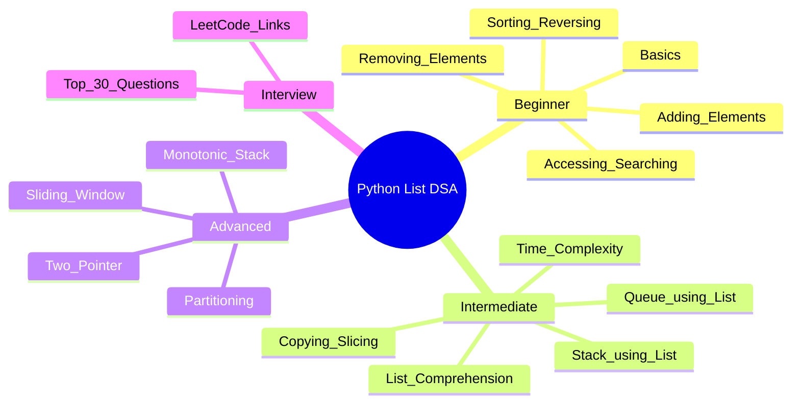

---

## 1. List Basics

```mermaid
flowchart LR
    classDef info fill:#3b82f6,stroke:#2563eb,color:#fff
    classDef action fill:#06b6d4,stroke:#0891b2,color:#fff

    A[Create List]:::info --> B[Homogeneous: nums = [1,2,3]]:::action
    A --> C[Heterogeneous: mix = [1, 'a', True]]:::action
    A --> D[Empty: lst = []]:::action
    A --> E[Using list(): list(range(5))]:::action
    B --> F[Index: 0-based]
    C --> F
    D --> F
    E --> F
    F --> G[Positive: 0 to n-1]
    F --> H[Negative: -1 to -n]
```

```python
nums = [10, 20, 30, 40, 50]
# Index:    0   1   2   3   4
# Negative:-5  -4  -3  -2  -1

print(nums[0])    # 10
print(nums[-1])   # 50
print(nums[-2])   # 40
```

| Operation | Code | Result |
|-----------|------|--------|
| Length | `len(nums)` | `5` |
| Check empty | `if not lst:` | `True` if empty |
| First element | `lst[0]` | — |
| Last element | `lst[-1]` | — |

---

## 2. Adding Elements — `append`, `extend`, `insert`

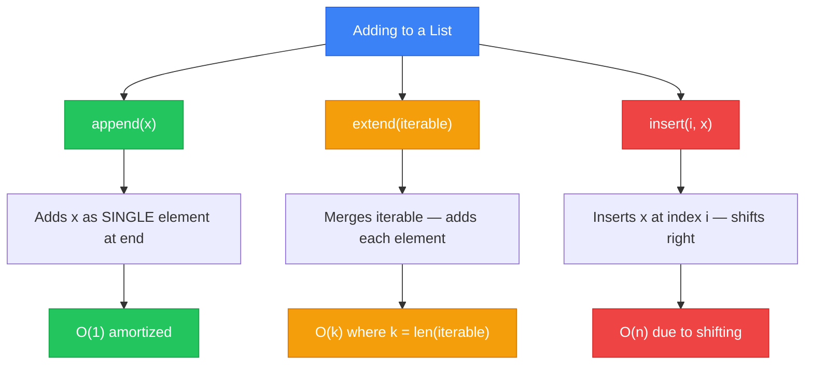

```python
nums = [1, 2, 3]

# append — adds one element
nums.append(4)           # [1, 2, 3, 4]
nums.append([5, 6])      # [1, 2, 3, 4, [5, 6]]  ← nested list!

# extend — merges iterable
nums = [1, 2, 3]
nums.extend([4, 5])      # [1, 2, 3, 4, 5]
nums.extend('hi')        # [1, 2, 3, 4, 5, 'h', 'i']

# insert — at specific index
nums = [1, 2, 4]
nums.insert(2, 3)        # [1, 2, 3, 4]
nums.insert(0, 0)        # [0, 1, 2, 3, 4]
nums.insert(10, 5)       # no error — appends: [0,1,2,3,4,5]
```

> 💡 **`append` vs `extend`** — `append(x)` adds `x` itself. `extend(iter)` adds each element.  
> 💡 `insert` is O(n) because elements shift right.

---

## 3. Removing Elements — `remove`, `pop`, `del`, `clear`

```mermaid
flowchart TD
    classDef slow fill:#ef4444,stroke:#dc2626,color:#fff
    classDef fast fill:#22c55e,stroke:#16a34a,color:#fff
    classDef info fill:#3b82f6,stroke:#2563eb,color:#fff

    START(( )):::info --> HasElements:::info
    HasElements --> REMOVE["remove(value)"]:::slow
    HasElements --> POP["pop(index)"]:::slow
    HasElements --> DEL["del lst[i]"]:::slow
    HasElements --> CLEAR["clear()"]:::slow
    REMOVE --> |removes FIRST match O(n)| HasElements
    POP --> |removes & returns element O(n)| HasElements
    DEL --> |removes by index / slice O(n)| HasElements
    CLEAR --> |"removes ALL O(n)"| Empty((Empty))
    Empty --> START
```

```python
nums = [10, 20, 30, 20, 40]

# remove — removes first occurrence of value
nums.remove(20)          # [10, 30, 20, 40]
# nums.remove(99)        # ValueError!

# pop — removes & returns by index (default last)
nums = [10, 20, 30, 40]
last = nums.pop()        # 40,  nums = [10, 20, 30]
second = nums.pop(1)     # 20,  nums = [10, 30]

# del — removes by index or slice
nums = [10, 20, 30, 40, 50]
del nums[1]              # [10, 30, 40, 50]
del nums[1:3]            # [10, 50]
del nums[:]              # [] — same as clear

# clear — removes all elements
nums.clear()             # []
```

| Method | Time | Returns | Notes |
|--------|------|---------|-------|
| `remove(x)` | O(n) | `None` | Raises `ValueError` if missing |
| `pop(i)` | O(n) | Removed item | O(1) if `i=-1` (last) |
| `del lst[i]` | O(n) | — | Can slice: `del lst[1:3]` |
| `clear()` | O(n) | `None` | Same as `lst[:] = []` |

---

## 4. Accessing & Searching — `index`, `count`, `in`

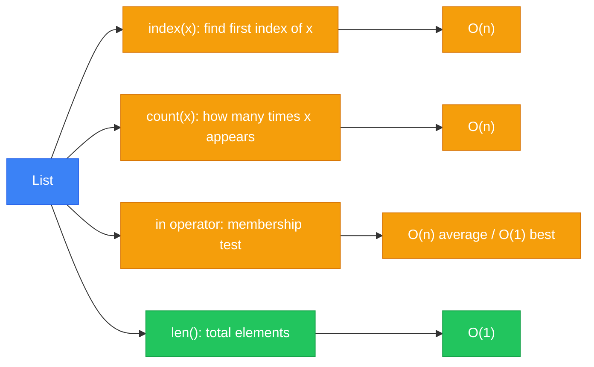

```python
nums = [10, 20, 30, 20, 40, 20]

# index — first index of value
nums.index(20)           # 1
nums.index(20, 2)        # 3  ← start searching from index 2
nums.index(20, 4)        # 5
# nums.index(99)         # ValueError!

# count — occurrences
nums.count(20)           # 3
nums.count(99)           # 0  ← no error

# in — membership (fastest for single check)
20 in nums               # True
99 in nums               # False

# len — total count
len(nums)                # 6
```

> 🔍 Use `in` for membership checks — it short-circuits on first match.  
> 🔍 Use `count()` over whole list only when you need the count, not just existence.

---

## 5. Sorting & Reversing — `sort`, `reverse`, `sorted`

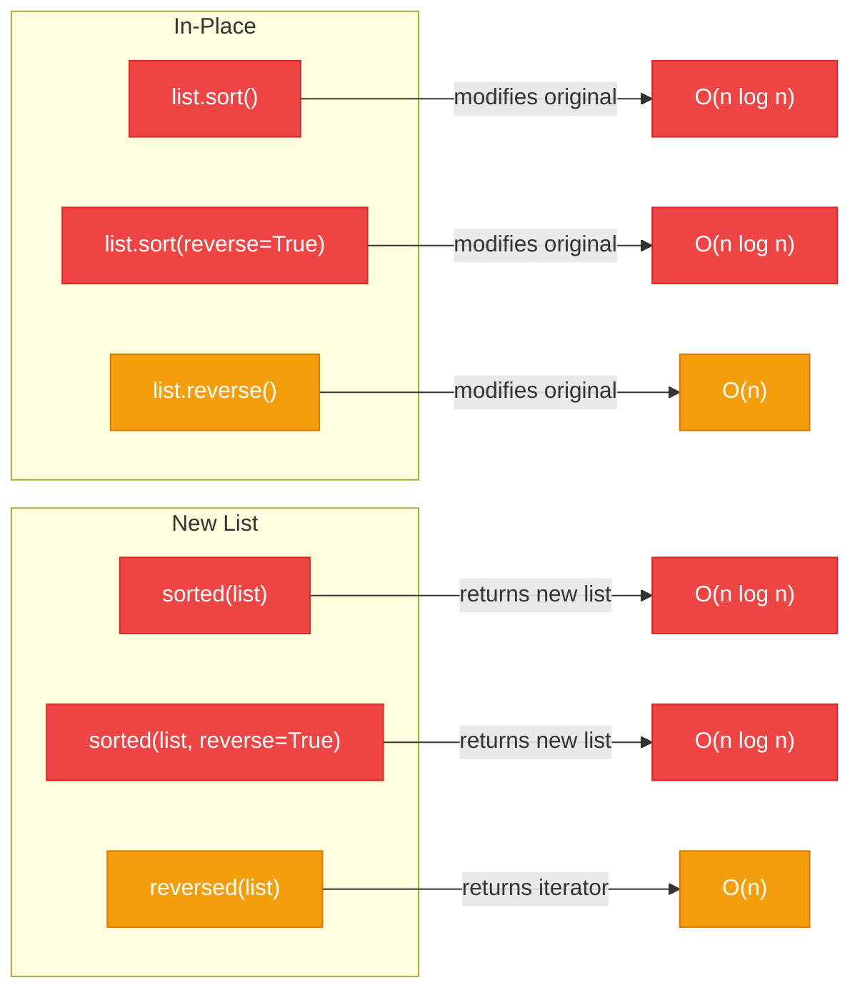

```python
nums = [3, 1, 4, 1, 5, 9, 2]

# sort — in-place, modifies original
nums.sort()              # [1, 1, 2, 3, 4, 5, 9]
nums.sort(reverse=True)  # [9, 5, 4, 3, 2, 1, 1]

# sorted — returns NEW sorted list, original unchanged
nums = [3, 1, 4]
sorted_nums = sorted(nums)           # [1, 3, 4]
sorted_desc = sorted(nums, reverse=True)  # [4, 3, 1]
print(nums)              # [3, 1, 4]  ← unchanged

# reverse — in-place reversal
nums.reverse()           # [4, 1, 3]

# reversed — returns iterator
list(reversed(nums))     # [3, 1, 4]
```

### Custom Sort with `key`

```python
words = ['banana', 'apple', 'cherry', 'date']

# Sort by length
words.sort(key=len)                      # ['date', 'apple', 'banana', 'cherry']

# Sort by last character
words.sort(key=lambda w: w[-1])          # ['banana', 'apple', 'date', 'cherry']

# Sort tuples by second element
pairs = [(1, 'z'), (2, 'a'), (3, 'm')]
pairs.sort(key=lambda x: x[1])           # [(2, 'a'), (3, 'm'), (1, 'z')]

# Multiple criteria: first by len, then alphabetically
words.sort(key=lambda w: (len(w), w))
```

> ⚡ `sort()` uses **Timsort** — O(n log n) worst-case, O(n) best-case (nearly sorted).  
> ⚡ `sorted()` works on ANY iterable; `sort()` is list-only.

---

## 6. Copying & Slicing — `copy`, `[:]`, `deepcopy`

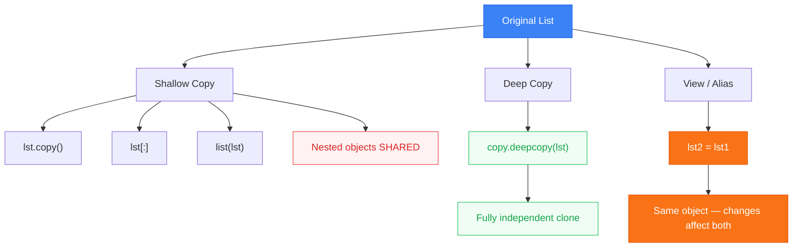

```python
# Reference / Alias — NOT a copy
a = [1, 2, [3, 4]]
b = a
b[0] = 99
print(a)               # [99, 2, [3, 4]]  ← a also changed!

# Shallow copies
a = [1, 2, [3, 4]]
b = a.copy()           # method 1
c = a[:]               # method 2 — slicing
d = list(a)            # method 3

b[0] = 99
print(a)               # [1, 2, [3, 4]]  ← unchanged (top-level)

b[2][0] = 88
print(a)               # [1, 2, [88, 4]]  ← nested STILL shared!

# Deep copy
import copy
a = [1, 2, [3, 4]]
b = copy.deepcopy(a)
b[2][0] = 77
print(a)               # [1, 2, [3, 4]]  ← fully independent
print(b)               # [1, 2, [77, 4]]
```

| Technique | Level | Use when |
|-----------|-------|----------|
| `b = a` | Alias | You want a reference |
| `copy()` / `[:]` / `list()` | Shallow | Flat list (ints, strings) |
| `deepcopy()` | Deep | Nested structures |

---

## 7. List Slicing — `[start:stop:step]`

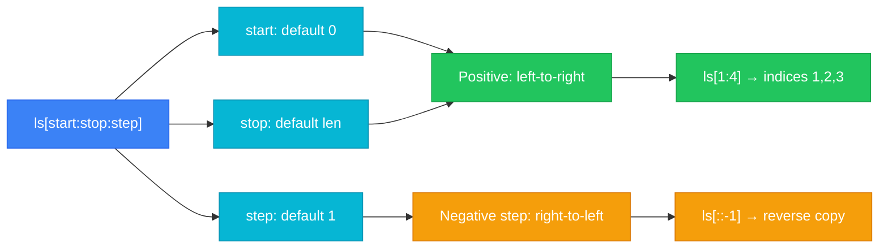

```python
nums = [0, 1, 2, 3, 4, 5, 6, 7, 8, 9]

# Basic slices
nums[2:5]               # [2, 3, 4]      indices 2,3,4 (stop exclusive)
nums[:4]                # [0, 1, 2, 3]   start = 0
nums[6:]                # [6, 7, 8, 9]   stop = end
nums[:]                 # [0..9]         full copy (shallow)

# Step
nums[::2]               # [0, 2, 4, 6, 8]    every 2nd
nums[1::2]              # [1, 3, 5, 7, 9]    odd indices
nums[::-1]              # [9, 8, 7, 6, 5, 4, 3, 2, 1, 0]  reverse

# Negative indices in slice
nums[-5:-2]             # [5, 6, 7]      from index -5 to -3
nums[-1::-1]            # [9, 8, ... 0]  reverse from end

# Slice assignment (modify in-place)
nums = [0, 1, 2, 3, 4]
nums[1:3] = [99, 100]    # [0, 99, 100, 3, 4]
nums[1:3] = []            # [0, 3, 4]    ← delete via slice
nums[0:0] = [42]          # [42, 0, 3, 4]  ← insert at start
nums[5:5] = [99]          # [42, 0, 3, 4, 99] ← insert at end
```

> 🔑 **Slice creates a NEW list** (shallow copy). O(k) where k = slice length.  
> 🔑 **Slice assignment** modifies in-place and can change list length.

---

## 8. List Comprehensions

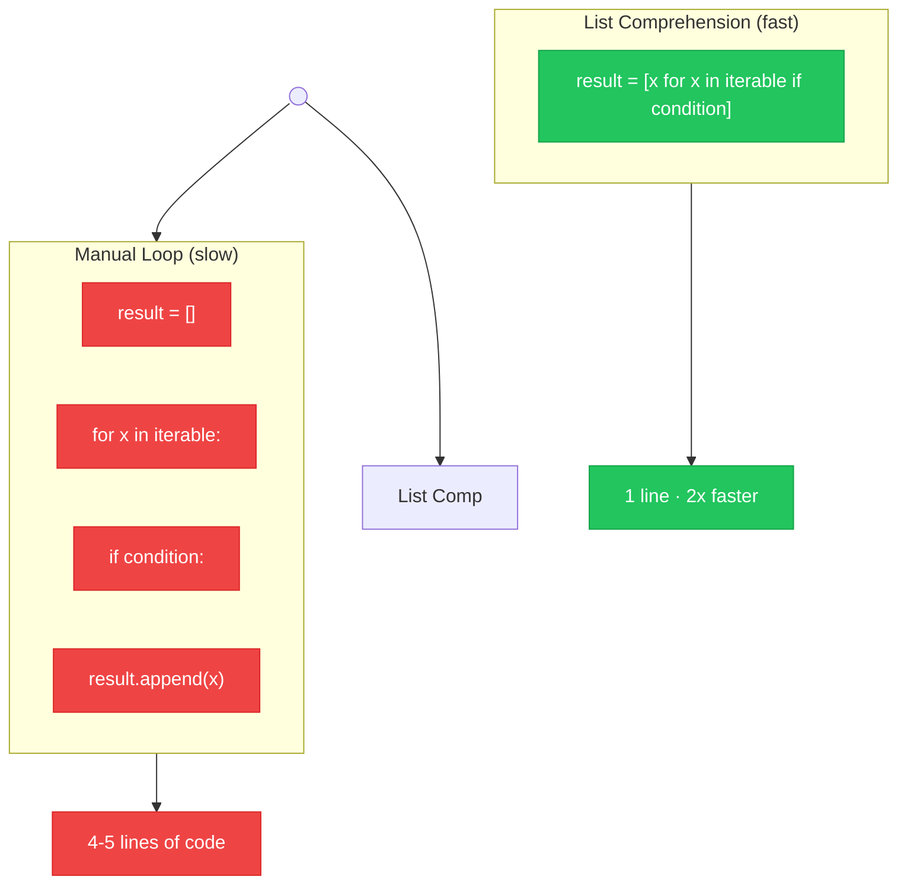

### Basic Patterns

```python
# Basic — square numbers
squares = [x**2 for x in range(10)]
# [0, 1, 4, 9, 16, 25, 36, 49, 64, 81]

# With condition — even squares
even_squares = [x**2 for x in range(10) if x % 2 == 0]
# [0, 4, 16, 36, 64]

# Nested loop — flatten matrix
matrix = [[1, 2], [3, 4], [5, 6]]
flat = [num for row in matrix for num in row]
# [1, 2, 3, 4, 5, 6]

# if-else (ternary in comprehension)
result = ['even' if x % 2 == 0 else 'odd' for x in range(5)]
# ['even', 'odd', 'even', 'odd', 'even']

# Enumerate in comprehension
pairs = [(i, v) for i, v in enumerate(['a', 'b', 'c'])]
# [(0, 'a'), (1, 'b'), (2, 'c')]

# Nested comprehension — matrix transpose
matrix = [[1, 2, 3], [4, 5, 6]]
transposed = [[row[i] for row in matrix] for i in range(3)]
# [[1, 4], [2, 5], [3, 6]]
```

### When NOT to use list comprehension

```python
# ❌ Complex logic — use for loop
# [f(g(h(x))) for x in data if p(x) and q(x) else default]  ← unreadable

# ❌ Side effects — use for loop
# [print(x) for x in data]  ← creates [None, None, ...]

# ✅ Simple transform + filter = perfect for comprehension
```

> ⚡ List comprehensions run at C speed — ~2x faster than manual `for` loops.  
> ⚡ Use generator expressions `(x for x in data)` for memory efficiency on large data.

---

## 9. Time Complexity — Big O for List Operations

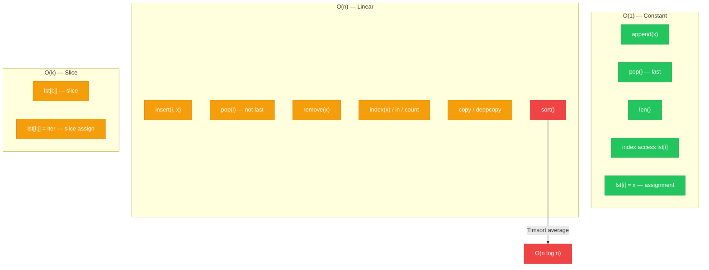

| Operation | Time | Notes |
|-----------|------|-------|
| `lst[i]` | **O(1)** | Direct index |
| `lst[i] = x` | **O(1)** | Assignment |
| `append(x)` | **O(1)** | Amortized |
| `pop()` | **O(1)** | Last element |
| `len(lst)` | **O(1)** | Stored attribute |
| `extend(k)` | **O(k)** | k = len(iterable) |
| `insert(i, x)` | **O(n)** | Shifts elements |
| `pop(i)` | **O(n)** | Shifts elements |
| `remove(x)` | **O(n)** | Search + shift |
| `index(x)` | **O(n)** | Linear search |
| `x in lst` | **O(n)** | Worst-case |
| `count(x)` | **O(n)** | Full traversal |
| `sort()` | **O(n log n)** | Timsort |
| `reverse()` | **O(n)** | In-place |
| `lst[:]` | **O(k)** | k = slice size |

---

## 10. Stack Using List (LIFO)

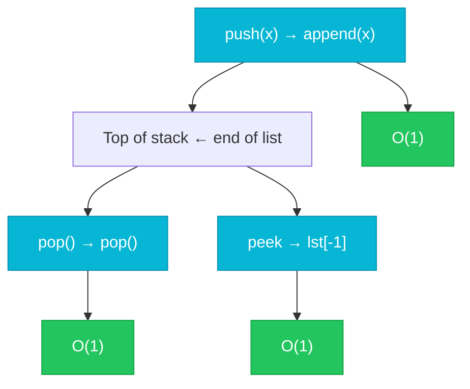

```python
# Stack = LIFO (Last In, First Out)
stack = []

# Push
stack.append('a')        # ['a']
stack.append('b')        # ['a', 'b']
stack.append('c')        # ['a', 'b', 'c']

# Pop
top = stack.pop()        # 'c',  stack = ['a', 'b']

# Peek
print(stack[-1])         # 'b'

# Is empty?
if not stack:
    print("empty")

# Size
len(stack)               # 2
```

> 🔥 **LeetCode:** [Valid Parentheses](https://leetcode.com/problems/valid-parentheses/) · [Min Stack](https://leetcode.com/problems/min-stack/) · [Daily Temperatures](https://leetcode.com/problems/daily-temperatures/)

---

## 11. Queue Using List (FIFO) — and why `deque` is better

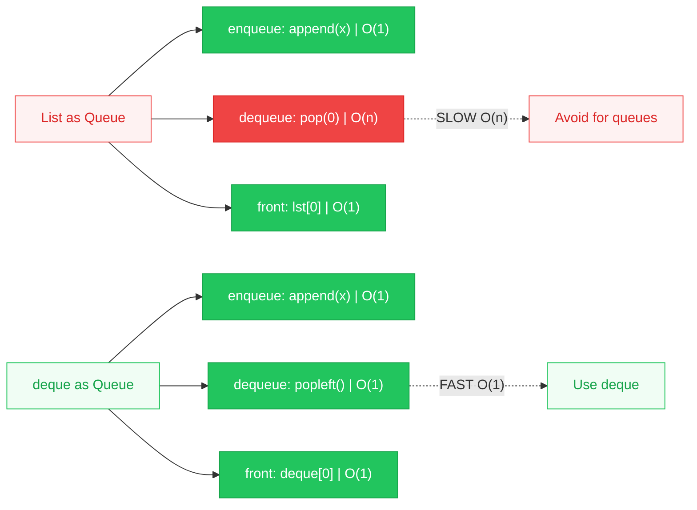

```python
# ❌ List as Queue — pop(0) is O(n)
queue = []
queue.append('a')         # enqueue — fine
queue.append('b')
front = queue.pop(0)      # 'a' — O(n)! shifts everything

# ✅ collections.deque — popleft() is O(1)
from collections import deque

queue = deque()
queue.append('a')          # enqueue           O(1)
queue.append('b')
front = queue.popleft()    # 'a'  — O(1)       O(1)
peek = queue[0]            # 'b'  — front peek  O(1)
```

> 🔥 **LeetCode:** [Number of Recent Calls](https://leetcode.com/problems/number-of-recent-calls/) · [Implement Queue using Stacks](https://leetcode.com/problems/implement-queue-using-stacks/)

---

## 12. Two Pointer Technique

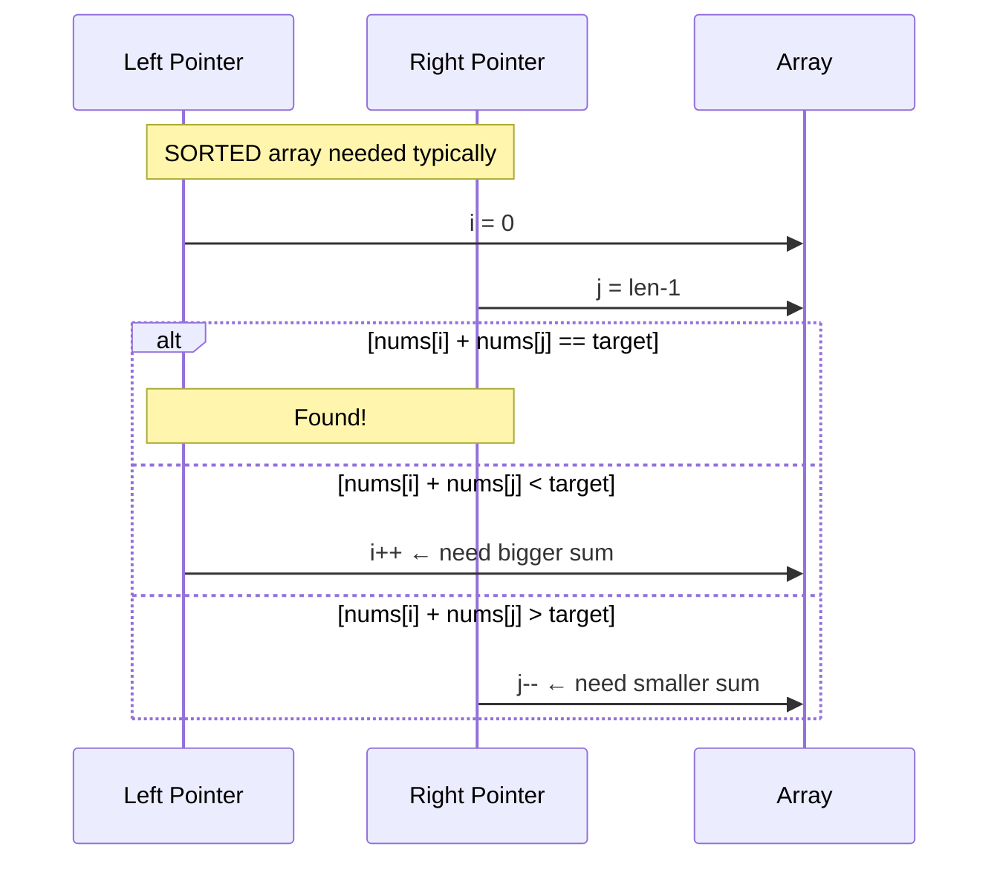

### Two Sum II (Sorted)

```python
def two_sum_sorted(nums, target):
    i, j = 0, len(nums) - 1
    while i < j:
        curr = nums[i] + nums[j]
        if curr == target:
            return [i, j]
        elif curr < target:
            i += 1
        else:
            j -= 1
    return [-1, -1]

# test
print(two_sum_sorted([2, 7, 11, 15], 9))  # [0, 1]
```

### Reverse in-place

```python
def reverse_list(lst):
    i, j = 0, len(lst) - 1
    while i < j:
        lst[i], lst[j] = lst[j], lst[i]
        i += 1
        j -= 1

nums = [1, 2, 3, 4, 5]
reverse_list(nums)
print(nums)  # [5, 4, 3, 2, 1]
```

> 🔥 **LeetCode:** [Two Sum II](https://leetcode.com/problems/two-sum-ii-input-array-is-sorted/) · [Container With Most Water](https://leetcode.com/problems/container-with-most-water/) · [3Sum](https://leetcode.com/problems/3sum/)

---

## 13. Sliding Window

> 🎯 **Goal:** Maintain a contiguous subarray (window) that slides over the array — avoids recomputing from scratch at each step.

### Fixed Window — How the window slides step by step

**Array:** `[1, 4, 2, 10, 2, 3, 1, 0, 20]`  **k = 4**

Each row shows one step. 🟩 Green = current window · ⬜ Gray = outside window

```mermaid
flowchart TD
    classDef cell fill:#e5e7eb,stroke:#9ca3af,color:#1f2937
    classDef win fill:#22c55e,stroke:#16a34a,color:#fff
    classDef idx fill:transparent,stroke:none,color:#9ca3af

    subgraph IROW["Array indices"]
        direction LR
        i0(0):::idx --> i1(1):::idx --> i2(2):::idx --> i3(3):::idx
        i3 --> i4(4):::idx --> i5(5):::idx --> i6(6):::idx --> i7(7):::idx --> i8(8):::idx
    end

    subgraph VROW["Array values"]
        direction LR
        v1[1] --> v2[4] --> v3[2] --> v4[10] --> v5[2] --> v6[3] --> v7[1] --> v8[0] --> v9[20]
    end

    subgraph S1["Step 1: window=[1,4,2,10]  sum=17"]
        direction LR
        a1[1]:::win --> a2[4]:::win --> a3[2]:::win --> a4[10]:::win
        a4 --> a5[2]:::cell --> a6[3]:::cell --> a7[1]:::cell --> a8[0]:::cell --> a9[20]:::cell
    end

    subgraph S2["Step 2: window=[4,2,10,2]  sum=18"]
        direction LR
        b1[1]:::cell --> b2[4]:::win --> b3[2]:::win --> b4[10]:::win
        b4 --> b5[2]:::win --> b6[3]:::cell --> b7[1]:::cell --> b8[0]:::cell --> b9[20]:::cell
    end

    subgraph S3["Step 3: window=[2,10,2,3]  sum=17"]
        direction LR
        c1[1]:::cell --> c2[4]:::cell --> c3[2]:::win --> c4[10]:::win
        c4 --> c5[2]:::win --> c6[3]:::win --> c7[1]:::cell --> c8[0]:::cell --> c9[20]:::cell
    end

    subgraph S4["Step 4: window=[10,2,3,1]  sum=16"]
        direction LR
        d1[1]:::cell --> d2[4]:::cell --> d3[2]:::cell --> d4[10]:::win
        d4 --> d5[2]:::win --> d6[3]:::win --> d7[1]:::win --> d8[0]:::cell --> d9[20]:::cell
    end

    subgraph S5["Step 5: window=[2,3,1,0]  sum=6"]
        direction LR
        e1[1]:::cell --> e2[4]:::cell --> e3[2]:::cell --> e4[10]:::cell
        e4 --> e5[2]:::win --> e6[3]:::win --> e7[1]:::win --> e8[0]:::win --> e9[20]:::cell
    end

    subgraph S6["Step 6: window=[3,1,0,20]  sum=24 ← MAX"]
        direction LR
        f1[1]:::cell --> f2[4]:::cell --> f3[2]:::cell --> f4[10]:::cell
        f4 --> f5[2]:::cell --> f6[3]:::win --> f7[1]:::win --> f8[0]:::win --> f9[20]:::win
    end
```

### Fixed Window — Max sum of k elements

```python
def max_sum_fixed(nums, k):
    window_sum = sum(nums[:k])
    max_sum = window_sum

    for i in range(k, len(nums)):
        window_sum += nums[i] - nums[i - k]
        max_sum = max(max_sum, window_sum)

    return max_sum

print(max_sum_fixed([1, 4, 2, 10, 2, 3, 1, 0, 20], 4))  # 24
```

### Variable Window — Smallest subarray with sum ≥ target

**Array:** `[2, 3, 1, 2, 4, 3]`  **target = 7**

🟩 Green = current window · 🟡 Yellow = newly added element · ⬜ Gray = outside


```python
def smallest_subarray(nums, target):
    start, window_sum = 0, 0
    min_len = float('inf')

    for end in range(len(nums)):
        window_sum += nums[end]

        while window_sum >= target:
            min_len = min(min_len, end - start + 1)
            window_sum -= nums[start]
            start += 1

    return min_len if min_len != float('inf') else 0

print(smallest_subarray([2, 3, 1, 2, 4, 3], 7))  # 2  → [4, 3]
```

> 🔥 **LeetCode:** [Maximum Subarray](https://leetcode.com/problems/maximum-subarray/) · [Longest Substring Without Repeating Characters](https://leetcode.com/problems/longest-substring-without-repeating-characters/) · [Minimum Window Substring](https://leetcode.com/problems/minimum-window-substring/)

---

## 14. Advanced List Patterns

### 14a. Monotonic Stack

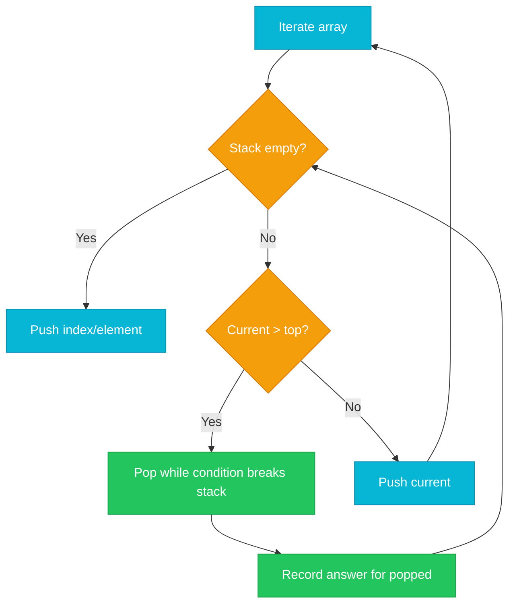

```python
# Next Greater Element — monotonic decreasing stack
def next_greater_elements(nums):
    result = [-1] * len(nums)
    stack = []

    for i in range(len(nums)):
        while stack and nums[stack[-1]] < nums[i]:
            idx = stack.pop()
            result[idx] = nums[i]
        stack.append(i)

    return result

print(next_greater_elements([2, 1, 2, 4, 3]))
# [4, 2, 4, -1, -1]
```

> 🔥 **LeetCode:** [Next Greater Element I](https://leetcode.com/problems/next-greater-element-i/) · [Daily Temperatures](https://leetcode.com/problems/daily-temperatures/)

### 14b. Prefix Sum

```python
# Build prefix sum once, answer range sum queries in O(1)
nums = [1, 2, 3, 4, 5]
prefix = [0]
for n in nums:
    prefix.append(prefix[-1] + n)

# sum of nums[1:4] (2+3+4)
print(prefix[4] - prefix[1])  # 9
```

> 🔥 **LeetCode:** [Range Sum Query](https://leetcode.com/problems/range-sum-query-immutable/) · [Subarray Sum Equals K](https://leetcode.com/problems/subarray-sum-equals-k/)

### 14c. Partitioning (Dutch National Flag)

```python
# Sort 0s, 1s, 2s in-place — O(n), O(1) space
def sort_colors(nums):
    low, mid, high = 0, 0, len(nums) - 1

    while mid <= high:
        if nums[mid] == 0:
            nums[low], nums[mid] = nums[mid], nums[low]
            low += 1
            mid += 1
        elif nums[mid] == 1:
            mid += 1
        else:  # 2
            nums[mid], nums[high] = nums[high], nums[mid]
            high -= 1

nums = [2, 0, 2, 1, 1, 0]
sort_colors(nums)
print(nums)  # [0, 0, 1, 1, 2, 2]
```

> 🔥 **LeetCode:** [Sort Colors](https://leetcode.com/problems/sort-colors/)

---

## 15. Most Asked Interview Questions

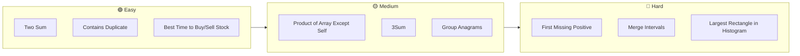

| # | Problem | Difficulty | Pattern | LeetCode |
|---|---------|-----------|---------|----------|
| 1 | **Two Sum** | 🟢 Easy | HashMap + List | [Link](https://leetcode.com/problems/two-sum/) |
| 2 | **Contains Duplicate** | 🟢 Easy | Set / Sort | [Link](https://leetcode.com/problems/contains-duplicate/) |
| 3 | **Best Time to Buy/Sell Stock** | 🟢 Easy | Kadane / Sliding | [Link](https://leetcode.com/problems/best-time-to-buy-and-sell-stock/) |
| 4 | **Remove Duplicates from Sorted Array** | 🟢 Easy | Two Pointer | [Link](https://leetcode.com/problems/remove-duplicates-from-sorted-array/) |
| 5 | **Move Zeroes** | 🟢 Easy | Two Pointer | [Link](https://leetcode.com/problems/move-zeroes/) |
| 6 | **Intersection of Two Arrays II** | 🟢 Easy | Two Pointer / Dict | [Link](https://leetcode.com/problems/intersection-of-two-arrays-ii/) |
| 7 | **Valid Anagram** | 🟢 Easy | Counting | [Link](https://leetcode.com/problems/valid-anagram/) |
| 8 | **Maximum Subarray** | 🟡 Medium | Kadane / Sliding | [Link](https://leetcode.com/problems/maximum-subarray/) |
| 9 | **Product of Array Except Self** | 🟡 Medium | Prefix/Suffix | [Link](https://leetcode.com/problems/product-of-array-except-self/) |
| 10 | **3Sum** | 🟡 Medium | Two Pointer | [Link](https://leetcode.com/problems/3sum/) |
| 11 | **Group Anagrams** | 🟡 Medium | Sorting / Map | [Link](https://leetcode.com/problems/group-anagrams/) |
| 12 | **Longest Substring Without Repeating** | 🟡 Medium | Sliding Window | [Link](https://leetcode.com/problems/longest-substring-without-repeating-characters/) |
| 13 | **Find All Duplicates in Array** | 🟡 Medium | Cyclic Sort / Negation | [Link](https://leetcode.com/problems/find-all-duplicates-in-an-array/) |
| 14 | **Subarray Sum Equals K** | 🟡 Medium | Prefix Sum | [Link](https://leetcode.com/problems/subarray-sum-equals-k/) |
| 15 | **Sort Colors** | 🟡 Medium | Dutch Flag | [Link](https://leetcode.com/problems/sort-colors/) |
| 16 | **Container With Most Water** | 🟡 Medium | Two Pointer | [Link](https://leetcode.com/problems/container-with-most-water/) |
| 17 | **Daily Temperatures** | 🟡 Medium | Monotonic Stack | [Link](https://leetcode.com/problems/daily-temperatures/) |
| 18 | **Valid Parentheses** | 🟡 Medium | Stack | [Link](https://leetcode.com/problems/valid-parentheses/) |
| 19 | **Find Minimum in Rotated Sorted Array** | 🟡 Medium | Binary Search | [Link](https://leetcode.com/problems/find-minimum-in-rotated-sorted-array/) |
| 20 | **Top K Frequent Elements** | 🟡 Medium | Heap / Bucket | [Link](https://leetcode.com/problems/top-k-frequent-elements/) |
| 21 | **Kth Largest Element in an Array** | 🟡 Medium | QuickSelect / Heap | [Link](https://leetcode.com/problems/kth-largest-element-in-an-array/) |
| 22 | **Rotate Array** | 🟡 Medium | Reverse | [Link](https://leetcode.com/problems/rotate-array/) |
| 23 | **Find First and Last Position** | 🟡 Medium | Binary Search | [Link](https://leetcode.com/problems/find-first-and-last-position-of-element-in-sorted-array/) |
| 24 | **Minimum Window Substring** | 🔴 Hard | Sliding Window | [Link](https://leetcode.com/problems/minimum-window-substring/) |
| 25 | **Largest Rectangle in Histogram** | 🔴 Hard | Monotonic Stack | [Link](https://leetcode.com/problems/largest-rectangle-in-histogram/) |
| 26 | **First Missing Positive** | 🔴 Hard | Cyclic Sort | [Link](https://leetcode.com/problems/first-missing-positive/) |
| 27 | **Merge Intervals** | 🟡 Medium | Sort + Merge | [Link](https://leetcode.com/problems/merge-intervals/) |
| 28 | **Set Matrix Zeroes** | 🟡 Medium | In-place | [Link](https://leetcode.com/problems/set-matrix-zeroes/) |
| 29 | **Spiral Matrix** | 🟡 Medium | Simulation | [Link](https://leetcode.com/problems/spiral-matrix/) |
| 30 | **Next Permutation** | 🟡 Medium | Reverse + Swap | [Link](https://leetcode.com/problems/next-permutation/) |

---

## 16. Learning Path (By Difficulty)

```mermaid
flowchart LR
    classDef beginner fill:#22c55e,stroke:#16a34a,color:#fff
    classDef core fill:#3b82f6,stroke:#2563eb,color:#fff
    classDef intermediate fill:#f59e0b,stroke:#d97706,color:#fff
    classDef advanced fill:#8b5cf6,stroke:#7c3aed,color:#fff

    subgraph WEEK1[Week 1-2: Foundation]
        direction LR
        A1[Create / Access / Index]:::beginner --> A2[append / extend / insert]:::beginner
        A2 --> A3[remove / pop / del / clear]:::beginner
        A3 --> A4[Slicing]:::beginner
    end

    subgraph WEEK3[Week 3-4: Core Patterns]
        direction LR
        B1[List Comprehension]:::core --> B2[sort / sorted / reverse]:::core
        B2 --> B3[Stack using List]:::core
        B3 --> B4[Prefix Sum]:::core
    end

    subgraph WEEK5[Week 5-6: Intermediate]
        direction LR
        C1[Two Pointer]:::intermediate --> C2[Sliding Window Fixed]:::intermediate
        C2 --> C3[Sliding Window Variable]:::intermediate
        C3 --> C4[Queue using deque]:::intermediate
    end

    subgraph WEEK7[Week 7-8: Advanced]
        direction LR
        D1[Monotonic Stack]:::advanced --> D2[Partitioning / Dutch Flag]:::advanced
        D2 --> D3[Cyclic Sort]:::advanced
        D3 --> D4[In-place Manipulation]:::advanced
    end

    WEEK1 --> WEEK3 --> WEEK5 --> WEEK7
```

---

## Quick Reference — All List Methods

```python
# ┌──────────────┬────────────────────────────────────┬──────────┐
# │ Method       │ Description                        │ Time     │
# ├──────────────┼────────────────────────────────────┼──────────┤
# │ append(x)    │ Adds x as one element at end       │ O(1)*    │
# │ extend(iter) │ Merges iterable into list          │ O(k)     │
# │ insert(i,x)  │ Inserts x at index i               │ O(n)     │
# │ remove(x)    │ Removes first x                    │ O(n)     │
# │ pop(i)       │ Removes & returns at index i       │ O(n)     │
# │ clear()      │ Removes all elements               │ O(n)     │
# │ index(x)     │ Returns first index of x           │ O(n)     │
# │ count(x)     │ Returns occurrences of x           │ O(n)     │
# │ sort()       │ Sorts in-place (Timsort)           │ O(nlogn) │
# │ reverse()    │ Reverses in-place                  │ O(n)     │
# │ copy()       │ Returns shallow copy               │ O(n)     │
# └──────────────┴────────────────────────────────────┴──────────┘
```

## Common Pitfalls — Quick Reminders

| Pitfall | Why | Fix |
|---------|-----|-----|
| `list = list` | Shadows built-in | Use `lst` or `arr` |
| `remove` in loop | Skips elements | Iterate over copy: `for x in lst[:]` |
| `pop(0)` for queue | O(n) per pop | Use `collections.deque` |
| `append` vs `extend` | Nested vs flat | Know the difference |
| Modifying while iterating | Unexpected behavior | Iterate over copy |
| `==` vs `is` | Value vs identity | `==` checks values |
| Mutable default arg | Shared across calls | Use `None` + initialize inside |

> `append([x])` adds a nested list. `extend([x])` adds x as element.

---

## 17. Interview Questions — Problem, Input, Output

### 17.1 Two Sum

```python
def two_sum(nums, target):
    """Return indices of two numbers that add up to target."""
    seen = {}
    for i, n in enumerate(nums):
        complement = target - n
        if complement in seen:
            return [seen[complement], i]
        seen[n] = i
    return []
```

| Input | Target | Output |
|-------|--------|--------|
| `[2, 7, 11, 15]` | `9` | `[0, 1]` |
| `[3, 2, 4]` | `6` | `[1, 2]` |
| `[3, 3]` | `6` | `[0, 1]` |

### 17.2 Contains Duplicate

```python
def contains_duplicate(nums):
    """Return True if any value appears at least twice."""
    return len(nums) != len(set(nums))
```

| Input | Output |
|-------|--------|
| `[1, 2, 3, 1]` | `True` |
| `[1, 2, 3, 4]` | `False` |
| `[1, 1, 1, 3, 3, 4, 3, 2, 4, 2]` | `True` |

### 17.3 Best Time to Buy and Sell Stock

```python
def max_profit(prices):
    """Return max profit from one buy and one sell."""
    min_price = float('inf')
    max_profit = 0
    for p in prices:
        if p < min_price:
            min_price = p
        elif p - min_price > max_profit:
            max_profit = p - min_price
    return max_profit
```

| Input | Output |
|-------|--------|
| `[7, 1, 5, 3, 6, 4]` | `5` |
| `[7, 6, 4, 3, 1]` | `0` |
| `[2, 4, 1]` | `2` |

### 17.4 Product of Array Except Self

```python
def product_except_self(nums):
    """Return array where output[i] = product of all except nums[i]."""
    n = len(nums)
    result = [1] * n
    prefix = 1
    for i in range(n):
        result[i] = prefix
        prefix *= nums[i]
    suffix = 1
    for i in range(n - 1, -1, -1):
        result[i] *= suffix
        suffix *= nums[i]
    return result
```

| Input | Output |
|-------|--------|
| `[1, 2, 3, 4]` | `[24, 12, 8, 6]` |
| `[-1, 1, 0, -3, 3]` | `[0, 0, 9, 0, 0]` |

### 17.5 Maximum Subarray (Kadane's Algorithm)

```python
def max_subarray(nums):
    """Return contiguous subarray with largest sum."""
    max_ending = max_so_far = nums[0]
    for n in nums[1:]:
        max_ending = max(n, max_ending + n)
        max_so_far = max(max_so_far, max_ending)
    return max_so_far
```

| Input | Output |
|-------|--------|
| `[-2, 1, -3, 4, -1, 2, 1, -5, 4]` | `6` |
| `[1]` | `1` |
| `[5, 4, -1, 7, 8]` | `23` |

### 17.6 3Sum

```python
def three_sum(nums):
    """Return all triplets that sum to zero."""
    nums.sort()
    result = []
    n = len(nums)
    for i in range(n - 2):
        if i > 0 and nums[i] == nums[i - 1]:
            continue
        l, r = i + 1, n - 1
        while l < r:
            s = nums[i] + nums[l] + nums[r]
            if s < 0:
                l += 1
            elif s > 0:
                r -= 1
            else:
                result.append([nums[i], nums[l], nums[r]])
                while l < r and nums[l] == nums[l + 1]:
                    l += 1
                while l < r and nums[r] == nums[r - 1]:
                    r -= 1
                l += 1
                r -= 1
    return result
```

| Input | Output |
|-------|--------|
| `[-1, 0, 1, 2, -1, -4]` | `[[-1, -1, 2], [-1, 0, 1]]` |
| `[0, 1, 1]` | `[]` |
| `[0, 0, 0]` | `[[0, 0, 0]]` |

### 17.7 Merge Intervals

```python
def merge_intervals(intervals):
    """Return merged intervals for overlapping ones."""
    intervals.sort(key=lambda x: x[0])
    merged = [intervals[0]]
    for s, e in intervals[1:]:
        if s <= merged[-1][1]:
            merged[-1][1] = max(merged[-1][1], e)
        else:
            merged.append([s, e])
    return merged
```

| Input | Output |
|-------|--------|
| `[[1,3],[2,6],[8,10],[15,18]]` | `[[1,6],[8,10],[15,18]]` |
| `[[1,4],[4,5]]` | `[[1,5]]` |
| `[[1,4],[2,3]]` | `[[1,4]]` |

### 17.8 Valid Parentheses

```python
def is_valid(s):
    """Return True if brackets are properly closed and nested."""
    pairs = {')': '(', '}': '{', ']': '['}
    stack = []
    for ch in s:
        if ch in pairs:
            if not stack or stack.pop() != pairs[ch]:
                return False
        else:
            stack.append(ch)
    return not stack
```

| Input | Output |
|-------|--------|
| `"()"` | `True` |
| `"()[]{}"` | `True` |
| `"(]"` | `False` |
| `"([)]"` | `False` |
| `"{[]}"` | `True` |

### 17.9 Longest Substring Without Repeating Characters

```python
def length_of_longest_substring(s):
    """Return length of longest substring without repeating chars."""
    seen = {}
    start = max_len = 0
    for i, ch in enumerate(s):
        if ch in seen and seen[ch] >= start:
            start = seen[ch] + 1
        seen[ch] = i
        max_len = max(max_len, i - start + 1)
    return max_len
```

| Input | Output |
|-------|--------|
| `"abcabcbb"` | `3` |
| `"bbbbb"` | `1` |
| `"pwwkew"` | `3` |
| `""` | `0` |

### 17.10 Sort Colors (Dutch National Flag)

```python
def sort_colors(nums):
    """Sort 0s, 1s, 2s in-place."""
    low = mid = 0
    high = len(nums) - 1
    while mid <= high:
        if nums[mid] == 0:
            nums[low], nums[mid] = nums[mid], nums[low]
            low += 1
            mid += 1
        elif nums[mid] == 1:
            mid += 1
        else:
            nums[mid], nums[high] = nums[high], nums[mid]
            high -= 1
    return nums
```

| Input | Output |
|-------|--------|
| `[2, 0, 2, 1, 1, 0]` | `[0, 0, 1, 1, 2, 2]` |
| `[2, 0, 1]` | `[0, 1, 2]` |

### 17.11 First Missing Positive

```python
def first_missing_positive(nums):
    """Return smallest missing positive integer."""
    n = len(nums)
    for i in range(n):
        while 1 <= nums[i] <= n and nums[nums[i] - 1] != nums[i]:
            nums[nums[i] - 1], nums[i] = nums[i], nums[nums[i] - 1]
    for i in range(n):
        if nums[i] != i + 1:
            return i + 1
    return n + 1
```

| Input | Output |
|-------|--------|
| `[1, 2, 0]` | `3` |
| `[3, 4, -1, 1]` | `2` |
| `[7, 8, 9, 11, 12]` | `1` |

### 17.12 Rotate Array

```python
def rotate(nums, k):
    """Rotate array right by k steps in-place."""
    n = len(nums)
    k %= n
    nums.reverse()
    nums[:k] = reversed(nums[:k])
    nums[k:] = reversed(nums[k:])
    return nums
```

| Input | k | Output |
|-------|---|--------|
| `[1, 2, 3, 4, 5, 6, 7]` | `3` | `[5, 6, 7, 1, 2, 3, 4]` |
| `[-1, -100, 3, 99]` | `2` | `[3, 99, -1, -100]` |

### 17.13 Move Zeroes

```python
def move_zeroes(nums):
    """Move all 0s to end preserving relative order of non-zero."""
    pos = 0
    for i in range(len(nums)):
        if nums[i] != 0:
            nums[pos], nums[i] = nums[i], nums[pos]
            pos += 1
    return nums
```

| Input | Output |
|-------|--------|
| `[0, 1, 0, 3, 12]` | `[1, 3, 12, 0, 0]` |
| `[0]` | `[0]` |

### 17.14 Find All Duplicates in Array

```python
def find_duplicates(nums):
    """Return list of integers that appear twice."""
    result = []
    for n in nums:
        idx = abs(n) - 1
        if nums[idx] < 0:
            result.append(abs(n))
        nums[idx] = -nums[idx]
    return result
```

| Input | Output |
|-------|--------|
| `[4, 3, 2, 7, 8, 2, 3, 1]` | `[2, 3]` |
| `[1, 1, 2]` | `[1]` |
| `[1]` | `[]` |

### 17.15 Container With Most Water

```python
def max_area(height):
    """Return max water area between two lines."""
    l, r = 0, len(height) - 1
    max_area = 0
    while l < r:
        h = min(height[l], height[r])
        max_area = max(max_area, h * (r - l))
        if height[l] < height[r]:
            l += 1
        else:
            r -= 1
    return max_area
```

| Input | Output |
|-------|--------|
| `[1, 8, 6, 2, 5, 4, 8, 3, 7]` | `49` |
| `[1, 1]` | `1` |

### 17.16 Next Permutation

```python
def next_permutation(nums):
    """Modify nums to next lexicographically greater permutation."""
    i = len(nums) - 2
    while i >= 0 and nums[i] >= nums[i + 1]:
        i -= 1
    if i >= 0:
        j = len(nums) - 1
        while nums[j] <= nums[i]:
            j -= 1
        nums[i], nums[j] = nums[j], nums[i]
    l, r = i + 1, len(nums) - 1
    while l < r:
        nums[l], nums[r] = nums[r], nums[l]
        l += 1
        r -= 1
    return nums
```

| Input | Output |
|-------|--------|
| `[1, 2, 3]` | `[1, 3, 2]` |
| `[3, 2, 1]` | `[1, 2, 3]` |
| `[1, 1, 5]` | `[1, 5, 1]` |

### 17.17 Group Anagrams

```python
def group_anagrams(strs):
    """Group anagrams together."""
    from collections import defaultdict
    groups = defaultdict(list)
    for s in strs:
        key = ''.join(sorted(s))
        groups[key].append(s)
    return list(groups.values())
```

| Input | Output |
|-------|--------|
| `["eat","tea","tan","ate","nat","bat"]` | `[["bat"],["nat","tan"],["ate","eat","tea"]]` |
| `[""]` | `[[""]]` |
| `["a"]` | `[["a"]]` |

### 17.18 Subarray Sum Equals K

```python
def subarray_sum(nums, k):
    """Return number of subarrays summing to k."""
    count = prefix = 0
    seen = {0: 1}
    for n in nums:
        prefix += n
        count += seen.get(prefix - k, 0)
        seen[prefix] = seen.get(prefix, 0) + 1
    return count
```

| Input | k | Output |
|-------|---|--------|
| `[1, 1, 1]` | `2` | `2` |
| `[1, 2, 3]` | `3` | `2` |
| `[-1, -1, 1]` | `0` | `1` |

### 17.19 Set Matrix Zeroes

```python
def set_zeroes(matrix):
    """Set entire row/column to 0 if element is 0 (in-place)."""
    m, n = len(matrix), len(matrix[0])
    first_row = any(matrix[0][j] == 0 for j in range(n))
    first_col = any(matrix[i][0] == 0 for i in range(m))
    for i in range(1, m):
        for j in range(1, n):
            if matrix[i][j] == 0:
                matrix[i][0] = matrix[0][j] = 0
    for i in range(1, m):
        for j in range(1, n):
            if matrix[i][0] == 0 or matrix[0][j] == 0:
                matrix[i][j] = 0
    if first_row:
        for j in range(n):
            matrix[0][j] = 0
    if first_col:
        for i in range(m):
            matrix[i][0] = 0
    return matrix
```

| Input | Output |
|-------|--------|
| `[[1,1,1],[1,0,1],[1,1,1]]` | `[[1,0,1],[0,0,0],[1,0,1]]` |
| `[[0,1,2,0],[3,4,5,2],[1,3,1,5]]` | `[[0,0,0,0],[0,4,5,0],[0,3,1,0]]` |

### 17.20 Daily Temperatures

```python
def daily_temperatures(temperatures):
    """Return days until warmer temperature for each day."""
    n = len(temperatures)
    result = [0] * n
    stack = []
    for i in range(n):
        while stack and temperatures[i] > temperatures[stack[-1]]:
            idx = stack.pop()
            result[idx] = i - idx
        stack.append(i)
    return result
```

| Input | Output |
|-------|--------|
| `[73,74,75,71,69,72,76,73]` | `[1,1,4,2,1,1,0,0]` |
| `[30,40,50,60]` | `[1,1,1,0]` |
| `[30,60,90]` | `[1,1,0]` |

---

*Happy Coding! 🐍*
