# Python Loops & Conditionals — Complete DSA Notes

> **Target:** Beginner → Advanced · All Loop Types · Mermaid Diagrams · Interview Questions

---

## Author

| | |
|---|---|
| **Tamilselvan** | Data Scientist & AI Engineer |
| **LinkedIn** | [https://www.linkedin.com/in/tamilselvan-ai/](https://www.linkedin.com/in/tamilselvan-ai/) |

---

```mermaid
mindmap
  root((Python Loops))
    Conditionals
      if
      if-else
      if-elif-else
      Ternary
    For Loops
      range()
      Iterables
      enumerate
      zip
    While Loops
      while
      while True
      while not
    Control
      break
      continue
      pass
      else clause
    Advanced
      Nested Loops
      List Comp
      Iterators
      Generators
    Interview
      Top 20 Problems
      Complexity
```

---

## 1. If-Elif-Else — Conditional Branching

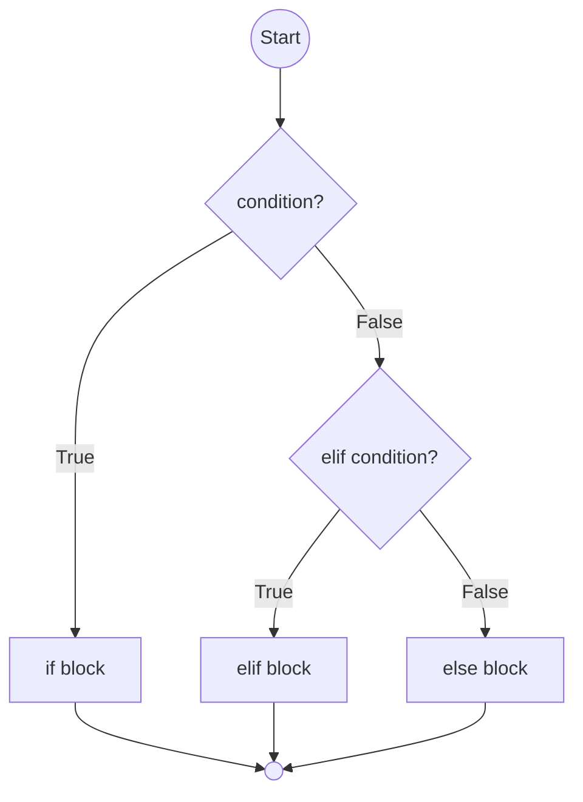

```python
x = 10

# Basic if
if x > 5:
    print("x is greater than 5")

# if-else
if x % 2 == 0:
    print("Even")
else:
    print("Odd")

# if-elif-else
if x < 0:
    print("Negative")
elif x == 0:
    print("Zero")
else:
    print("Positive")

# Ternary conditional
status = "Even" if x % 2 == 0 else "Odd"
```

| Concept | Syntax | Example |
|---------|--------|---------|
| if | `if cond:` | `if x > 0:` |
| if-else | `if cond: else:` | `if x > 0: else:` |
| if-elif-else | `if cond: elif cond: else:` | `if x > 0: elif x == 0: else:` |
| Ternary | `val if cond else val` | `"even" if x % 2 == 0 else "odd"` |
| Nested conditional | `if cond: if cond:` | `if x > 0: if x > 10:` |

> **Short-circuit:** `and` / `or` stop evaluating once result is known. `False and ...` stops. `True or ...` stops.

---

## 2. For Loops — Iteration over sequences

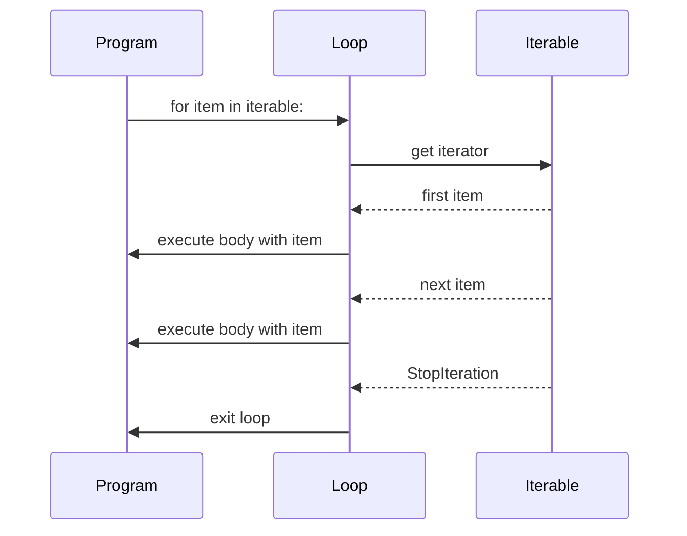

```python
# For loop with range
for i in range(5):           # 0, 1, 2, 3, 4
    print(i)

for i in range(2, 8):        # 2, 3, 4, 5, 6, 7
    print(i)

for i in range(0, 10, 2):    # 0, 2, 4, 6, 8
    print(i)

# For loop over list
fruits = ["apple", "banana", "cherry"]
for fruit in fruits:
    print(fruit)

# For loop over string
for ch in "hello":
    print(ch)

# For loop over dictionary
d = {"a": 1, "b": 2}
for key in d:                # keys
for val in d.values():       # values
for k, v in d.items():       # key-value pairs
```

| `range(start, stop, step)` | Output |
|---------------------------|--------|
| `range(5)` | `0, 1, 2, 3, 4` |
| `range(2, 5)` | `2, 3, 4` |
| `range(0, 10, 3)` | `0, 3, 6, 9` |
| `range(5, 0, -1)` | `5, 4, 3, 2, 1` |
| `range(5, -1, -1)` | `5, 4, 3, 2, 1, 0` |

> `range()` is lazy — returns an iterator, not a list, in Python 3. Use `list(range(n))` if you need the list.

---

## 3. While Loops — Condition-based iteration

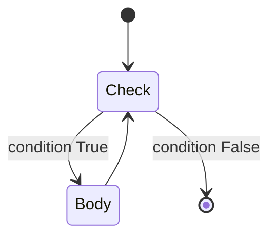

```python
# Basic while
i = 0
while i < 5:
    print(i)
    i += 1

# While with counter
count = 10
while count > 0:
    print(count)
    count -= 1

# While with sentinel value
data = ""
while data != "quit":
    data = input("Enter command: ")
    print(f"Got: {data}")
```

| Pattern | Use Case |
|---------|----------|
| `while condition:` | Unknown iterations, input loop |
| `while True:` | Event loop, server |
| `while not done:` | Flag-based exit |
| `while len(lst) > 0:` | Process until empty |

### 3a. While True — Infinite Loop with break

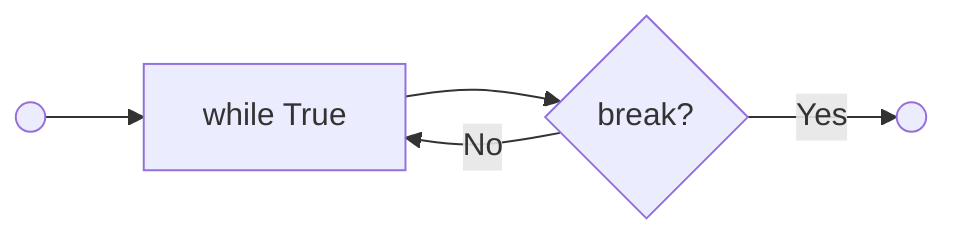

```python
# Infinite loop with break condition
while True:
    cmd = input("> ")
    if cmd == "quit":
        break
    if cmd == "":
        continue
    print(f"Echo: {cmd}")
```

> **Always** ensure a `break` path in `while True` loops or you will hang your program.

### 3b. While Not — Loop until condition is met

```python
# while not — run until falsy becomes truthy
done = False
while not done:
    result = process()
    done = result.is_complete()

# Wait for flag
flag = False
while not flag:
    flag = check_external_signal()
    time.sleep(0.1)
```

---

## 4. Loop Control — `break`, `continue`, `pass`

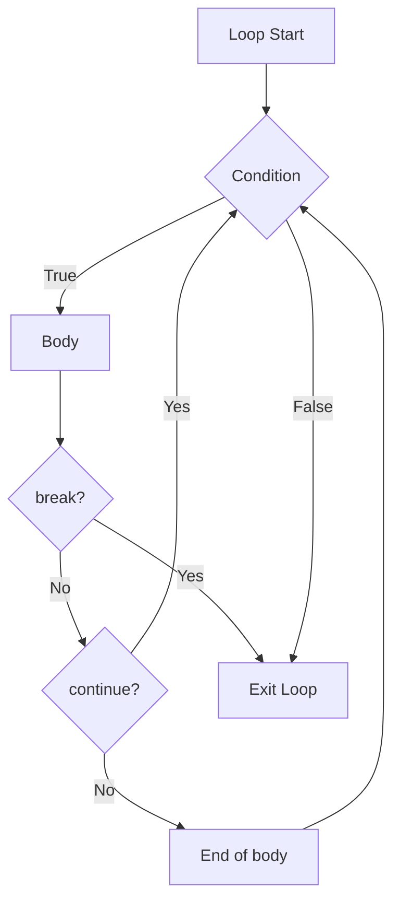

```python
# break — exit loop immediately
for i in range(10):
    if i == 5:
        break
    print(i)                    # 0, 1, 2, 3, 4

# continue — skip rest of iteration
for i in range(5):
    if i == 2:
        continue
    print(i)                    # 0, 1, 3, 4

# pass — no-op placeholder
for i in range(10):
    if i % 2 == 0:
        pass                     # TODO: handle even numbers
    else:
        print(i)
```

> `pass` does nothing. Use it as a placeholder. `continue` skips to next iteration. `break` exits entirely.

---

## 5. For-Else and While-Else

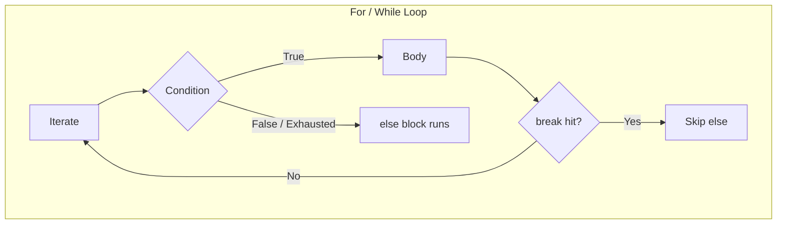

```python
# For-else — else runs if NO break occurred
def find_target(nums, target):
    for n in nums:
        if n == target:
            print("Found!")
            break
    else:
        print("Not found — else ran!")

find_target([1, 2, 3], 2)    # Found!
find_target([1, 2, 3], 5)    # Not found — else ran!

# While-else
i = 0
while i < 3:
    print(i)
    i += 1
else:
    print("Loop completed naturally")
```

> `else` after a loop runs only if the loop **was not** exited by `break`. Useful for search loops.

---

## 6. Enumerate, Zip, Reversed, Sorted

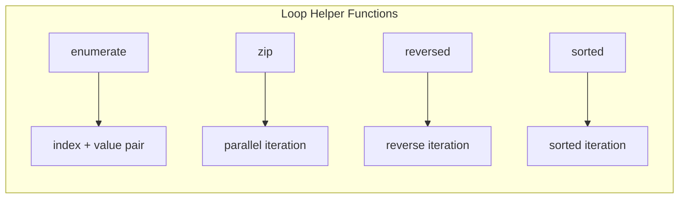

```python
# enumerate — get index and value
fruits = ["apple", "banana", "cherry"]
for i, fruit in enumerate(fruits):
    print(f"{i}: {fruit}")

for i, fruit in enumerate(fruits, start=1):
    print(f"{i}. {fruit}")

# zip — parallel iteration
names = ["Alice", "Bob", "Charlie"]
scores = [85, 92, 78]
for name, score in zip(names, scores):
    print(f"{name}: {score}")

# zip stops at shortest iterable
a = [1, 2, 3]
b = [10, 20]
for x, y in zip(a, b):
    print(x, y)                 # (1,10), (2,20) — 3 is skipped

# itertools.zip_longest pads shorter iterables
from itertools import zip_longest
for x, y in zip_longest(a, b, fillvalue=0):
    print(x, y)                 # (1,10), (2,20), (3,0)

# reversed
for x in reversed([1, 2, 3]):
    print(x)                    # 3, 2, 1

# sorted
for x in sorted([3, 1, 2]):
    print(x)                    # 1, 2, 3
```

| Function | Returns | Description |
|----------|---------|-------------|
| `enumerate(iter)` | `(index, value)` tuples | Loop with index |
| `zip(*iterables)` | `(a[i], b[i])` tuples | Parallel iteration |
| `reversed(seq)` | iterator | Reverse iteration |
| `sorted(iter)` | new list | Sorted iteration |

---

## 7. Nested Loops

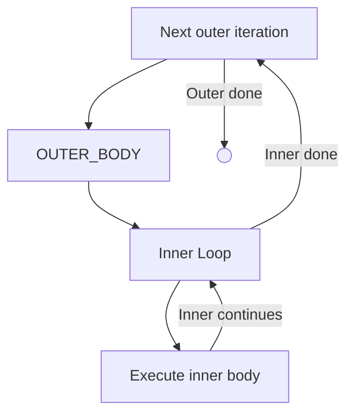

```python
# Nested for loops — matrix traversal
matrix = [[1, 2, 3], [4, 5, 6], [7, 8, 9]]
for row in matrix:
    for val in row:
        print(val, end=" ")
    print()                     # newline per row

# Nested while-for
i = 0
while i < 3:
    for j in range(3):
        print(f"({i},{j})", end=" ")
    print()
    i += 1

# Multiplication table
for i in range(1, 11):
    for j in range(1, 11):
        print(f"{i*j:4}", end="")
    print()
```

> **Complexity:** Nested loops multiply. O(n × m) for 2 levels, O(n³) for 3 levels. Avoid deep nesting.

---

## 8. List Comprehensions — Loop in one line

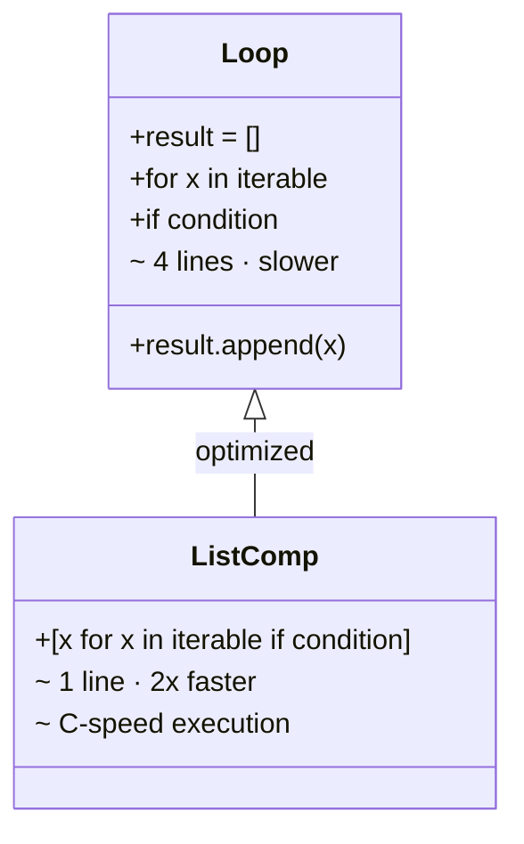

```python
# Basic — square numbers
squares = [x**2 for x in range(10)]
# [0, 1, 4, 9, 16, 25, 36, 49, 64, 81]

# With condition — even squares
even_squares = [x**2 for x in range(10) if x % 2 == 0]
# [0, 4, 16, 36, 64]

# Nested comprehension — flatten matrix
matrix = [[1, 2], [3, 4], [5, 6]]
flat = [num for row in matrix for num in row]
# [1, 2, 3, 4, 5, 6]

# if-else in comprehension
result = ["even" if x % 2 == 0 else "odd" for x in range(5)]
# ['even', 'odd', 'even', 'odd', 'even']

# Set comprehension
{x**2 for x in [1, 2, 2, 3]}          # {1, 4, 9}

# Dict comprehension
{x: x**2 for x in range(5)}           # {0:0, 1:1, 2:4, 3:9, 4:16}

# Generator expression (memory efficient)
sum(x**2 for x in range(1000000))     # no list created
```

| Type | Syntax | Output |
|------|--------|--------|
| List | `[expr for x in iter]` | `list` |
| Set | `{expr for x in iter}` | `set` |
| Dict | `{k: v for x in iter}` | `dict` |
| Generator | `(expr for x in iter)` | `generator` |

---

## 9. Common Patterns & Pitfalls

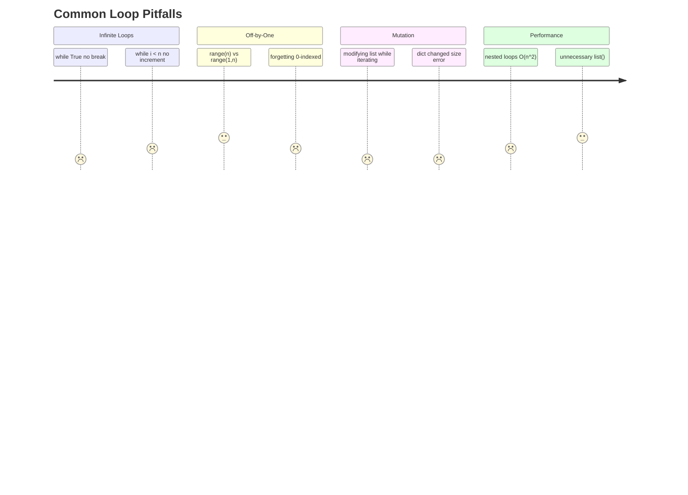

```python
# ❌ Modifying list while iterating
nums = [1, 2, 3, 4, 5]
for n in nums:          # BAD: skips elements
    if n % 2 == 0:
        nums.remove(n)
# Result: [1, 3, 5] — works, but [1, 2, 4, 5] would give wrong result!

# ✅ Iterate over a copy
for n in nums[:]:
    if n % 2 == 0:
        nums.remove(n)

# ❌ Modifying dict during iteration
d = {"a": 1, "b": 2}
# for k in d:           # RuntimeError: dict changed size
#     if k == "a":
#         del d[k]

# ✅ Iterate over list of keys
for k in list(d.keys()):
    if k == "a":
        del d[k]

# ❌ Infinite while
# i = 0
# while i < 10:         # missing i += 1
#     print(i)

# ❌ Off-by-one with range
for i in range(1, len(nums)):   # starts at 1, not 0

# ✅ Correct
for i in range(len(nums)):
```

---

## 10. Advanced: Iterators & Generators

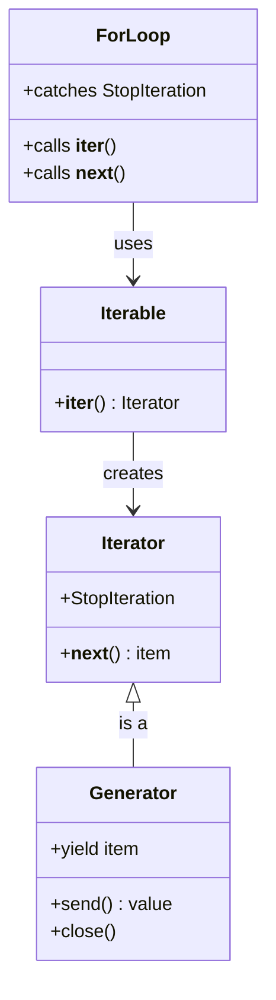

```python
# Custom iterator
class CountDown:
    def __init__(self, n):
        self.n = n
    def __iter__(self):
        return self
    def __next__(self):
        if self.n <= 0:
            raise StopIteration
        self.n -= 1
        return self.n + 1

for x in CountDown(5):
    print(x)                    # 5, 4, 3, 2, 1

# Generator — simpler than iterator class
def countdown(n):
    while n > 0:
        yield n
        n -= 1

for x in countdown(5):
    print(x)                    # 5, 4, 3, 2, 1

# Generator expression
squares = (x**2 for x in range(10))
for s in squares:
    print(s)

# yield from — delegate to sub-generator
def flatten(nested):
    for sublist in nested:
        yield from sublist

list(flatten([[1, 2], [3, 4]]))  # [1, 2, 3, 4]
```

| Feature | Iterator | Generator |
|---------|----------|-----------|
| Definition | Class with `__iter__` + `__next__` | Function with `yield` |
| State | Manual via `self` | Automatic |
| Memory | Single item | Single item |
| Use | Complex stateful iteration | Simple lazy sequences |

---

## 11. Time Complexity of Loops

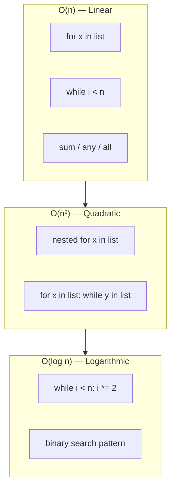

| Loop Pattern | Time | Example |
|-------------|------|---------|
| Single `for` / `while` | O(n) | `for x in lst:` |
| Nested loops | O(n × m) | `for x in a: for y in b:` |
| Double nested | O(n²) | `for i in range(n): for j in range(n):` |
| Halving loop | O(log n) | `while n > 0: n //= 2` |
| Nested halving | O(n log n) | `for x in lst: while n > 0: n //= 2` |
| Triple nested | O(n³) | 3 levels of nesting |

```python
# O(n) — single pass
for x in range(n):
    print(x)

# O(n²) — nested
for i in range(n):
    for j in range(n):
        print(i, j)

# O(n + m) — sequential (not nested)
for x in range(n): ...
for y in range(m): ...

# O(log n) — halving
i = n
while i > 0:
    print(i)
    i //= 2

# O(n log n) — loop over halving
for x in range(n):
    i = n
    while i > 0:
        i //= 2
```

---

## 12. Learning Path

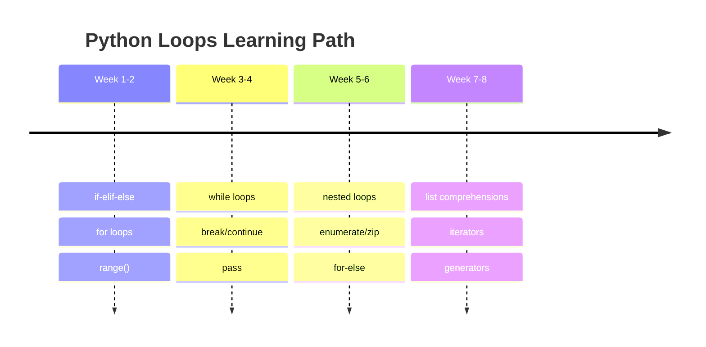

---

## 13. Interview Questions — Problem, Input, Output

### 13.1 FizzBuzz

```python
def fizzbuzz(n):
    """Return list of strings: Fizz for %3, Buzz for %5, FizzBuzz for both."""
    result = []
    for i in range(1, n + 1):
        if i % 15 == 0:
            result.append("FizzBuzz")
        elif i % 3 == 0:
            result.append("Fizz")
        elif i % 5 == 0:
            result.append("Buzz")
        else:
            result.append(str(i))
    return result
```

| Input | Output |
|-------|--------|
| `5` | `["1","2","Fizz","4","Buzz"]` |
| `15` | `["1","2","Fizz","4","Buzz","Fizz","7","8","Fizz","Buzz","11","Fizz","13","14","FizzBuzz"]` |

> 🔥 **LeetCode:** [Fizz Buzz](https://leetcode.com/problems/fizz-buzz/)

### 13.2 Palindrome Check

```python
def is_palindrome(s):
    """Return True if string reads same forwards and backwards."""
    i, j = 0, len(s) - 1
    while i < j:
        if s[i] != s[j]:
            return False
        i += 1
        j -= 1
    return True
```

| Input | Output |
|-------|--------|
| `"racecar"` | `True` |
| `"hello"` | `False` |
| `"a"` | `True` |
| `""` | `True` |

> 🔥 **LeetCode:** [Valid Palindrome](https://leetcode.com/problems/valid-palindrome/)

### 13.3 Find Missing Number

```python
def missing_number(nums):
    """Return the missing number from 0..n."""
    n = len(nums)
    total = n * (n + 1) // 2
    return total - sum(nums)
```

| Input | Output |
|-------|--------|
| `[3, 0, 1]` | `2` |
| `[0, 1]` | `2` |
| `[9,6,4,2,3,5,7,0,1]` | `8` |

> 🔥 **LeetCode:** [Missing Number](https://leetcode.com/problems/missing-number/)

### 13.4 Two Sum (Brute Force vs Optimized)

```python
def two_sum_brute(nums, target):
    """O(n²) — nested loop."""
    for i in range(len(nums)):
        for j in range(i + 1, len(nums)):
            if nums[i] + nums[j] == target:
                return [i, j]
    return []

def two_sum_optimized(nums, target):
    """O(n) — single pass with hash map."""
    seen = {}
    for i, n in enumerate(nums):
        complement = target - n
        if complement in seen:
            return [seen[complement], i]
        seen[n] = i
    return []
```

| Input | Target | Output |
|-------|--------|--------|
| `[2, 7, 11, 15]` | `9` | `[0, 1]` |
| `[3, 2, 4]` | `6` | `[1, 2]` |

> 🔥 **LeetCode:** [Two Sum](https://leetcode.com/problems/two-sum/)

### 13.5 Maximum Subarray (Kadane)

```python
def max_subarray(nums):
    """Return max sum of contiguous subarray."""
    max_ending = max_so_far = nums[0]
    for n in nums[1:]:
        max_ending = max(n, max_ending + n)
        max_so_far = max(max_so_far, max_ending)
    return max_so_far
```

| Input | Output |
|-------|--------|
| `[-2,1,-3,4,-1,2,1,-5,4]` | `6` |
| `[1]` | `1` |
| `[5,4,-1,7,8]` | `23` |

> 🔥 **LeetCode:** [Maximum Subarray](https://leetcode.com/problems/maximum-subarray/)

### 13.6 Product of Array Except Self

```python
def product_except_self(nums):
    """Return array where output[i] = product of all except nums[i]. No division."""
    n = len(nums)
    result = [1] * n
    prefix = 1
    for i in range(n):
        result[i] = prefix
        prefix *= nums[i]
    suffix = 1
    for i in range(n - 1, -1, -1):
        result[i] *= suffix
        suffix *= nums[i]
    return result
```

| Input | Output |
|-------|--------|
| `[1, 2, 3, 4]` | `[24, 12, 8, 6]` |
| `[-1, 1, 0, -3, 3]` | `[0, 0, 9, 0, 0]` |

> 🔥 **LeetCode:** [Product of Array Except Self](https://leetcode.com/problems/product-of-array-except-self/)

### 13.7 Valid Parentheses

```python
def is_valid(s):
    """Return True if brackets are properly closed and nested."""
    pairs = {')': '(', '}': '{', ']': '['}
    stack = []
    for ch in s:
        if ch in pairs:
            if not stack or stack.pop() != pairs[ch]:
                return False
        else:
            stack.append(ch)
    return not stack
```

| Input | Output |
|-------|--------|
| `"()"` | `True` |
| `"()[]{}"` | `True` |
| `"(]"` | `False` |
| `"([)]"` | `False` |
| `"{[]}"` | `True` |

> 🔥 **LeetCode:** [Valid Parentheses](https://leetcode.com/problems/valid-parentheses/)

### 13.8 Contains Duplicate

```python
def contains_duplicate(nums):
    """Return True if any value appears at least twice."""
    seen = set()
    for n in nums:
        if n in seen:
            return True
        seen.add(n)
    return False
```

| Input | Output |
|-------|--------|
| `[1, 2, 3, 1]` | `True` |
| `[1, 2, 3, 4]` | `False` |

> 🔥 **LeetCode:** [Contains Duplicate](https://leetcode.com/problems/contains-duplicate/)

### 13.9 Majority Element

```python
def majority_element(nums):
    """Return element appearing more than n/2 times. Boyer-Moore."""
    count = candidate = 0
    for n in nums:
        if count == 0:
            candidate = n
        count += 1 if n == candidate else -1
    return candidate
```

| Input | Output |
|-------|--------|
| `[3, 2, 3]` | `3` |
| `[2, 2, 1, 1, 1, 2, 2]` | `2` |

> 🔥 **LeetCode:** [Majority Element](https://leetcode.com/problems/majority-element/)

### 13.10 Intersection of Two Arrays

```python
def intersect(nums1, nums2):
    """Return intersection of two arrays (with duplicates)."""
    freq = {}
    for n in nums1:
        freq[n] = freq.get(n, 0) + 1
    result = []
    for n in nums2:
        if freq.get(n, 0) > 0:
            result.append(n)
            freq[n] -= 1
    return result
```

| Input 1 | Input 2 | Output |
|---------|---------|--------|
| `[1,2,2,1]` | `[2,2]` | `[2,2]` |
| `[4,9,5]` | `[9,4,9,8,4]` | `[4,9]` |

> 🔥 **LeetCode:** [Intersection of Two Arrays II](https://leetcode.com/problems/intersection-of-two-arrays-ii/)

### 13.11 Longest Consecutive Sequence

```python
def longest_consecutive(nums):
    """Return length of longest consecutive elements sequence."""
    num_set = set(nums)
    longest = 0
    for n in num_set:
        if n - 1 not in num_set:       # start of sequence
            length = 1
            while n + length in num_set:
                length += 1
            longest = max(longest, length)
    return longest
```

| Input | Output |
|-------|--------|
| `[100, 4, 200, 1, 3, 2]` | `4` |
| `[0, 3, 7, 2, 5, 8, 4, 6, 0, 1]` | `9` |

> 🔥 **LeetCode:** [Longest Consecutive Sequence](https://leetcode.com/problems/longest-consecutive-sequence/)

### 13.12 Summary Ranges

```python
def summary_ranges(nums):
    """Return smallest sorted list of ranges covering all numbers."""
    if not nums:
        return []
    result = []
    start = nums[0]
    for i in range(1, len(nums)):
        if nums[i] != nums[i - 1] + 1:
            result.append(str(start) if start == nums[i - 1] else f"{start}->{nums[i - 1]}")
            start = nums[i]
    result.append(str(start) if start == nums[-1] else f"{start}->{nums[-1]}")
    return result
```

| Input | Output |
|-------|--------|
| `[0, 1, 2, 4, 5, 7]` | `["0->2","4->5","7"]` |
| `[0, 2, 3, 4, 6, 8, 9]` | `["0","2->4","6","8->9"]` |

> 🔥 **LeetCode:** [Summary Ranges](https://leetcode.com/problems/summary-ranges/)

### 13.13 Move Zeroes

```python
def move_zeroes(nums):
    """Move all 0s to end preserving relative order."""
    pos = 0
    for i in range(len(nums)):
        if nums[i] != 0:
            nums[pos], nums[i] = nums[i], nums[pos]
            pos += 1
    return nums
```

| Input | Output |
|-------|--------|
| `[0, 1, 0, 3, 12]` | `[1, 3, 12, 0, 0]` |
| `[0]` | `[0]` |

> 🔥 **LeetCode:** [Move Zeroes](https://leetcode.com/problems/move-zeroes/)

### 13.14 Find Duplicate Number

```python
def find_duplicate(nums):
    """Return duplicate number. Floyd's cycle detection. O(n) time, O(1) space."""
    slow = fast = nums[0]
    while True:
        slow = nums[slow]
        fast = nums[nums[fast]]
        if slow == fast:
            break
    slow = nums[0]
    while slow != fast:
        slow = nums[slow]
        fast = nums[fast]
    return slow
```

| Input | Output |
|-------|--------|
| `[1, 3, 4, 2, 2]` | `2` |
| `[3, 1, 3, 4, 2]` | `3` |

> 🔥 **LeetCode:** [Find the Duplicate Number](https://leetcode.com/problems/find-the-duplicate-number/)

### 13.15 Pascal's Triangle

```python
def generate(num_rows):
    """Return first numRows of Pascal's triangle."""
    result = []
    for i in range(num_rows):
        row = [1] * (i + 1)
        for j in range(1, i):
            row[j] = result[i - 1][j - 1] + result[i - 1][j]
        result.append(row)
    return result
```

| Input | Output |
|-------|--------|
| `5` | `[[1],[1,1],[1,2,1],[1,3,3,1],[1,4,6,4,1]]` |

> 🔥 **LeetCode:** [Pascal's Triangle](https://leetcode.com/problems/pascals-triangle/)

### 13.16 Happy Number

```python
def is_happy(n):
    """Return True if number is happy (sum of squares of digits → 1)."""
    seen = set()
    while n != 1 and n not in seen:
        seen.add(n)
        n = sum(int(d) ** 2 for d in str(n))
    return n == 1
```

| Input | Output |
|-------|--------|
| `19` | `True` |
| `2` | `False` |

> 🔥 **LeetCode:** [Happy Number](https://leetcode.com/problems/happy-number/)

### 13.17 Remove Duplicates from Sorted Array

```python
def remove_duplicates(nums):
    """Remove duplicates in-place, return new length."""
    if not nums:
        return 0
    i = 0
    for j in range(1, len(nums)):
        if nums[j] != nums[i]:
            i += 1
            nums[i] = nums[j]
    return i + 1
```

| Input | Output (length) | Modified array |
|-------|----------------|----------------|
| `[1,1,2]` | `2` | `[1,2,_]` |
| `[0,0,1,1,1,2,2,3,3,4]` | `5` | `[0,1,2,3,4,_,_,_,_,_]` |

> 🔥 **LeetCode:** [Remove Duplicates from Sorted Array](https://leetcode.com/problems/remove-duplicates-from-sorted-array/)

### 13.18 First Bad Version

```python
def first_bad_version(n, is_bad_version):
    """Return first bad version using binary search loop."""
    l, r = 1, n
    while l < r:
        mid = (l + r) // 2
        if is_bad_version(mid):
            r = mid
        else:
            l = mid + 1
    return l
```

| n | Bad version | Output |
|---|-------------|--------|
| `5` | starts at `4` | `4` |
| `10` | starts at `1` | `1` |

> 🔥 **LeetCode:** [First Bad Version](https://leetcode.com/problems/first-bad-version/)

### 13.19 Word Pattern

```python
def word_pattern(pattern, s):
    """Return True if pattern matches the string words."""
    words = s.split()
    if len(pattern) != len(words):
        return False
    char_to_word = {}
    word_to_char = {}
    for ch, w in zip(pattern, words):
        if ch in char_to_word:
            if char_to_word[ch] != w:
                return False
        elif w in word_to_char:
            return False
        else:
            char_to_word[ch] = w
            word_to_char[w] = ch
    return True
```

| Pattern | String | Output |
|---------|--------|--------|
| `"abba"` | `"dog cat cat dog"` | `True` |
| `"abba"` | `"dog cat cat fish"` | `False` |
| `"aaaa"` | `"dog cat cat dog"` | `False` |

> 🔥 **LeetCode:** [Word Pattern](https://leetcode.com/problems/word-pattern/)

### 13.20 Find All Numbers Disappeared in Array

```python
def find_disappeared_numbers(nums):
    """Return list of missing numbers from 1..n."""
    for n in nums:
        idx = abs(n) - 1
        if nums[idx] > 0:
            nums[idx] = -nums[idx]
    return [i + 1 for i, n in enumerate(nums) if n > 0]
```

| Input | Output |
|-------|--------|
| `[4,3,2,7,8,2,3,1]` | `[5, 6]` |
| `[1, 1]` | `[2]` |

> 🔥 **LeetCode:** [Find All Numbers Disappeared in an Array](https://leetcode.com/problems/find-all-numbers-disappeared-in-an-array/)

---

## Quick Reference — Loop Methods

```python
# ┌────────────────┬────────────────────────────────┬──────────┐
# │ Construct      │ Description                    │ Use Case │
# ├────────────────┼────────────────────────────────┼──────────┤
# │ if/elif/else   │ Conditional branching          │ Decisions│
# │ for x in iter  │ Iterate over sequence          │ Known set │
# │ while cond:    │ Loop while condition is True   │ Unknown # │
# │ while True:    │ Infinite loop with break       │ Event loop│
# │ while not x:   │ Loop until condition is met    │ Flag wait │
# │ break          │ Exit loop immediately          │ Early exit│
# │ continue       │ Skip to next iteration         │ Filtering │
# │ pass           │ No-op placeholder              │ Stub code │
# │ else:          │ Runs if no break occurred      │ Search    │
# │ enumerate()    │ Loop with index                │ Indexing  │
# │ zip()          │ Parallel iteration             │ Pairing   │
# │ reversed()     │ Reverse iteration              │ Backward  │
# │ sorted()       │ Sorted iteration               │ Ordering  │
# │ [x for x...]   │ List comprehension             │ 1-liner   │
# │ (x for x...)   │ Generator expression            │ Memory    │
# └────────────────┴────────────────────────────────┴──────────┘
```

---

## Common Pitfalls — Quick Reminders

| Pitfall | Why | Fix |
|---------|-----|-----|
| Modifying list while iterating | Skips elements | Iterate over `lst[:]` |
| Modifying dict while iterating | `RuntimeError` | Iterate over `list(d.keys())` |
| Infinite while loop | Missing increment | Ensure counter advances |
| Off-by-one in `range` | Wrong bounds | `range(n)` = 0 to n-1 |
| For-else confusion | else runs after normal exit | Only use with break inside |
| Mutable default in loop | Shared across calls | Use `None` default |
| `is` vs `==` in conditions | Identity vs equality | Use `==` for value comparison |
| `while not` double negative | Hard to read | Use positive `while not_ready:` |

---

*Happy Coding!*
